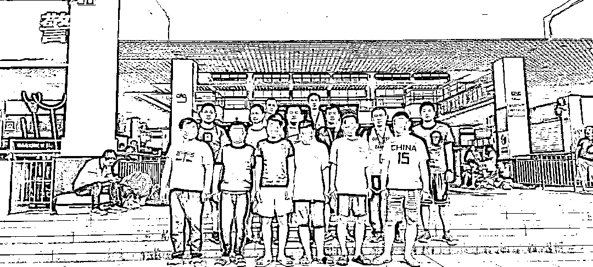
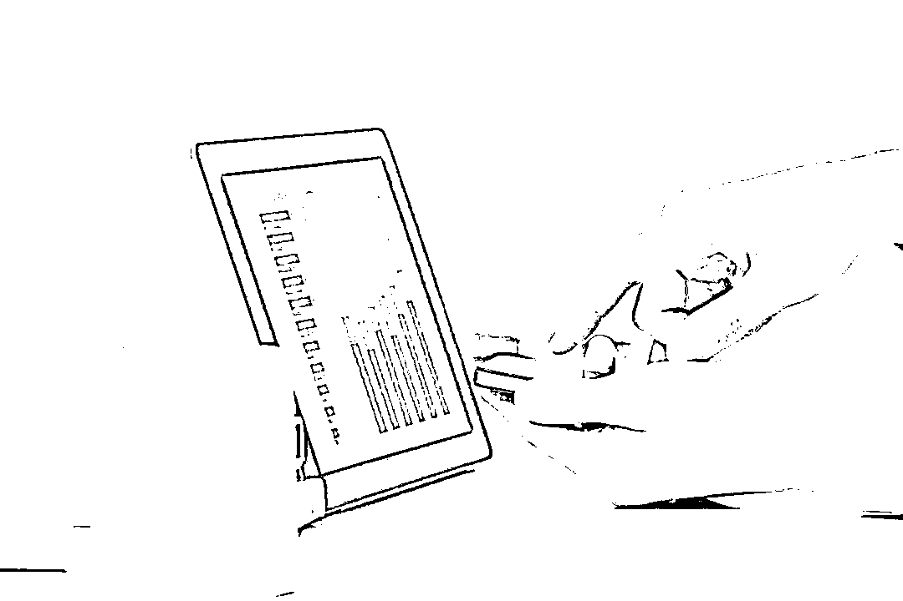
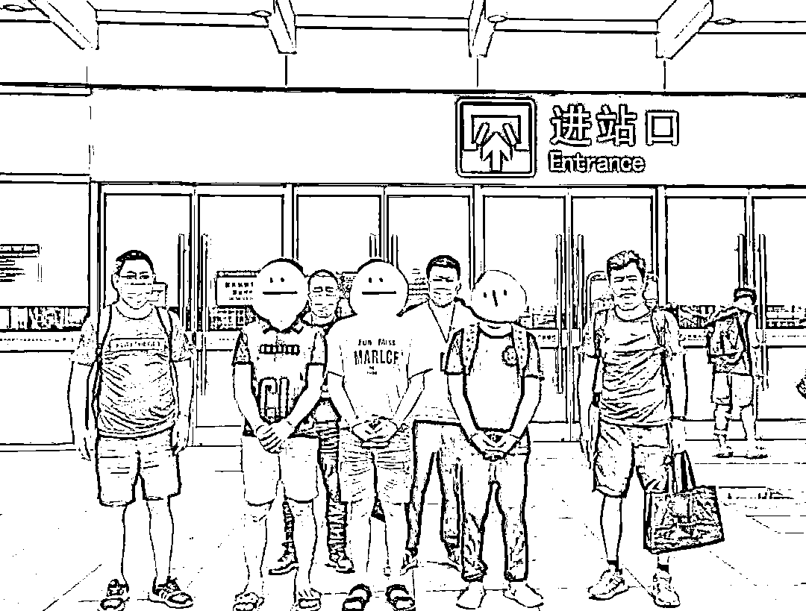
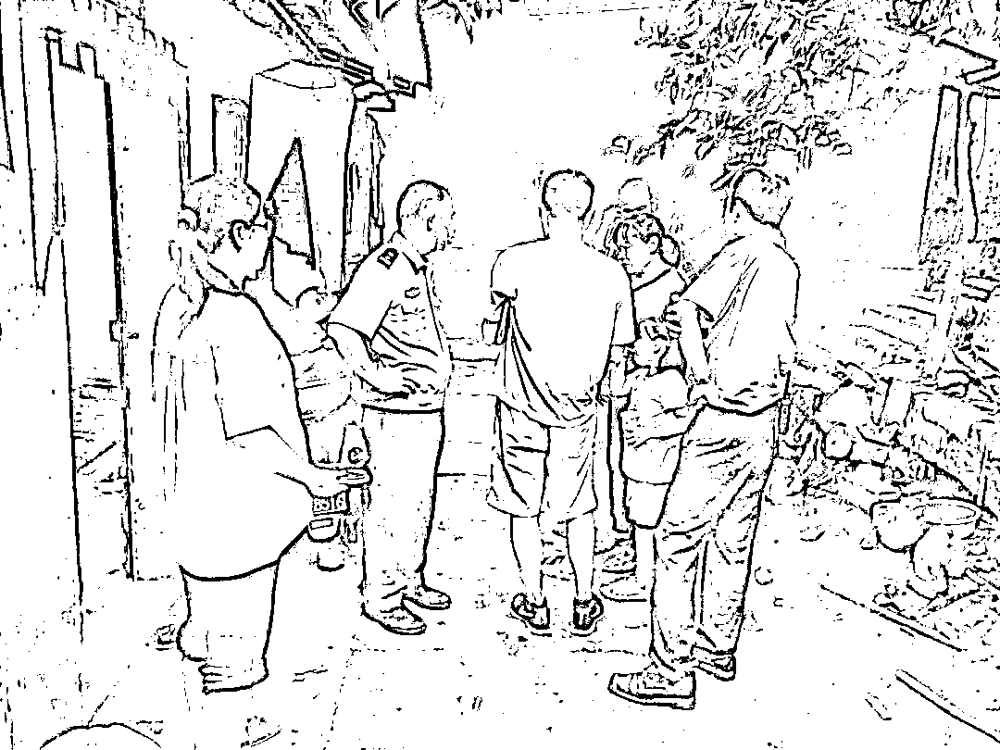

# 小情侣筹钱“赎身”回国！义乌警方抓 25 人，捣毁一特大境外电信网络诈骗窝点

> 原文：[`mp.weixin.qq.com/s?__biz=MzIyMDYwMTk0Mw==&mid=2247522364&idx=6&sn=070da6ff1022f7ad67e7be02bcb7fc7e&chksm=97cb5304a0bcda12e0f1fe122c4a56ba51c70fbeb578e6a69ec1d9b960348e2898e884bd3eb9&scene=27#wechat_redirect`](http://mp.weixin.qq.com/s?__biz=MzIyMDYwMTk0Mw==&mid=2247522364&idx=6&sn=070da6ff1022f7ad67e7be02bcb7fc7e&chksm=97cb5304a0bcda12e0f1fe122c4a56ba51c70fbeb578e6a69ec1d9b960348e2898e884bd3eb9&scene=27#wechat_redirect)

[`mp.weixin.qq.com/mp/readtemplate?t=pages/video_player_tmpl&action=mpvideo&auto=0&vid=wxv_2092030491582398472`](https://mp.weixin.qq.com/mp/readtemplate?t=pages/video_player_tmpl&action=mpvideo&auto=0&vid=wxv_2092030491582398472)

**因为一次投资理财失败，义乌一损失惨重的市场商户轻信另一名嘘寒问暖的“受害者”，结果落入诈骗分子精心编织的陷阱——短短 4 天时间，她就被骗走 110 余万元。**

**近日，记者从义乌警方获悉，通过围绕这一案件缜密侦查，一个盘踞在境外的电信网络诈骗团伙进入他们的视线。目前，该团伙已有 25 名成员落网。**

****

**商户投资理财被骗 110 万元******

**张女士是义乌国际商贸城商户。去年上半年，她因投资理财失败，和有共同经历的人组建了一个微信群，试图“抱团”挽回经济损失。微信群里，一个昵称叫“封心葬爱”的人发言特别积极，很快就成为张女士等人的“主心骨”。**

**去年 11 月 27 日，“封心葬爱”向张女士推荐了一个名叫“腾讯金融”的网站。“这个平台投资非常稳，回报率也很高。”张女士没多想，就在网站上投资了 5000 元“试水”。不到一天时间，她就获得了 574.64 元的收益。随后，尝到甜头的张女士又投资了 2 万多元，不到一小时就收到 1300 多元收益。成功提取本金和收益后，她觉得自己这次找到了一个“靠谱”的投资平台。**

****

**去年 11 月 29 日晚，张女士在“腾讯金融”充值了 3 万多元，然而仅过了一小时，这些钱就缩水了近 10%。为了挽回损失，她又先后追加 3 笔资金“补仓”，但依然止不住一路亏损。“我当时就不想玩了，但充进去的钱却取不出来。”张女士联系网站客服后，对方表示出现问题的原因是输错了银行账号和密码，要求她再充值一笔钱“解冻”。**

**此后几天，这名客服以输错银行账号和密码、充值 3 倍流水解冻等各种理由，频繁让张女士在网站充值。短短四天，张女士共计投入 110 余万元，没提取出一分钱后，才意识到自己被骗了。两天后，她赶到义乌市公安局商城派出所报警。**

**25 人被抓 小情侣筹钱从公司“赎身”******

**根据张女士提供的线索，在网络安全保卫大队和刑侦大队等兄弟单位的支持下，商城所立即展开调查工作。**

**据民警介绍，该案的主要难点在于如何通过大数据分析出幕后黑手。近一个月的时间，专案组 7 名侦查员全身心地扑在资金流、人员信息数据分析上，最终在海量数据中找到了突破口，并不断扩线追踪，最终锁定了一个盘踞在阿联酋迪拜的电信网络诈骗团伙。**

**从今年 1 月 7 日抓获第一人开始，团伙中已有 25 名成员落网，其中一人已因犯诈骗罪已被义乌市人民法院判处有期徒刑 8 年。**

****

**小林和小吴是一对情侣，都是海南人。小林欠下了十几万的债款，听朋友介绍说去境外做客服一个月可以赚一两万，且包机票，就心动了。二人抱着赚钱的目的出了国，没想到飞机一落地就被扣了护照。**

**两个人到了公司才知道，自己进了“狼窝”，“我们被要求工作满半年以上才能回国，否则来回机票就需要自理。”知道做的事犯法，二人都很害怕，再加上小吴母亲身体不好，二人想早点回国。没到半年，两人心虚得实在干不下去了，就让家里筹集了来回机票钱和赔付违约的钱，匆匆回了国。**

**3 月 8 日，回国刚结束隔离的小林和小吴被义乌警方抓捕归案，“我们俩家里本来生活条件就不好，钱没赚到，还花了十来万元‘赎身’，最重要的是背上了案底。”对于自己误入歧途，情侣俩都后悔万分。**

**义乌警方对国内发生的多起案件进行串并侦查，已发现国内有 36 起电信网络诈骗案与该团伙有关，受害人涉及浙江、江苏、广东、湖南、河北、河南等多个省市，涉案金额高达 1100 多万元。“从掌握的证据来看，这些受害人还只是冰山一角，我们预计该团伙的赃款有 5000 万左右。”商城所民警朱钧平说。**

****

**套路解析 小利诱惑******

**经查，该团伙组织架构清晰、分工明确，有行政主管、组长、组员、后台人员、养号、卖号、解封、拉手人员。行政主管负责管理诈骗窝点秩序，组长管理其组下组员，组员用各种聊天渠道加被害人微信，负责与被害人聊天，将被害人骗至平台进行下注和投资，后台人员在平台上充当客服，引导被害人充值，养号人员负责购买 QQ、微信等聊天网络账号。**

**据落网人员交代，该团伙实施诈骗的方式主要有两种——一种是假冒优质单身男性或女性，采用“杀猪盘”的套路作案；另一种是潜入前期投资理财失败的微信群，对受害者嘘寒问暖套取信任后再将他们引诱到诈骗平台进行押注。**

**据悉，组员通过事前知道的开奖结果，编出一套投资方案，在被害人少量投注时，让其赢取少量资金，并给其提现，在被害人确信无疑后，让其充值更多资金，同时也让被害人赢取资金，在被害人要求提现时，以被害人操作失误、银行账号冻结等理由让被害人继续充值，骗取更多资金。**

**“除了‘腾讯金融’，他们搭建的投资平台还有‘京东金融’，这些和正规互联网公司搭边的名称很容易让受害者上当。”朱钧平说。**

****

**（警方做家属工作）**

**警方分析，诈骗分子之所以能屡屡得手，主要源于被害人警惕意识的缺失。许多被害人在通过网络结识诈骗分子后，被对方的体贴入微所迷惑，未经核实对方真实身份便将自身重要信息透露于对方，或在骗子的花言巧语下轻易将钱款借出。**

**近年来，义乌警方积极推进打击治理电信网络诈骗犯罪工作，以打击黑灰产为切入点，紧密结合“断卡”行动，严厉打击开卡卖卡、贩卖公民个人信息、提供技术支撑、转账洗钱等违法犯罪活动，坚决斩断犯罪关键链条。目前，义乌警方仍在对此案作进一步深挖，力争实现案件全链条打击。**

****

**（警方走访）**

**最后，义乌警方敦促相关电信网络诈骗团伙成员放弃侥幸心理，尽快投案自首，争取宽大处理。对拒不投案并继续滞留境外进行违法犯罪活动的，将依法从严惩处。**

**来源：义乌公安，利箭在行动**

****

**← 向右滑动与灰产圈互动交流 →**

****