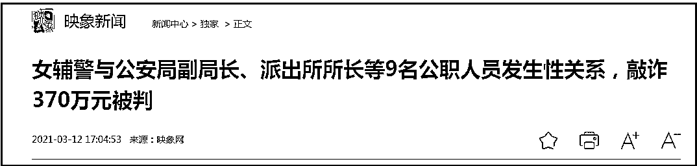
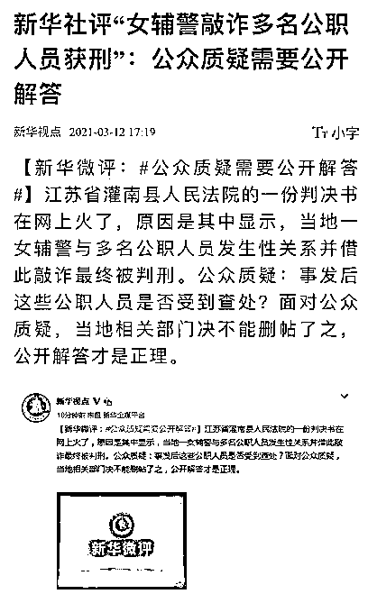
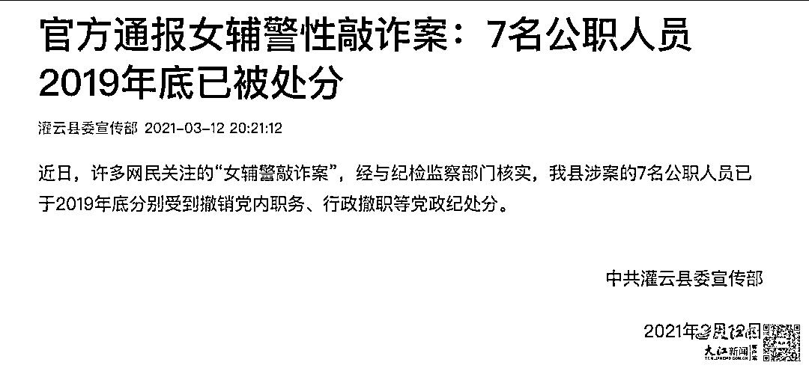

# 连云港被 9 个领导睡了的女辅警，被判了 7 年

> 原文：[`mp.weixin.qq.com/s?__biz=MzIyMDYwMTk0Mw==&mid=2247522426&idx=1&sn=dee798e4483dbc38a2924d6f250ddc68&chksm=97cb5342a0bcda54e952a714b7ec3a8505b2b8a563968d90096154489c0ba9b7e22dda85efe9&scene=27#wechat_redirect`](http://mp.weixin.qq.com/s?__biz=MzIyMDYwMTk0Mw==&mid=2247522426&idx=1&sn=dee798e4483dbc38a2924d6f250ddc68&chksm=97cb5342a0bcda54e952a714b7ec3a8505b2b8a563968d90096154489c0ba9b7e22dda85efe9&scene=27#wechat_redirect)

曾震惊全国，备受关注的江苏连云港女辅警敲诈案二审正式宣判。

**此前报道：**

[90 后女辅警与多名公职人员发生性关系，勒索 370 万获刑？](http://mp.weixin.qq.com/s?__biz=MzIyMDYwMTk0Mw==&mid=2247510921&idx=2&sn=d7464db411f34ae12bd88ae61fd0d0fb&chksm=97cb60b1a0bce9a75cd6bdf787449ae2ee4c366e4bef16bb4b4395251562cce070451a720370&scene=21#wechat_redirect)

[敲诈公职人员的女辅警照片曝光？90 后女孩发声：别转了！](http://mp.weixin.qq.com/s?__biz=MzIyMDYwMTk0Mw==&mid=2247510971&idx=3&sn=d9c9f2aa08c92ee565267695ae87f0c9&chksm=97cb6083a0bce995eec92114f69814ed4ea5ab1ba639449bf9cba5bfa81fe5505a8560a05326&scene=21#wechat_redirect)

10 月 15 日，江苏省连云港市中级人民法院对上诉人许艳敲诈勒索一案二审公开宣判，**以敲诈勒索罪改判许艳有期徒刑七年，并处罚金人民币三十万元，**对其违法所得依法处置。

在此之前，江苏连云港市灌南县人民法院发布《刑事判决书（2020）苏 0724 刑初 166 号》显示，2014 年 3 月至 2019 年 4 月期间，女辅警徐艳同时或者不间断的与多名公职人员发生不正当男女关系……先后敲诈 9 人共计人民币**372.6 万元**”。

**当地法院一审判决显示，许某被判犯敲诈勒索罪，判处有期徒刑 13 年，并处罚金人民币 500 万元。**

**消息一出立即炸锅。一个女辅警被 9 个官员睡了，还要罚 500 万送入监狱。** 

媒体后来披露的判决书载明，被敲诈者有连云港下辖的灌云县派出所所长、时任连云港市公安局海州分局副局长及时任灌云县妇幼保健院工会主席、时任灌云县四队镇中心小学校长等。

该判决书显示，2014 年 3 月至 2015 年 1 月，许某与时任灌云县公安局南岗派出所所长孙某发生不正当两性关系，先后三次向孙某索要人民币 100 万元；

2014 年 5 月至 8 月，许某与时任灌云县侍庄派出所所长朱某乙发生不正当两性关系，向朱某乙索要人民币 10 万元；

2016 年 6 月至 2016 年 8 月，许某与时任灌云县公安局副局长寇某发生不正当男女关系，向寇某索要人民币 20 万元；

2016 年 6 月至 7 月，许某与灌云县妇幼保健院工会主席陈某甲发生不正当两性关系，向陈某甲索要人民币 10.8 万元；

2016 年 9 月至 12 月，许某与时任灌云县四队镇中心小学校长关某甲发生不正当两性关系，向关某甲索要人民币 45 万元；

2017 年 5 月至 6 月，许某与时任灌云县陡沟卫生院副院长兰某乙发生不正当两性关系，向兰某乙索要人民币 15 万元；

2017 年 7 月至 8 月，许某与时任灌云县陡沟镇卫生院药库工作人员徐某甲发生不正当两性关系，向 徐某甲索要人民币 29.8 万元；

2017 年 2 月至 9 月，许某与林某发生不正当两性关系，向林某索要人民币 14 万元；

2016 年 3 月至 2016 年 5 月，许某与连云港市公安局海州分局路南派出所所长刘某乙发生不正当两性关系，向刘某乙索要人民币 20 万元后，双方不再联系；

2018 年 3 月至 2019 年 4 月，许某再次与时任连云港市公安局海州分局副局长刘某乙发生不正当两性关系，后以购房交首付、怀孕流产补偿、分手补偿为由，向刘某乙索要人民币共计 108 万元。

让人愤怒的是，消息传出后，当地开始疯狂地删帖删稿，以至于连新华社都怒指其不能一删了之。 

强大的舆论压力下，当地撤回了判决书并表示，许艳在法定上诉期间内提出上诉，目前该案正在二审审理期间，一审判决书未生效。根据《最高人民法院关于人民法院在互联网公布裁判文书的规定》（法释〔2016〕19 号）第七条的规定，该文书在发生法律效力之前不应在互联网公布，故予以撤回。

7 个月后，结果出炉：被公安局副局长、派出所所长等 9 名官员睡了的女辅警，还是没有逃脱牢狱之灾，13 年刑罚改为 7 年，而令人震惊的罚款 500 万罚款也变成了 30 万元。

值得高兴吗？

女辅警被判了，那睡了女辅警的 9 位官员到底怎么处理的呢？之前，连云港灌云县委宣传部发布通告：涉案的 7 名公职人员已于 2019 年底分别受到撤销党内职务、行政撤职等党政纪处分。

这是目前官方披露的涉案官员的所有细节。

那么徐艳为何会改判 7 年呢？

**二审显示敲诈金额小了，由 372.6 万变成了 144.6 万，受害人由 9 人变成了 7 人**

据媒体引述二审审理查明：2014 年上半年至 2017 年 11 月，上诉人许艳通过电话、微信或者工作关系，主动结识朱某某等 7 名已婚公职人员，与对方发生不正当性关系，之后自称怀孕流产，谎称家人已知情要找对方闹事，还以到对方工作单位吵闹，或者扬言向对方妻子、孩子学校公开二人关系、向有关机关告发等相要挟，向上述人员索要钱款共计人民币**144.6 万元。**

二审认为，上诉人许艳以非法占有为目的，采取要挟手段先后索要 7 人财物共计人民币 144.6 万元，数额特别巨大，其行为已构成敲诈勒索罪。许艳犯罪以后自动投案，如实交代自己的主要犯罪事实，系自首，且当庭认罪悔罪，依法可以从轻或者减轻处罚。被害人对本案的发生存在一定过错，可以对许艳酌情从宽处理。

看完判决只有一个感觉： 

**这个徐艳真可恶， 那 9 名官员，都是老实巴交的好人啊，他们都是被逼无奈才睡的辅警...他们都弱势的受害者...**

**是的，一定是这样。**

来源：反欺诈金钟罩，阻击诈骗

← 向右滑动与灰产圈互动交流 →

