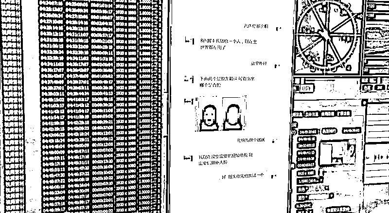
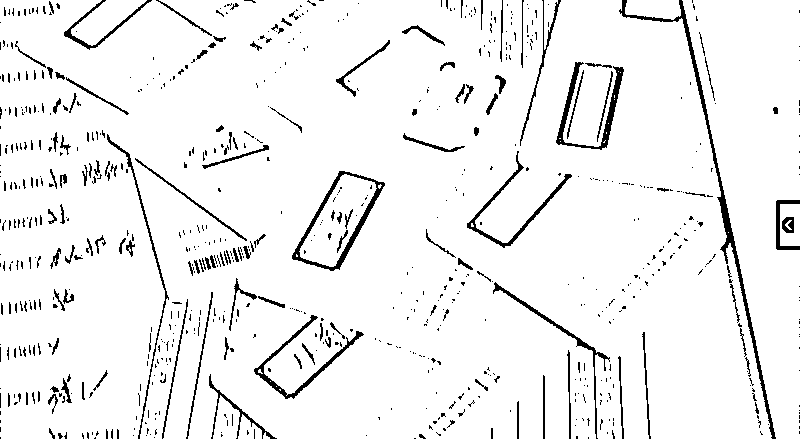
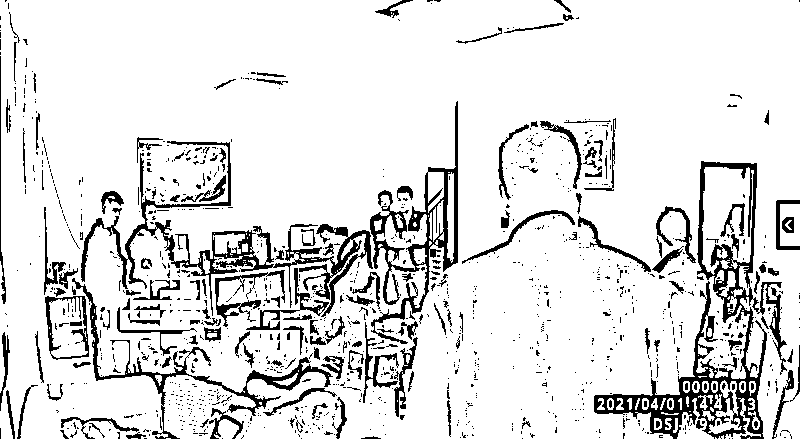

# 警惕！他们正在刷你的脸！

> 原文：[`mp.weixin.qq.com/s?__biz=MzIyMDYwMTk0Mw==&mid=2247522426&idx=3&sn=7d36b4f08f280790f28359772221442f&chksm=97cb5342a0bcda5404af8c3570ded41fdb420a74cb158162352e43623af8e257feb28d82f449&scene=27#wechat_redirect`](http://mp.weixin.qq.com/s?__biz=MzIyMDYwMTk0Mw==&mid=2247522426&idx=3&sn=7d36b4f08f280790f28359772221442f&chksm=97cb5342a0bcda5404af8c3570ded41fdb420a74cb158162352e43623af8e257feb28d82f449&scene=27#wechat_redirect)

[`mp.weixin.qq.com/mp/readtemplate?t=pages/video_player_tmpl&action=mpvideo&auto=0&vid=wxv_2091813193365929984`](https://mp.weixin.qq.com/mp/readtemplate?t=pages/video_player_tmpl&action=mpvideo&auto=0&vid=wxv_2091813193365929984)

**刷脸支付、刷脸打卡、刷脸门禁**……如今人脸识别的应用越来越普及，很多人几乎每天都会刷脸，然而大家想不到，可能会有人在背后“偷刷”你的脸。

”

10 月 15 日，安徽合肥警方公布一起非法利用 AI 人工智能技术，伪造他人人脸动态视频，为黑灰产业链提供注册的虚拟手机卡等技术支撑的案件。

此前，合肥市公安局网安支队在网上巡查时发现了一则可疑的互联网广告，**广告发布者声称自己可以通过模拟人脸识别技术，帮“客户”通过虚拟运营商办理手机卡。**除此之外，对方还大量有偿收购身份证、人脸等个人信息。通过侦查网警发现，广告发布者马某有重大嫌疑。

顺着马某，警方经过长时间的侦查确认，发现在马某背后还隐藏着一个专门帮助他人违规办理手机卡的犯罪团伙。近日，合肥警方在合肥、青岛同时展开抓捕行动，成功将 8 名嫌疑人一网打尽，现场缴获用于作案的 10 台电脑和 26 部手机。

当警方到达犯罪窝点时，几名工作人员正在操作着电脑上的软件，利用 AI 人工智能技术将一张张照片制作成人脸动态视频。

在嫌疑人制作的视频中，人物是可以依照输入的指令做出眨眼、张嘴、皱眉等多种精细动作，模仿人物表情变化。同时为了实现以假乱真，人物的刘海还能不时随风飘动来模拟拍摄时的轻微晃动，有的视频背景也是可以动的，画面效果非常逼真。

经过演示，将一张静态的自拍照输入软件后，嫌疑人只需要数十秒，就能够将照片变为相应的动态视频，“可以念数字，而且能做到实时的。”民警表示，看起来难以置信的事情通过软件，在很短的时间内就能完成。

[`mp.weixin.qq.com/mp/readtemplate?t=pages/video_player_tmpl&action=mpvideo&auto=0&vid=wxv_2096064986325237763`](https://mp.weixin.qq.com/mp/readtemplate?t=pages/video_player_tmpl&action=mpvideo&auto=0&vid=wxv_2096064986325237763)

马某交代说，由于制作简单，这样的一个视频价格通常也就在 2 元至 10 元，不过“客户”往往是成百上千的购买，因此，团伙牟利巨大。 

**那模拟视频有什么用呢？**

嫌疑人表示，**他们主要利用视频办理虚拟运营商的手机卡，因为手机卡注册环节中需要人脸识别，而通过这些逼真的视频，就可以欺骗后台审核人员，完成手机卡的注册。注册好的手机卡，嫌疑人就会卖给犯罪团伙用于电信网络诈骗、网络赌博、洗钱等犯罪活动。**

为了完成视频制作，就需要大量的公民个人信息照片，在嫌疑人的电脑里，警方就发现了十几个 G 的公民人脸数据，人脸照片和其本人身份证照片也被整理好，分门别类地存放在一个个文件夹里。

**“身份证正反面照片、手持身份证照片、自拍照等，被称为一套。”民警表示，成套照片被称为“料”，出售照片的人则被称为“料商”，而这些“料”在网上往往已经转手了很多次，但很多受害人对此却是毫不知情。**

经查，马某所在的团伙就是分为两个小组，一个小组就是专门“收料”，另一个小组就负责制作视频并开卡。目前该案仍在进一步侦办中。

**警****方****提****醒**

当中国网民规模超过 10 亿，当全家老少都开始习惯“云上生活”，当线上办公、网购、扫码已经成为日常，网络安全怎么强调都不过分。我们要像在线下世界里防骗、防盗一样，在网上也必须要有足够的安全意识，并拥有一定的防护技能。就像网络安全周的主题：“网络安全为人民，网络安全靠人民”。守住网络安全的防线，需要您的参与。

来源：警探、中国警察网、阻击诈骗

← 向右滑动与灰产圈互动交流 →

