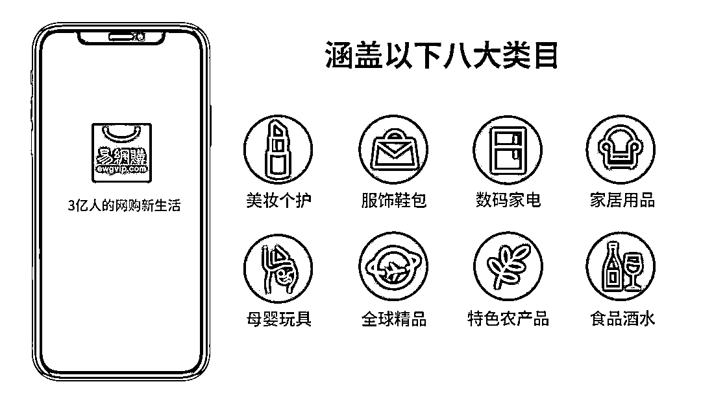
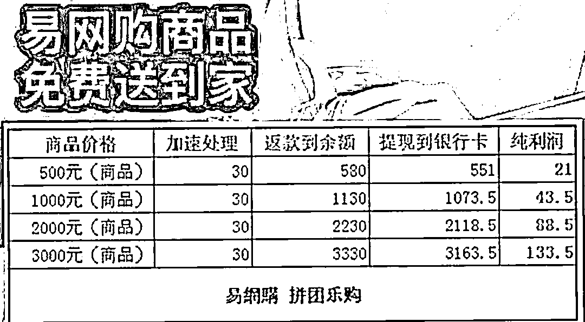
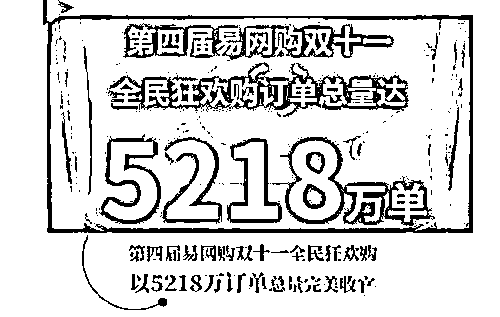

# 崩盘！1200 万人被骗光，创始人卷走 260 亿！

> 原文：[`mp.weixin.qq.com/s?__biz=MzIyMDYwMTk0Mw==&mid=2247522426&idx=5&sn=13f003cb21ea6283318b236c63bee13a&chksm=97cb5342a0bcda5486881adaee84362d17d243c6e27fab947d372d151a119bc5cf56b7374416&scene=27#wechat_redirect`](http://mp.weixin.qq.com/s?__biz=MzIyMDYwMTk0Mw==&mid=2247522426&idx=5&sn=13f003cb21ea6283318b236c63bee13a&chksm=97cb5342a0bcda5486881adaee84362d17d243c6e27fab947d372d151a119bc5cf56b7374416&scene=27#wechat_redirect)

01

这个时代，骗子太多了。

一个骗子倒下了，另一个又冒出来了，简直是前赴后继的节奏！

又一家大名鼎鼎的平台公司——易网购出事了，1200 万人被骗，创始人贾永龙卷走 260 亿，逃至澳洲。

据了解，广州市天河区公安经侦大队人员确认，经侦已经受理易网购集资诈骗案，目前案件正在调查中！

是的，你没看错，就是那家 2014 年成立，号称要“要在 2021 年成为社交电商领域 NO.1”的网络销售平台公司易网购。

易网购野心勃勃地宣布，它在全国范围里已有 11294 家加盟商，其中广东有 6782 家，会员数 1200 万左右，成为全国第九大电商平台，集团年产值达 100 亿。

一石激起千层浪，这个消息让 1200 万易网购会员们，立马炸锅了，要知道，年收上百亿的平台说倒就倒，外加 200 多亿巨款，易网购出事，堪称是本年度大雷了。

更惊人的是，就连易网购的高管们，都被贾永龙坑了一把。他称在澳洲上市要接近尾声了，希望高管们投钱来购买子虚乌有的原始股时，其实他本人早在大半年前，已做好准备，卷款出逃。 

啧啧啧，这贾永龙，真是一个新时代的岳不群，连自己的身边人都害。直到今天，贾永龙这惊天一逃，才让所有人如梦初醒，恍然大悟，然而，既是把大腿拍肿，这世界上也没有后悔药了。今天，易网购这个披着华丽丽外衣的弥天骗局，终于走到尽头了，只剩下 1000 万被骗的粉丝们，目瞪口呆，悔之晚矣！02 “购物返本”、“消费等于赚钱”、“买东西就是在赚钱”......如果有平台用这样的语言告诉你：消费多少返还多少，衣食住行包罗万象，这样的好事，你信吗?　 有人也许会说：这不就是白送吗，天下哪有如此好事，这不符合常识！然而，易网购就是这么宣传的，而易网购会员也是如此坚信的。从表面看，易网购是一个类似淘宝一样的电商平台，卖家在上面卖货，买家通过平台买货。 但如果细研究，易网购与其他电商平台可不一样，他们有捞钱二板斧，宣称：1、如果帮助易网购拉人头、发展会员，可以获得红包奖励。随着移动互联网的发展，人与人交流的门槛变低，信息的传播速度也变得更快，易网购正是借助社交软件，采用红包拉新的方式，来实现病毒式快速裂变。易网购的做法是：你推荐新人使用成功了，那你立马可获得相应的金额。多少奖励呢？大概是这样：

> 你每拉一个新“人头”使用易网购，易网购会送出 100 多元的红包给你，新用户成为会员后，为了获得老带新的红包福利，推荐了表妹使用易网购，也同样得到 100 多元的红包。

易网购用了这招迅速地为自己积累了大量的用户。2、在易网购平台上的消费，最终都会返利给消费者。嗯，那既然用户规模上来了，接下来呢？当然是安利你们购物了。这时候，蹊跷的事情来了：易网购承诺，只要在易网购平台上的消费，最终都会返给消费者，不仅返现，而且还能赚钱。以 1130 元的碧根果为例，会员只要付 1000 元，另加 30 元“加速处理费”，平台就会返 1130 元给你，会员提现到银行卡要扣除 5%，实际到账 1073.5 元，净赚 43.5 元。 也就是说，你买 1000 元的东西，不但能免费收货还能净赚 40 元，买 2000 元赚 88.5 元，买 3000 元赚 133.5 元，这哪里是网购，简直是一本万利的投资，投资越大返利越多。天啊，这是何等好事！很多人一开始当然免不了怀疑：这易网购是猴子请来做慈善的么？购物返利，拉人头还提成，这个资金大窟窿，易网购怎么填上？ 对这个，易网购有自己的一套说辞：亲，你 out，我们赚钱的方式，来自于“金融创新”！ 如果你不怕丢脸执着地问：你们搞什么金融创新？易网购会告诉你：一是通过上市融资，二是利用现金流进行投资获取收益；此外，还包括其电商平台上的广告收入。　当然，易网购发展到今天这个规模，也不仅仅这几下子。他还有一套独特的方法，来证明自己，蛊惑人心： 

> 你看看人家的信用历史：通常，易网购的返利会秒回返款，最多 1 到 2 天返利，平台前期返利的声誉很好。你看看人家的经营范围：易网购的跨境商品服务，已经覆盖全球 30 多个国家和地区，涵盖以“原产地农产品、中国国货品牌、全球跨境优品”三大核心品类，，多么高大上！你看看人家的商业模式：立足易网购商城、以互联网与智能科技创新为核心，创领“全球原产地农业与全球优品”的跨境无界购物生活方式，构建全球智慧科技、互联网与新零售融合的生态圈。你看看人家的高品位：热衷慈善，长期支持扶贫和教育事业，累计以各种形式捐赠近千万，回馈社会。

现在，你还不信吗？ 于是乎，很多大婶大叔大爷大妈们被俘获了、洗脑了，心向往之，甚至天天想着靠易网购赚钱。于是，易网购在 2018 年双 11 期间大量宣传“双十一消费返利秒回返款”，48 小时之内，易网购订单总量达到 5218 万单，成交金额高达 260 多亿。每个易网购会员众筹账号的钱最少有几万，有的高达 70 多万。会员们为了抢购易网购的商品，刷光了储蓄卡、信用卡，甚至在借呗、微粒贷等网贷平台借了大量的钱，负债累累。上帝让谁灭亡，必先让其疯狂，果然，易网购在 2018 年双 11 之后就戛然而止，该平台一直以各种理由拖延返款，甚至不返款。不仅不返款，易网购还开始了新的一轮轮的割韭菜运动：

> 到今年 2 月，易网购的负责人称，允许会员从账户里提现 10%的资金，但其余的资金必须换成众筹板块项目的平台币“e 豆”。如果想把 e 豆换成现金，会员要另外投入 30%的资金，并且在众筹板块消费再以返利方式归还。会员为了拿回钱，按照以上方式提现，但易网购又拿出其他理由搪塞。等到易网购的后台打不开，客服联系不上，很多人才发现自己被骗了。仅仅两个月后，易网购再度谎称公司要在澳洲上市，称会员可以用众筹里的资金转买成原始股，买了原始股的会员必须去香港开海外账户，开好账号后再去公司签署合同。5 月 20 日，易网购又以公司上市需要资金流水为由，开启新的“拼团乐购”。

今天，真相大白，易网购果然通过“借新债还旧债”、拆东墙补西墙的方法维持着，所谓的商品只是幌子，所谓的返利只是利诱，所谓的亮丽业绩只是泡沫，以购物之名，实施集资诈骗才是其真正目的。也就是说，看起来浓眉大眼的易网购，其实不过是一场“美容”之后的传销+庞氏骗局，目的就是吸你的血。他们一开始让你尝到甜头，然后利用下一个人的资金补足上一个人的收益，击鼓传花，甚至利用亲杀亲、熟杀熟的套路，把一波波心怀暴富梦的人们坑进来。这种故事最终的结局都是：一旦击鼓传花传不下去了，庞氏骗局的链条会忽然断裂，那么所有的钱都会打了水漂，崩盘只是早晚的问题善林金融：600 亿元！e 租宝：581.75 亿元！中晋系：400 余亿元！钱宝：未兑付金额达 300 亿元！泛亚：430 亿元！在一个个惊心动魄的数据下，是多少投资者欲哭无泪的眼睛！其实，这些庞氏骗局的画皮并不那么别致，消费返利的模式本就无法持续，触手可及的利益却让这么多人放弃常识、甘冒风险，即使将信将疑，在动人的诱惑之下，往往也心甘情愿当了那只扑火的飞蛾。历史不会重复，但总是带着同样的韵脚。一次又一次血的教训都在告诫我们：

> 凡是打着“免费”、“暴利”标签的，很可能是骗局。凡是开卡或注册要交钱的，很可能是骗局。凡是以购物名义，抬高商品价格在平台销售，然后承诺一定百分比销费返还的，很可能是骗局。凡是商家与伪消费者联合，有购物为名而无购物之实，刷单盛行，而这个平台却听任乃至纵容商家这样做的，很可能是骗局。

推而广之，请牢牢记住一个投资的铁律：世上没有免费的午餐，免费的往往是最贵的；风险与收益成正比，千万不能指望有天上掉馅饼的好事。君子爱财，取之有道。在梦想取得成功，发家致富之前，首先看住你自己辛苦赚来的血汗钱。永远不要以为自己比别人高明。即使你前 100 次赚到了“ 快钱 ”，但第 101 次的陷落，就将永劫不复。你贪恋别人的利息，别人想着你的本金。在热映的电影《误杀》里的一句台词很符合今天这个情景：只要给羊草吃，他才不在乎是否被薅羊毛。 投机死于贪婪！赚钱不易，为了你的孩子、你的家人，请擦亮双眼，照料好自己的钱。

来源：百晓生道破盘界 作者：百晓生

← 向右滑动与灰产圈互动交流 →

