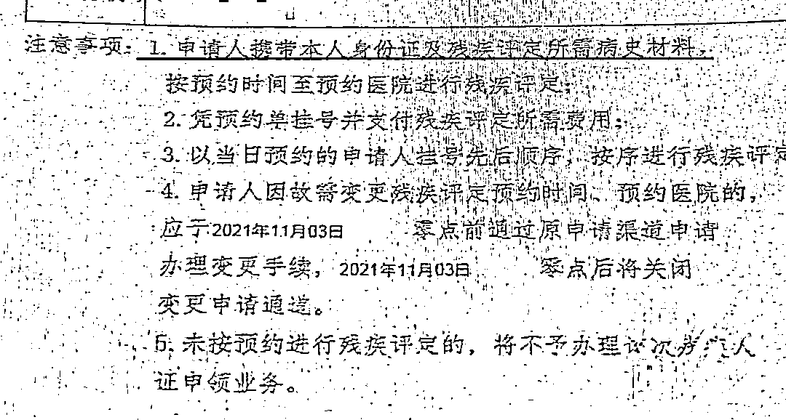
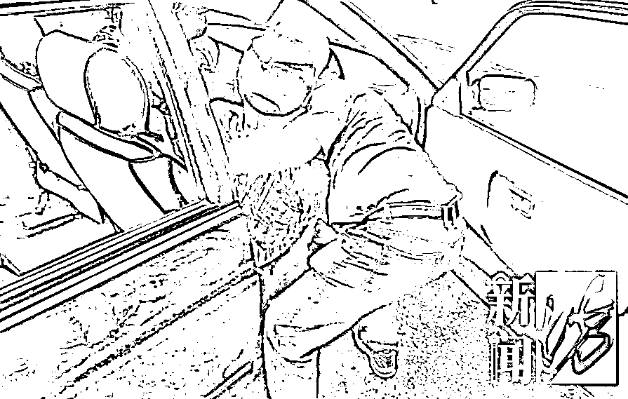

# 为植物人办残疾证，被要求“必须植物人本人来”？

> 原文：[`mp.weixin.qq.com/s?__biz=MzIyMDYwMTk0Mw==&mid=2247522476&idx=2&sn=3d022a777576b58c5c178c0131db568d&chksm=97cb5394a0bcda82be7905c88c49d3e14a8e2ac47d23dc5c8f865665b1284a81aff62759f5da&scene=27#wechat_redirect`](http://mp.weixin.qq.com/s?__biz=MzIyMDYwMTk0Mw==&mid=2247522476&idx=2&sn=3d022a777576b58c5c178c0131db568d&chksm=97cb5394a0bcda82be7905c88c49d3e14a8e2ac47d23dc5c8f865665b1284a81aff62759f5da&scene=27#wechat_redirect)

一年多前，市民王先生因患脑部疾病不幸成了植物人，没有任何行为能力。然而，家属申请伤残鉴定证明时，却被要求王先生本人必须亲自到场。

王先生的妻子张阿姨告诉记者，丈夫一年多前患有脑部疾病，虽说做了手术，但身体还是每况愈下，逐渐变成了植物人，目前住在杨浦区新华医院。

张阿姨和家人一直在医院悉心照顾王先生，但是高额的治疗费用压得他们喘不过气来。

了解到植物人办理残疾证能拿到部分补助，张阿姨的弟弟来到杨浦区长白新村街道社区事务受理服务中心咨询了相关办理事项。 

而想要办理残疾证，首先需要前往街道社区事务受理服务中心递交申请材料，获得一张残疾评定预约单，这个步骤可由他人代办。 

长白新村街道社区事务受理服务中心工作人员表示，经过上述步骤后，接下来的评定就需要由本人参与了。预约单上显示，伤残等级鉴定这个步骤，需要申请人本人携带身份证等材料前往指定医院。

工作人员称，预约单上写明，申请人要携带本人身份证及残疾评定所有的材料，再带上预约单到医院鉴定。

张阿姨表示很无奈，丈夫都是“植物人”状态了，如何亲自到场？

记者查询后发现，在杨浦区，做肢体残疾类伤残鉴定的医院只有杨浦区中心医院和一家康复医院，王先生所在的新华医院并不在其中。

张阿姨联系了杨浦区中心医院和相关部门，询问是否必须已是植物人状态的王先生本人亲自前往做鉴定，也得到了肯定的答复。

随后，记者致电杨浦区残联，工作人员也表示确实要植物人本人前往指定医院。

无奈之下，张阿姨想过叫 120 救护车或者出租车接送王先生往返。但因费用、时间等种种原因，未能成行。

最后，还是请朋友帮忙，开车送王先生和张阿姨去了杨浦区中心医院。

对此，街道工作人员表示，街道的工作只负责到给予申请人预约单。之后的伤残鉴定，残疾证的领取等步骤均与街道无关。植物人王先生的遭遇他们会向相关部门进行反映。

来源 ：新闻坊，潇湘晨报

← 向右滑动与灰产圈互动交流 →

