# 海底捞紧急发声明！网友吵翻

> 原文：[`mp.weixin.qq.com/s?__biz=MzIyMDYwMTk0Mw==&mid=2247522476&idx=3&sn=dab6a57d7abf6e87959034514c977c11&chksm=97cb5394a0bcda8203c37f4cd80a6f1bb2eed6e9697cf04f92bf61702507f30c6341b26e002b&scene=27#wechat_redirect`](http://mp.weixin.qq.com/s?__biz=MzIyMDYwMTk0Mw==&mid=2247522476&idx=3&sn=dab6a57d7abf6e87959034514c977c11&chksm=97cb5394a0bcda8203c37f4cd80a6f1bb2eed6e9697cf04f92bf61702507f30c6341b26e002b&scene=27#wechat_redirect)

10 月 19 日 

海底捞冲上热搜第一

因为脆脆毛肚缺斤少两

被顾客抓现行

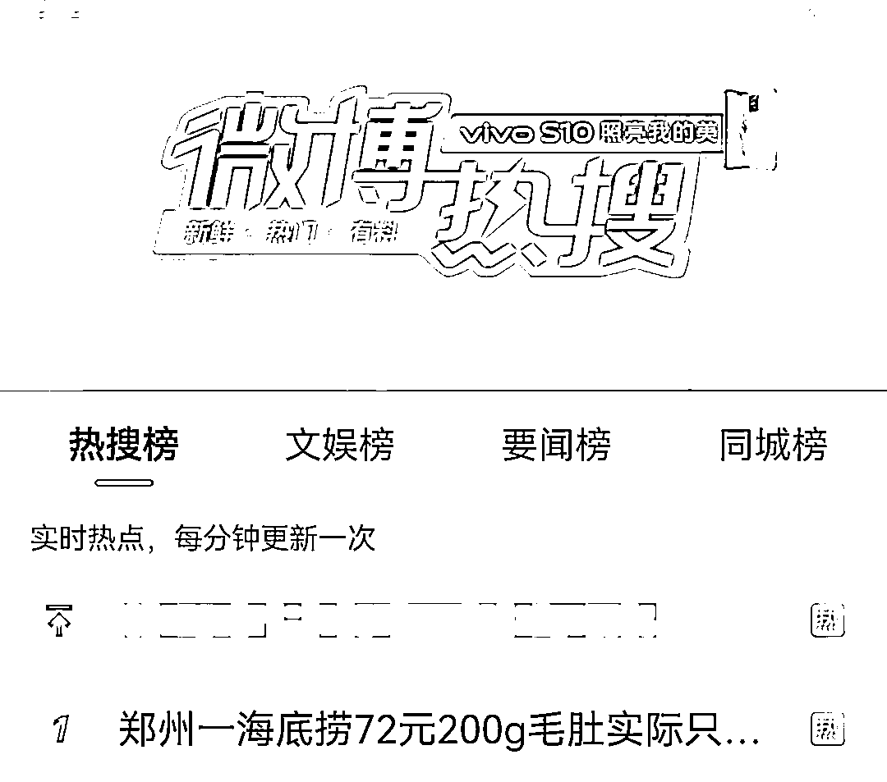

200g 毛肚实际只有 138g

[`mp.weixin.qq.com/mp/readtemplate?t=pages/video_player_tmpl&action=mpvideo&auto=0&vid=wxv_2098074285171867649`](https://mp.weixin.qq.com/mp/readtemplate?t=pages/video_player_tmpl&action=mpvideo&auto=0&vid=wxv_2098074285171867649)

近日，河南郑州，耿女士和朋友去海底捞新世界百货店就餐时，其中点了一份 72 元的捞派脆脆毛肚，可上菜后发现分量明显很少，要求员工称重时发现规格约 200g 的毛肚实际只有 138g，竟少了 62g。

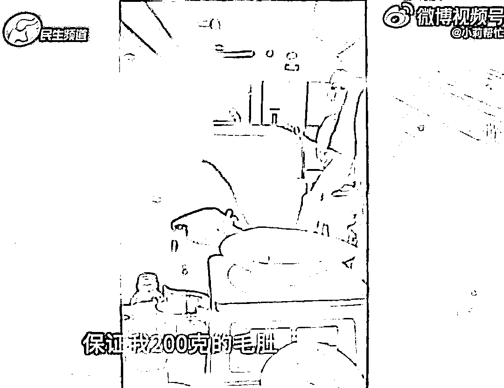

记者陪同耿女士去店内核实情况，**店长解释：员工备菜时操作失误导致，当天只有这一份菜品不合格。**

郑州市城东路市场监管所所长称这种情况，按照新消法规定可以对顾客损失进行三倍赔偿。

当事人耿女士回应：**不要一分钱不要卡，道歉解释清楚即可。**

海底捞毛肚缺斤少两的事情被曝光后，很快引发热议。 

有网友觉得店家太黑了，200g 少 62g，整整少了 1/3 左右，看来下次去吃海底捞得带上称了。

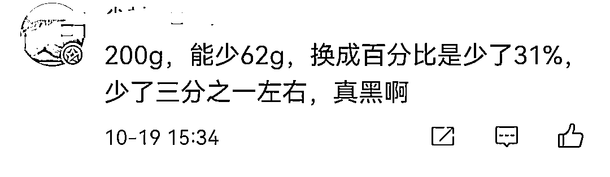

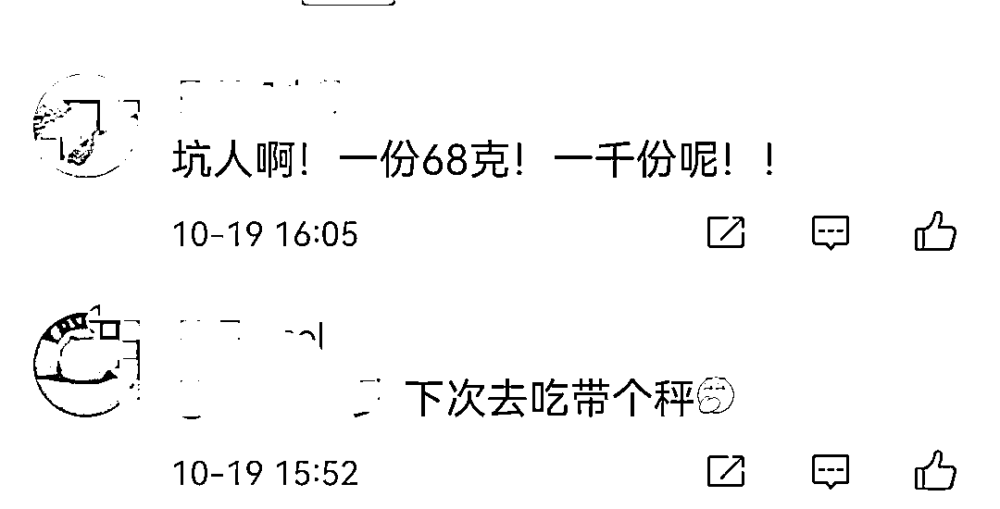

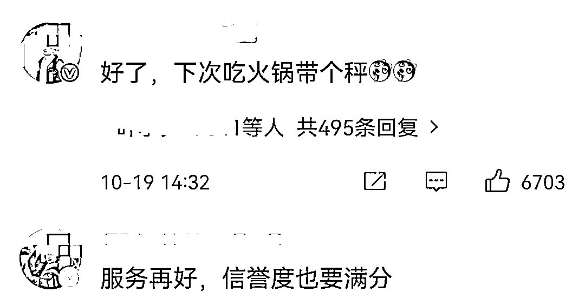

也有网友觉得会不会真的是失误。

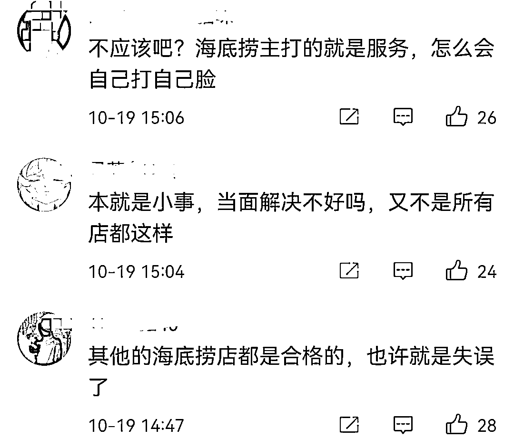

海底捞发表紧急声明

随后，海底捞紧急声明，产品按要求摆盘后存放需在半小时内。顾客凌晨 4 点就餐，因员工提前摆盘后放入冻库保存，产品特性导致水分流失。**属操作失误，已加强整改。**

事发当天就给顾客当面道歉了，并支持顾客依法维权。**因顾客提出两万现金赔偿，未能达成一致。已就此向市场局主动报告。**

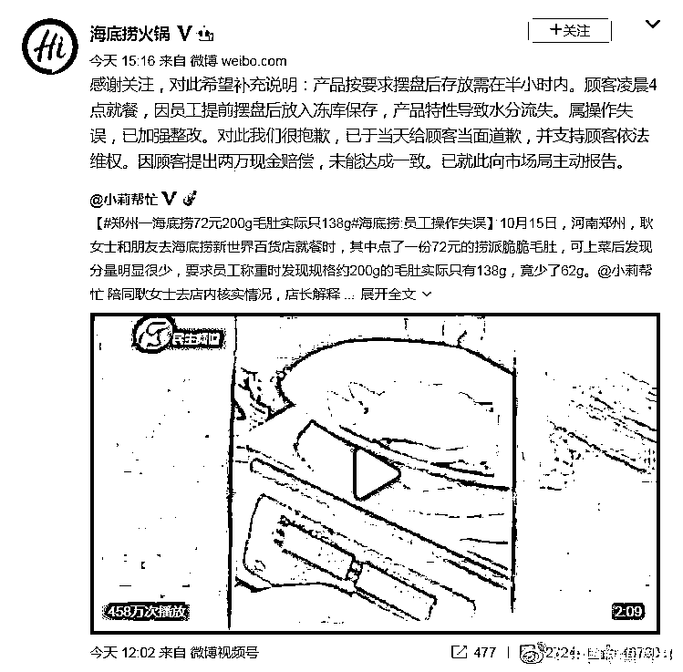

网友热议

对于海底捞得这份说明，有网友并不买账。

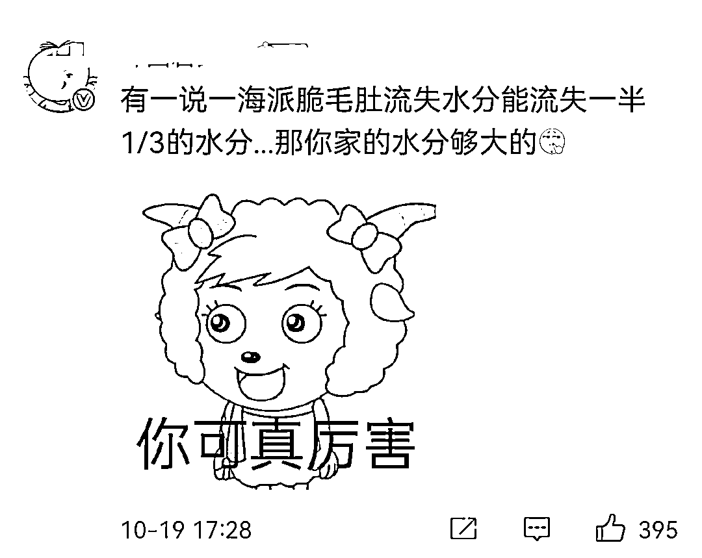

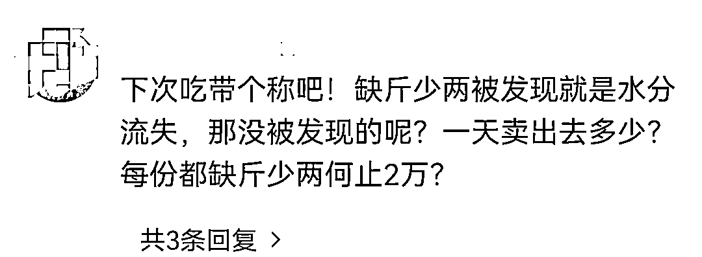

有网友则表示，海底捞是过分了，但顾客也有点过分了。

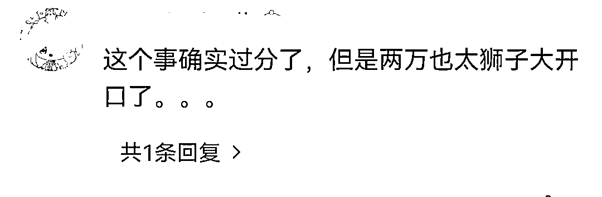

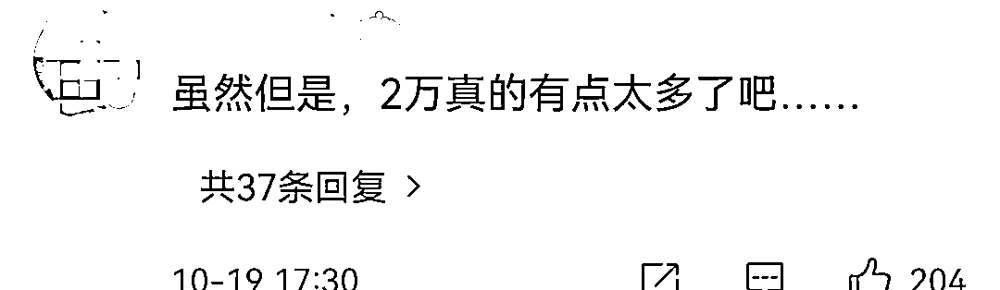

据媒体对事件最新进展的报道，关于 2 万元赔偿问题，**当事人耿女士解释：我们想曝光他们，不要一分钱，**到了市场监管所我们也是这么说的。

**对此，你怎么看？**

来源：新闻晨报、极目新闻、@海底捞火锅、长沙晚报

← 向右滑动与灰产圈互动交流 →

