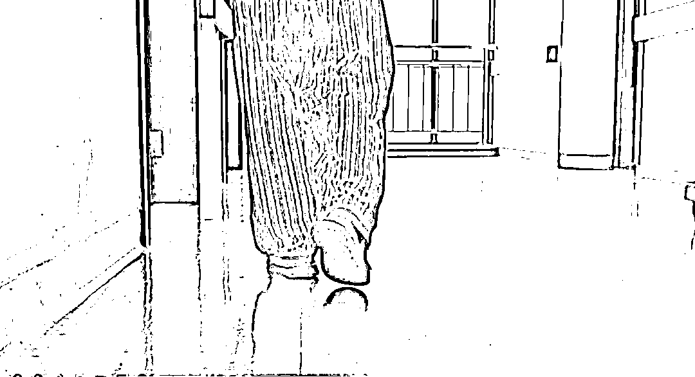
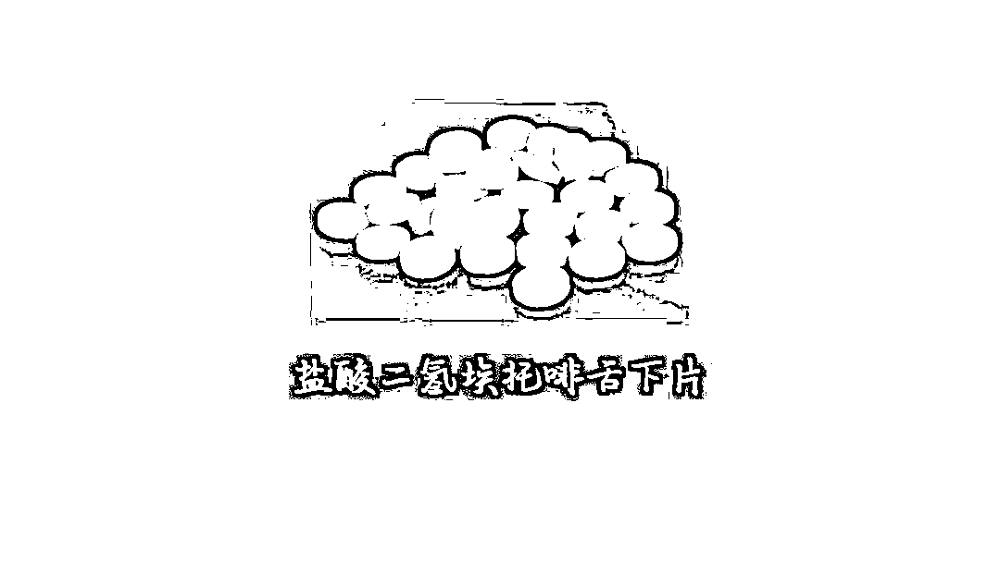
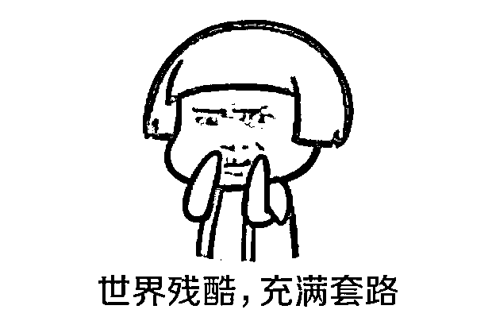

# 他认患癌老人为父，自掏腰包送其住院看病。背后有何猫腻？

> 原文：[`mp.weixin.qq.com/s?__biz=MzIyMDYwMTk0Mw==&mid=2247522476&idx=4&sn=791d23fc54da2a993dbb0326eb676c1a&chksm=97cb5394a0bcda82aa20ac5503e20f2fffcad1fc41ed63c1d861c3dcb51201b1a17627e6ce2c&scene=27#wechat_redirect`](http://mp.weixin.qq.com/s?__biz=MzIyMDYwMTk0Mw==&mid=2247522476&idx=4&sn=791d23fc54da2a993dbb0326eb676c1a&chksm=97cb5394a0bcda82aa20ac5503e20f2fffcad1fc41ed63c1d861c3dcb51201b1a17627e6ce2c&scene=27#wechat_redirect)

3 年前，家住河南台前县 60 多岁的高老汉患上了食道癌，由于病情严重无法承担家中农活，加之每天花钱买药治病，他对家人心存愧疚。

2018 年 4 月的一天，一个叫袁华（化名）的**老乡找到他，说可以带他去免费住院看病，食宿费、交通费用全包**，“遇到这种好事”高老汉动心了。

**免费看病对他来说无疑是个好消息**，一来手术之后每日疼痛难忍，二来生活拮据买药花销太大，“认为自己没啥损失”的高老汉决定啥都不问，乖乖听袁华的“指挥”。

当月，袁华便**以高老汉儿子的身份**，安排他住进了苏北某老年医院。

收治高老汉的孙大夫核实了病历材料，经过一番常规检查，确定了老汉确实患有食道癌。

资料图片，图文无关

孙大夫向办案人员回忆称，高老汉的“儿子”告诉他，高老汉已是食道癌晚期，**住院主要是给他减轻痛苦，延长寿命**。“我们医护人员表示理解。”

高老汉进入病房后，经常在病床上辗转反侧，时不时地喊着疼痛，听着着实让人揪心。

“后来他‘儿子’又主动找到我，说一般镇痛药对他父亲作用不明显，以前都是用‘盐酸二氢埃托啡舌下片’，要求我给他开这个药”。

“盐酸二氢埃托啡舌下片”是一种每片仅 20 微克的白色小药片，由于具有强效镇痛作用，反复用药可产生耐药性和依赖性，被国家列入麻醉药品，严格管制。

**在高老汉“儿子”的一再央求下**，“有麻醉药处方权”的孙大夫就开了这个药。接下来一段时间，医生每天都给高老汉常规治疗，并开具盐酸二氢埃托啡舌下片予以镇痛。

使用说明显示，该药被允许使用的最大剂量一般为一次 60 微克（3 片），一日 180 微克（9 片），连续用药不得超过 3 天，超大剂量使用时应遵医嘱。

办案组了解到，高老汉住院两个月，医生总共给开了 28 张处方，一共 654 片盐酸二氢埃托啡舌下片，其中单次开 24 片的就有 27 次，单次开 6 片的有 1 次。从苏北某医院的用药处方笺来看，已明显超出正常剂量。

让孙大夫没想到的是，这是一场精心设计的骗局——**冒充癌症病人“家属”就医，费尽心机开出镇痛药，却想方设法不给病人服用，将套出的药片“贩卖”**才是袁华的真正目的。

高老汉的遭遇绝非个例。警方调查发现，袁华等人又寻找了其他癌症患者，以同样的套路安排他们住进不同医院，又以同样的理由让医生开出了相关麻醉药片。

短短 6 个月，袁华等人从常州、安阳、徐州等地医疗机构相继套出 1500 片药。

警方调查发现，这个谋财之道是其他老乡“传授”给他们的，有些吸食毒品的人会用这种药代替毒品，**一片四五元的药片转个手就能卖到 260 元****。**

警方查到，药片主要卖到了山东阳谷、河南濮阳等地，而“上家”的身份、买药的实际用途等，由于袁华等人并不实际过问，对此公安机关仍在积极侦查。

来自徐州市鼓楼区人民检察院的公益诉讼办案成员敏锐地觉察到监管存在漏洞，于是对刑事案件以外损害公共利益的情况展开调查。主治医生解释：“因为病人比较痛苦，人性照顾，麻醉药品越吃剂量越大，根据病人要求可以给他们加大使用剂量。”

据袁华向警方供述，他们只是**跑到医生面前演演苦情戏，医生就会给多开这个药**，甚至他们不住院，医生也会按以往用量继续开药。

值得关注的是，该药用药说明书明确写到，必须病人住院时专人看护其舌下含服，涉案医院护士进一步证实，“**医院也规定，这类管制药品，必须要亲自发到病人手中，看着病人服用完才能离开**。” 

但卷宗材料显示，涉案 5 家医院分别在不同程度上出现将药直接交给家属、不看管病人服药的情况。

公益诉讼办案组成员张晓东表示，高老汉仅在医院住了几天，就以“需要吃流质和半流质”食物或者“住在女儿家”等各种理由不实际住院，而病人不在院期间药品正常开出，并且全都由“家属”代领，至于怎么服药、是否服药，医院更不得而知。

卷宗资料显示，还有医护人员反映，有时看护高老汉服药后，其表示会反胃而先将药吐出来，后续不知道有无服用。

“医院已发现部分端倪，但在医疗活动中没有引起足够重视。”张晓东说。

虽然各国对精神和麻醉类药物均进行严格管制，但是否将之界定为毒品，还需要有关部门予以明确。

最高人民检察院在此前一份批复中，认定盐酸二氢埃托啡是麻醉药品属“其他毒品”的范围，因此考虑到 1500 片盐酸二氢埃托啡舌下片从医院流出，被袁华等人用于非法买卖，而这种具有毒品性质的管制药品在社会上流通，必将极大侵害社会公共利益。经研究，公益诉讼办案组决定对案件立案调查。

办案组认为，**社会上一些不法分子，利用对癌症患者的同情心和医疗机构管理上的疏漏套取麻精药品**。对此，检察机关不能就案办案，结合办案情况进行总结，并制发检察建议书，对办理过程中发现医疗机构存在的三类问题与卫健部门进行充分沟通。

医生没有对病人实际情况进行核实，甚至在病人不实际住院的情况下违反规定超剂量开药；护士没有按照用药规程将药亲自交给病人并看护其服用；部分医护人员缺乏责任心，对药品使用说明掌握不准确，对药品的属性、剂量和服用规定等知之甚少……

面对检察机关指出的问题，苏北该市卫健委高度重视，组成专案组赴相关医院开展了专项调查，对违规的 40 名医护人员给予责令暂停执业、罚款、警告等不同程度的行政处罚，并清查了全市范围内所有二级以上医疗机构麻精药品使用管理情况，对存在问题的医疗机构进行全市通报批评。

“感谢检察机关及时将发现的问题反馈给我们，给我们提出了宝贵的建议，我们才能及时堵住麻精药品的监管漏洞。”苏北该市卫健委的相关负责人说。

办案组还发现苏南某市也存在上述问题。第一时间固定相关证据后，办案组将案件线索移送给该市检察院。随后，该院经审查后启动了公益诉讼程序，当地卫健委经过调查，对涉案两家医院予以警告、罚款的行政处罚，吊销了两家医院麻醉药品、第一类精神药品购用印鉴卡，对涉案的 7 名医师分别处以责令暂停执业六个月或一年、警告的行政处罚。

此外，徐州鼓楼区人民检察院还向河南省安阳市人民检察院移送了麻精药品监管案件线索，通过当地检察机关和卫健委的共同努力，涉案医院及相关医护人员分别受到了不同程度的行政处罚。

“点滴工作，我们感到的都是责任！”徐州鼓楼区人民检察院向承办检察官邱军表示，国家对麻精药品设定了严格的管控措施，在医疗环节如果出现监管漏洞，这些药品一旦流入社会，极容易被毒贩利用，从而严重危害社会公共安全。

她表示，通过司法裁判文书网的查询，办案组发现类似案件还有很多，涉及全国各地的医疗机构，也亟待引起国家卫健委等相关部门的重视。

来源：中国青年报客户端、江苏检察在线原题《镇痛药被频繁套取背后》

← 向右滑动与灰产圈互动交流 →

