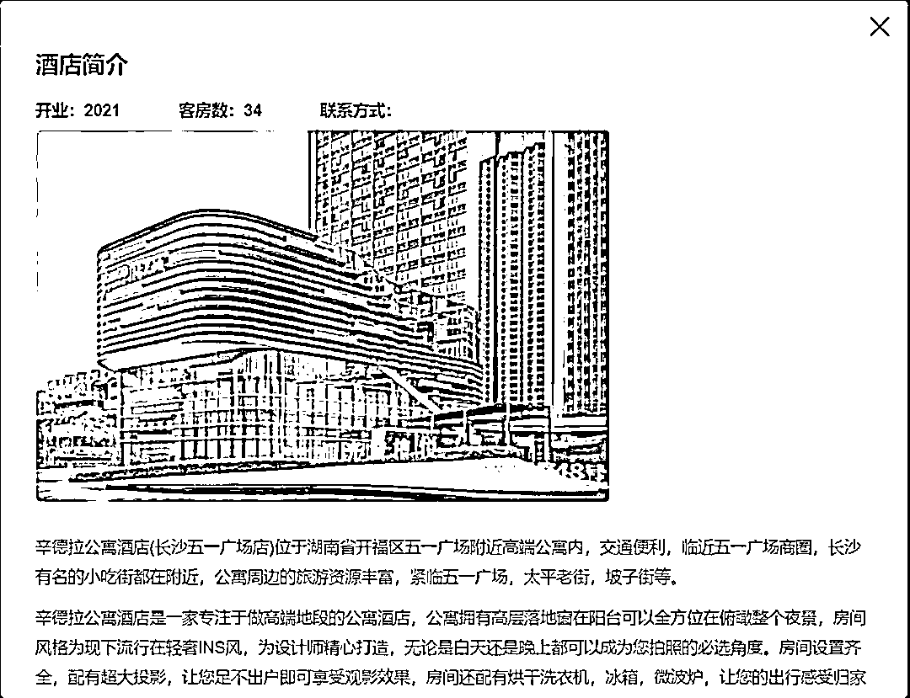
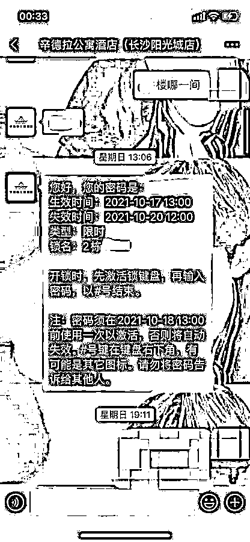

# 女子入住长沙一酒店，密码锁深夜被人打开.....

> 原文：[`mp.weixin.qq.com/s?__biz=MzIyMDYwMTk0Mw==&mid=2247522476&idx=5&sn=774750ec4c27bce3657fe3166b144195&chksm=97cb5394a0bcda82df084e7a6f160cfc462e6425e805afad8ce27271518cde5b61726bc39a5a&scene=27#wechat_redirect`](http://mp.weixin.qq.com/s?__biz=MzIyMDYwMTk0Mw==&mid=2247522476&idx=5&sn=774750ec4c27bce3657fe3166b144195&chksm=97cb5394a0bcda82df084e7a6f160cfc462e6425e805afad8ce27271518cde5b61726bc39a5a&scene=27#wechat_redirect)

[`mp.weixin.qq.com/mp/readtemplate?t=pages/video_player_tmpl&action=mpvideo&auto=0&vid=wxv_2098848780384108550`](https://mp.weixin.qq.com/mp/readtemplate?t=pages/video_player_tmpl&action=mpvideo&auto=0&vid=wxv_2098848780384108550)

10 月 19 日，来自上海的梁女士向极目新闻反映，17 日深夜，她在湖南长沙一酒店住店时，有人多次输入正确的密码，幸好房间门反锁才未被打开。梁女士事后得知，酒店房间门锁的密码是限时的，在入住时段外会失效，且只有住客和酒店工作人员知晓密码。该酒店负责人回应称，楼道内没有监控，无法确定开锁者是谁。此外，店方认为存在客人自导自演的可能。

据梁女士介绍，10 月 17 日，她和妹妹来到长沙旅游，预订了位于开福区阳光城檀悦 2 栋内的辛德拉公寓酒店，预订日期为 17 日至 19 日三天。入住当晚 10 时许，姐妹俩听到房间门外传来输入门锁密码的声音，对方还多次转动了门把手，试图开门，她们便来到门口录下视频。所幸房间门由于被反锁未被打开。

梁女士告诉记者，她得知，酒店的门锁密码是限时用的，在入住时段外就会失效，只有前台人员和客人知道密码。她和妹妹还测试发现，只有在输入正确密码的情况下，门把手才能被转动。一名酒店负责人对她们表示，酒店开业不久，楼道内没有监控，无法确定开锁者是谁。梁女士则表示等天亮会退房，并另寻其他酒店，要求酒店承担她们这三天的房费。店方同意了退房，并免除了 17 日当晚的房费，不过拒绝承担后两天的房费。

19 日下午，记者联系上辛德拉酒店一名刘姓店长和一名负责人刘女士。刘店长称，事发前后，酒店内的工作人员只有两名前台与一名负责人，他们当时都没有去过梁女士所在的房间，“两个前台当时在一起吃饭，负责人和其他酒店的人在一起”。刘店长与刘女士都表示，他们认为存在客人自导自演的可能，“正常人都会喊一声吓退门外的人，而且感觉她们在视频中太冷静了”。

梁女士告诉记者，她认为酒店应必备监控，没有监控是酒店的疏漏，不想与他们多做辩解。她也想通过自己的经历提醒网友，住酒店时需要多注意安全。目前，她已向消费者热线投诉此事。

来源 ：极目新闻，潇湘晨报

← 向右滑动与灰产圈互动交流 →

