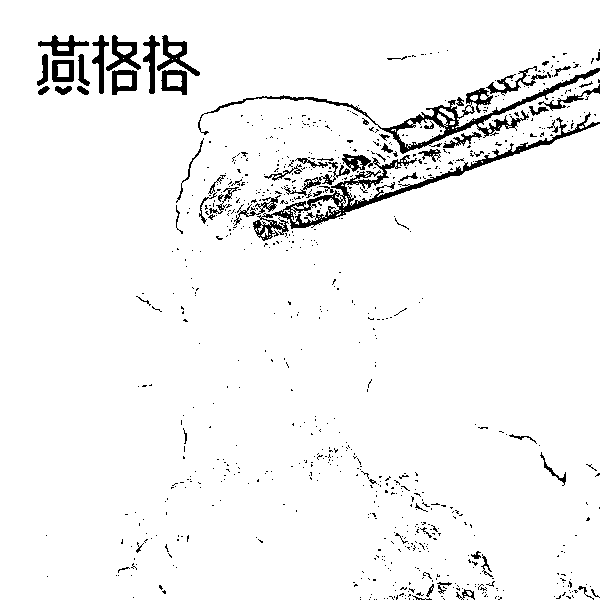
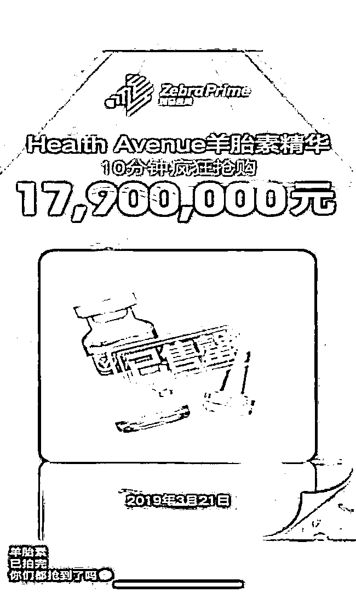
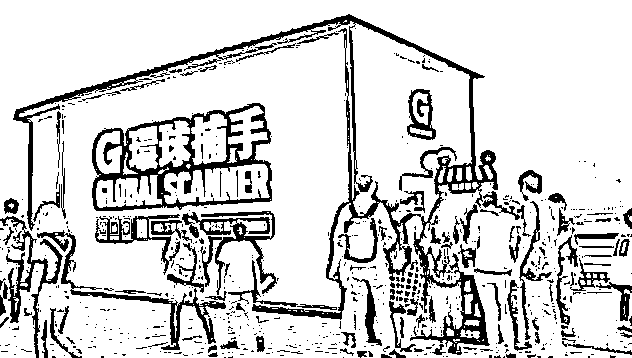
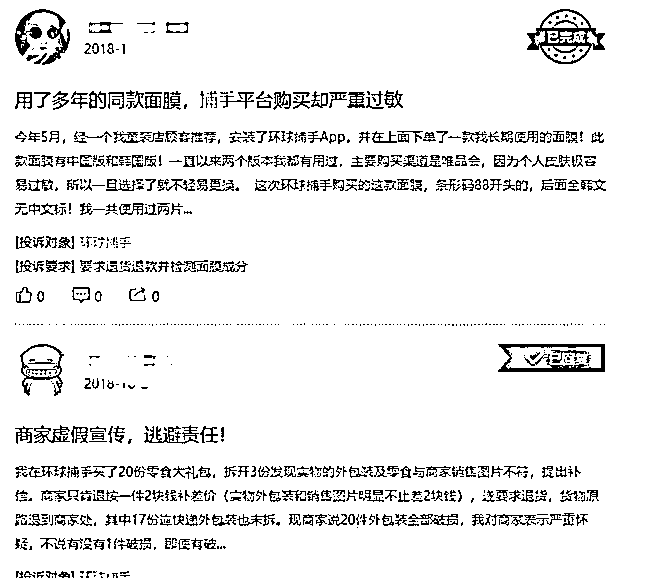
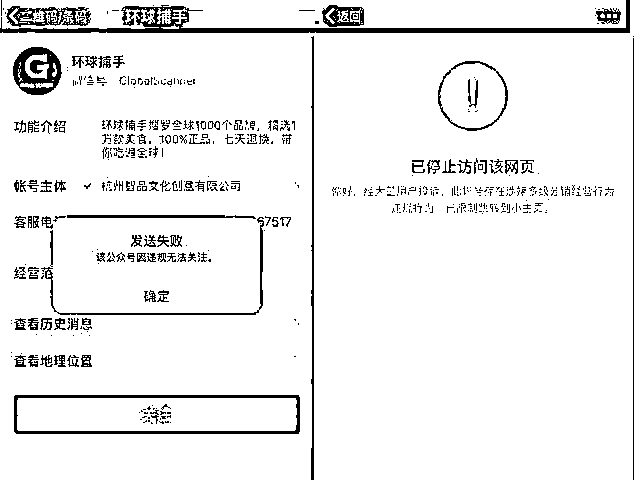
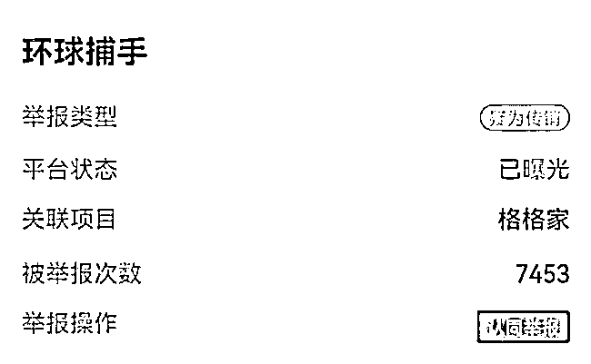
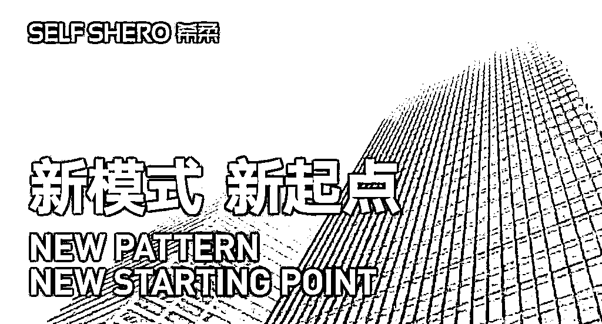

# 两度“借壳还魂”，环球捕手的求生记！

> 原文：[`mp.weixin.qq.com/s?__biz=MzIyMDYwMTk0Mw==&mid=2247522476&idx=6&sn=48b32b9a68319b5ac6a242c5f120d23a&chksm=97cb5394a0bcda826823c4becab3bad3aa41ca11566fc4f2d4a78350cc5448f04dd19b26182d&scene=27#wechat_redirect`](http://mp.weixin.qq.com/s?__biz=MzIyMDYwMTk0Mw==&mid=2247522476&idx=6&sn=48b32b9a68319b5ac6a242c5f120d23a&chksm=97cb5394a0bcda826823c4becab3bad3aa41ca11566fc4f2d4a78350cc5448f04dd19b26182d&scene=27#wechat_redirect)

**出道即“神话”**  

2011 年至 2014 年间，环球捕手的创始人李潇凭借着品牌燕格格持续保持天猫淘宝类目全网第一，但李潇的志气远不在此。

吃透阿里生态圈流量红利后，随着 2014 年天猫重点扶持转向国内一二线品牌及国际大品牌，李潇正式“出淘”，豪赌社交电商。

2015 年，李潇成立浙江格家网络技术有限公司，于 2016 年 4 月，正式上线基于微信生态圈的电商平台环球捕手。

在经历一年的会员沉淀期，其微信公众号突然在 2017 年 7 月走红朋友圈，一直不温不火的环球捕手彻底地红遍了大江南北。 

数据显示，7 月 27 日，环球捕手微信指数超过 450 万，而同期某知名大 V 公号的微信指数只有 50 万。根据环球捕手统计数据显示，平台上线 5 天日销售额就突破百万元，30 天用户数破百万。

环球捕手缔造了一场人人称道的微商神话，不过这迅猛而来的辉煌在深究之下，只要一碰，就碎了。

2017 年 11 月 11 日凌晨，双十一狂欢购物节，环球捕手连续两天首小时营收过千万，平均客单价 285 元，共有 9 大类目上千个品牌 1500 万用户参与环球捕手双十一两天的购物狂欢。

当时，环球捕手的品牌认知度与普及率都还远远不及淘宝、京东等品牌，但在其平台上的销售数据却完全可以与淘宝媲美。

但这超高的数据伴随着的是令人匪夷所思的现象，比如：Health Avenue 羊胎素精华 10 分钟疯狂抢购 1790 万元，而这样可观的销售数据，在环球捕手平台上几乎每天都在发生。

而创始人李潇及其代理也不断提及环球捕手是“躺赚”模式，如何“躺赚”，就耐人寻味了。

#02、光环之下屡遭质疑

环球捕手明面上有三个等级，分别是环球捕手普通会员、服务商（经理）、优秀服务商。新用户在环球捕手上购买 399 元的指定产品，即可开通“捕手会员”，同时成为“环球捕手店主”。

普通会员可以获得其下级销售佣金收益的一定比例，并且每发展一名会员，可以直接获得 100 元的分成。

在销售金额达到 1 万元之后，就可以升级为经理级会员，这时不仅可以获得直接下属的销售分成，更可以获得下属的下属的销售分成。

在销售额达到 30 万元后，就可以升级成为优秀服务商，可以获得团队里所有人的销售分成。“之后月入几十万是很轻松的事了”环球捕手品牌经理级会员说道。

同时，与囤货方式不同的是，在环球捕手平台上销售产品，只需要每天分享平台上的产品链接即可，而大多数情况下热情推送产品链接至朋友圈的代理，根本就没见过真正的产品，一切栩栩如生的使用心得体验几乎都是来自平台定期推送。

实际探究起来，平台上众多自称官方直营的店铺其实并无官方授权，商家和代理，一个敢认，一个敢夸，问题和投诉也如期而至。

在黑猫投诉平台上，环球捕手被多次投诉，不少消费者投诉其平台涉嫌出售假冒服装、化妆品副作用严重、食品与销售图片不符，申请退款但不退钱等问题。

就连 1818 黄金眼上也保留着不少环球捕手上销售假货的报道。

同时，环球捕手多级分销的模式也遭到质疑。

据当时消息，环球捕手自 2016 年 4 月上线以来到 2017 年 1 月，不到 1 年的时间内，用户数量迅速扩张已经突破 1000 万，截至去年 10 月环球捕手单日销售额突破 2.18 亿元。

两年多的时间内，环球捕手在成交额以及用户积累上都完成了惊人的增长，但数据成长和所谓的“躺赚”背后离不开其拉人头的模式。

忽略产品质量，一味追求人头数量，舍本逐利、积错成习，最终导致环球捕手走上狭路。

2017 年 8 月 1 日，“环球捕手”公众号遭遇永久封号，腾讯官方提示“该账号因违规无法关注”，有关界面同样显示该账号涉嫌多级分销违规行为。

环球捕手也因此由盛转衰，负面舆论纷至沓来，越来越多的人意识到这种恶意营销、拉人头的模式是典型的传销。

在腾讯灵鲲金融风险监管平台上，环球捕手更是被标记了 7000 多次，标记类型为“疑为传销”，平台状态为“已曝光”。

#03、两度借壳还魂”卷土重来

而环球捕手的借壳游戏还在继续。

2018 年 11 月，因涉嫌传销而被微信永久封号的社交电商环球捕手退场，格家网络科技公司正式推出斑马会员。

企查查股权关系显示，浙江格家网络技术有限公司通过全资控股的方式成立子公司杭州迅兰电子商务有限公司，最终由杭州迅兰作为斑马会员的运营方。

而斑马会员等级同样分为：会员（店主）、服务商、优秀服务商三级。

在平台累积消费满 399 即可开通会员；而会员卖出总额达 1 万元，就可以晋升为服务商，团队每增加成员都可获得收益；当业绩达到 30 万，可获得团队成员所有的销售及推荐分成。

这熟悉的套路与环球捕手如出一辙。

且斑马会员不愿意放弃环球捕手“骗取”的庞大用户量，甚至公然打出“环球捕手已经全民升级，快去看看！”的广告，进行引流。

同时，两个平台在产品质量和运营模式上基本换汤不换药，于是，斑马会员又一次招致差评，并引来监管部门的关注。

2020 年 4 月 23 日，一份汉寿县市场监督管理局在查处杭州迅兰电子商务有限公司、杭州酷梨科技有限公司、广州云庭网络营销策划有限公司涉嫌传销裁决书显示，冻结上述公司在支付宝公司开立的结算账户内的资金 3000 万元。

同时在腾讯灵鲲金融风险监管平台上，斑马会员被举报 1500 多次，举报类型已定性为传销，平台状态显示为“警方介入”，在黑猫投诉平台上，与斑马会员有关的投诉条数也已超过了 400 多条。

继环球捕手后，斑马会员又不灵了。

2020 年 7 月底，在斑马会员涉传倒闭的新闻不绝于耳，而与此同时，“斑马会员新项目---SS 希柔即将启动”又被刷爆朋友圈。

斑马会员处于一种“倒闭了，但没完全倒”的状态，直到浙江省通信管理局公布的 2021 年第三批存在侵害用户权益行为的 APP 企业名单中，榜上有名的斑马会员才让人后知后觉，居然还没倒。

只不过斑马会员的管理员们早已对其弃如敝屣，纷纷奔赴下一个品牌——希柔，斑马会员已经名存实亡。

在企查查上，希柔显示隶属于杭州雅洁电子商务有限公司旗下的品牌生态链管理平台，与格家网络没有股权联系，但在实际控制人处显示为，格家网络创始人李潇占股 99%，一切已然昭然若揭。

希柔几乎就是环球捕手和斑马会员的延续，就拿希柔的基本玩法来看，仍然是三个级别：SSV、SSP、SCO，分别享受在平台购物 8.5 折，6.5 折和 5.5 折。

短短几年之间，环球捕手几次看似已然落下帷幕，但镰刀从未停止。

**此前报道：**

**[【环球捕手】拉人头致富的发财梦破灭了](http://mp.weixin.qq.com/s?__biz=MzIyMDYwMTk0Mw==&mid=2247487290&idx=2&sn=18176482fba9c22e51f3dd66b5d183aa&chksm=97c8c402a0bf4d14354c39543a0946bb775a6d742026048b797a53a7a2c25ef7bc3a6cbbd0b3&scene=21#wechat_redirect)**

**[深度|“环球捕手”重出江湖 ！捕获的恐怕只是“人心”！](http://mp.weixin.qq.com/s?__biz=MzIyMDYwMTk0Mw==&mid=2247490116&idx=1&sn=a4c3e09364324ddbb1c9a40eba9c1566&chksm=97c8d17ca0bf586aa29f0aabd868ee6e619cf5ddca86eee5bc84b825ccfa386beed321a8edca&scene=21#wechat_redirect)**

**[两次借尸还魂，环球捕手“死”了但没完全“死”](http://mp.weixin.qq.com/s?__biz=MzIyMDYwMTk0Mw==&mid=2247516448&idx=3&sn=bcc061e991266a45b7685beba83122b3&chksm=97cb4a18a0bcc30e5cce5ea2df0a9a5c0ae57f8e70603429a26b7c62c2e10c88af223c8d3825&scene=21#wechat_redirect)**

来源 : 美商社，巴蜀反诈

← 向右滑动与灰产圈互动交流 →

