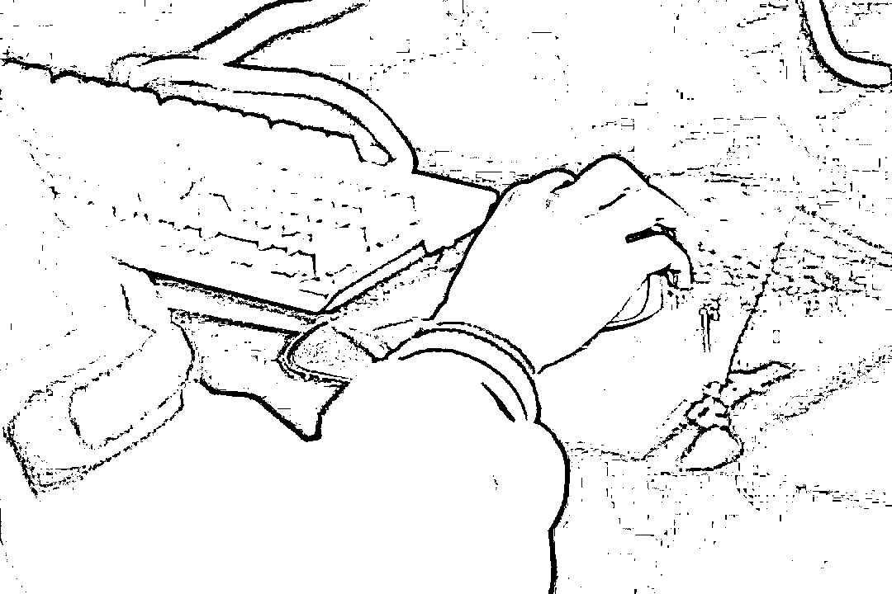
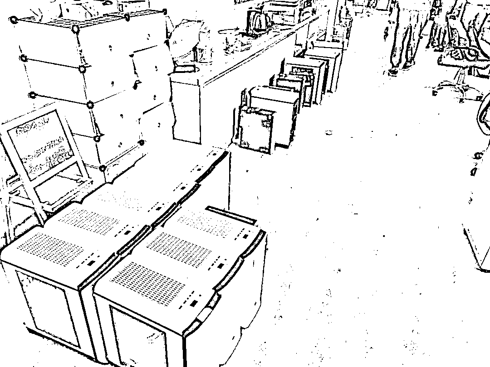

# 疯狂吸金的“电竞小酒馆”App 其实是……

> 原文：[`mp.weixin.qq.com/s?__biz=MzIyMDYwMTk0Mw==&mid=2247522476&idx=7&sn=cc7daa3a079cbd9088daaff5c6adc2ab&chksm=97cb5394a0bcda829f3c6a517c9931ae47ad53b7a69c67a97929fd5ce486b85f0f1d9511d126&scene=27#wechat_redirect`](http://mp.weixin.qq.com/s?__biz=MzIyMDYwMTk0Mw==&mid=2247522476&idx=7&sn=cc7daa3a079cbd9088daaff5c6adc2ab&chksm=97cb5394a0bcda829f3c6a517c9931ae47ad53b7a69c67a97929fd5ce486b85f0f1d9511d126&scene=27#wechat_redirect)

**上线 3 个月 7 万人次参赌**

**狂揽赌资 3500 万元**

**70 余人落网**

**……**

**小心披着游戏外衣的**

**网络赌博陷阱**

电子竞技产业的蓬勃发展给经济带来新动力，但也成为赌博犯罪滋生的新领域。在上海市普陀区检察院办理的一起开设赌场案件中，上线三个月的电竞赌博 App 在网络上迅速膨胀。经历了短暂的吸金后，何某、吴某等核心成员被抓获，他们的发财梦就此破灭，团伙 70 余人先后落网。截至目前，该案已有 60 余人因犯开设赌场罪而获刑。

“电竞小酒馆”App 疯狂吸金

图片来源于网络，与正文无关

面对办案检察官，被告人何某如实供述了自己的“创业史”：从学校毕业后，他曾就职于一家大型互联网公司，有着丰富的团队开发和网络项目运营经验。辞职后，他在发展得如火如荼的电竞市场中发现了商机，从 2020 年春开始筹谋开发一款提供电竞博彩业务的 App。他拉拢到同样熟悉互联网运营的吴某、傅某等人，在浙江、海南分别注册公司，通过网络招聘的方式从各地招兵买马，一步步组建起了一个组织严密、分工明确的公司团队。

一切准备就绪后，2020 年 6 月 10 日，“电竞小酒馆”App 正式上线。App 针对各种电竞赛事开设赔率，让玩家充值，对国内外各大电竞赛事按不同的赔率进行投注。从 6 月到 9 月，短短三个月的时间，这款 App 就吸引了 7 万人次参与，而何某的公司也因此吸收了 3500 余万元的赌资。

不久，公安机关发现了这款涉嫌赌博的 App，随即立案侦查。2020 年 10 月 19 日至 22 日，何某、吴某等几名核心成员纷纷到案，上海市普陀区检察院同步提前介入引导侦查。

通过社交平台招揽玩家

“销售做好了才有活路。”何某到案后接受讯问时说。办案检察官发现，该公司的销售人员一直通过各种社交媒体挖掘潜在玩家。

“你喜欢电竞吗？”据到案的一个玩家回忆，他一开始是在 QQ 上收到了陌生人的好友申请，身为一个电竞爱好者的他出于好奇加了对方好友，随即被拉入到一个聊天群，群内每天都会有人发布电竞比赛的信息，还介绍“电竞小酒馆”App 的下注方法。点击群里提供的网址链接，就能注册“电竞小酒馆”App 的账号。进入 App 能看到里面有四个模块，分别是“首页”“赛事”“预测”和“我的”，包含了英雄联盟、DOTA、王者荣耀等热门游戏的赛况信息。

其中，“预测”模块就是玩家下注的地方。玩家充值金额到账户内，系统会按照 1∶1 的比例自动兑换成相应数额的“水晶”“钻石”或者“金币”等“电竞小酒馆”App 的虚拟币。玩家可以对各大电竞赛事比赛直播的结果按不同赔率进行下注，计算输赢后，会有专门工作人员协助玩家将赢取的“钻石”“金币”按照一定比率提现。然而，据玩家反映“大多数情况都是输”。

提前介入期间，办案检察官多次前往公安机关召开案件讨论会，从赌资如何提现等取证难点方面提出侦查意见。

检察官打破“障眼法”

经查，App 中的“钻石”“水晶”等虚拟币可以通过两种渠道提现：第一种是 App 自带对赌小游戏“炸弹猫”，玩家将自己的“钻石”在小游戏中以认输的方式输给销售人员，销售人员以现金的方式返还给玩家；第二种则是点击 App 上加入的积分兑换链接，虚拟币可以兑换竞技积分，再用积分通过第三方“椰子商城”“嗨乐商城”等平台兑换商品，如购物卡或充值卡。

为什么不在 App 里直接开发提现渠道，而要设计如此大费周章的提现方式？办案检察官发现，这不过是何某的“障眼法”。

何某非常清楚“电竞小酒馆”App 的赌博性质，利用第三方兑换平台和小游戏进行提现可以让变现渠道更为隐蔽，使 App 看起来更像一个普通的电竞游戏资讯平台和简单的游戏平台，他以为只要竞猜和提现在两个不同的平台就可以高枕无忧。经过办案检察官的释法说理，何某最后承认：“这个 App 是一个具有网络赌博性质的平台，我们提供变现的渠道是违法的。”

70 余人陆续落网

查获的部分办公设备

2020 年 10 月开始，随着何某、吴某、傅某等运营团队负责人落网，运营团队其余成员 70 余人也陆续在浙江杭州、舟山和海南等地被抓获。

根据公司架构，这些犯罪嫌疑人分工各不相同，主要分为三类：技术类、客服类、销售类。面对人员众多、分工细化的庞大犯罪嫌疑人团伙，**办案检察官在心中打了一个问号：除实际控制人何某等管理人之外，其余人主观上是否明知 App 的违法性质？**

在案件办理过程中，这三类人员均存在不同程度的辩解。为此，办案检察官多次召开案件讨论会，**分析认为如何充值下注及兑换提现是“电竞小酒馆”App 的核心问题，如果犯罪嫌疑人对于该 App 可以下注、开盘、提现的过程明知，就可认定其对赌博性质的明知。**

办案检察官在证据审查和讯问中发现，销售人员一般都要帮助玩家下注、兑换积分、提现；客服人员比销售更加全面、完整地掌握公司的运转模式，因为他们要解答玩家提出的各种问题；而技术人员研发了软件页面和功能，且到案的犯罪嫌疑人均在公司工作至少一个月以上，对于软件的运营方式心中必然有数。

**最终，通过办案检察官的释法说理，被告人均认罪认罚。**办案检察官认为，何某等人以营利为目的，共同以“电竞小酒馆”App 方式在网络上开设赌场，犯罪事实清楚，证据确实、充分，应以开设赌场罪追究刑事责任。

截至目前，经普陀区检察院提起公诉，已有 60 余人因犯开设赌场罪获刑。9 月 1 日，主犯何某被法院以开设赌场罪判处有期徒刑三年九个月，并处罚金 10 万元。其余被告人分别被判处有期徒刑七个月到两年八个月不等的刑罚，各并处 4000 元到 5 万元不等的罚金。目前，案件还在办理中。

电子竞技作为新兴比赛形式，在社会生活中的影响日渐广泛，受众多为年轻人。“电竞小酒馆”App 三个月招揽 7 万人次参赌，其中不乏青少年玩家。本案中到案的部分玩家均受到了行政处罚，**检察官在此提醒大家，提高防范意识，警惕披着游戏外衣的网络赌博陷阱。**

来源 :检察日报、最高人民检察院微信公众号，巴蜀反诈

← 向右滑动与灰产圈互动交流 →

