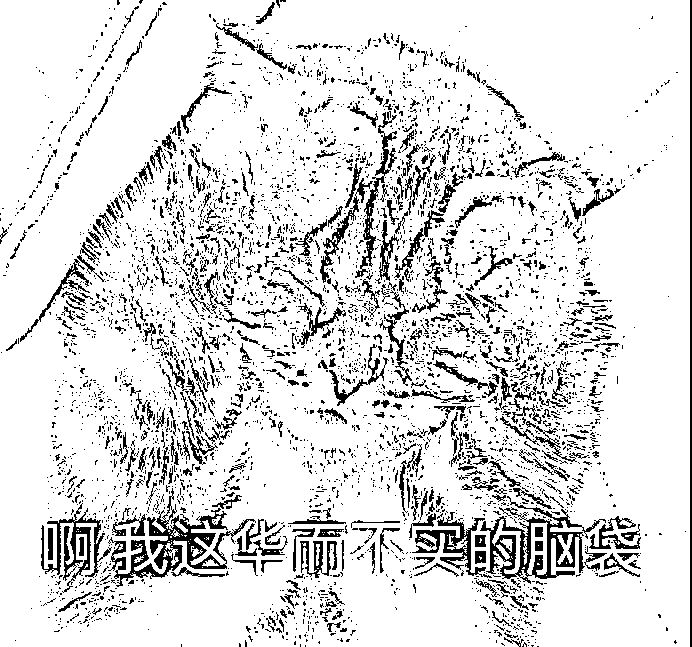

# 一张快递单，就能骗你十几万！

> 原文：[`mp.weixin.qq.com/s?__biz=MzIyMDYwMTk0Mw==&mid=2247522563&idx=4&sn=3e3e35ede51f565761b1ca97d053dee0&chksm=97cb523ba0bcdb2d309d8dbde6516e7ffa64dfe2383268395423b7388fa8fda3f7e6b0b3a767&scene=27#wechat_redirect`](http://mp.weixin.qq.com/s?__biz=MzIyMDYwMTk0Mw==&mid=2247522563&idx=4&sn=3e3e35ede51f565761b1ca97d053dee0&chksm=97cb523ba0bcdb2d309d8dbde6516e7ffa64dfe2383268395423b7388fa8fda3f7e6b0b3a767&scene=27#wechat_redirect)

**前几天看到这样一条微博**

**一位拥有百万粉丝的视频 UP 主**

**在接了一通电话之后**

**被骗走了 16 万元**

[`mp.weixin.qq.com/mp/readtemplate?t=pages/video_player_tmpl&action=mpvideo&auto=0&vid=wxv_2091710818793897992`](https://mp.weixin.qq.com/mp/readtemplate?t=pages/video_player_tmpl&action=mpvideo&auto=0&vid=wxv_2091710818793897992)

**（点击右下角全屏观看效果更佳）**

对方能准确地报出她的个人信息

使她降低了警戒心

从而上当受骗

我们经常疑惑个人信息是如何泄露的

答案，很可能就藏在不起眼的快递盒里

▼▼▼

一个被丢弃的快递盒的命运是什么？ 

**被当作 5 毛一斤的纸盒卖掉？**

**被大自然消解？**

**还是被送到垃圾处理场“回炉再造”？**

这些是我们能想到的快递盒命运正常的归宿。 

不少人拿到快递包裹，一拆了之，一扔了事。

但其实，这个你随手丢掉的快递盒，这张你未处理的快递面单，已经足够**让你的个人信息处于“裸奔”的状态**。

这些个人信息包括**「 姓名、年龄、昵称、性别、手机号码、住址、爱好、学校、社团、手机型号、偶像、爱好、阅读习惯、爱看的电影、消费习惯、最近逛的网站、视频、点赞……」**

简直可怕！

今天小编就跟大家盘一盘，**一张快递单，是如何暴露你的个人隐私的？我们又该如何防范？** 

**一张快递单上有哪些信息？**

首先，我们先看一看一张快递单究竟可以将一个人的画像精准还原到什么程度。

以下是小编在网上找的一家快递单截图。

△图片来源于网络

随便一扒，我们就可以得到以下信息：

**1.寄件人姓名；**

**2.寄件人地址；**

**3.寄件人手机号； **

**4.收件人姓名；**

**5.收件人地址；**

**6.收件人手机号；**

**7\. 物品详情；**

**8\. 揽收人签字；**

如果寄件人是你的朋友，那么你朋友的姓名、地址、电话等也将暴露无遗。

**不法分子利用快递单得到的信息可以做什么？** 

下面是一个被丢弃的快递盒。

△图片来源于网络

通过这些信息，不法分子基本已经“认识”了你： 

1\.   通过**快递****单**，不法分子首先可以知道你的**姓名****，家****或者公司的地址**，以及你的**手机号**。

2\.   通过你的**手机号**，不法分子可以找到你**绑定的微信**、支付宝、QQ、微博等**社交媒体账号**。

而现代年轻人离不开社交软件，很多人在申请账号时使用的都是同一个手机号和昵称。

所以只需要知道一个，就能在其他地方找到对应的账号。

于是，关于他的一切，统统都能知道了。顺着这个信息还可以了解你的**颜值相貌、学校、社团、喜好、偶像、微博给谁点过赞、喜欢听什么音乐……**

****

△图片来源于网络

3\.  通过你购买的物品，不法分子可以了解你的**消费习惯和经济能力**，还可以推测你的**生活习惯**。

4.  揽收人签字如果是你本人签，不法分子可以得知你的**笔迹**。如果是亲人、朋友、同事代签，还可以了解你的家庭情况和交际圈。

所以，小小的一张“纸”，就足以建立起你的立体画像。

而掌握这些个人信息的不法分子，将开始下一步动作——**卖给诈骗集团**。

一般来说，这中间还会有**“料商”**倒一手——“料商”将以 1-2 元 1 条的价格买走这些快递盒上的个人信息，然后再倒卖给东南亚诈骗集团，形成一条隐秘而完整的产业链。 

△图片来源于网络

这些包括电话、住址、所购产品在内的个人信息在业内就被称为**“快递料”**。

所以，“快递料”的主人隐私被泄露不说，还有可能被专业的诈骗团队盯上，有人因此被骗**数十万甚至百万元**不等。

** 被迫“裸奔”的我们该怎么办？ **

说了这么多隐私泄露的危害和易泄露性，到底我们该如何在日常生活中有所规避呢？

**1、控制源头，从收件地址填写开始——「能隐则隐」**

填写“地址”时，能多简单就多简单，房号最好不填（在中转站自取，不需要详细地址）；填写“收件人”时，尽量不要透露性别、职业，若是独居，时不时的给自己起个新名字，也不失为一种自我保护的方式。

**2、重视废弃快递单处理——「能删则删」**

丢弃快递单前，用油性笔、纸巾沾水、修正液、花露水、风油精、美工刀、牙膏等**将收件人、发件人、快递单号都涂抹掉**，**包括自己的签字**都涂抹干净。 

不要嫌麻烦，做总比不做好。 

毕竟，绝大部分电信网络诈骗，都是从个人信息泄漏开始的。

来源 ：微信 110，熊猫反诈

灰产圈在线客服

<mpsearch class="js_mpsearch appmsg_search_iframe js_uneditable custom_select_card" data-keywords="%5B%7B%22label%22%3A%22%E4%BC%A0%E9%94%80%22%7D%2C%7B%22label%22%3A%22%E8%B5%8C%E5%8D%9A%22%7D%2C%7B%22label%22%3A%22%E8%AF%88%E9%AA%97%22%7D%2C%7B%22label%22%3A%22%E6%9D%80%E7%8C%AA%E7%9B%98%22%7D%2C%7B%22label%22%3A%22%E9%BB%91%E4%BA%A7%22%7D%2C%7B%22label%22%3A%22%E8%89%B2%E6%83%85%22%7D%5D" data-parentclass="appmsg_search_iframe_wrp" data-ratio="1.5664335664335665" data-w="286"></mpsearch>

← 向右滑动与灰产圈互动交流 →

