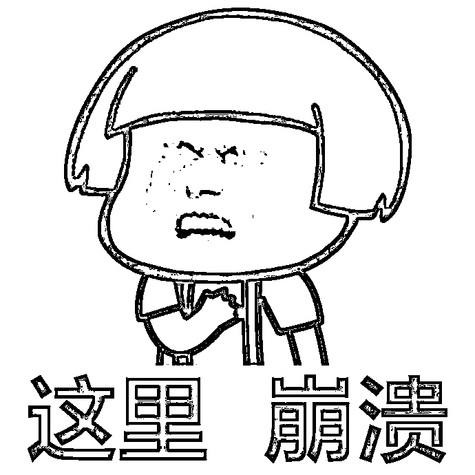
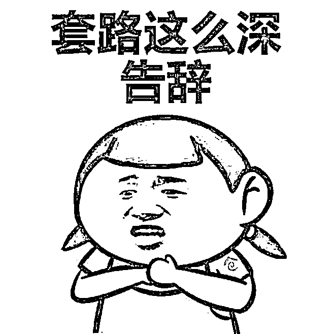
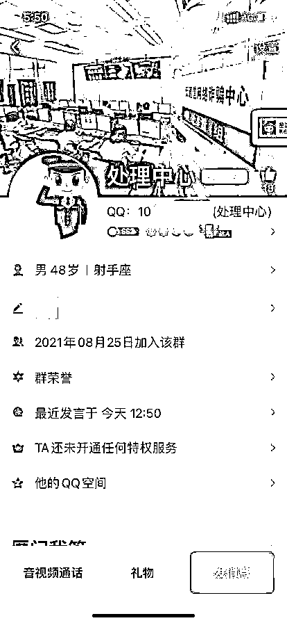
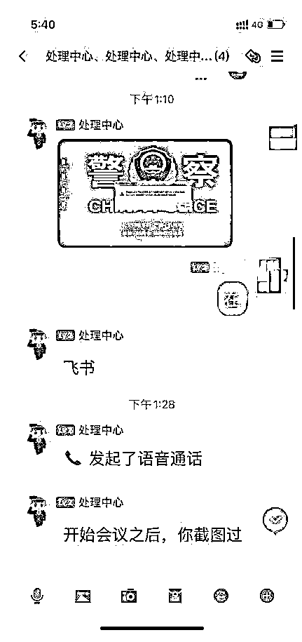
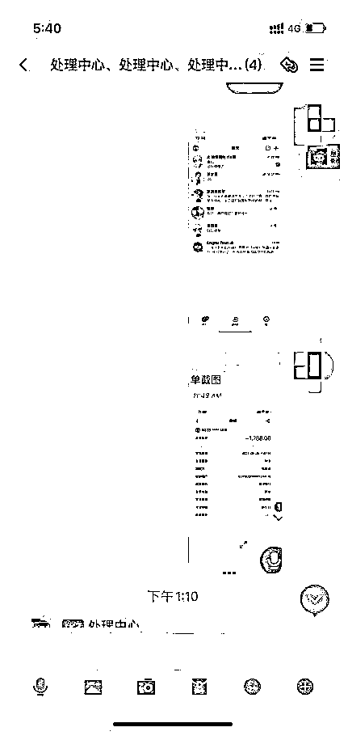
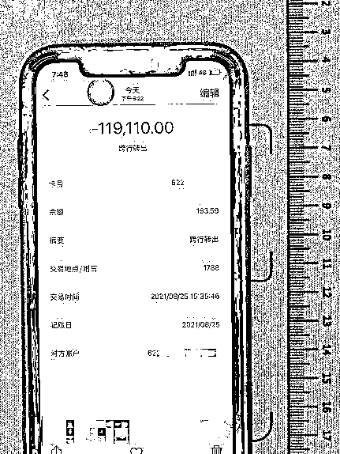
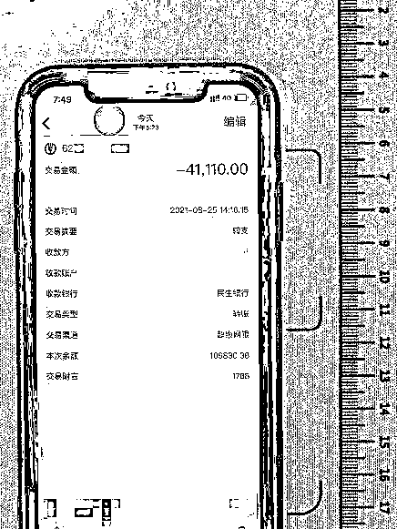
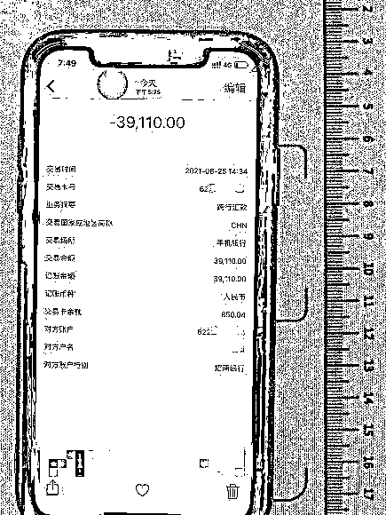

# 刷单被骗后找“网警”帮忙，结果....

> 原文：[`mp.weixin.qq.com/s?__biz=MzIyMDYwMTk0Mw==&mid=2247522563&idx=5&sn=2d21dbcb8a7728611610ee4d87799ab8&chksm=97cb523ba0bcdb2d4788f285425dc805d04f4977082f0df4883b54360973d215d05395509786&scene=27#wechat_redirect`](http://mp.weixin.qq.com/s?__biz=MzIyMDYwMTk0Mw==&mid=2247522563&idx=5&sn=2d21dbcb8a7728611610ee4d87799ab8&chksm=97cb523ba0bcdb2d4788f285425dc805d04f4977082f0df4883b54360973d215d05395509786&scene=27#wechat_redirect)

[`v.qq.com/iframe/preview.html?width=500&height=375&auto=0&vid=wxv_2099151439364161538`](https://v.qq.com/iframe/preview.html?width=500&height=375&auto=0&vid=wxv_2099151439364161538)

“网络刷单”诈骗

大家都已不再陌生

被骗后寻求警察帮助

也是毋庸置疑

可如果

你找的“警察”并不是“警察”

反倒被骗了 20 万

那可真是太扎心了

相关案例

近日，李某报警称，其接了一个刷单任务，在刷了几单后的确赚到了一点小钱。之后，对方又发了一个 1800 元的刷单任务，李某刷完后对方称这次的是一个组合任务，需要再刷几单才能返现。这时李某意识到被骗，立即终止了刷单。

被骗的李某立即想到了报警，但是李某却没有选择拨打 110 或者到派出所去报警，而是在网络上搜索“反诈警察”。

经过搜索，还真让李某找到了一个自称是“北京网警”的人，李某添加了该“网警”的 QQ。听完李某的诉求，“网警”表示可以为李某追回被骗款项。后把李某拉进了一个 qq 群中，在该群中还有两名自称是“处理中心的民警”，头像图片也显示为“反通信网络诈骗中心处置组”，他们在群内发了一个盖有某公安局章的立案登记表给李某，并让李某提供身份信息和转账信息。

李某没有发现异常，还以为找对了网警。随后对方提供了一个银行账户冻结的截图，声称已将之前骗他钱的账户冻结，并且表示李某现在的银行账户不安全，需要下载一个 APP，把钱转到他们提供的账户上。

此时李某已经完全相信对方是警察，在转账了 20 万元后，对方还要继续让他贷款转账。李某才发现自己又被骗了，这才拨打 110 报警。

友情提醒

网络刷单本身就是一种违法的行为，任何要求垫资的网络刷单都是诈骗，遇到“刷单”、“刷信誉”、“刷信用”的网络兼职广告时一定要提高警惕。

一旦遭遇骗局，请第一时间拨打 110 报警。切勿自行在互联网搜索报警方式来寻求帮助，公安机关不会通过电话、QQ、微信等社交软件办案，更不会叫你转账到任何账户。

来源：常州网警、江苏网警、阻击诈骗

灰产圈在线客服

<mpsearch class="js_mpsearch appmsg_search_iframe js_uneditable custom_select_card" data-keywords="%5B%7B%22label%22%3A%22%E6%9D%80%E7%8C%AA%E7%9B%98%22%7D%2C%7B%22label%22%3A%22%E8%B5%8C%E5%8D%9A%22%7D%2C%7B%22label%22%3A%22%E8%AF%88%E9%AA%97%22%7D%2C%7B%22label%22%3A%22%E9%AA%97%E5%B1%80%22%7D%2C%7B%22label%22%3A%22%E5%8C%BA%E5%9D%97%E9%93%BE%22%7D%2C%7B%22label%22%3A%22%E8%89%B2%E6%83%85%22%7D%5D" data-parentclass="appmsg_search_iframe_wrp" data-ratio="1.5664335664335665" data-w="286"></mpsearch>

← 向右滑动与灰产圈互动交流 →

