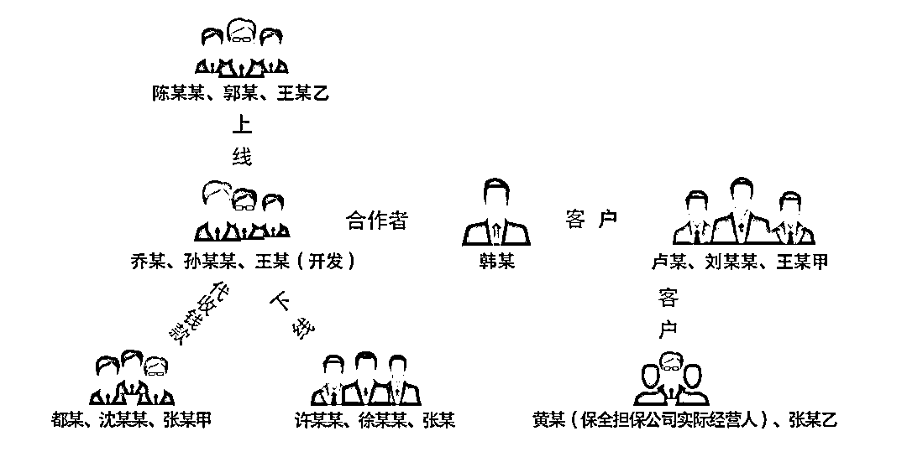

# 10 亿余条个人信息从何而来？起底聊天群背后的黑色产业链……

> 原文：[`mp.weixin.qq.com/s?__biz=MzIyMDYwMTk0Mw==&mid=2247522563&idx=6&sn=f5754cde6627ab4656316fda8e62e012&chksm=97cb523ba0bcdb2d0ebd59b77019dd9ee3553e8cdc4f623cc205b660e32b9649c2bca6e7f3fc&scene=27#wechat_redirect`](http://mp.weixin.qq.com/s?__biz=MzIyMDYwMTk0Mw==&mid=2247522563&idx=6&sn=f5754cde6627ab4656316fda8e62e012&chksm=97cb523ba0bcdb2d0ebd59b77019dd9ee3553e8cdc4f623cc205b660e32b9649c2bca6e7f3fc&scene=27#wechat_redirect)

人物关系图　制图/吴美妘

研发搭建含有 10 亿余条公民个人信息的数据库、开发导航机器人实现引流置顶、配置担保系统保障交易安全……犯罪团伙利用如此“高端配置”，通过某匿名聊天软件组建“信息查档”聊天群，明码标价贩卖公民个人信息。日前，江苏省连云港市海州区检察院以涉嫌侵犯公民个人信息罪对乔某等 17 名被告人、1 家涉案公司依法提起公诉。

这样一个秘密“信息查档”聊天群是如何建立的？数据库中数量庞大的个人信息又是从何而来？

金钱诱惑下被害人变成害人者　　

2019 年初，韩某因私人原因想查询开房记录，便通过网络认识了名为“宝刀”（公安机关仍在进一步侦查中）的人，对方收了 1900 元钱后，承诺帮其查开房记录。

可是没过多久，韩某发现有人用自己的名字在网络上发布不良信息，遂怀疑自己的身份信息被盗用。韩某仔细回想后，认为“宝刀”有重大嫌疑，于是要求“宝刀”退钱。随后，“宝刀”向韩某退回了 600 元，同时向韩某发送了某匿名聊天软件，告诉韩某这里有很多人贩卖个人信息，可以找其他人查询开房记录。

韩某半信半疑，但还是在某匿名聊天软件上注册了账号。随后，“宝刀”推荐给韩某一个名为“信息查档”的聊天群，这是一个专门贩卖个人信息的群。起初，韩某只是在群中“潜水”，但在目睹群内人员“查档”的需求量非常大后，他动起了歪心思，开始在自己的朋友圈内发送可以“查档”的广告。

2020 年 2 月左右，一个微信好友询问韩某能不能查询手机定位。韩某允诺后，在“信息查档”聊天群里四处加好友寻找查询手机定位的方法，最终找到了一个昵称“千里耳”的人（公安机关仍在进一步侦查中）。“查询银行卡状态 600 元一条，开房记录 800 元一条，基本个人信息 100 元至 5000 元不等，能要多少要多少……”韩某从“千里耳”处知道了很多“门道”。

在利益的诱惑下，韩某多次通过微信等渠道发布可以查询个人信息的广告，待客户“上钩”后，就找群中的人低价查询个人信息，再高价卖出。尝到甜头的韩某胆子越来越大，向卢某、刘某某、王某甲等 3 人贩卖公民个人信息 1000 余条，违法所得 25 万余元。

隐藏在聊天群背后的黑色产业链

韩某只是非法贩卖公民个人信息的“中间商”，与他关系密切的群友都是何人？“信息查档”聊天群又是谁建立的？

今年 3 月 20 日，连云港市公安局海州分局通过网络巡查，发现有人在某匿名聊天软件上的群组中非法贩卖公民个人信息，遂展开侦查，由此揪出一起特大侵犯公民个人信息案。

经查，2019 年 9 月，乔某经网友介绍第一次接触到某匿名聊天软件，从中得知贩卖公民个人信息可以赚大钱，于是就联合朋友孙某某干起了这项非法活动。自 2020 年 5 月起，二人在某匿名聊天软件上组建了专门用于非法活动的“信息查档”聊天群，提供查询住宿信息、手机定位、航班信息、犯罪记录等 20 余种业务。

为了逃避侦查，乔某等人找来都某、沈某某等人帮自己代收钱款，并给予对方酬劳。

“每次有业务，就把代收人的收款方式发给客户，代收人收到费用后，会用虚拟货币和我进行结算。”乔某交代。其间，为了提高交易的可信度，孙某某还找来王某，开发了一款用于担保买卖双方虚拟交易服务的“担保系统”。该系统依附于某匿名聊天软件群组，类似于网购的担保交易平台，卖家以商品形式展示信息类型，买家下单，双方通过虚拟货币进行结算，为贩卖公民个人信息等违法犯罪活动提供担保交易。

随后，为吸引更多的客户，乔某等人搭建了一个数据库，其中含有公民身份证号码、电话号码、QQ 账号、车牌信息等 10 亿余条公民个人信息，并研发出一个具有引流置顶作用的导航机器人。将数据库、导航机器人、“担保系统”进行有效连接后，客户在某匿名聊天软件中搜索“查档”等关键词时，导航机器人会让其优先搜索到乔某等人组建的群组。作为促销手段，客户只要加入群组，就可以免费查询公民个人信息 3 次，超过 3 次再另外收费。

乔某等人如愿积攒了越来越高的人气，购买信息的下家越来越多，生意越来越红火。随后，乔某将现实生活中的朋友许某某、徐某某、张某 3 人发展为“下线”。截至案发，该团伙非法贩卖公民个人信息数千条，违法所得百万余元。

全链条打击，上线下线一起查

在案件侦查阶段，海州区检察院提前介入，从案件定性、犯罪数额认定、违法性认知等方面引导公安机关补证。

审查逮捕阶段，承办检察官前往看守所提审乔某。

今年 4 月 29 日，公安机关将该案提请海州区检察院审查逮捕。案件办理期间，承办检察官田玉琼在详细梳理案件证据基础上，多次与公安机关沟通，先后调取转账记录、聊天记录、银行流水等证据补证固证。5 月 6 日，检察机关依法对犯罪嫌疑人乔某、孙某某、王某、许某某、徐某某、张某 6 人以涉嫌侵犯公民个人信息罪批准逮捕。鉴于韩某有立功情节，积极退赃，主动认罪认罚，检察机关对其作出不批准逮捕决定。

为确保精准指控犯罪，全面打击黑灰产业犯罪，检察机关从查清信息交易的次数和数量、“信息查档”聊天群中的公民个人信息类型及数量、调取虚拟货币交易数据、核实涉案人员违法所得等方面列明详细的继续补充侦查意见，引导公安机关进一步补证。

同时，针对涉案的两名代收人员都某、沈某某，鉴于二人的行为已涉嫌侵犯公民个人信息罪，检察机关于 5 月 7 日向公安机关发出直接移送审查起诉建议书。随后，公安机关根据二人交代的情况将另一名代收人员张某甲抓捕归案。

在多次梳理乔某等人的犯罪网络后，一个疑问萦绕在田玉琼心头：数据库中的公民个人信息从哪里来？检察机关建议公安机关以乔某为突破口，加大侦查力度。最终，乔某交代他曾“私下查询过上家身份以及支付的固定虚拟货币钱包 IP 地址”，公安机关顺藤摸瓜，查到“上线”陈某某、郭某及王某乙。

在案件取得突破性进展后，公安机关又先后将韩某的“下线”卢某、刘某某、王某甲 3 人抓捕归案，检察机关建议进一步查清这 3 人贩卖信息的去向、用途。后经引导侦查，公安机关先后抓获了与卢某有交易往来的黄某、张某乙，刘某某与王某甲贩卖信息的去向还在进一步侦查中。

8 月 4 日，公安机关将乔某、韩某及其“上线”“下线”共 18 人移送海州区检察院审查起诉。

检察官经仔细审查发现，黄某系某诉讼保全担保公司的实际经营人，为拓展公司经营，非法查询多种敏感信息提供给公司客户，情节特别严重，该担保公司涉嫌单位犯罪，遂依法对该担保公司进行追诉。同时，考虑到沈某某具有坦白、认罪认罚、积极退赃、从犯等从宽处罚情节，该院建议对其变更强制措施为取保候审。此外，因涉案的代收人员张某甲为在校学生，该院及时与校方取得联系，详细了解其在校表现，并召开公开听证会，结合听证意见，综合考虑其犯罪情节，最终决定对张某甲作相对不起诉处理，给予其悔过自新、重返校园的机会。

来源：检察日报，利箭在出击

灰产圈在线客服

<mpsearch class="js_mpsearch appmsg_search_iframe js_uneditable custom_select_card" data-keywords="%5B%7B%22label%22%3A%22%E4%BC%A0%E9%94%80%22%7D%2C%7B%22label%22%3A%22%E8%B5%8C%E5%8D%9A%22%7D%2C%7B%22label%22%3A%22%E9%93%B6%E8%A1%8C%E5%8D%A1%22%7D%2C%7B%22label%22%3A%22%E8%8F%9C%E5%86%9C%22%7D%5D" data-parentclass="appmsg_search_iframe_wrp" data-ratio="1.5664335664335665" data-w="286"></mpsearch>

← 向右滑动与灰产圈互动交流 →

