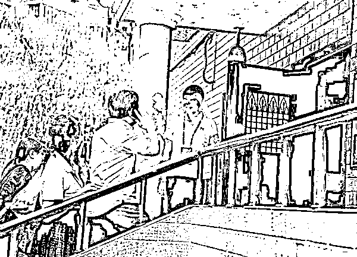

# 精准打击！朝阳群众到底是什么神秘组织？

> 原文：[`mp.weixin.qq.com/s?__biz=MzIyMDYwMTk0Mw==&mid=2247522630&idx=4&sn=e9eb936f356b941ed5010c5fb6b5b35f&chksm=97cb527ea0bcdb6824e8cb349cfa4c1769ebb9120159c2cdca5d66070319aa4c77d4f700969c&scene=27#wechat_redirect`](http://mp.weixin.qq.com/s?__biz=MzIyMDYwMTk0Mw==&mid=2247522630&idx=4&sn=e9eb936f356b941ed5010c5fb6b5b35f&chksm=97cb527ea0bcdb6824e8cb349cfa4c1769ebb9120159c2cdca5d66070319aa4c77d4f700969c&scene=27#wechat_redirect)

最近稍显消停的娱乐圈突然平地一声惊雷，21 晚@平安北京朝阳 通报称著名钢琴家李云迪因嫖娼被行拘，这一次依然是群众举报的功劳。 

当晚随着“李云迪嫖娼被拘”爆上热搜第一，“朝阳群众”也跟着登上热搜前列，网友们再次被这个神秘的“世界第五大王牌情报组织”的战斗力惊到了。

据不完全统计，自 2013 年以来，因涉黄涉毒遭朝阳群众举报后被警方查处的明星名人近有 20 人。

继吴亦凡后，李云迪也进去了，有人调侃这是朝阳群众为看守所的年底联欢会凑了个合唱团——“吴迪”组合。

不过吧，@江宁婆婆 正经脸：别想了，俩人住不到一间去。

李云迪被举报后行拘的消息公布后，也让网友们又不禁感慨起来：“你永远可以相信朝阳群众。”

近年来，朝阳群众曾多次协助警方查案，参与破获多起明星吸毒、嫖娼等大案。

据不完全统计，自 2013 年以来，因涉黄涉毒遭朝阳群众举报后被警方查处的明星名人有：

吸毒：李代沫、张元、宁财神、张耀扬、尹相杰、毛宁、宋冬野、傅艺伟、王学兵、张博、高虎、房祖名、柯震东、满文军、莫少聪。

嫖娼：薛蛮子、黄海波、李云迪。

那些年被抓的涉黄涉毒艺人 图自网友

朝阳群众在“薛蛮子嫖娼案”的楼门口监控 图自法制晚报

随着越来越多的名人“栽倒”在“群众举报”，“BJCYQZ 北京朝阳群众”走进舆论视野，被网友们戏称为与 CIA 中情局、KGB 克格勃、MOSSAD 摩萨德、MI6 军情六处并列的“世界第五大王牌情报组织”。

这个“世界第五大王牌情报组织”，绝非浪得虚名。早在 1974 年，神秘的“朝阳群众”就曾配合公安机关在太阳宫附近抓获过 6 名间谍。 

如今的朝阳群众作为警民携手、群防群治的重要力量，为朝阳区的平安做出了巨大的贡献。北京市公安局朝阳分局宣传部门相关负责人曾介绍，截至 2017 年底，朝阳区共有实名注册的“朝阳群众”达 14 万余人。朝阳区面积 470.8 平方公里，平均下来，每平方公里的地面上就有近 300 人属于这个神秘的“情报机构”。

平均每月，朝阳群众要向警方提供线索 2 万余条，集中反映涉及盗销电动自行车、街头诈骗、反恐、公共安全、涉毒类等线索。

在重点街区，“朝阳群众”几乎随处可见，无处不在。他们可能是商场超市里穿制服的保安，可能是身穿志愿者服装戴红袖标的老年“侦缉队”，又或者是晨练遛弯儿买菜时所见的一个个芸芸路人。你觉得他们在聊八卦、侃大山，其实都是在“交互侦察信息”。

除了揪出近 20 名涉黄涉毒明星艺人，在日常生活中，朝阳群众面对的其实主要还是琐碎的治安现象，关注社区内一切异常现象。

比如陌生人进入一个小区，有大爷大妈主动问“你找谁家”，可能就是你作为陌生人被“朝阳群众”发现了。

朝阳群众在盘问进出小区的可疑生人 图自法制晚报

社区民警杨国建把朝阳群众比作是民警的“眼睛”和“耳朵”，“很多人把自行车十块钱二十块钱就卖给收废品的，他（朝阳群众）就会留意这可能是小偷。抄水表的到人家里觉得味道不对，可能是吸毒，都会来和我们反映。”

2017 年 5 月一位“朝阳大妈”巡逻时，就发现一个新搬来的小伙子总是一个人订好多份外卖，向社区民警报告了这个可疑情况。当地警方发现，出租屋里还住着 6 名卖淫女，为隐藏行迹每天足不出户，由男子外出“揽客”，没想到没能逃过朝阳群众的“法眼”。

不过偶尔也会出现“乌龙事件”。2018 年，有朝阳群众发现领居家经常有陌生男女进出，而且不断传出情绪高涨类似“喊口号”的声音。当时年关将至，这位朝阳群众担心那是一个诈骗传销窝点，于是报了警。结果警察一到，发现实际上是几个年轻人在玩一款直播答题游戏。

现在的“朝阳群众”大概有五部分组成，分别是治安志愿者、党员巡逻队、专职巡逻队、义务巡逻员、治保积极分子。

为提高“朝阳群众”识辨“坏人”能力，朝阳区有关部门会定期组织开展培训，总结了发现精神萎靡、形影消瘦的陌生人要报告，夜间常有男子进入衣着暴露女子出租房的要报告等“八发现八报告”经验，并在 APEC 会议等大型活动期间组织志愿者到一线巡逻实战。

写着“八发现八报告”的朝阳群众胸牌 图自法制晚报

朝阳群众代表向特警学习在确保自身安全的情况下将歹徒手中的刀夺下 图自新京报

而社区民警在接到训练有素的治安志愿者报告后，往往通过跟踪蹲守、调看视频监控、运用大数据分析等技术手段，确定是否抓捕。正是有了“朝阳群众”与警方的密切配合，一些人在自以为神不知、鬼不觉的地方吸毒时却被逮个正着。

2017 年 2 月初，北京市公安局还上线了“朝阳群众 HD”手机应用，群众可以通过该应用发送文字、图片、视频等向警方提供线索。从此，“朝阳群众”不再仅仅是街道上戴着红袖章的大爷大妈，住在其他区域的年轻人也可以参与到其中，在结构上实现了从“离退休人员为主”向“各年龄段广泛参与”转变。

APP 上线两个月后，注册用户就达到 5 万余人，收到线索 3000 余条。一个多月的测试期间，警方抓获了犯罪嫌疑人 91 名。2017 年，朝阳警方从 APP 中获得的有效线索多达 8300 余条，根据这些线索，警方共破获案件 370 余起，拘留 250 余人，消除各类安全隐患 390 余起，墙都不服就服朝阳区群众。

如今在整个北京，维护首都稳定的重要力量、为首都治安做出了不可估量贡献的民间自发组织，已经不仅有“朝阳群众”了。

根据北京市公安局官网信息，截至 2017 年 7 月，全市实名注册的治安志愿者已超过 85 万人，各类群防群治力量动员总量近 140 万人，已经形成了 “西城大妈”、“海淀网友”、“丰台劝导队”、“东城守望岗”等群众安保组织。

2014 年起，北京市还通过自愿形式，形成了一支“网警志愿者”队伍，积极协助警方开展打击网络违法犯罪工作。这些网络上的“朝阳群众”较为年轻，80 后、90 后是绝对的主力军，占志愿者总数的 80%，涵盖了学生、教师、医生、公司职员、政府公务员等多种多样的职业，还有网络大 V、专家学者和来自互联网安全企业、各大网站工作人员。

“朝阳群众”的队伍正不断扩大，让违法犯罪行为无处可逃。

来源：观察者网

← 向右滑动与灰产圈互动交流 →

