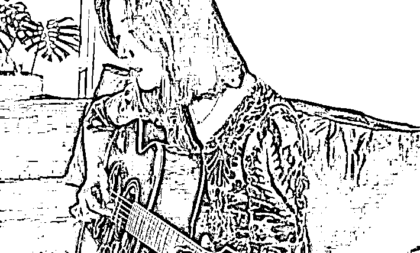

# 王珞丹：欠钱不还成老赖？

> 原文：[`mp.weixin.qq.com/s?__biz=MzIyMDYwMTk0Mw==&mid=2247522630&idx=5&sn=474aca7ad5afa28b55474fe31ff37697&chksm=97cb527ea0bcdb6836d636eec4550d7fc1dadfdcf6225e703a715faa9bb7f38658cb665f2c9a&scene=27#wechat_redirect`](http://mp.weixin.qq.com/s?__biz=MzIyMDYwMTk0Mw==&mid=2247522630&idx=5&sn=474aca7ad5afa28b55474fe31ff37697&chksm=97cb527ea0bcdb6836d636eec4550d7fc1dadfdcf6225e703a715faa9bb7f38658cb665f2c9a&scene=27#wechat_redirect)

今日，

**“王珞丹拖欠工程款被强制执行”**

**的话题****登上热搜，**

引起诸多争议。

据企查查 APP 显示，10 月 20 日，王珞丹被北京市昌平区人民法院**列为被执行人，案号为（2021）京 0114 执 12123 号，执行标的为 30.96 万元。**

这则案件还要从 9 年前说起。据原告表示，2012 年，王珞丹购买昌平区某别墅进行改造，**在未取得国有土地使用证、建设用地规划许可证及建设工程许可证的情况下，由其父亲王卫星代表王珞丹将该工程发包给原告，双方于 2012 年 12 月 5 日签订了《工程施工合同》。**

工程完工后，王珞丹方迟迟未组织验收。

2014 年，原告再次将项目结算单发送给王珞丹父亲，但都未得到回复。

同年，原告见王珞丹一方迟迟未给回应，便派人去施工地讨要工程款。双方发生口角，闹得不可开交，最终不得已报警处理。

2015 年，原告再度讨要无果。直到 2017 年查到有关王珞丹的身份情况，才得以提起诉讼。

但王珞丹辩解的时候，认为自己成为被告主体不合适。

她暗指这是父亲的个人行为，当时王卫星没有购房资格，所以以女儿名义购买，实际出资人是王卫星，房产也归他所有，后面的工程建设也是王卫星的安排，所以王珞丹觉得自己很冤枉。

王珞丹的父亲辩解时，也将责任揽在自己身上，认为和女儿王珞丹无关。

虽然对方是原告，但也不完全都是对的，王卫星直指对方施工质量差，影响入住，而且当时工程延期，强调证件齐全，也指出原告方要求赔偿的数额不正确。

法院查明后判决：**原告与王卫星于 2012 年 12 月 5 日签订的《工程施工合同》无效；王珞丹、王卫星于本判决生效后十日内连带支付原告工程款 30.96 万元等。** 

不过，原告豪雅公司也曾多次被列为失信被执行人。天眼查 APP 显示，2014 年-2018 年，豪雅公司 5 次被北京市朝阳区人民法院列为执行人，但全部未履行相关义务。

此外，豪雅公司因未按规定提交年度报告信息而被列入企业经营异常名录，目前其企业营业执照已被工商局吊销。同时，两位大股东股权已被冻结。

目前，王珞丹并未对此事作出回应，

**她的微博更新停留在 2021 年 10 月 18 日。**

总而言之，

这场长达 9 年的工人艰难讨薪

总算有了一个新进展。

事情曝光后，

网友都对此事愤怒不已，

不少人表示：

**“拖欠了 9 年，可真是缺德。”**

还有人表示：

**“9 年前的 30 多万跟现在不好比啊。”**

也有人发出疑问：

**“她也不缺这点钱，**

**为什么不给呢？”**

王珞丹，1984 年 1 月 30 日出生于内蒙古自治区赤峰市，作为出道多年的演艺圈明星，王珞丹的名字可谓是家喻户晓，出演的影视剧《奋斗》《我的青春谁做主》《杜拉拉升职记》《搜索》《卫子夫》《急诊科医生》都是经典。

王珞丹作为知名演员，

出道多年也收入不菲。

她经常在社交平台晒出自己的日常照，

可以看出豪宅的面积宽阔。

相信对王珞丹来说，

30 万元并不算多，

希望这件事情能有一个妥善的处理。

最后小编想说的是：

公众人物之所以作为公众人物，

其在享受万众瞩目的过程中，

还承担有普通大众所没有的责任，

他们需要向社会展示正能量的一面

让社会大众以他们为标榜。

**“能力越大，责任越大”**

**希望能有更多的明星**

**给社会树立正确的形象，**

**引导好的社会风气。**

来源：新闻晨报，长沙晚报

← 向右滑动与灰产圈互动交流 →

