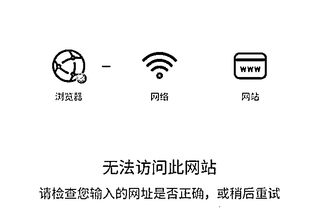
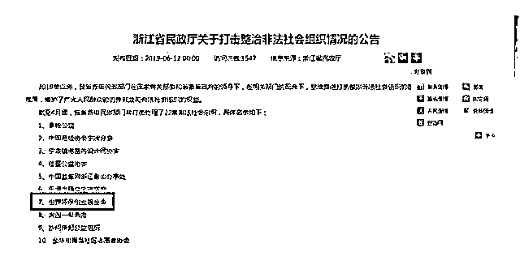
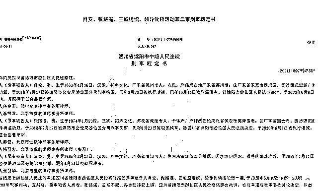
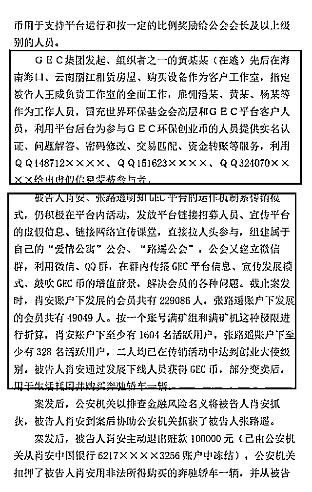
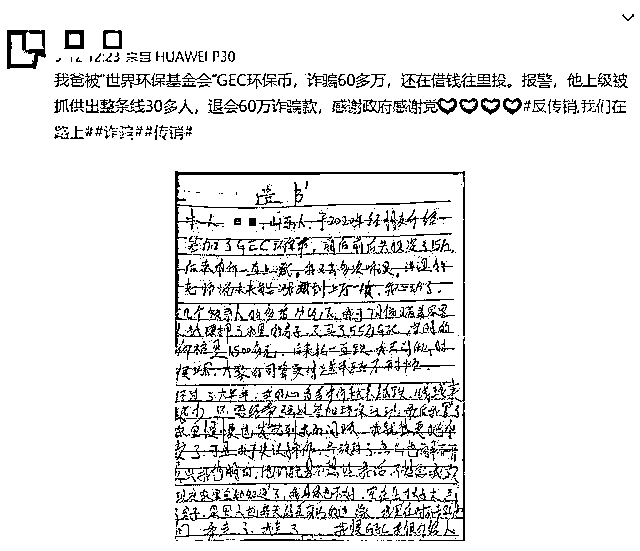
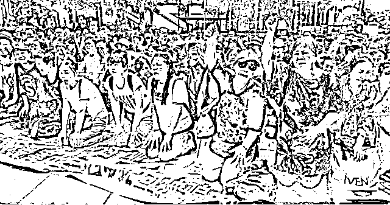

# 雷达币都崩了，GEC 环保币还剩多久呢？？

> 原文：[`mp.weixin.qq.com/s?__biz=MzIyMDYwMTk0Mw==&mid=2247522630&idx=6&sn=0a78070c25c5265e656ea6e1d8581283&chksm=97cb527ea0bcdb68966105bcaad52d3a224a53ec8ea30fe7ef57b3766a5fb44a4761560b9e50&scene=27#wechat_redirect`](http://mp.weixin.qq.com/s?__biz=MzIyMDYwMTk0Mw==&mid=2247522630&idx=6&sn=0a78070c25c5265e656ea6e1d8581283&chksm=97cb527ea0bcdb68966105bcaad52d3a224a53ec8ea30fe7ef57b3766a5fb44a4761560b9e50&scene=27#wechat_redirect)

雷达币突然崩盘，在币圈引起巨大的反响。2014 年问世的雷达币，历经 7 年，在 2021 年崩盘，这 7 年时间里，它的会员数至少都有百万了吧，这一朝关盘也是狠狠的扇了那些忠实的投资者一耳光，自己成为了被抛弃的那一个，对其信仰也是一夕崩塌。 

但是也有一些人不愿意相信这个事实，还死命的怀疑公告的真实性，可以肯定的是公告确实是真实的，雷达币的技术人员也确实被抓了，而雷达币的项目方也是利用国家严打政策将锅甩给警方。事实是现在相关的网址都打不开了，可恨的是那些被忽悠瘸了的人还在半信半疑中。

连素称“稳定币”的雷达币都是以“关盘”为结局，那 GEC 环保币如今又能坚持多久呢？

环保币之前多次暴雷，很多人都爆料说被骗，声称这就是个资金盘。但是也有人说环保币都存活了 4 年了不像骗人的。可那又怎么样呢？雷达币不也存活了 7 年吗？还不是崩盘了。

当然环保币违不违法，是不是资金盘，也不是张口就来的，是有事实依据的。早在 19 年，浙江省民政厅将“世界环保创业基金会”列入了非法社会组织名单。而后多地警方也是预警环保币。那还算符合国家的法律法规吗？

玩过环保币的应该都知道王威吧。这个人是工作室的负责人，也是环保币的核心团队之一，目前已被判刑。连核心人员都被判刑了，这还不能说明问题吗？

不仅如此，连操盘手黄某某都逃到国外去了，更加证明了环保币就是个彻彻底底的骗局。

再看看参与的投资者们，你们敢说自己赚钱了吗？之前有过因为被环保币骗了 60 多万的投资者一时想不开要自尽还留下遗书的事情，如今还历历在目呢。

但凡看多了的人都会知道要远离这样的项目，可是为什么环保币还能存活在现在呢？因为那些项目方为了圈钱铤而走险，坑害的目标人群都是上了年纪的中老年人，他们因为信息闭塞，所有的消息都来源于群里的闭环洗脑话术，被忽悠的一个劲的往里面投钱，之前 MBI 也是这样的，当时维权是多么困难啊。

现在的环保币也是同样的套路，别真的和 MBI 受害者一样，那才真的是叫天天不应，叫地地不灵了。

这样罄竹难书的资金盘，崩盘是早晚的事情，只是想在没有崩盘没有被套牢的时候，给大家一定的警告，不要因为它还在就相信它是好的是合法的，现在还继续往里面投钱的，那真的是肉包子打狗-有去无回了。希望雷达币的崩盘能够使投资者觉醒，保有清醒的头脑，赶紧撤出吧，若真到崩盘，就已经晚了。

**此前报道：**

**[雷达币关网！数十万会员被套！操盘团队甩锅跑路！](http://mp.weixin.qq.com/s?__biz=MzIyMDYwMTk0Mw==&mid=2247522563&idx=2&sn=7372a3782360e09c025ea72eb9f4dcb5&chksm=97cb523ba0bcdb2d76672375d342f587d8c564e84a8c29c6b5e8977a5a98b8954baed4a61d25&scene=21#wechat_redirect)**

**[亲妈逼迫女儿做小姐赚钱，竟是为买 GEC 环保币！！！](http://mp.weixin.qq.com/s?__biz=MzIyMDYwMTk0Mw==&mid=2247505562&idx=1&sn=beb6fe67d710c565ed42ebd6e7f78c2f&chksm=97cb1da2a0bc94b4f66ed85fc08aac274aa1f2ab9b5304dd9c51b74b33d3b84b71d30af983fb&scene=21#wechat_redirect)**

**[GEC 环保币：是天上馅饼，还是地上陷阱？](http://mp.weixin.qq.com/s?__biz=MzIyMDYwMTk0Mw==&mid=2247518940&idx=4&sn=fdb599f4b1c4115806d77d89696a077c&chksm=97cb41e4a0bcc8f21148dd20a924157505bdb40bef82a81ac57577fd71c41923b3329ff6a671&scene=21#wechat_redirect)**

来源：比特财经网，反传 365

← 向右滑动与灰产圈互动交流 →

