# 高中生不好好读书跑去“约 P”？当妈的还支持？

> 原文：[`mp.weixin.qq.com/s?__biz=MzIyMDYwMTk0Mw==&mid=2247522630&idx=8&sn=de51620a2e2c585be19f227a6468cf60&chksm=97cb527ea0bcdb680089958e05504c7b53fea96b73fc6ff3fc3c26c36381319ae59b301857ce&scene=27#wechat_redirect`](http://mp.weixin.qq.com/s?__biz=MzIyMDYwMTk0Mw==&mid=2247522630&idx=8&sn=de51620a2e2c585be19f227a6468cf60&chksm=97cb527ea0bcdb680089958e05504c7b53fea96b73fc6ff3fc3c26c36381319ae59b301857ce&scene=27#wechat_redirect)

近日，我市出现高中生因“约 P”

被骗**12.5 万元**

**好奇害死猫****浏览色情网站惹祸端**

*   近日，我市小 S 闲来无聊，浏览起色情网站。当他正欣赏着小姐姐们“搔首弄姿”，网页突然出现弹窗，暗示可以“约 P”。荷尔蒙涌动的小 S 按捺不住想要偷偷尝试，于是点击弹窗链接下载了**“伊人会所”APP**，随后根据邀请码注册个人账号。

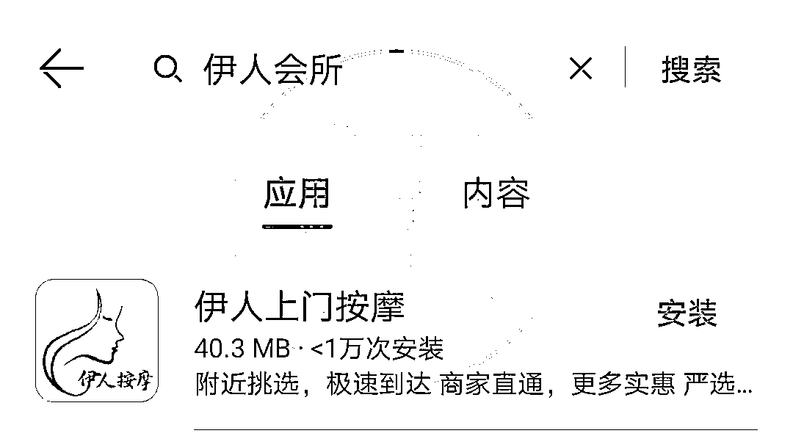

**反诈小贴士**

千万不要点击广告链接下载 APP。一是不明广告链接大多含有木马病毒，点击瞬间便可窃取手机上所有的个人信息；二是不明链接极有可能是诈骗 APP。之所以“伊人会所”APP 在手机正规的应用市场搜索不到，因为它是非正规软件。

**“约 P”可以****请先做三个“任务”**

*   一心想要“约 P”的小 S 注册之后，“客服”便联系上了他，**表示要先做三个“任务”才可以“约 P”**，甚至还利用提成来吸引小 S 眼球。没有社会经验的小 S 于是听从“客服”要求，做起了任务。

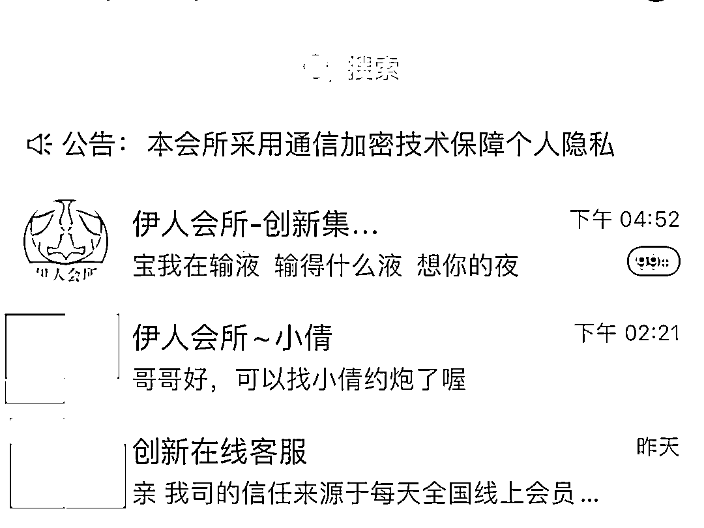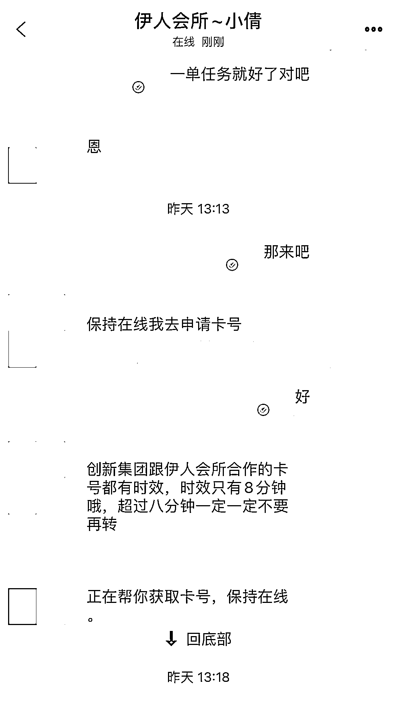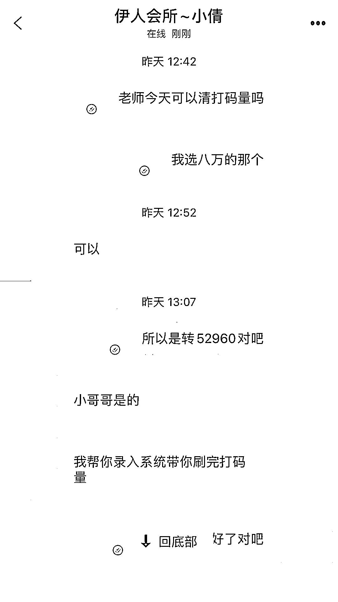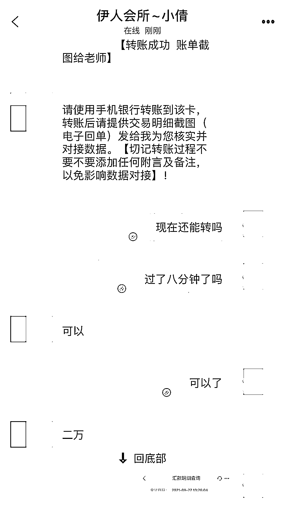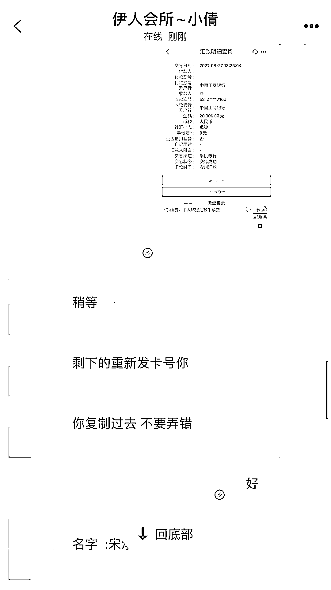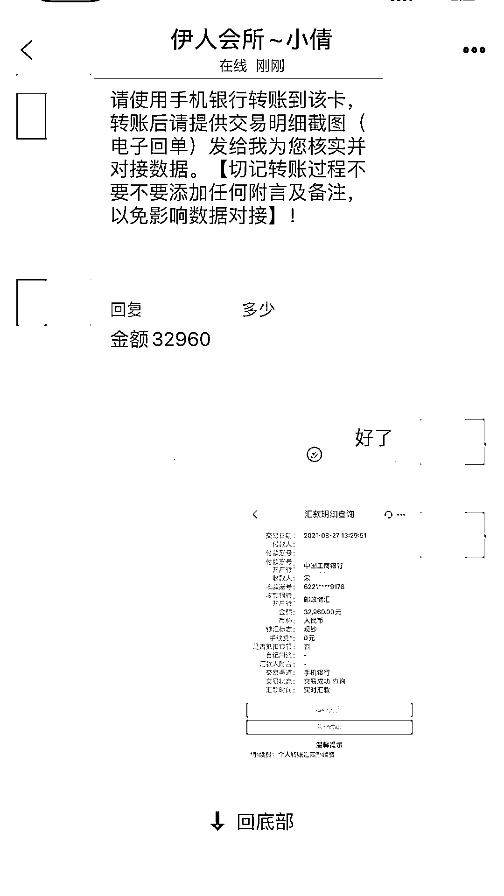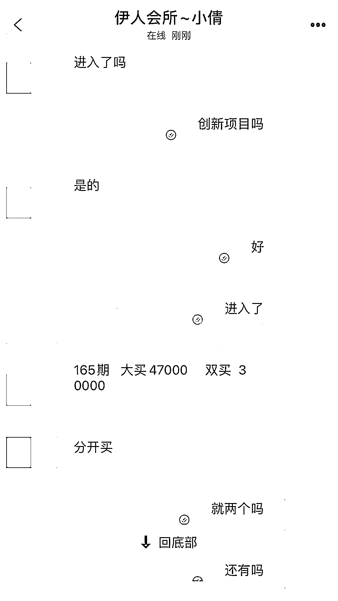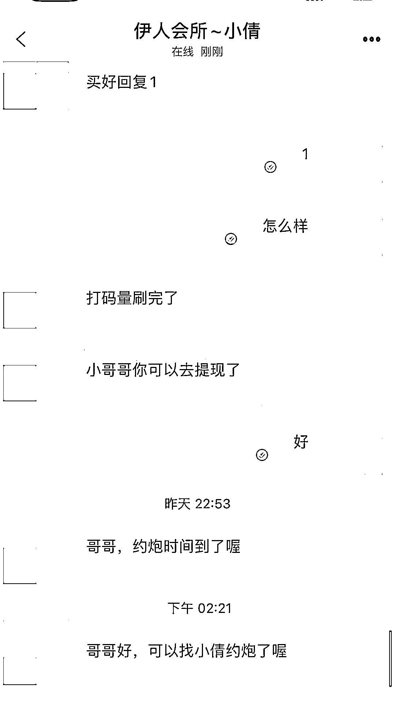

↔左右滑动查看图片

**被诱导赌博****还以为是买彩票**

*   第一单任务是投资 38 元，听从“客服”要求在投资页面点击大、小、单、双等 1-18 数字，得到本佣 74 元；第二单投资 500 元，得到本佣 600 元。短短几分钟，小 S 便赚了 136 元并成功提现。此时的小 S 觉得非常不错，他以为自己在买彩票，但其实是赌博。

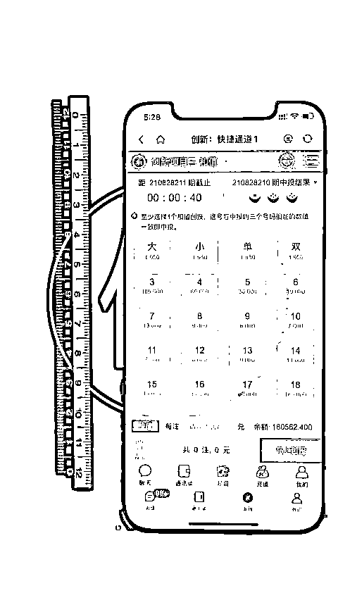**大胆投资****深陷诈骗套路**

*   第三单，小 S 放心大胆地投资了 4000 元，在得到本佣 4500 元后却提现失败，“客服”表示操作有误，需补单 3 倍余额，于是**小 S 转账 13734 元**，账号内马上显示赚了 2 万多元。“老师”指导继续连做三单投资，账号内余额一下子上升至 8 万多元。此时“老师”要求收取盈利金额的 40%，**于是小 S 向其转账 27040 元**，可“老师”竟然戏精上身，发脾气说没有备注清楚，**于是小 S 继续转账 27040 元**。

**跟家长商量结果****继续转账 52960 元**

*   此时，小 S 账号内余额为 11 万元左右，却总是无法提现，“客服”表示要再充值**52960 元**才能顺利提钱。小 S 便跟妈妈商量，由于妈妈当时在外地，话题便被搁置了。8 天后妈妈回家，两人继续商量，**得出结果竟是妈妈同意孩子继续转账。**于是小 S 向对方转账两笔共**52960 元**。随后“老师”继续指导，小 S 账户内一度余额高达**180562.4 元**。**最终当提现显示需开通“大额通道”即支付 90281.2 元时，小 S 这才醒悟报警，共被骗 124638 元。**

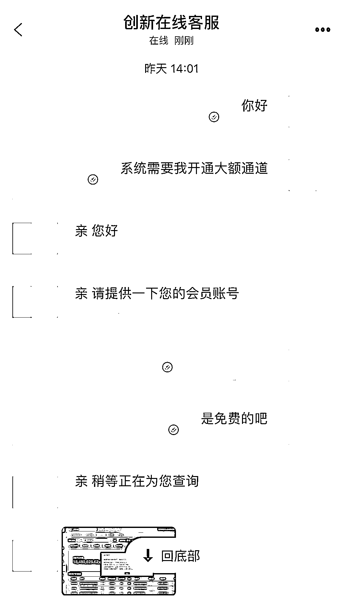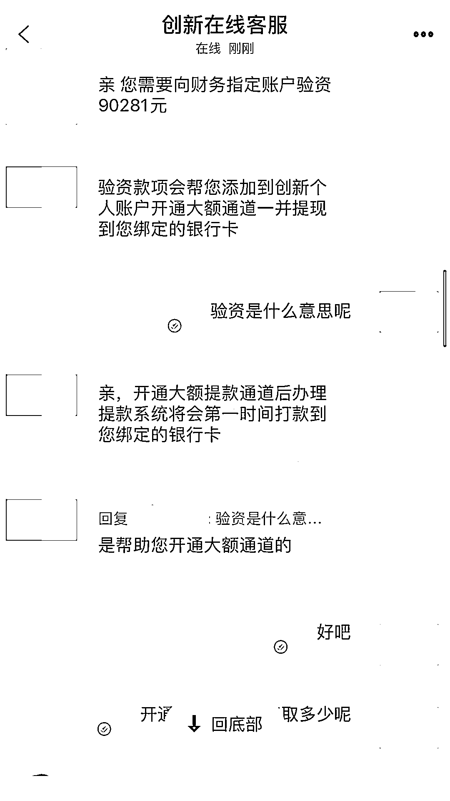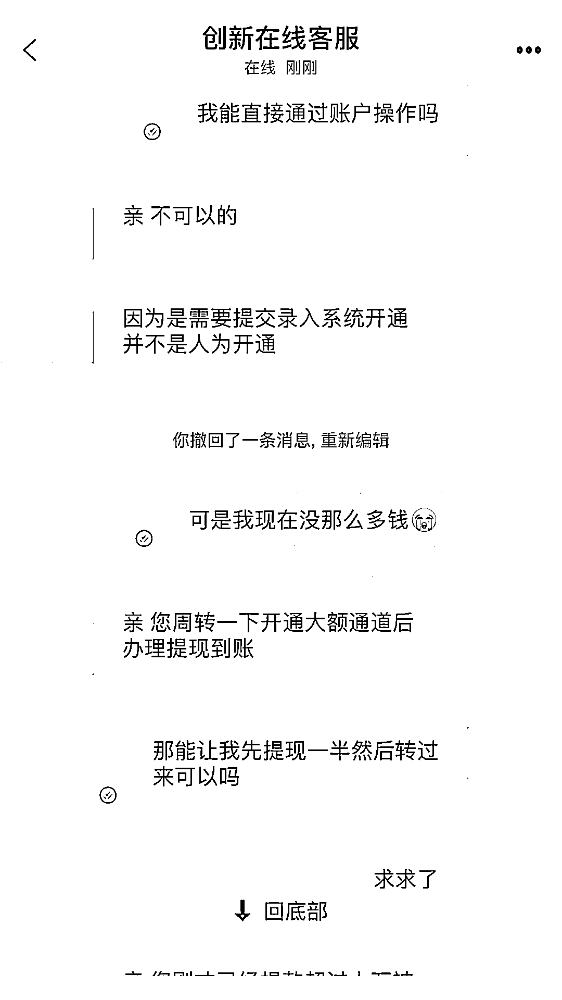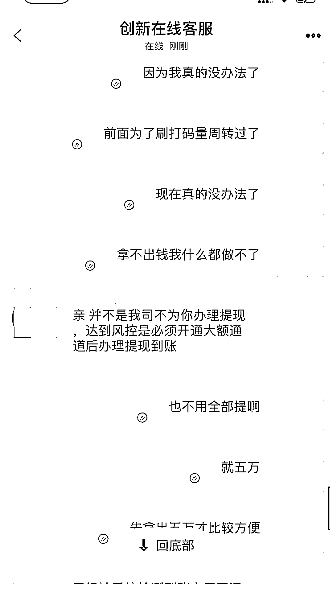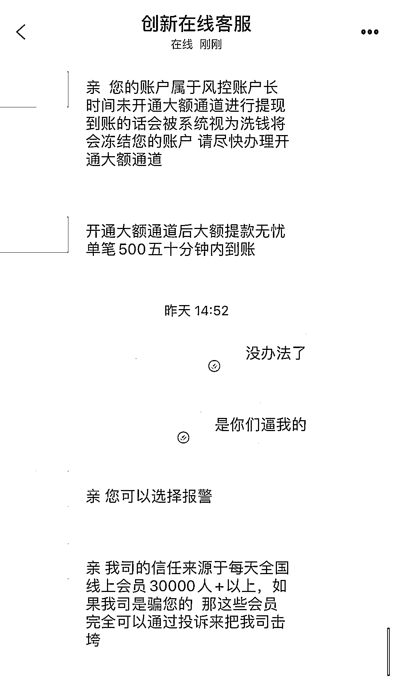

↔左右滑动查看图片

**高中生放着好好的书不念**

**竟不务正业想着去约 P？**

**还把赌博当投资？**

**家长一同被带跑偏**

**这种情况实属罕见**

**孩子啊**

**课本的书要好好读**

**社会这本书也要好好念**

**多了解反诈知识**

**别再被荷尔蒙蒙蔽了头脑啦**

来源：中山市反诈骗中心，阻击诈骗

← 向右滑动与灰产圈互动交流 →

