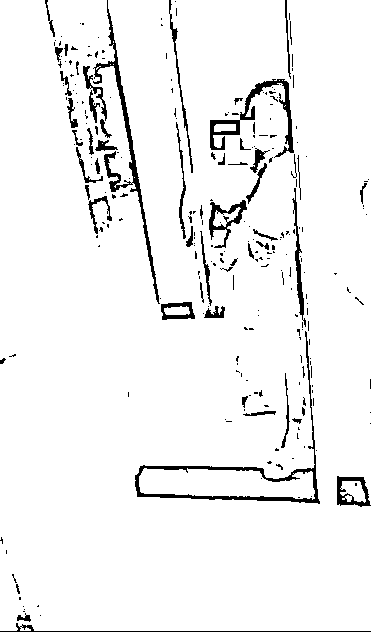
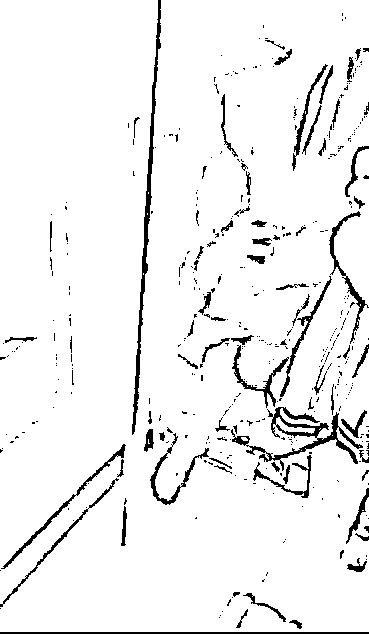

# 有男人躲衣柜，妻子称是修水龙头的，男主人：他俩发生了关系，但不信她是自愿

> 原文：[`mp.weixin.qq.com/s?__biz=MzIyMDYwMTk0Mw==&mid=2247522682&idx=1&sn=7cdae434c6e013f305077bc0eb01bba0&chksm=97cb5242a0bcdb54ec35125e978a4659273efed9ffe44d7ce0dcf4d8aec2871fae2e87b52c3a&scene=27#wechat_redirect`](http://mp.weixin.qq.com/s?__biz=MzIyMDYwMTk0Mw==&mid=2247522682&idx=1&sn=7cdae434c6e013f305077bc0eb01bba0&chksm=97cb5242a0bcdb54ec35125e978a4659273efed9ffe44d7ce0dcf4d8aec2871fae2e87b52c3a&scene=27#wechat_redirect)

近日，**广西南宁一段“男主人持刀质问藏自家衣柜男子”的视频引发社会广泛关注**。视频中，男主人拿着刀情绪激动地质问一名躲在自家衣柜里面的男子，是不是和自己的妻子“有一腿”。藏身衣柜的男子否认跟其妻子发生了关系，并让男子冷静下来，好好谈一谈。**一旁抱着小孩的女子则称，藏在衣柜里的男子“是她叫来修水龙头的”**。

[`mp.weixin.qq.com/mp/readtemplate?t=pages/video_player_tmpl&action=mpvideo&auto=0&vid=wxv_2103666896070934529`](https://mp.weixin.qq.com/mp/readtemplate?t=pages/video_player_tmpl&action=mpvideo&auto=0&vid=wxv_2103666896070934529)

10 月 23 日，极目新闻记者联系上视频中的男主人叶某，他表示，妻子确实与躲衣柜的男子发生了关系，但他不相信妻子是自愿，接下来他考虑请律师打官司。叶某同时表示，并称此前网上流传出的一封落款为他和他妻子的道歉信，系他人伪造。

“修水龙头”事件引发关注

看到眼前的一幕时，痛苦和愤怒的情绪，瞬间在叶某内心充斥，随后他用手机拍下了当时的一幕。 

现场视频显示，男主人一手拿着手机录像，一手拿着刀指着躲在衣柜中的一名男子，并不断向其怒吼，称“我早就知道你们有一腿了”，情绪非常激动。对此，躲在衣柜里的男子解释道“我真的没有做什么”，并称躲在衣柜里是怕产生误会，希望男主人能冷静下来，不要冲动。 

对此，男主人表示，此前躲在衣柜里的男子和妻子“已经有很多次了”，并斥责妻子“儿子在家里面，都能做出这种（事）”。**此时，站在一旁抱着孩子的妻子连忙解释，藏在衣柜里的男子“是她叫来修水龙头的”**。但对于妻子的说法，男主人却并不买账，妻子的话语反而更加激怒了他，其称“修水龙头为什么躲在衣柜里”。

视频截图

上述视频被发布到网络平台后，很快引发广大网友热议。有网友表示，如果换作是自己，在那样的情况下，作为一个男人他是不能忍的。还有网友留言劝说道，如果视频中的内容属实，那么其妻子和躲在衣柜里的男子都是不可原谅的，但男主人一定要冷静，不要做傻事，要用正确合理的方法解决事情。

极目新闻记者注意到，就在上述视频曝光不久后，网上又传出一封疑似男主人及其妻子，写给躲在衣柜里男子的道歉信。“修水龙头”事件似乎一下子发生了反转。 

信中以男主人妻子的口吻写道，2021 年 10 月 16 日，因家里水龙头损坏，她便下楼喊邻居张曦（化名）帮忙换水龙头，就在张曦到家里修了 10 分钟后，其丈夫叶某回家看到房内的张曦，不听任何解释就进行殴打，并拿刀捅伤张曦，并拍摄视频污蔑两人出轨。 

信中还提到，经报警了解，换水龙头的情况属实，为此叶某向张曦赔偿了 3000 元补偿金，并向张曦及其家人道歉。

一气之下捅伤了男子腿部

“修水龙头”事件究竟有着怎样的经过？网传道歉信是否属实？ 

10 月 23 日上午 11 时许，事件中的丈夫叶某告诉极目新闻记者，“修水龙头”事件发生在 10 月 16 日，当天他本来在单位上班，因为降温他于 16 日下午 3 时许返回家中，想要拿一件衣服。**然而，当他到家门口时，才发现家里大门竟然是反锁着的，见状他便给妻子打电话，但直到约 20 分钟后，妻子才将大门打开**。 

走进房内，他立马察觉到情况有些不对劲，浴室里面有不少水渍，像是刚刚洗过澡，而卧室里也有些乱糟糟的，原本放在柜子里的一些衣服，不知为何被拿到了柜子外面。打开柜门，眼前的一幕让他气不打一处来，一名男子竟蜷缩着身子躲在柜子里面。

视频截图

 “对方在我们住的楼下做生意，平时交集并不多。”叶某告诉极目新闻记者，平日里他和妻子下楼出门时，经常能够看到那名男子，有时候他觉得男子看妻子的眼神有些不对劲。那天事发的时候他愤怒至极，从厨房里面拿了一把刀，质问那名躲在柜子里的男子，对方和妻子都坚称是在家里“修水龙头”，并没有发生其他事情，但当时他并不相信两人的说辞，并动手打了男子，还将男子腿部捅伤。随后，他选择向警方报案。

**叶某说，由于事发时他动手打了那名男子，在警方的介入下，他确实给对方赔了 3000 元钱**。然而，此后网上流出的一封署着他和他妻子名字的道歉信，却是他始料未及的，“那封信是伪造的，我有必要对此进行澄清。”

妻子承认确实与男子发生关系

在叶某看来，道歉信中描述的“修水龙头”内容是不实的，他不可能向对方道歉。 

叶某告诉极目新闻记者，事发几天后，妻子向他表示，当天之所以坚称对方是修水龙头的，是怕他在那样的情况下，头脑发热做出不理智的举动。据其妻子介绍，当天其确实与视频中的男子张曦发生了关系，原本两人之间还有不少暧昧聊天记录，但事发当天均已被张曦删除。 

叶某告诉极目新闻记者，这件事发生之后，为了躲避那名男子，他和妻子已经搬出了原先的租房，他不相信妻子是自愿和对方发生关系，仍想和妻子过下去。下一步，他将考虑请律师打官司。

极目新闻记者提出，希望能够联系其妻子和躲在衣柜里的男子进行采访，但叶某表示，并没有那名男子的联系方式，其妻子则暂未接听他的电话。

辖区派出所相关工作人员告诉极目新闻记者，事发后双方确实报了案，关于男子被捅伤的事情，目前双方已经协调解决，但后续关于双方情感纠纷问题，他们没办法作出明确界定，双方可通过法律途径进行维权。

来源 ：极目新闻，潇湘晨报

← 向右滑动与灰产圈互动交流 →

