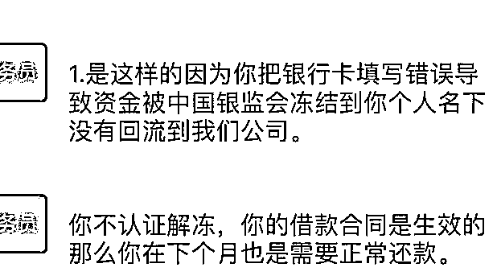

# 骗子竟然开始“自建”派出所了！

> 原文：[`mp.weixin.qq.com/s?__biz=MzIyMDYwMTk0Mw==&mid=2247522682&idx=2&sn=1bc133289c3bee9d74934ad24bb97f6e&chksm=97cb5242a0bcdb544522b353c6d865b7b5cbadf524400d59967834abd09da7cc3d4fa86be747&scene=27#wechat_redirect`](http://mp.weixin.qq.com/s?__biz=MzIyMDYwMTk0Mw==&mid=2247522682&idx=2&sn=1bc133289c3bee9d74934ad24bb97f6e&chksm=97cb5242a0bcdb544522b353c6d865b7b5cbadf524400d59967834abd09da7cc3d4fa86be747&scene=27#wechat_redirect)

[`v.qq.com/iframe/preview.html?width=500&height=375&auto=0&vid=u3303u54u10`](https://v.qq.com/iframe/preview.html?width=500&height=375&auto=0&vid=u3303u54u10)

骗子冒充警察诈骗，发警官证 

这些都是老套路了

现在的骗子竟然开始“自建”派出所了！

近日，四川省泸州市一市民申请贷款时遭遇诈骗，**骗子不仅身穿警服，还在写有某“派出所”字样的背景墙前拍摄视频**，企图冒充警察。

据了解，市民孔某在某手机 App 上申请了 20000 元网络贷款，但是订单状态显示借款人账号信息与银行卡不符，资金冻结。不久后，该 App“客服”向其回复，**称必须在规定时间内往银行卡里存入 15%的贷款资金才能解冻，如果不进行认证，不仅每月仍需正常还款，还会被立案处理**。

同时，该“客服”**还出示了一份通知“贷款人认证以及解冻贷款账户”的“红头文件”**。

同时，骗子又发来一段视频，视频里一名身着警服的“警察”，要求孔某尽快完成认证，这名“警察”背后还是某“派出所”的背景墙。该“客服”还发来消息：**欢迎你报警**。

心存疑虑的孔某赶紧来到龙马潭区公安分局莲花池派出所向警方求助。

民警了解事情的经过后，向孔某解释，**公安机关不会通过电话、QQ、微信等形式办案，更不会让其在网站上输入银行卡账号密码来解冻资金**，对方肯定是冒充警察诈骗的犯罪分子。民警劝阻及时，孔某没有造成经济损失。随后，在民警的建议下，孔某下载安装了国家反诈中心 App。

来源：南方都市报、N 视频报道、新京报我们视频、平安泸州、蜀黍家

← 向右滑动与灰产圈互动交流 →

