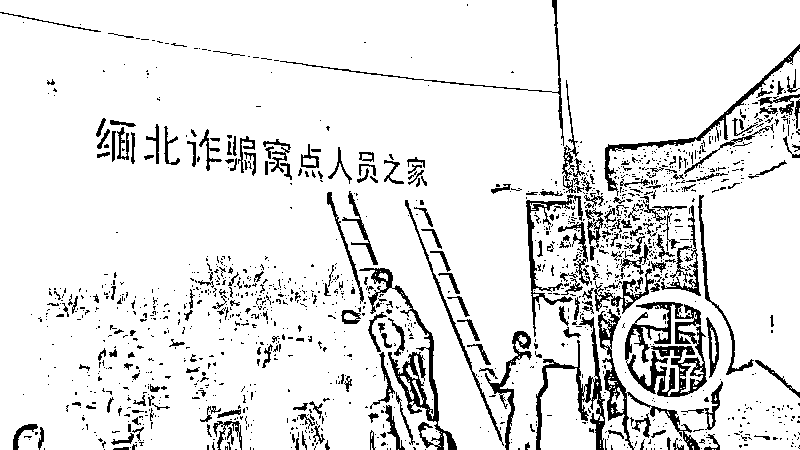
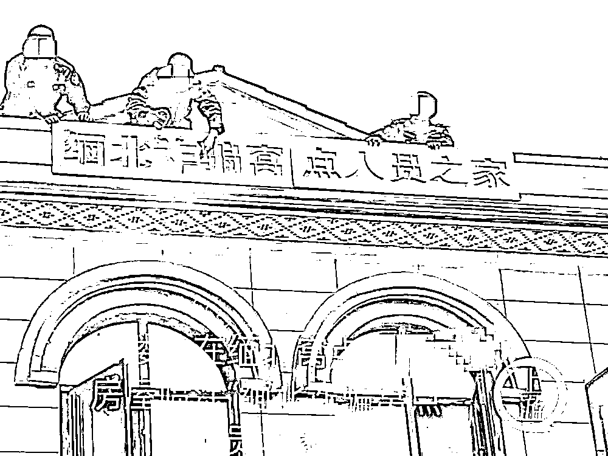
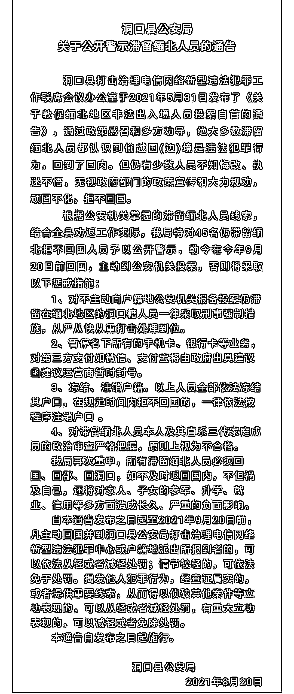

# 为劝返诈骗者，居民房屋被喷涂“缅北诈骗窝点人员之家”

> 原文：[`mp.weixin.qq.com/s?__biz=MzIyMDYwMTk0Mw==&mid=2247522682&idx=3&sn=66fbeab359b705c490b652b919f2c6f7&chksm=97cb5242a0bcdb5494630bfcf964370e6c5f6b5194ceaf617b4918df275fa23e9d7cdb32bf6c&scene=27#wechat_redirect`](http://mp.weixin.qq.com/s?__biz=MzIyMDYwMTk0Mw==&mid=2247522682&idx=3&sn=66fbeab359b705c490b652b919f2c6f7&chksm=97cb5242a0bcdb5494630bfcf964370e6c5f6b5194ceaf617b4918df275fa23e9d7cdb32bf6c&scene=27#wechat_redirect)

有报料称，湖南省邵阳市洞口县多个乡镇组织基层工作人员在多户居民房屋的墙壁上用油漆写出“缅北诈骗窝点人员之家”字样。

10 月 22 日，记者从洞口县公安局及其下属派出所证实了上述情形。古楼乡派出所工作人员称，为劝返当地滞留缅北的涉嫌诈骗人员，做了很多工作，但“他们就是不回来，死都要死在那里”，这才不得已而为之。

全国律师协会宪法与行政法专业委员会顾问、北京市才良律师事务所主任王才亮认为，这些字样的喷涂，没有法律的授权，严重损害了房屋的所有权人以及使用权人的合法权益，是一种违法的行政行为。

10 月以来，湖南洞口县多个乡镇对多户滞留缅北人员老家房屋喷涂“缅北诈骗窝点人员之家”字样。/受访者供图

上游新闻记者获取的图片显示，有多名穿着疑似警服的人员，搭着梯子或者站在屋顶上，利用模具在居民房屋的外墙上喷涂“缅北诈骗窝点人员之家”字样，字体为红色。当地知情者介绍，10 月上旬以来，当地政府组织人员在杨林乡、古楼乡对涉及滞留缅北、涉嫌诈骗人员的居民家外墙进行喷涂。

10 月 22 日上午，记者致电洞口县公安局，接线工作人员表示确有此事，但他们不负责具体工作。

“整个洞口涉及缅北诈骗窝点人员共有 200 多个，已经劝返 100 多个，还剩 70 多个没回来。”古楼乡派出所工作人员介绍，政府部门前期做了很多工作，但“他们就是不回来，死都要死在那里”，并称他们所喷涂的人家事先都经过反复确认，工作任务艰巨，不得已才为之。

记者注意到，8 月 20 日，洞口县公安局通过微信公众号“洞口公安”发布《洞口县公安局关于公开警示滞留缅北人员的通告》称，洞口县打击治理电信网络新型违法犯罪工作联席会议办公室于 2021 年 5 月 31 日发布了《关于敦促缅北地区非法出入境人员投案自首的通告》，通告政策感召和多方劝导，绝大多数滞留缅北人员都认识到偷越国（边）境是违法犯罪行为，回到了国内。但仍有少数人员不知悔改、执迷不悟，无视政府部门的政策宣传和大力规劝，顽固不化，拒不回国。

《通告》提到，根据公安机关掌握的滞留缅北人员线索，结合全县劝返工作实际，洞口县公安局特对 45 名仍滞留缅北拒不回国人员予以公开警示，勒令在 2021 年 9 月 20 日前回国，主动到公安机关投案，否则将采取包括刑事强制措施在内等惩戒措施。《通告》最后附有 45 名滞留缅北人员信息。

@洞口公安 公众号发布《关于公开警示滞缅北人员的通告》（滑动查看）

全国律师协会宪法与行政法专业委员会顾问、北京市才良律师事务所主任王才亮介绍，这些字样的喷涂，没有法律的授权，严重损害了房屋的所有权人以及使用权人的合法权益。虽然那些滞留缅北诈骗窝点人员的行为可能涉嫌违反法律规定，但是他们的人格权包括名誉权等仍然受到法律保护。但是，怎么也不能殃及家属。

王才亮说，具体喷涂实施人员的行为由于是受行政机关的指派，其法律责任应该由指派方承担，所以该喷涂行为，属于一种违法的行政行为，应当由指派的行政机关承担相应的法律后果，包括并不限于清除喷涂的字样使墙体恢复原状、赔礼道歉等等。

王才亮表示，对于当地在处理滞留缅甸诈骗窝点人员工作中的困难可以理解，但是工作再难，行政执法、刑事诉讼等活动都必须严格依照法律的规定进行，不能以违法行为去处理违法行为。

来源：上游新闻，南风窗

← 向右滑动与灰产圈互动交流 →

