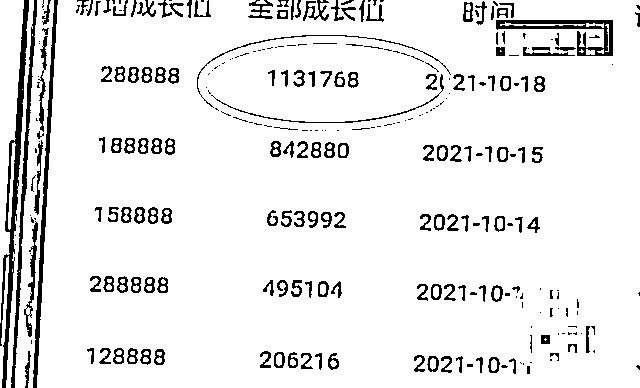

# 完成任务，每月固定提供几个女友？

> 原文：[`mp.weixin.qq.com/s?__biz=MzIyMDYwMTk0Mw==&mid=2247522682&idx=4&sn=b8bbafc7f846ce42c63e7789478bde9e&chksm=97cb5242a0bcdb546be44ba35787102d4c94ed77e36adf219de500af46850715006cf162d80e&scene=27#wechat_redirect`](http://mp.weixin.qq.com/s?__biz=MzIyMDYwMTk0Mw==&mid=2247522682&idx=4&sn=b8bbafc7f846ce42c63e7789478bde9e&chksm=97cb5242a0bcdb546be44ba35787102d4c94ed77e36adf219de500af46850715006cf162d80e&scene=27#wechat_redirect)

据四川观察报道：家住河北的李先生称自己最近在网络上被骗了 113 万元！而根据李先生讲述，这次他遇到的诈骗与以往的“杀猪盘”还有所不同，这究竟是怎么回事呢？

据李先生回忆称：“我这个是 9 月 30 号在浏览网页的时候，有一个不太健康的网站，然后发现了这个 APP，然后我就把它下载了，9 月 30 号下载的，下载了以后这个软件的一个客服人员就一步一步地诱导我，让我往里边投入资金，然后截止到 10 月 18 号，我已经往里边投入了大概有 113 万元左右。”

李先生告诉记者，9 月底他独自一人来到成都求医，偶然间他登陆了一个非法网站，并且在系统提示下下载了一款手机软件。令李先生没想到的是，就是这款来历不明的软件让他损失惨重。

李先生回忆称：“就下载了这款软件以后，那个客服人员第一步就说‘通过我们这个软件你可以赚钱，就有一些类似于下赌注啊，猜大小、猜单双，你跟着我们数据师去做，你是百分之百能赚钱’。”

据李先生透露称，该软件并不是靠婚恋交友为噱头来实施诈骗的“杀猪盘”，除了可以博彩，这款软件还有着一些其他的服务。

李先生称：“这个软件你弄入一定资金以后去完成它那几个任务，然后它就可以提供女友。”

在李先生下载的软件中可以看到，一个自称经纪人的账号向他提供了大量的不雅视频与照片，而该软件的多个界面中也都充斥着不雅内容。

据李先生讲述称：“经纪人就是负责引诱你的，就是说‘你完成了这些东西以后我给你负责介绍女友，给你安排见面’，她就是这么引诱我的，她给我发各种妹子的视频、照片，她不聊天，就是发各种东西引诱你往里面不断地投钱。”

在与李先生接触期间，该软件的工作人员不断表示“想要跟这些美女见面，就必须在网站上完成博彩任务”。抱着试一试的心态，第一单李先生只投入了 188 元钱。

李先生表示：“一开始我就抱着试试看的态度，我就先投入了一百多，结果她就让那个数据师引导我去做它那个赌博的项目，然后每一步都是对的，做下来都是赢的，最后是赚了而百多，然后她说可以提现，然后我就把那二百多提现，确实也能提现出来了。”

第一单的投入很快就收到了回报，于是李先生又在软件工作人员的引导下完成了随后的几单。

李先生：“开始先小金额嘛，然后几百、上千，都可以提现，到最后的时候她说要安排四个任务，必须全部完成，达到目标以后他们才给我提供一些服务，就是总金额全部提现，然后每个月固定有几个女友……”

因为一切都和软件上说得差不多，直到这时李先生依旧没有意识到自己已经上当受骗了。可是想要见到所谓的美丽女友“空降”到自己的城市，李先生还需要再完成软件上指定的任务才可以。

而该软件所提供的四个任务分别为——激活首单、同城空降、同省空降、全国空降。

李先生称：“它这个任务就是说，把这些任务全部完成以后，由经纪人负责帮客户联系所谓的女友，然后一个月见几次面，至于后面工作人员就不会说的很透彻了……”

为了促使李先生加大力度，软件上的工作人员还给他发了不少十分露骨的文字信息，而要完成这四个指定任务就不是简单的几百几千可以搞定的了。短短二十天的时间，李先生就在软件上投入了 113 万元，现在不仅钱取不出来，所谓的女友也从未出现过。

李先生：“完成任务就是投入资金，然后下赌注，下赌注就会赚钱，金额不断地扩大……到最后我的任务完成了，我说我可以提现了吧，对方说不行，我问题为什么，她说要缴税。”

对于对方提出的要求，李先生欣然同意了，但是没想到对方却再次提出了其他要求。

软件的工作人员表示，李先生的 113 万元参加完赌博之后，现在账上的积分已经达到 155 万元，因为他赚了 40 万，所以需要缴个税。

对此，李先生表示：“我就说缴个税的话可以，就从我账上那 155 万里扣，该缴多少税咱缴多少税，然后她算了算说我要缴 31 万元的税，然后就说这个税我必需要再单独汇入 31 万元的资金，我账户里的 155 万元才能提现。我就想着不合理啊，就算中彩票中了 500 万也是从这里面扣 100 万的税，然后给你 400 万对吧，我就越想越不对劲，昨天失眠了一晚上，我就下决心，这必须得报案，这肯定是诈骗！”

反应过来自己可能被骗的李先生报了警，警方也已经介入调查，李先生透露称，其实一直以来他都是通过软件来和对方取得联系的，虽然对方的账号还有工作人员应答，但是对方称如果李先生不缴纳所谓 31 万元的个人所得税，他账户里的 155 万元钱就无法提现。

对此，有律师表示：该案件中涉案的非法软件主要涉嫌网络赌博，一经查实，相关人员会根据《刑法》第 303 条定罪处罚，情节严重的可能被处以 5 年以上 10 年以下有期徒刑，并处以罚金。

而本案中的受害人李先生也表示，自己想透过镜头来提醒更多的人，在虚拟的世界里需要提高警惕，更要洁身自好，避免给不法分子可乘之机！

来源：我在柬埔寨，四川观察

← 向右滑动与灰产圈互动交流 →

