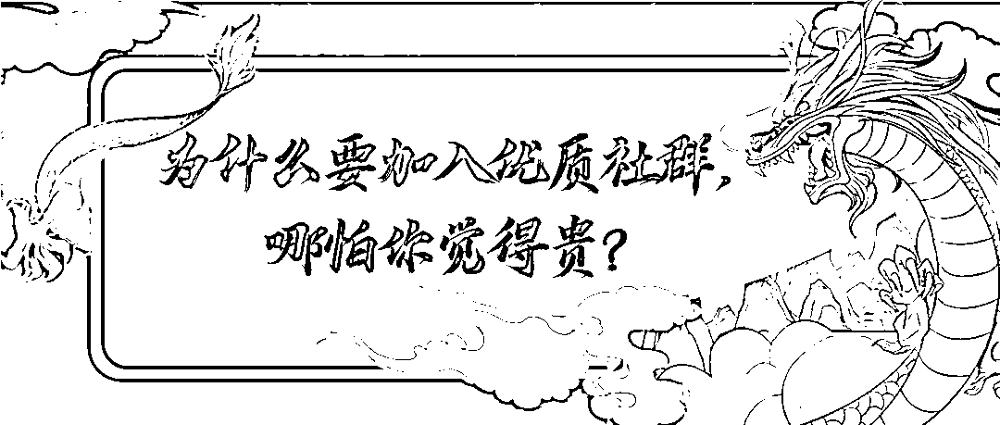
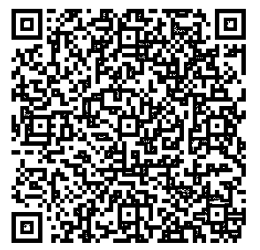
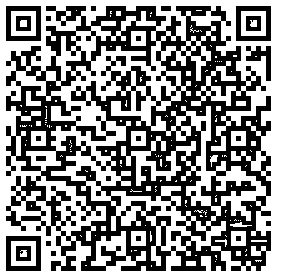
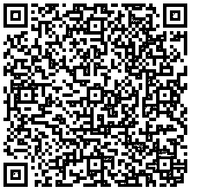
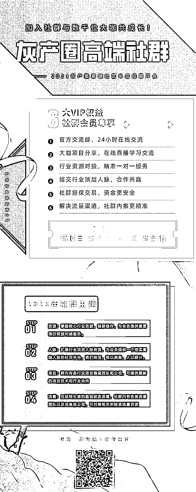

# 为什么要加入优质社群，哪怕你觉得贵？

> 原文：[`mp.weixin.qq.com/s?__biz=MzIyMDYwMTk0Mw==&mid=2247522682&idx=6&sn=45f2322f2deb2a2b3f0d109794eb63e7&chksm=97cb5242a0bcdb54306483a58e38d26ec1064c55f57096a4bbcad969c3885129d58ce6d21216&scene=27#wechat_redirect`](http://mp.weixin.qq.com/s?__biz=MzIyMDYwMTk0Mw==&mid=2247522682&idx=6&sn=45f2322f2deb2a2b3f0d109794eb63e7&chksm=97cb5242a0bcdb54306483a58e38d26ec1064c55f57096a4bbcad969c3885129d58ce6d21216&scene=27#wechat_redirect)

为什么要加入优质社群

前面我们已经发文说明了[付费社群的正确打开方式。](http://mp.weixin.qq.com/s?__biz=Mzg5ODAwNzA5Ng==&mid=2247486449&idx=3&sn=ac883c105c598105f6a366485843b6b4&chksm=c06862a6f71febb0e44dd3d555607482dbeead2786b7677817b80b29d732d87f1173ffe2b2e5&scene=21#wechat_redirect)

雷军曾告诉傅盛：“一个人要做成一件事情，其实本质上不是在于你多强，而是你要顺势而为，于万仞之上推千钧之石。”

我最大的体会是：找到外部势能，为自己的成长赋能，这是通往成功的捷径。而优质社群就是高势能区域，是你的万仞之山。

当然，必不可少的，你要付出不亚于任何人的努力。否则，哪怕你站在万仞之上了，你却连启动巨石的力量都没有。

**1、加入优质社群，获得系统支持**

之前我在朋友圈发了一段话，说“这个时代，个人奋斗不是成败的关键，加入一个协作网络，获得系统支持才是核心。当然，个人也不能太懒…”

这条内容得到不少朋友点赞，可见很多人意识到了这一点。

在社群里，可以获得系统的支持，有社群的平台分享项目和技术，同时可提供实时的提问和解答以及资源对接，最重要的是资源的交易有社群的担保交易，类似于淘宝交易流程，安全可靠确保资金安全，同时提供很多线上的实操课程学习，在获得社群的技术和项目支持再加上自己的实操你会打开一条新的网络项目赚钱之路。

**2、跟优秀的人做朋友，向有结果的人学习**

一个人应该随时随地、积极主动去升级自己的社交圈，而加入优质社群就是个不错的选择。

如果一直活在自己的小圈子里，也许有坐井观天的幸福，总觉得自己已经不错了，陷入到“邓宁-克鲁格心理效应”认知陷阱里。更可怕的是，你作为一个点（没有附着的网络），看不到外面世界的变化，在大势之下，随时都有被滚滚车轮碾过的危险……

同频的人同行业的人聚集在一起，集思广益，同时获取行业最新动向以及社群本身的技术支持，相信你的进步会飞快。

**3、如果你不是高手，那就去服务高手**

在《巨人的工具》这本书里，NFL 新英格兰爱国者队的主教练比尔·贝利奇克讲到了一个**“画布策略”****，核心就是用服务为牛人铺路，换取跟牛人学习实践的机会。**不但学徒如此，一些高手持续实行这个策略。因为有一个道理，是那些自大的人体会不到的：当你给人铺路的时候，你实际上也在左右他前进的方向。在这个意义上，利他就是最大的利己。

总结一下：

跟优秀的人做朋友，向有结果的人学习，加入优质社群，成为一个有价值的点，然后不断依靠社群的势能和赋能，最终突破个人局限，获得跨越式发展和成长。

最后，我们在这里推荐的我们灰产圈的官方社群：**灰产圈高端社群**

2021 年灰产圈社群主题

**1.资源：**掌握核心行业资源，精耕细作，为会员提供最靠谱的资源对接服务。

**（长按识别二维码查看社群风向标）**

**  **

**2.人脉：**扩展行业顶层人脉资源，为会员提供一个结实高端人脉的社交平台，我们相信，物以类聚，人以群分

**（长按识别二维码查看社群人脉库）**   

**3.项目：**互联网行业瞬息万变，项目也迭代更新，社群内有各行业项目操盘团队和公司，可提供最新的项目技术和行业动向，同时，我们会提供切实可行的互联网项目实操方案和运营思路，以及配套的资源。

**（长按识别二维码查看社群项目库）**

     

**4.流量：**互联网生意的基础就是流量，做生意的本质就是做流量，精准的流量就是互联网项目的保障，社群内有各类流量团队以及信息流公司，社群内可对接相关的精准流量资源，并提供资金担保，同时社群内提供各行业各类粉丝的引流技术和软件，可自行引流或者对接流量渠道。

**2021 年灰产圈高端社群有哪些服务？**

****

****会员适合哪些人加入？****

****1\. 缺资源、缺人脉、缺项目的人****

****2.从事微营销、各类出粉、微商等行业的人****

****3\. 需求流量渠道以及变现方式的人****

****4\. 新媒体、互联网赚钱项目等行业从业者****

****5\. 短视频、电商、淘客等需要用户二次变现的人****

****6\. 拥有资源与人脉，并拥有分享精神的朋友****

**关于社群的一些问题解答**

**Q：加入灰产圈高端社群有效期是多久？费用是多少？**

****A：有效期为加入时间起的一年时间（365 天），费用为 799 元。****

**Q：价格上没有优惠吗？可以打折吗？**

****A：与价格匹配的是社群提供的高价值，所以我们不会有折扣，如果灰产圈高端社群会员费用是 10 元，相信你也不会感兴趣！****

**Q：我没有高价值的人脉、资源、项目，可以加入到社群会员吗？**

****A：帮助大家业务推荐、资源对接，快速链接人脉是我们的服务之一，只要你人品端正，无不良黑历史，都是可以加入到我们会员的！****

**Q：加入会员后能都找到我需要的资源呢？**

****A：加入社群会员后，可在微信 500 人微信群内寻找自己所需求资源，自己找不到的管理帮你对接，我们尽所有可能的情况下去帮助会员对接一切所需要的的资源，基本上你需求的我们都可以帮你对接的到！（注：违规违法资源不提供对接）****

**Q：加入灰产圈高端社群会员后我能获得些什么？**

****A：在这里你可以获得更广阔的人脉，各行业的一手资讯，与其他大咖交流分享的平台，以及社群管理每日的业务推荐、一对一拉群对接，快速链接人脉等，这些都是会员权益的一部分。****

****如何缴费加入？****

****社群目前入会价格：799/年费****

****（从加入当天起一年的服务时间）****

********入会流程：** 1.扫描二维码在线支付：******

************

******2.支持微信或支付宝转账，
请添加官方客服号：huichange02    ******

******（付款方式二选一，方式一付款后提供付款截图给客服：huichange02）******