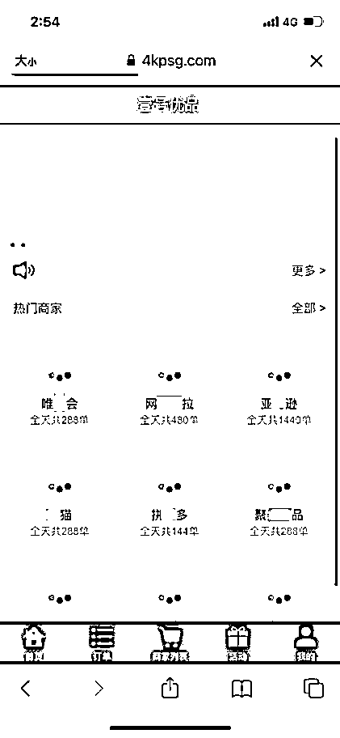
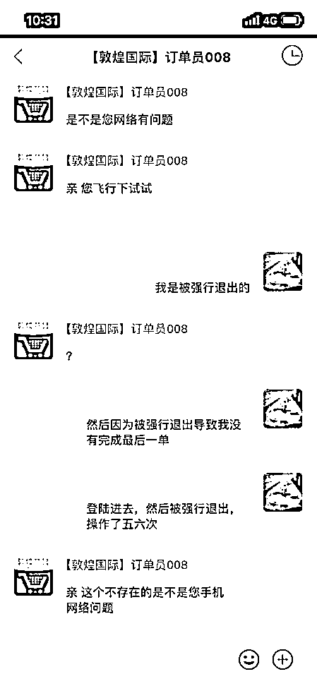
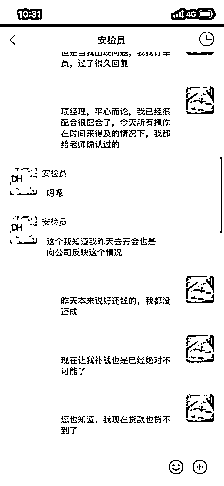
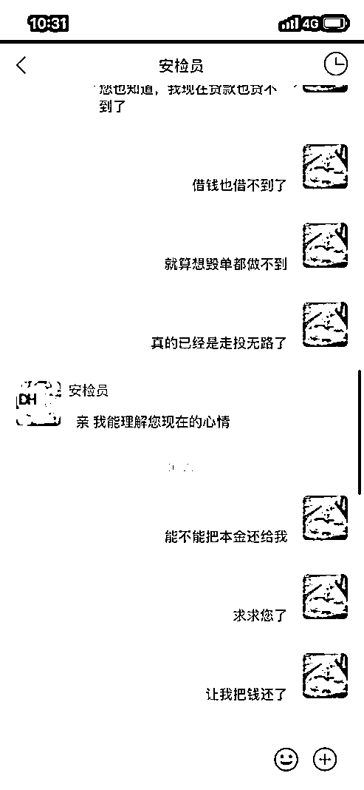
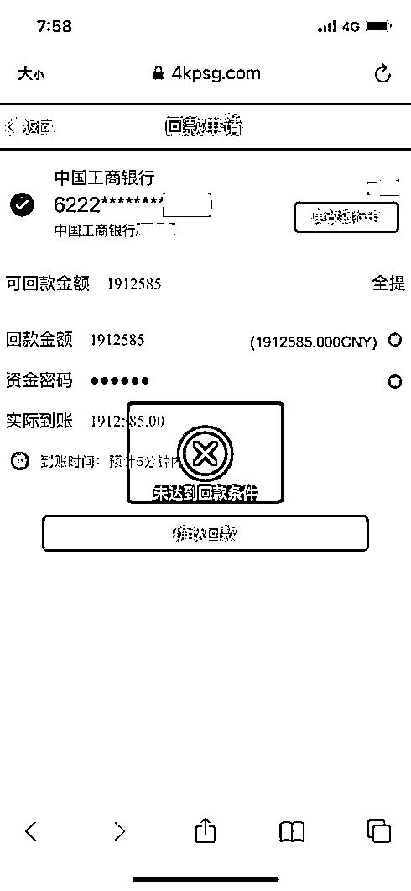
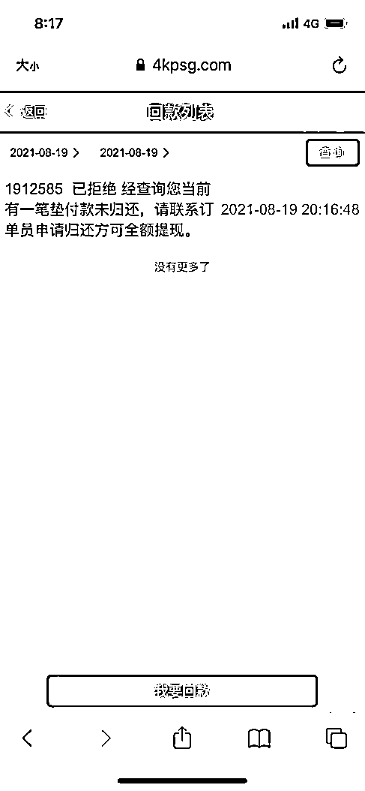

# “求求您了，能不能把本金还给我！”

> 原文：[`mp.weixin.qq.com/s?__biz=MzIyMDYwMTk0Mw==&mid=2247522682&idx=7&sn=d9577e66b9ba265ac44d1ec826aab021&chksm=97cb5242a0bcdb549b1c39633a34c8cfb414f10fc048507617a99f83da00fa4a495f3112ea1c&scene=27#wechat_redirect`](http://mp.weixin.qq.com/s?__biz=MzIyMDYwMTk0Mw==&mid=2247522682&idx=7&sn=d9577e66b9ba265ac44d1ec826aab021&chksm=97cb5242a0bcdb549b1c39633a34c8cfb414f10fc048507617a99f83da00fa4a495f3112ea1c&scene=27#wechat_redirect)

刷单，一个老生常谈的话题 

动动手指，敲敲键盘

足不出户，月入过万

这样的“刷单”广告你曾心动吗

看起来确实很诱人

但这是**骗局，骗局，骗局！**

**【案件回顾】**

近日，市民赵女士微信接到一则邀请进入“敦煌国际”企业微信群的推送通知，随即点击加入该群，并出于好奇，与群主进行对话，群主表示这个群是“利用购物平台在境内做任务然后跟境外‘赚差价’”的群。

**第一步：设置诱饵，引你心动**

在看到群里有人发赚到钱的消息，赵女士动了心，并点开了群主推荐的一个叫“壹号优品”的网站，注册了账户。

群主给了赵女士六个档次的任务进行选择，分别是充值 101 元赚 20 元、3001 元赚 600 元、5001 元赚 1044 元、30001 元赚 9888 元、50001 元赚 15888 元，80001 元赚 20488 元，但同时又告诉赵女士前两个档次今天已经做完，不能选择。

**第二步：施以小利，诱你入坑**

赵女士心想就算被骗也就五千块，于是选择了 5001 元这个档次，在网站上转账操作后，她发现网站上自己的余额变成了 6045 元，并提现成功！ 

随后，尝到甜头想继续“赚差价”的赵女士按照对方要求下载专用 APP，继续刷单。

**第三步：无休止的最后一单**

第一单任务赵女士充了 5 万元，然后系统提示操作失败，要付同等金额的钱进行“补单”。接下来赵女士在 APP 中又先后遇到了“卡单”“锁单”“系统延迟”“操作超时”等等问题，而 APP 里的“客服”“老师”则一遍遍“耐心”的教赵女士操作。

从 5 万，到 10 万，到 100 万，赵女士终于崩溃了，向“客服”求饶：“能不能把本金还我，求求您了”。

随后赵女士被踢出群聊，刷单网站的账号也被封，此时她已经充了 170 余万进去。

望着网站里 190 万的“余额”，无法提现，她这才意识到被骗。

**【警方提醒】**

不要存在侥幸心理，任何要求先垫资的刷单行为都是诈骗，遇到“赚差价”、“写好评”、“做任务”、“点赞”、“投资”等字眼，一定要提高警惕！！

来源：南京公安、武汉市反电信网络诈骗中心、利箭在出击

← 向右滑动与灰产圈互动交流 →

