# 重磅！反电信网络诈骗法（草案）公布！

> 原文：[`mp.weixin.qq.com/s?__biz=MzIyMDYwMTk0Mw==&mid=2247522682&idx=8&sn=3386cc3ea9b28c65404483fcca1cff79&chksm=97cb5242a0bcdb54866bffaabc678eb4df3676ad5fe45971980407a4a803d94b6bc7d9467122&scene=27#wechat_redirect`](http://mp.weixin.qq.com/s?__biz=MzIyMDYwMTk0Mw==&mid=2247522682&idx=8&sn=3386cc3ea9b28c65404483fcca1cff79&chksm=97cb5242a0bcdb54866bffaabc678eb4df3676ad5fe45971980407a4a803d94b6bc7d9467122&scene=27#wechat_redirect)

第十三届全国人大常委会第三十一次会议对《中华人民共和国反电信网络诈骗法（草案）》进行了审议。现已公布公开征求意见，社会公众可以直接登录中国人大网（www.npc.gov.cn）或国家法律法规数据库（flk.npc.gov.cn）提出意见，也可以将意见寄送全国人大常委会法制工作委员会（北京市西城区前门西大街 1 号，邮编：100805。信封上请注明反电信网络诈骗法草案征求意见）。征求意见截止日期：2021 年 11 月 21 日。 

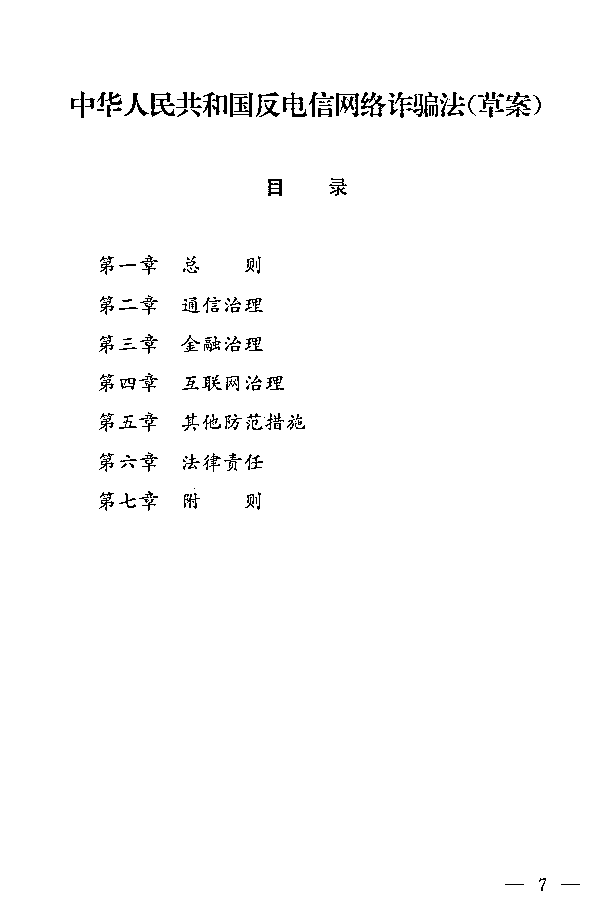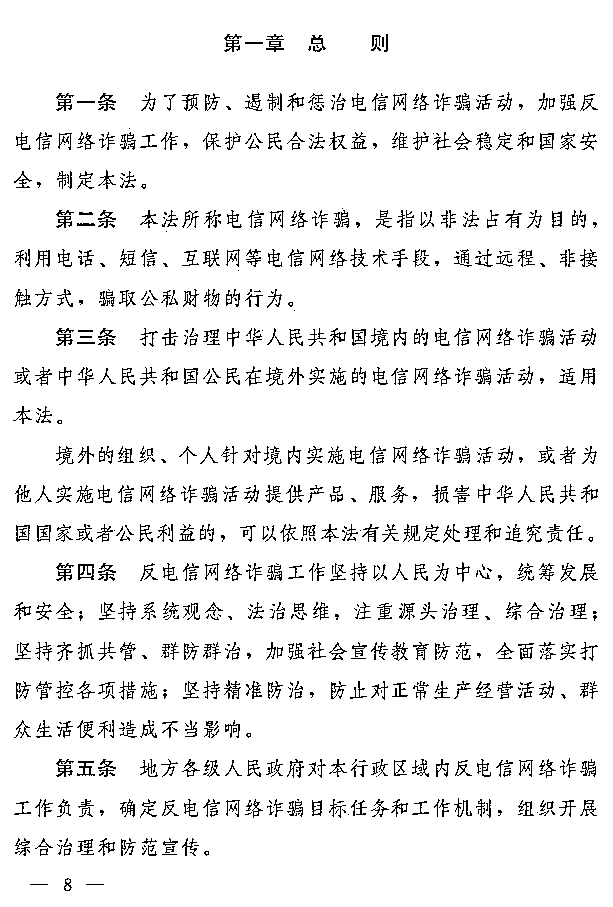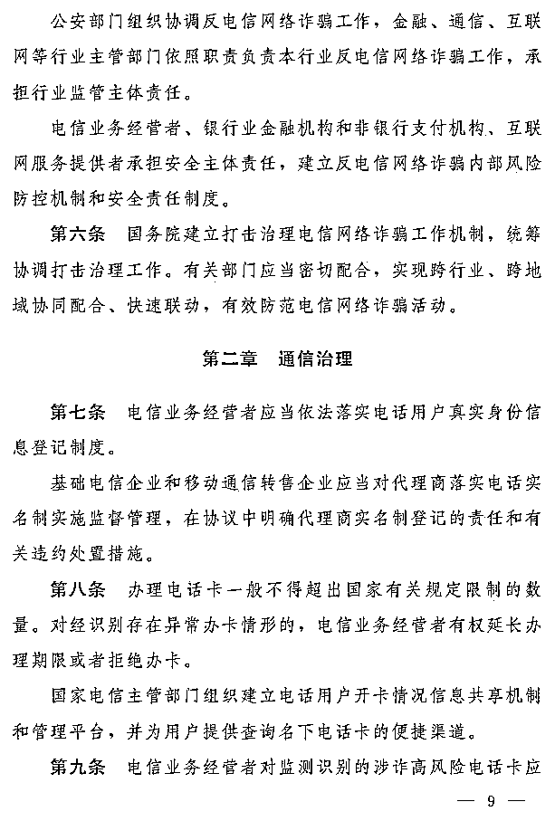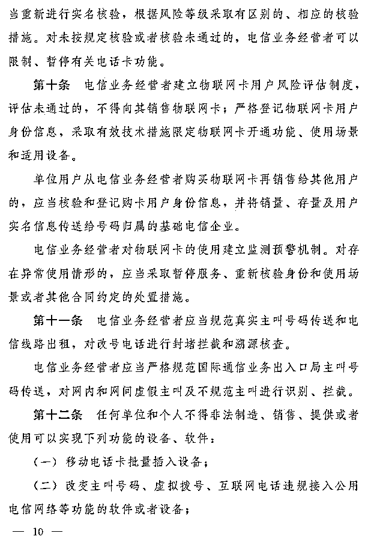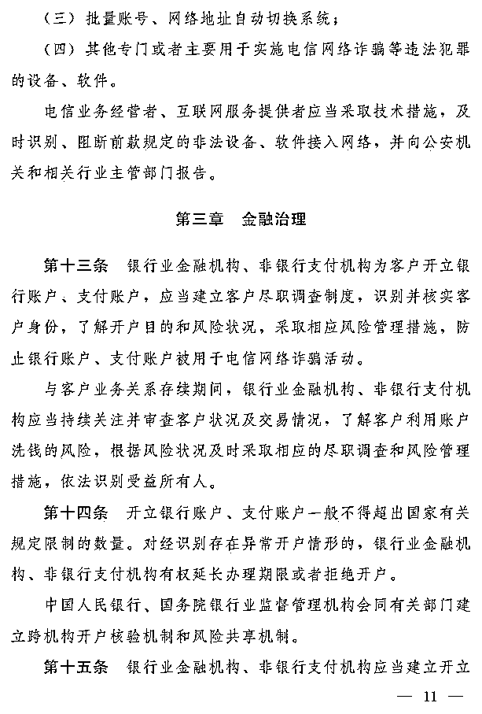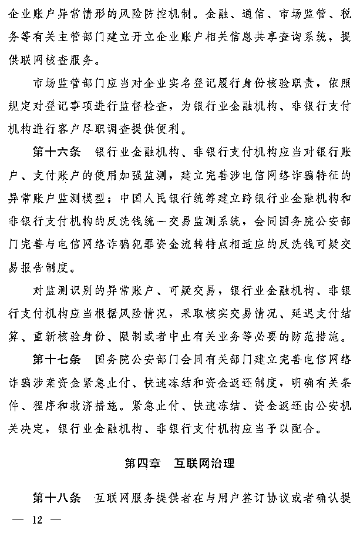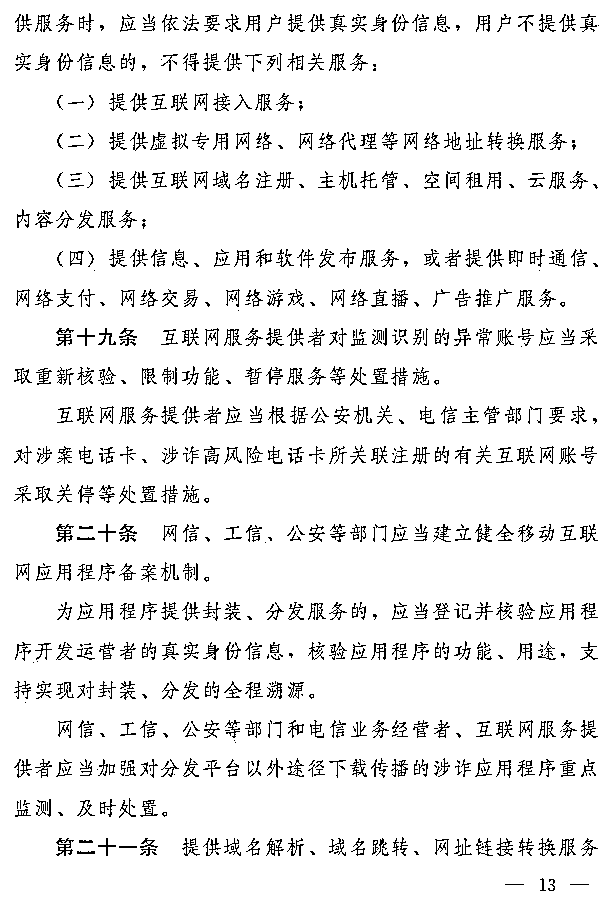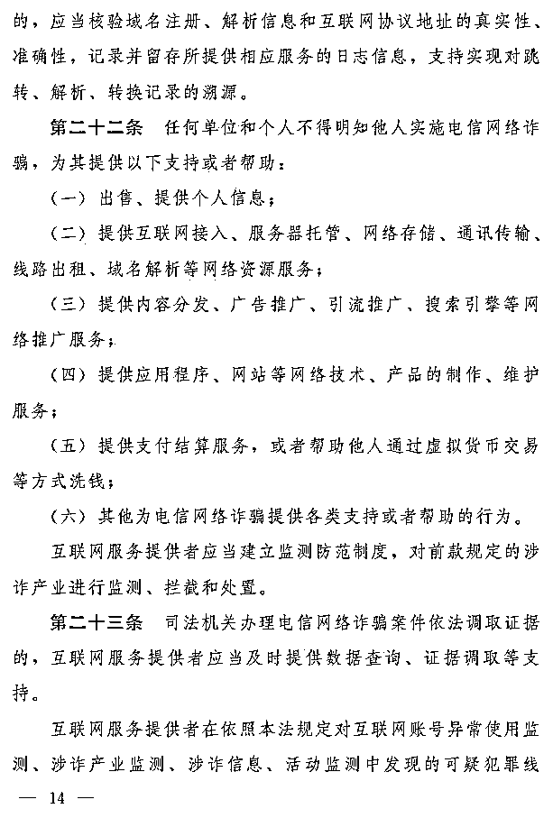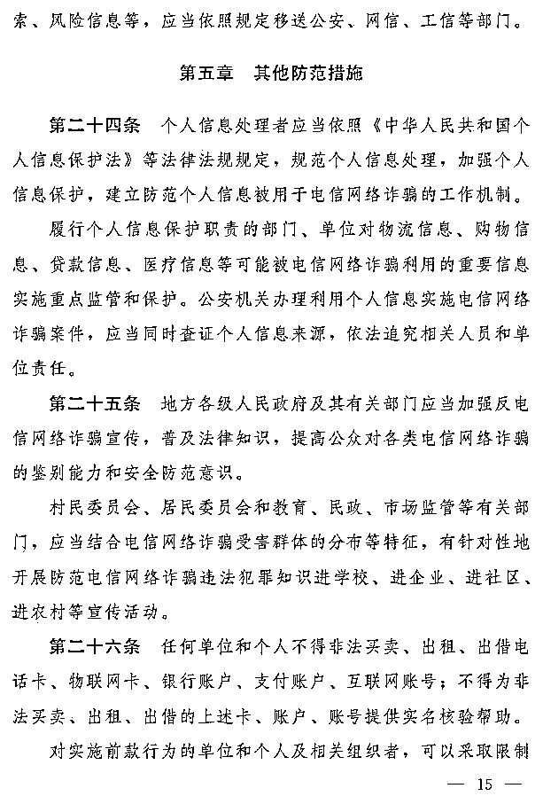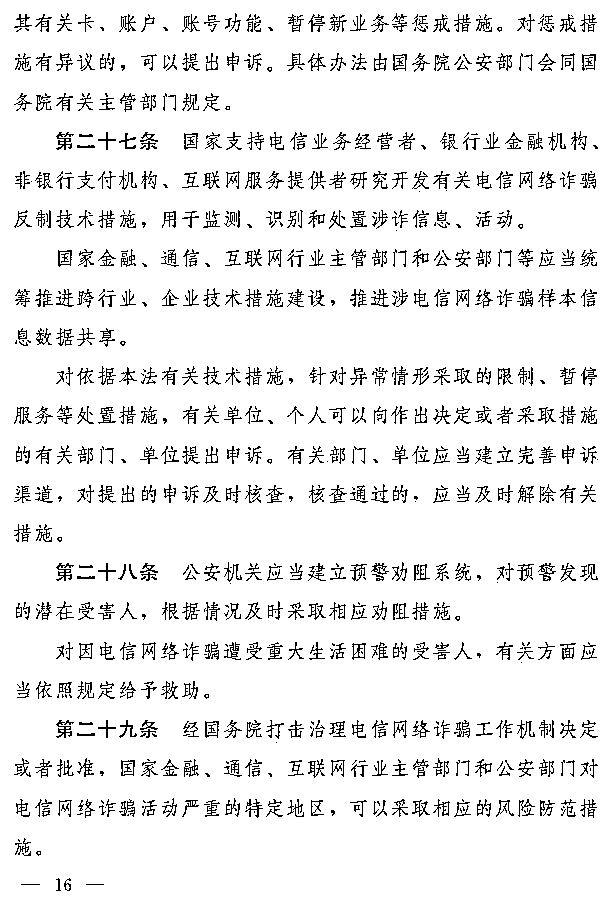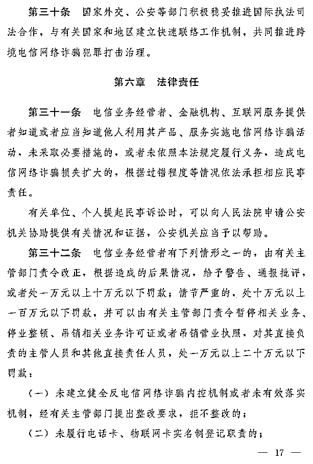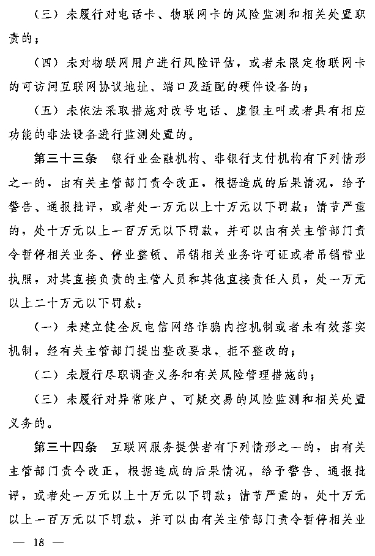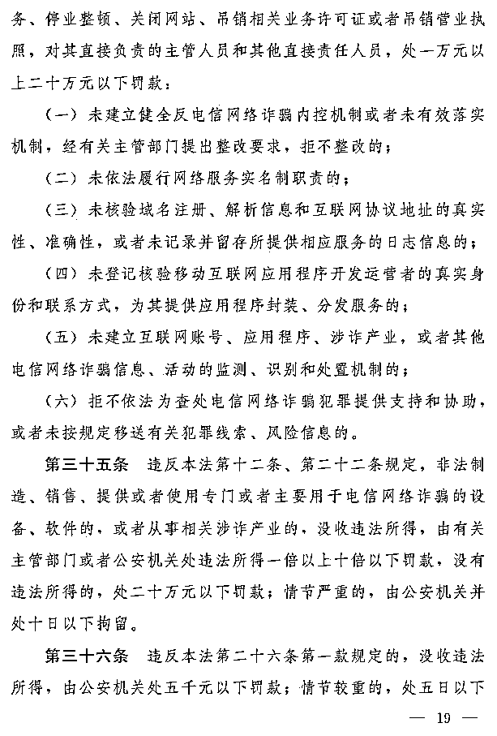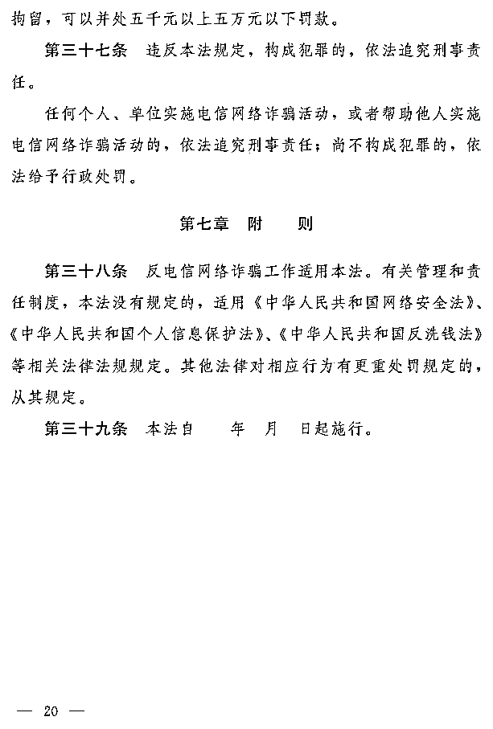来源：中国人大网，腾讯安全战略研究

← 向右滑动与灰产圈互动交流 →

