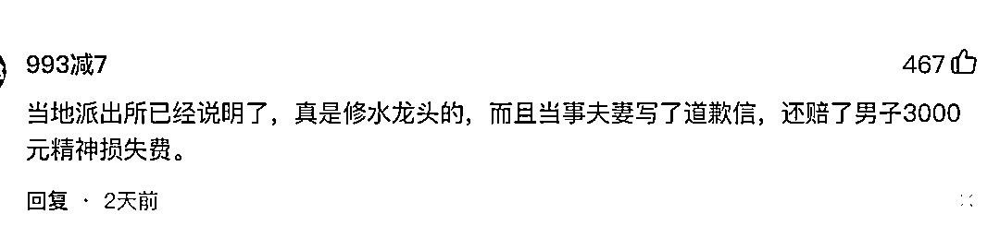
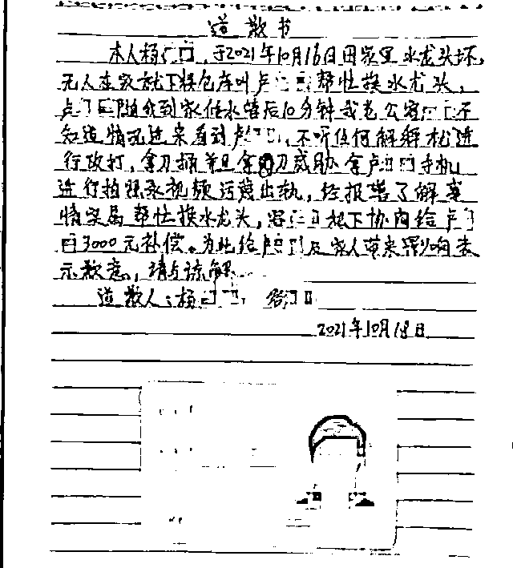
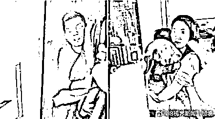

# 男子修水龙头躲衣柜事件反转，妻子承认确实与男子发生关系

> 原文：[`mp.weixin.qq.com/s?__biz=MzIyMDYwMTk0Mw==&mid=2247522748&idx=1&sn=ed697c8218c57db8b17aaf3dcd755ac7&chksm=97cb5284a0bcdb9264763e1faf681dc740d77aabbc01f4623ee8b30666bd2b1859297a9e20fb&scene=27#wechat_redirect`](http://mp.weixin.qq.com/s?__biz=MzIyMDYwMTk0Mw==&mid=2247522748&idx=1&sn=ed697c8218c57db8b17aaf3dcd755ac7&chksm=97cb5284a0bcdb9264763e1faf681dc740d77aabbc01f4623ee8b30666bd2b1859297a9e20fb&scene=27#wechat_redirect)

**此前报道：**

[有男人躲衣柜，妻子称是修水龙头的，男主人：他俩发生了关系，但不信她是自愿](http://mp.weixin.qq.com/s?__biz=MzIyMDYwMTk0Mw==&mid=2247522682&idx=1&sn=7cdae434c6e013f305077bc0eb01bba0&chksm=97cb5242a0bcdb54ec35125e978a4659273efed9ffe44d7ce0dcf4d8aec2871fae2e87b52c3a&scene=21#wechat_redirect)

“老公，你别乱想，他是修水龙头的！”据中国网报道，近日，网曝广西南宁，一名男子情绪激动地拿着刀，质问躲在自家衣柜里的另一名男子，来干什么？妻子抱着娃说，他是修水龙头的。男子则解释说，自己是怕丈夫误会，才躲进衣柜的。丈夫表示对这种解释不认可。

 [`v.qq.com/iframe/preview.html?width=500&height=375&auto=0&vid=p3303ecjf5v`](https://v.qq.com/iframe/preview.html?width=500&height=375&auto=0&vid=p3303ecjf5v) 

后来，网上流出一封带有身份证的道歉信，信中“证实”确实是修水龙头，还赔偿对方 3000 元

本以为真是“修水龙头”的，结果此事闹大之后，男主出面回应了。 首先他否认了道歉信是他写的，但是他确实承认赔偿了对方 3000 元，因为他当时动手打了男子，还将男子腿部捅伤，**在警方的介入下，他确实给对方赔了 3000 元钱**。其次，当天他本来在单位上班，因为降温他于 16 日下午 3 时许返回家中，想要拿一件衣服。**然而，当他到家门口时，才发现家里大门竟然是反锁着的，见状他便给妻子打电话，但直到约 20 分钟后，妻子才将大门打开**。走进房内，他立马察觉到情况有些不对劲，浴室里面有不少水渍，像是刚刚洗过澡，而卧室里也有些乱糟糟的，原本放在柜子里的一些衣服，不知为何被拿到了柜子外面。打开柜门，眼前的一幕让他气不打一处来，一名男子竟蜷缩着身子躲在柜子里面。最重要的是，据其妻子介绍，当天其确实与视频中的男子发生了关系，原本两人之间还有不少暧昧聊天记录，但事发当天均已被衣柜男子删除。事发之后，为了躲避那名男子，他和妻子已经搬出了原先的租房，他不相信妻子是自愿和对方发生关系，仍想和妻子过下去。下一步，他将考虑请律师打官司。<mpvideosnap class="js_uneditable custom_select_card channels_iframe" data-pluginname="videosnap" data-id="export/UzFfAgtgekIEAQAAAAAAM4Qwh6PgggAAAAstQy6ubaLX4KHWvLEZgBPEooNUWWtCBMn9zNPgMIv-mjFJCIkcWbDnT8udRoXT" data-url="https://findermp.video.qq.com/251/20350/stodownload?encfilekey=XGocBFxVWK5dcyOOqpEU47RpBHQIvlhnyPB4vh0ORA676Iic3W3cW8Do7Uib4LzVRxqzyZhsevWnGw3z0zE2Hzw7NrIZ3LbjjoaCLf0AS7RWqPGicuMHffgTMmibInhIoub3iczPXsx33oo1jOWTNj2zudIRcSiay1uFKkg4bNQx69aUiaaVVjOeq3fuicLfZyicogTQw&amp;adaptivelytrans=0&amp;bizid=1023&amp;dotrans=0&amp;hy=SH&amp;idx=1&amp;m=591568ae74a1f6b91d980b81328cce50&amp;token=x5Y29zUxcibCxIEfn8JG6wkLgicmavpWwGia1zNWXnicRWlZfh656sGtxOGpicfMKm1IgN7UMEJWlcWc" data-headimgurl="http://wx.qlogo.cn/finderhead/PiajxSqBRaEISAKibugHhUQs74zK9sdqn9QvawbxCzU7AuxCgU4kpS0A/0" data-username="v2_060000231003b20faec8cae18b1bcad5cb00e937b0779ef044c516b0481d185bbca60dd9c21f@finder" data-nickname="灰产圈" data-desc="水龙头事件中丈夫还原躲衣柜事实真相@灰产圈 " data-nonceid="15690018260537294500" data-type="video"></mpvideosnap>来源：微博那些事儿

← 向右滑动与灰产圈互动交流 →

