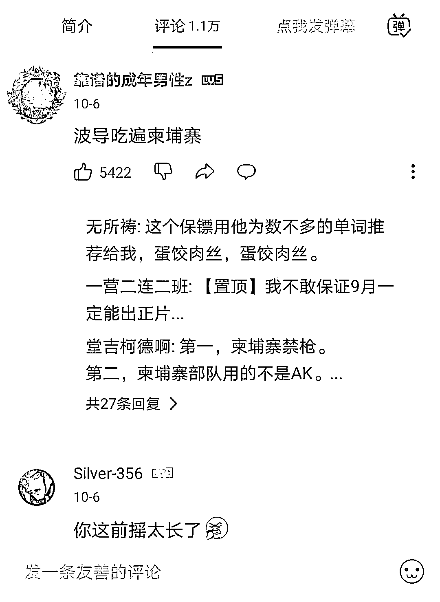

# 号称举报掉了一个巨型诈骗园区！被粉丝诈骗 25 万的百万 UP 主，反过来诈骗粉丝？

> 原文：[`mp.weixin.qq.com/s?__biz=MzIyMDYwMTk0Mw==&mid=2247522748&idx=2&sn=359306a1503b6c9fa7cb0bc16a442e12&chksm=97cb5284a0bcdb92dfbc7cb19057fb605078a8309a951f8010f911e0ec7de28bc0d4f96b4c01&scene=27#wechat_redirect`](http://mp.weixin.qq.com/s?__biz=MzIyMDYwMTk0Mw==&mid=2247522748&idx=2&sn=359306a1503b6c9fa7cb0bc16a442e12&chksm=97cb5284a0bcdb92dfbc7cb19057fb605078a8309a951f8010f911e0ec7de28bc0d4f96b4c01&scene=27#wechat_redirect)

**这是我第四次，也是最后一次写“波桑吃遍世界”这个博主了。**

**因为我感觉我被消费了。**

7 月 17 号，有媒体报道了网红“波桑吃遍世界”被粉丝诈骗 25 万的案例，事情立刻引起全网热议，最高冲到热搜第一。

这位网红从名字上看就知道是美食博主，他晒自己吃各种食物的视频，也分享到周围各国旅游的经历，某站上粉丝数高达 150.6 万。

后来，波桑发布视频，声称要亲身来到柬埔寨，揭露这里的一切绑架案和诈骗。

当时小编觉得他这个行为虽然鲁莽，虽然也有炒作嫌疑，但是不可否认其本质还是好的。甚至还担心他可能会因为这个行为遭遇到危险，而拜托网友们多多注意下。

但是！在看完了他最近发布的几期视频之后，我真的感觉我被消费了。

可以看到，从他发第一个揭露视频开始，他的视频点击量简直是飞速上涨，直接达到了 814.2 万，而之后的两个视频点击也不低，最少都有百万以上。

但是视频内容呢？

在我看来，他只是打着揭露的名头，赚取了上千万流量，却拍了一个柬埔寨旅游 Vlog。 

接下来，就来看看他这五集“硬核”视频到底发了点啥？

因为五集视频的时长太长，我也不想一一上传，干脆直接用他评论区下方的网友精辟发言来总结一下：

没错！就是这么不可思议！ 

你以为的危险统统不存在，他只是在隔离酒店喝了碗中国魔法汤；

独自去吃了堪称天价的沙县小吃和桂林米粉；

约两个柬埔寨妹子吃了韩国烤肉，期间妹子还主动向他告白；

和朋友雇的保镖赶赴西港，路上吃了 1.5 人民币超便宜甜甜圈和汉堡；

到了西港之后买了泡面，椰子，吃了烤鱼。

**除此之外，他只干了一件我觉得还可以的事情，就是给在金边的一对中国父女捐了 600 美金，****（但是后面被另一个 up 主一支屿扒出来只捐了 200 美金……）**

**就大无语！！！你都有钱到这个时候来柬埔寨了，一张回国机票都几千美金，几万人民币了，还非得在这几百美金的捐款上作假！**

现在只剩下最后一集视频，也就是他说的这次揭露的最终结果——举报了一个巨型诈骗园区还没发，但是我已经不想看了。因为无论最终结果怎么样，这几乎所谓的“硬核”视频都太拉胯了。

我也不是一定要看所谓的危险视频、深入电诈园区之类的，但是他现在发的这些和他最开始做这个视频预告时说的**“硬核”、“希望能活着回来”**，营造的紧张基调为，未免也相差太多了！

回想看到他的第一期视频发布的时候，我是真的很震撼，因为作为一个柬埔寨的编辑，我确实看到过太多太多的黑暗事件，见过很多被电诈害了的人，所以看到那个视频的时候，我觉得这个年轻人人可能是年少气盛，但也是心中有光的人。 

但是看完这几期吃吃喝喝约网友的视频后，我觉得很失望。

这个所谓的揭露诈骗和绑架的视频不过是一次流量的炒作。你在为他担心，他却在数你能为他带来多少 money。

最后带大家看看视频评论区网友的看法：

**此前报道：**

**[B 站百万人气 UP 主：“我被粉丝骗了 25 万！”](http://mp.weixin.qq.com/s?__biz=MzIyMDYwMTk0Mw==&mid=2247517414&idx=1&sn=62a5867fc5520b808874febabd8604a6&chksm=97cb4fdea0bcc6c880200e80862b4db19c82d350c58b01a1998435c721fe1fca921069209745&scene=21#wechat_redirect)**

来源：高棉通，阻击诈骗

← 向右滑动与灰产圈互动交流 →

