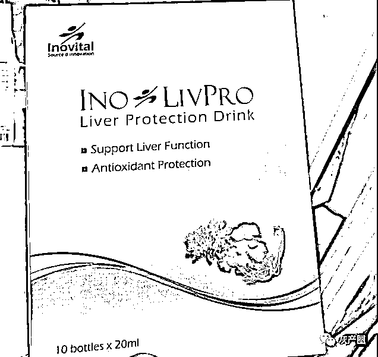
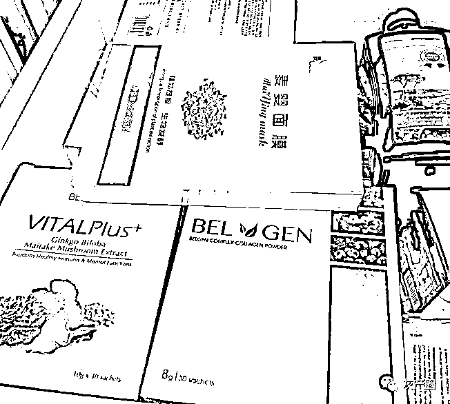
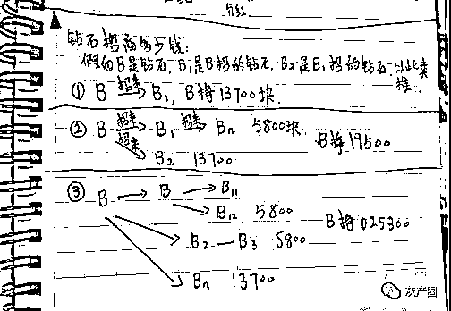
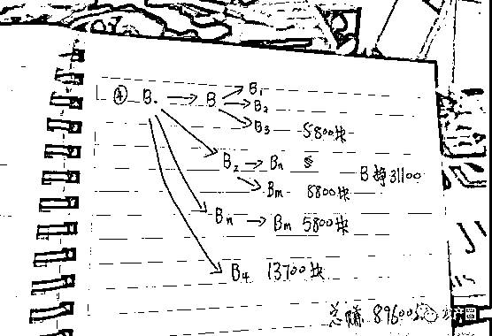
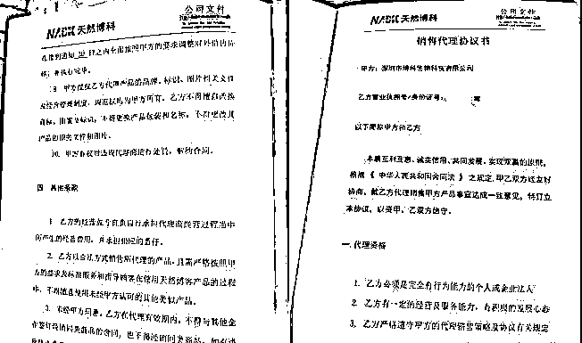
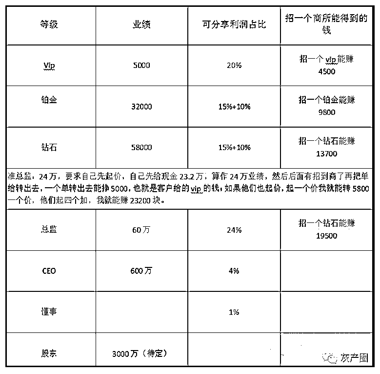
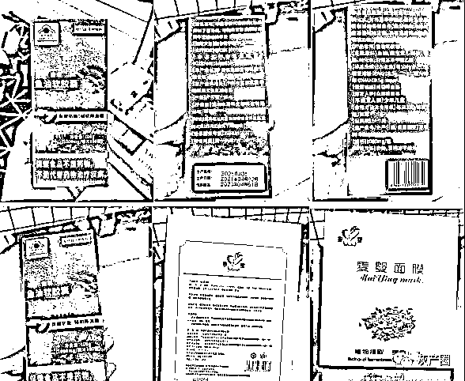
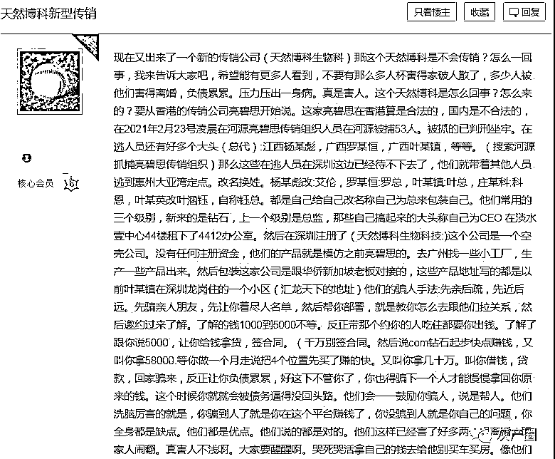
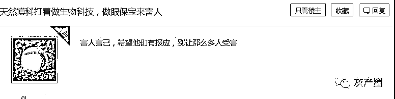
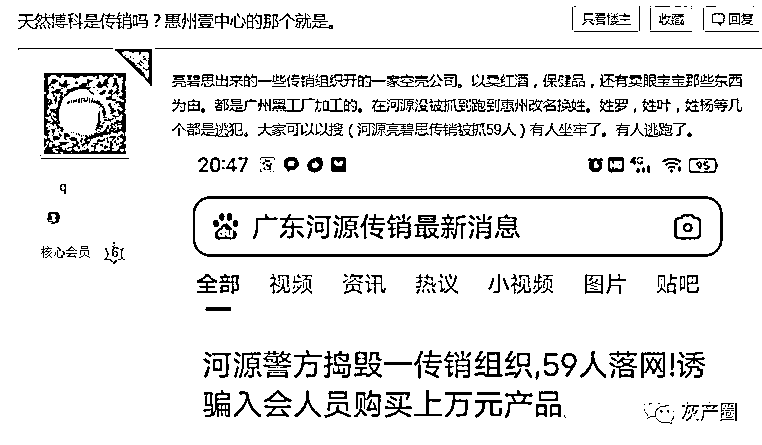

# 我被朋友骗去“天然博科”传销的真实经历，朋友们要小心！

> 原文：[`mp.weixin.qq.com/s?__biz=MzIyMDYwMTk0Mw==&mid=2247522748&idx=4&sn=8f59d96beaf0dba74cc466805d7f3c49&chksm=97cb5284a0bcdb920b4ab6acbac717666c0cdaf52db6b0aac05e701c5296fcb9d1afaf562721&scene=27#wechat_redirect`](http://mp.weixin.qq.com/s?__biz=MzIyMDYwMTk0Mw==&mid=2247522748&idx=4&sn=8f59d96beaf0dba74cc466805d7f3c49&chksm=97cb5284a0bcdb920b4ab6acbac717666c0cdaf52db6b0aac05e701c5296fcb9d1afaf562721&scene=27#wechat_redirect)

我去了惠州大亚湾，本着刚好放端午假期，想着去惠州那边找我那位“所谓”的朋友 H 玩。

因为之前就已经认识了他，并加了微信，也见过几次，也有一直保持联系，一直给我灌输观念，说什么打工没前途的，无限放大打工的坏处，说创业多么自由，多么美好，还给我说他签了一个订单，赚了三万多，这个我是印象深刻的。

去到了那边已经是晚上了，他让我自己找个地方住下，说他那里没地方，我无语了，大老远的跑过来都不过来接一下？还以为我到了能去你那睡一晚能省点钱。

到了 5 月 3 号下午才见到他，穿着一身的西装的衬衫，穿着皮鞋，蹭亮蹭亮的，一身的成功人士的打扮，见了面之后我们就去海边的澳头公园那边去踩单车（后来才知道这些活动都是他们管用玩到腻了的），在骑单车的时候好放松，很愉快，当中他时不时的夸一下惠州多好多好，环境多棒多棒；然后晚上吃饭去了广场，然后点好餐之后就莫名其妙的来了一个 J 哥（化名），吃了饭之后就 J 哥不停不停的说，灌输打工的观念，说到最后就给我说这个月中有个机会可以带我一起去哪哪看商会，我觉得莫名其妙就找个理由推脱了说下次。

之后我就回去了，当中他不断的问候我，表现的很关心我，那个 J 哥也加了微信询问我最近的情况。

H 也一直有跟我聊天，感觉他很热情也很关心我，他朋友圈平时也是各种晒美食旅游，各种高端场所，他们的说法就是“别人看我们玩，其实我们在工作；别人看我们在工作，其实我们在玩”，现在想想真搞笑。

问他做什么，他说自己在做生意，做批发贸易，母婴类的产品，红酒产品，还有护肤，他对我非常好，只要到了广州就会约我出来见面聊天；还把他的经历讲给我听，还经常给我讲那个 J 哥以前也是打工，自己创业之后变化多大多好，还买房买车，帮了他很多，说是他很要好的朋友，在他迷途的时候无私帮助他很多，是他很感恩的人。也总是当着我面买单，让人感觉他经济很好。

他说做生意人脉很重要，他就是带我去参加一些活动认识人，那里活动的人都对我很热情很关心，在外面的人情冷暖让我觉得这里的人都好关爱我，怎么以前没有遇到这么好的朋友啊，然后活动中那个 J 哥也是各种关心，各种问候，简直就把我当亲人一样看待。

▲部分产品为亮碧思传销组织产品

活动结束后就故作关心说是为了我那朋友 H 的面子才争取到这个机会，然后说要去什么招商会，大家都是 AA 的，需要交 1500 的一个吃住费用（这才是他们的高明之处，只要交了钱，你就会珍惜这次机会），交了然后就去了壹中心，路上 H 一直陪着我，对我非常关心，路上碰到那些传销拍档也给我介绍，说这个以前做过什么什么大生意的，那个有多少多少套房产名车等等。开了三天的招商会，都是给你说什么市场，产品知识，什么 vip、钻石、部门负责人、CEO 等等，还说现在去买个东西都要会员制，这很正常，比传统生意好赚钱，这门生意不是传销等，还说 21 天七折退货。三天的行程很紧凑，晚上还要去吃饭喝酒，找不同的人给你打雾，每个人说到最后都会说“你什么时候搞定啥啥聘级，以后找我一定帮忙”，每天都弄得很晚才睡，这是为了让你没有时间去思考和查找资料。

接着就是去摸单，不断的催促你快点搞定 VIP。

然后就是去的一个海边小农庄，不停的找人打雾，美其名曰“学习”，实则是给你洗脑，让你尽快搞定 58000 的钻石，不断的洗脑洗脑。开大会的时候会让你上去介绍你自己，说让大家认识你以后好帮忙，再来就是逼单，强迫问你什么时候能搞定钻石，有点反感也有点害怕，因为他们人太多，之后就是只要你没交了钱做钻石，就会不断的找人给你打雾，目的就是要你钻石给你洗脑。说只要找到 4 个加盟的人就可以了，没有时间限制，打雾打的头晕脑胀，稀里糊涂的就交了钱，成为钻石聘级。

▲奖励制度（假如 B 是钻石，B1 是 B 招的钻石，B2 是 B1 招的钻石，一个钻石只需要招四个合作伙伴就可以了）

成为钻石之后，还是不断的打雾，每天在益田醒茶、一卡、漏洞咖啡等不同的奶茶店坐着听那些已经是准总监、总监不断的分享他们的成功经历，他们告诉我怎么样尽快上位，方法就是黄金架构，借用家人的身份证把下面四个钻石的下线自己买下来，还说这样做有多少好处，快速上位，省钱，双户籍收钱，复制等，可以关水闸不漏钱。

后面听他们总监的课，那些他们崇拜的不得了的总监 CEO 们都是在讲着他们自己以前的经历，都怎么怎么不容易的走过来，劝你一定要尽快搞定，别耽误时间，浪费时间就是浪费金钱，后面回想起，那段时间他们几乎所有人都没怎么出去卖过产品，几乎都在奶茶店讨论着怎么约朋友过来，怎么分析朋友的问题。

每天都要去公司开会，每周都要去一次酒店开大会，进行洗脑学习，CEO 在上面讲着一堆的家里长家里短，看事情只看正面不看负面。还总是说：“如果这是传销那为什么还有那么多人坚持在这里呀，难道就只有你一个聪明，其他人都是傻的吗？”

▲被洗脑后签署的合同

真是服了，只看正面不看负面，那个叫嘉哥的也说过“只要你跟着我就一定会挣到钱的”，还说什么你是第一个觉得这里是传销的，来了这里每个总监都是月入过万，你觉得你会比他们差吗，后来想想也不对，月入几万的人出去吃饭还 AA？？

然后那段时间就过得非常非常累，早出晚归的，H 也一直陪着我，说是关心我，其实是一直监视着我的一举一动，把我的行为上报给嘉哥，好找对应的法子搞定我，想尽办法套我信用卡网贷里的钱。

后来月底了，就莫名其妙的给我说什么这个黄金架构本来不想给你说，只是每个人都要有知情权，然后就是谁谁给我说了架构，简单讲就是自己先出 4 个钻石（一个钻石 58000）的钱占住位置成为准总监，不断的说有多少多少好处，还说这样可以断了后路，以后可以一直专心做业绩，不断洗脑。你不起这个架构，那就带你去打雾打到你起这个架构为止。

那个时候我有点怀疑,问他们的一个总监：为什么现在是在这里，而不是赚钱。她说：那是因为现在的一个重心不是在赚钱，而是要帮谁谁上到 CEO 这个位置，这个位置很重要，意义重大，能帮到恺丰的未来。当时感觉有点无语，但又说不出哪里奇怪。然后就是不停的给你洗脑产生一个 CEO 有多么多么大的好处。

▲深圳市博科生物科技有限公司升级、奖励制度

上到准总监之后，就是教你所谓额生意流程，怎么做 ABC，A 就是总监，分析者，B 就是介绍人，起到桥梁的作用，C 就是准备被拉入传销的人。

反复强调这个是团队生意，你本身实力不够的，无法吸引到别人过来，A 的出现能大大增加 C 更加信任这个生意，再加上团队里其他级别高的人出现，就会显得很有实力的样子，而且很会对 C 非常关心，C 就不由自主的会感动、感谢，要加入这个所谓“温暖”的大家庭，尤其是女生，孤僻的，自闭的人，非常容易沦陷，这就是他们所讲的吸引力法则。

其实他们对每个准备要加入的人都很好很关照，还吹嘘只要你加入了公司，公司就是有 74%收益返回，其实就是把每个聘级的返回利润加起来就有 74%，而且很多 vip、钻石、准总监全都是自己拿钱砸上去的，还说一定要上到总监才会赚钱，总监还有公司百分之二的股份，一年有两次的分红。

有新人加入质疑这是在给别人下套的时候，她们就会统一口供说这个是做生意的门道，是让你们少走弯路，这个是在帮人，是给他们一个机会，我们也是要挑人的好吧，陌生人熟人都可以做，熟人会更快点成单，信任度高，所以一定要多带些亲朋好友过来邀约，一直在强调这是在帮人不是拉人头，是给他们一条发财之路。

一边总是强调来这里刚开始是为了钱，到最后是为了情，所以邀约朋友过来的时候不要一直想着那 13700.一边又有事没事的给我们计算合作伙伴做生意的一个回报收益。一边使劲的穿着多么漂亮华丽的衣服出入各种广场喝咖啡，一边吃饭又为了几块钱的茶位费而跟服务员纠缠了半天。完完全全就没有正经谈生意的痕迹，跟传统生意不一样，还吹嘘说这是最新轻资产创业。

后面在公司开会打雾，越来越觉得恶心，听着他们报人名单，准备约过来联谊的人的情况的时候，原来我也曾上过他们的人名单，也分析过我的基本情况，家庭人员，工作岗位，经济情况，性格喜好等。我的情况上报给他的上线之后，已经和上线沟通了怎么样和我聊天，获取信任度，了解我的想法，其实他一直用着 ABC 法则去跟我聊，天啊，这样的人，还值得去信任吗，

每周都会定期去酒店开大会，酒店还都是所有人 AA 每人 15 块，几个公司的人都会聚在一起，分享自己怎么约到客户，怎么拉到一个人做了钻石等等，之后就是听 CEO 级别的人去分享他们的一个经历，据说做到 CEO 级别的都是买了好几套房，其实也是拿着你们准总监钻石所有人得钱买的。

总说这个生意是你自己的，你自己赚的钱，自己安排自己的时间，但是每天做些什么去了哪里都是和上线汇报，还说做这个生意一定要“听话、照做、归零”，只有这样才能赚到钱，如果你是按照你自己的想法去做，你肯定赚不到钱。

7 月-9 月这段时间是谢某 hang 要上位 CEO，要团队里的每个人都要加油，每个人都要做业绩，有人约过来的就赶紧约过来联谊，实在没有得就暗示底下的人自己做单撑业绩上去，实际上每个人都负债好几十万，但他们都不会对新人说，依旧会包装自己吹嘘每个月赚几万几万，其实只有一个月赚几万块钱，而且还是自己拿钱填业绩拿回来的回扣，无语了。。。还说以后会把自己下面的单转出去，一定会回本的，其实就是把自己朋友亲戚拉过来让他们做钻石，把自己欠的钱让自己朋友家人来填补，转移给他们，真是好手段。

一开始还吹嘘什么可以 21 天之内可以退款，那时候找那个所谓的嘉哥要退货，直接放狠话的骂我，超级凶，气势上盖过去，还说什么你的贵人对你那么好你就让他那么失望？

一个劲的只要你做下去，还说这个行业不淘汰任何人，都是自己淘汰自己，等过了 21 天又会说这个只是你和公司的合同，没有经过我的手，我也没有签字，你要退就找公司。

▲深圳市博科生物科技有限公司产品

真的很恶心，那副吃人不吐骨头的嘴脸，也难怪他三年就可以买房买车了，成交前那么的殷勤，关心，等不想做了却推脱的干干净净，跟他没有半毛钱关系。

那里面做的人很多其实生活过得并不好，很多人自己都买了好几个户口，投入了几十万，有的人投入了 80 多万，有的是借钱投入的，也有自己刷信用卡网贷自己做上总监聘级，还一直幻想着这个钱一定可以回来的，只是时间问题，很多在里面的半年以上的基本都完完全全被洗脑了，认为这就是风口，抓住这个风口就能买房买车。

这些人天天忙着打雾学习，去外面见客户（朋友亲戚），失去了原来的圈子，在社会上已经不被认可了，只有回到传销的圈子才能找到认同、被认可的存在感，无论你跟他们说什么，他们总有一套又一套的说辞来反驳你。

这些都是一套又一套的，朋友们，如果你身边有人突然改变形象穿西装，梳发型，头发往后倒，很喜欢晒钱，打扮的成功人士一样，经常去中高端场所，晒戒指，你问他们做什么的，他说做轻医美生意，轻资产创业，做批发的，自己做生意，做贸易，空气净化，葡萄酒，香水，珠宝，spa，美妆，保健品，母婴产品，奶粉等的，都有可能做亮碧思模式传销。切记！切记！！

有网友爆料，天然博科公司的主要负责人是原亮碧思传销组织中的头目之一，他们公司中销售的产品，有部分为亮碧思传销产品

来源：奥一报料、利箭在出击

← 向右滑动与灰产圈互动交流 →

