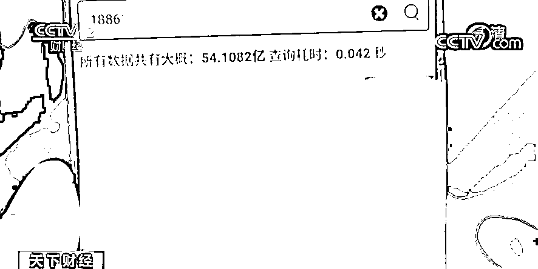

# 54 亿条！每条超 6000 元！你的个人信息，可能已经泄露…

> 原文：[`mp.weixin.qq.com/s?__biz=MzIyMDYwMTk0Mw==&mid=2247522748&idx=5&sn=ba8d080807881d582885f8164d0a9420&chksm=97cb5284a0bcdb92dc95c3d1a4f9b0d9f8c6212ea543b0f97979c78ba62fee22e8e5e58d9491&scene=27#wechat_redirect`](http://mp.weixin.qq.com/s?__biz=MzIyMDYwMTk0Mw==&mid=2247522748&idx=5&sn=ba8d080807881d582885f8164d0a9420&chksm=97cb5284a0bcdb92dc95c3d1a4f9b0d9f8c6212ea543b0f97979c78ba62fee22e8e5e58d9491&scene=27#wechat_redirect)

近日，江苏无锡警方成功破获了一起侵犯公民个人信息案，犯罪嫌疑人非法获取各类公民信息，**数据累计高达 54 亿多条**，并通过非法网络平台以查询、出售等方式牟利。 

[`mp.weixin.qq.com/mp/readtemplate?t=pages/video_player_tmpl&action=mpvideo&auto=0&vid=wxv_2104923349393932290`](https://mp.weixin.qq.com/mp/readtemplate?t=pages/video_player_tmpl&action=mpvideo&auto=0&vid=wxv_2104923349393932290)

△央视财经《天下财经》栏目视频

今年 3 月份，无锡网警部门在网上巡查时发现，一名卖家利用非法网络平台，**为他人查询某大型社交网络账号关联的手机号码等个人信息数据，并将查询信息以每条 1000 美元（约合人民币 6384 元）的价格出售**。

**江苏无锡市公安局锡山分局网安大队民警 陆朋：**我们发现在贵州遵义有一家网络公司可能与该案有关，我们深入侦查发现，该网络公司的法人何某，他是具有一定的黑客技术的一个人员，深入侦查发现他自己组建了一个社工库。

所谓社工库就是黑客们将泄露的用户数据整合分析，集中归档的一个地方。何某通过搭建具备查询功能的数据库，并利用非法网络平台提供查询公民个人信息的服务以此获利。经过侦查，无锡警方于近日成功抓获何某、熊某等人，现场查扣涉案服务器 6 台、电脑 2 台，以及非法获取的各类公民个人信息 54 亿余条，目前该案还在进一步侦办中。

**江苏无锡市公安局锡山分局网安大队民警 陆朋：**它的信息，迄今为止应该是国内我们查获的，最大单体量的一个公民个人信息社工库。

来源：央视财经

← 向右滑动与灰产圈互动交流 →

