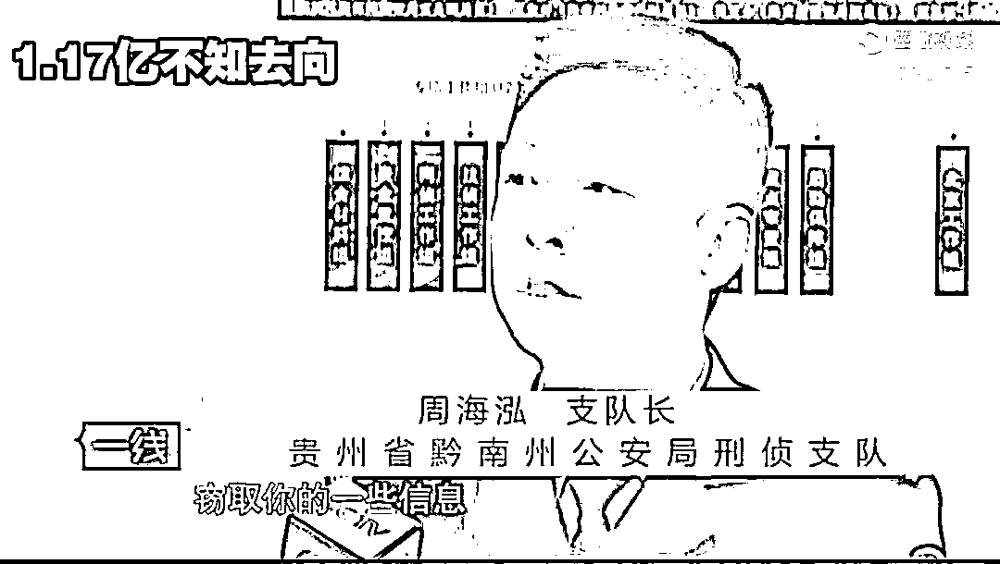
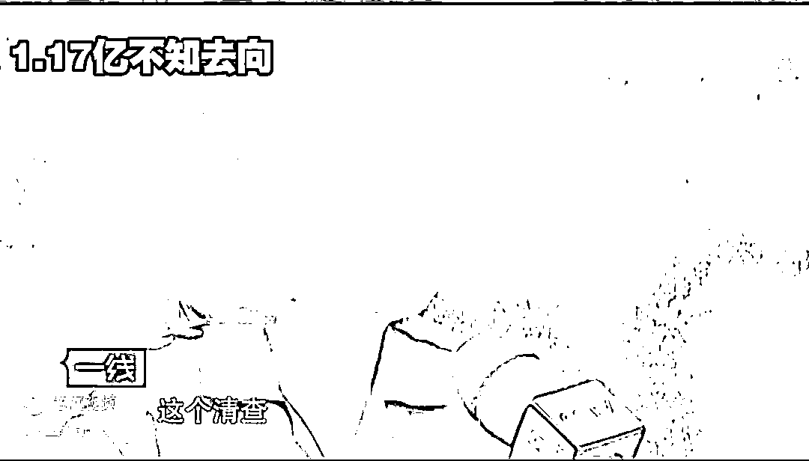
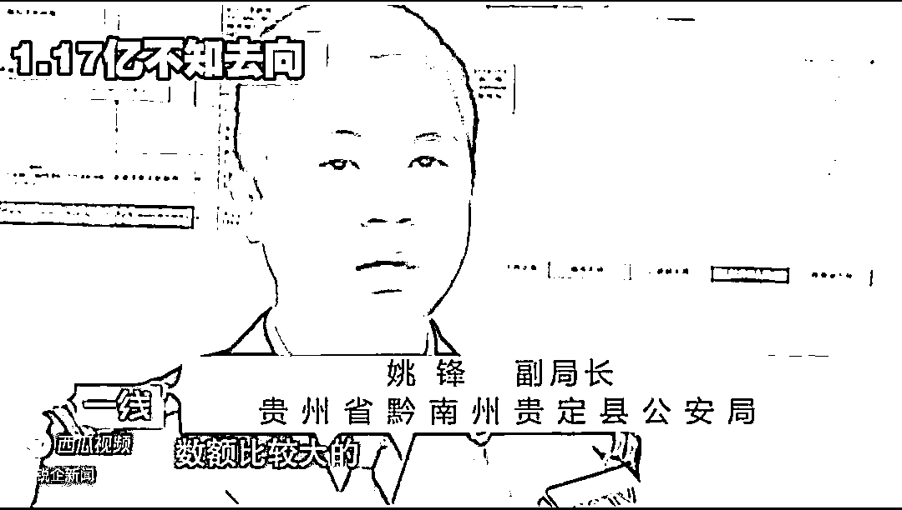
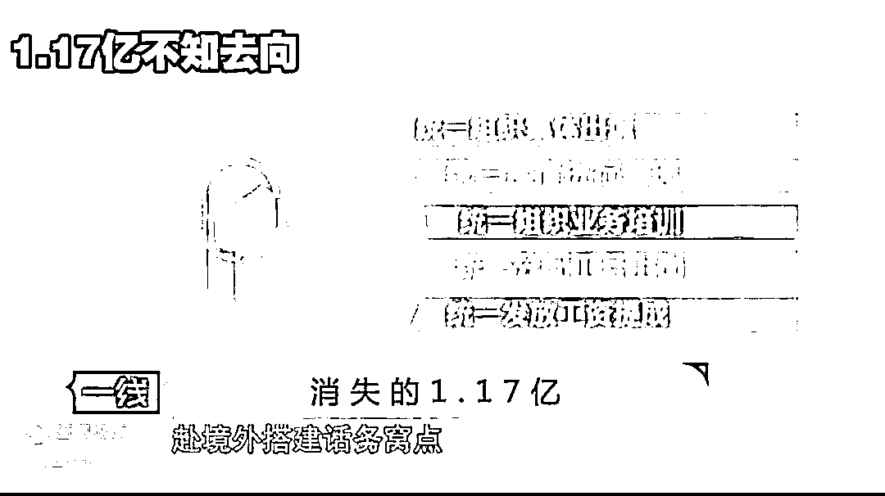

# 被骗 1.17 亿，涉案银行卡 9000 多张......

> 原文：[`mp.weixin.qq.com/s?__biz=MzIyMDYwMTk0Mw==&mid=2247522748&idx=6&sn=ff472cf549ddfcb2e5ba2091cae2f16d&chksm=97cb5284a0bcdb922a55892b32189d8682e2aec05e30e40f2e0d454235037cafd831d8b8c5db&scene=27#wechat_redirect`](http://mp.weixin.qq.com/s?__biz=MzIyMDYwMTk0Mw==&mid=2247522748&idx=6&sn=ff472cf549ddfcb2e5ba2091cae2f16d&chksm=97cb5284a0bcdb922a55892b32189d8682e2aec05e30e40f2e0d454235037cafd831d8b8c5db&scene=27#wechat_redirect)

[`mp.weixin.qq.com/mp/readtemplate?t=pages/video_player_tmpl&action=mpvideo&auto=0&vid=wxv_2097722340888346626`](https://mp.weixin.qq.com/mp/readtemplate?t=pages/video_player_tmpl&action=mpvideo&auto=0&vid=wxv_2097722340888346626)

“

支队长周海泓：有时候叫你输验证码的时候，实际上他就在窃取你的一些信息密码，还有什么等等的这些东西。

2015 年全国发生的电信诈骗案

**达到了 59 万多起**

**被骗走了 222 亿元**

这两个数字让人触目惊心

那么在类似电信诈骗案中，该如何识别呢？

**受害人杨兰（化名）：****他就说是农行法务部门的。**然后就是说我办了一张信用卡，在上海办的信用卡，然后他还把信用卡的姓名，还有我的身份证号码，还有金额，还有开户的时间都跟我说了，开户地点也跟我说了，我说我没有去那边，没有去那边办。他说，那如果你的确没有办的话，那就说明你的信息肯定会泄露了。那你赶紧报警。

自己的个人信息怎么会被泄露？正当杨兰一头雾水的时候，电话里自称唐勇的人很热心的提出可以帮助杨兰把电话直接转到上海松江公安分局。

**受害人杨兰：**那我就相信他了，然后他就直接跟我转接过去。实话告诉你，现在你涉案的情节重大，冻结管制令就是要冻结你名下的所有资产，包括动产不动产，时间 18 个月，为什么要冻结？因为你现在涉及到的是一个跨国际的诈骗案件，他说他们在公安系统里面查到，我又涉嫌一个和刘磊合伙的一个跨国诈骗的一个案子。我一天我就急了，我说我信用卡的事情我都还没有解决，怎么又冒出来一个我和其他人合伙诈骗的事情。

检警单位自然可以怀疑你名下账户资产都是诈骗所得，先行冻结起来，一方没有脱产之嫌疑。这些突如其来的问题砸的杨兰头晕眼花，于是拨打 114 查询上海松江公安分局的电话号码。而正当杨兰按照查询结果拨打过去的时候，**他的手机再次响起来电显示和自己通过 114 查询到的是同一个号码。**通过租用的国际线路使用任意一个改号的软件，通过投传电话打了个电话给郭俊华队长，转到了检察院。

杨兰和一个自称孙检察长的人，断断续续进行了三个小时的通话，依然没有洗脱自己的嫌疑，难道自己真的要被关起来？就在杨兰魂不守舍的时候，那个自称公安局的何群又打电话过来，他给杨兰发了一份传真信息，让杨兰确信自己真的被卷入了违法犯罪的案件中了。在调查之前，我有事情，需要先跟你说好。因为目前这个案件中央政府也特别盖章。此案件在调查的期间是不能对外公开，包含你的家人、亲戚朋友、爱人，谁都不能泄露。所以我要你现在跟我保证，你不会将这个案件的内容，没有经过检调单位的允许擅自的宣扬散播出去，能够做到吗？

**受害人杨兰：****能，他说你搞财务的，那你们单位的账户，我们也怀疑你用单位的账户来洗钱。**他说我们只有通过清查的方式，那你这个清查，他是说这个清查，只有孙老师，扬言口中的孙老师，就是所谓的孙检察长。他说你要找一个安静一点的地方，然后电脑网络好一点的那个地方，那你最好建议你最好去宾馆，你就跟会计说，我想跟你借用一下 U 盾，做一个清查程序，看一下账目的情况。她让我就写了借条给她，我写借条给她，后面她就借给我了。孙检察长告诉杨兰，他必须带着所有的银行卡和 U 盾做一个财务清查。

“

副局长姚峰：数额也比较小的，就是通过自动取款机取款，，数额比较大的。比如像我们这个案件，数额比较大，一般 U 盾进行转账。

**受害人杨兰：**他在电话里面跟我讲，你不要把密码账号说出来，你尽管输进去就行了。我们是不会知道你的密码的。**看到最高人民检察院的网站上，个人贴着自己的电子通缉令。**杨兰顿时吓呆了，对电话里的孙检察官的话更是言听计从，开始按照对方的口令，点击下载相关软件，插入自己持有的单位资金 U 盾，配合执行所谓的清查程序。 

通过银行流水发现他那个转账的速度特别快，一分钟达到了 10 笔账户，十笔转款。这个是人为操作是不可能的，人为操作不可能。我们估计这个上面应该被一些电子手段，或者是木马操作。杨兰**配合这样所谓的清查持续了一个星期，周一的时候不是说也准备还去进行清查**，去了宾馆楼下的时候，农行就打电话给我，然后就跟我说，你们的那个账户是怎么会有 5 万的转到个人账户绑定银行转了好多笔。安了一定的插件，教她进入连接的一个网址，就是把资金往里面转，实际上这些都是诈骗集团。

最后他提供的账户就干，我就想干脆我就把这个东西直接带到上海中央分局。

第一个是我直接现场跟他们清查。第二个，我直接只知道结果，我就是这样想的，所以我就直接奔到那边去了。然后可能我们就问他到上海是干什么，他说，因为，有上海公安机关，还有上海检察院说他资金有问题，叫他转到安全账户。

杨兰不知道的是，就在他前往上海的时候，贵州警方也接到杨兰单位的报案，称财务主管杨兰已经失踪好几天。两个对公账户的资金 1.17 亿元也被转走。

**受害人杨兰：**我当时我真的无法解释，但是我自己真的像中毒一样，我也不知道自己怎么会去做这种事情，不知怎么办。经过侦查，警方发现犯罪嫌疑人所用的通讯手段是通过网络电话平台进行拨叫。**而且这个网络电话平台加装了改号软件，可以在被害人的电话上显示出他们所冒充的通检法机关的电话，骗取被害人的信任。**贵州警方和上海警方核实确认这是一起典型的电信诈骗案。由于被骗金额特别巨大，公安部将该案列为督办案件。

贵州省公安厅成立专案指挥部，抽调五百多名警力全力侦破此案。2016 年 1 月 13 日，专案组开始分阶段实施收网行动。把手放到头上，放头上，一只手放到头上。警方在搜查犯罪嫌疑人住所时发现了一段录音：现在这个案件是我负责的，一会儿我问你什么，你只要将对于这个案件所知道的事情如实汇报，不要有撒谎、隐瞒的行为发生。这本是嫌疑人准备在培训时使用的，没想到案发后却成了自己涉嫌诈骗的罪证。其中主要的犯罪嫌疑人这几个台湾人，**他们在国内统一招募话务人员，统一办理出国手续，统一组织集体出境，统一食宿进行管理，统一组织业务培训，统一分配功耗上岗，统一发放工资提成**，赴境外搭建话务窝点，运用远程操控等技术手段进取钱财。

**嫌疑人梁某：**确实，这一件真的是违背良心的事情。这个时间然后现在就觉得非常的，本来我们也不想这样办，事情已经发生了。有一个人拿了一张 A4 纸，就跟我们说，按让我们按照上面的内容，就按情景，然后转接到上面的去，我们是一号，然后就转到二号，其它的事情然后你就不要问了。

**受害人：**接下来的事情你们就不要问了，只要我每通一次电话，他都会跟我说，**这是国家机密案件**，案件涉及到公安人员在里面参与，这些地方干部也在参与。所以我就可以说在对针对这个事情，我就是高度紧张。

**一线是谁，二线是谁，三线是谁，诈骗的多少钱？**

一线的话就是接到受害者电话以后，类似客服询问而已。然后问了以后跟受害人讲，说你的东西是不是被人家盗办、利用之类的，然后再转到二线去。二线再冒充公安，所谓的警察就是诈骗公司继续对杨行兰骗的二线话务员。当发现杨兰已经开始上钩之后，电话里的警察就会说，因为案情重大，要把电话转给专案组的检察官，**而这所谓的检察官，实际上就是诈骗公司的三线话务员。**

在推测受害人已经开始半信半疑之后，骗子就通过严厉强硬的语气震慑并控制受害人。为了最大限度的追回资金，专案组在公安部协调和北京市公安局的大力支持下，迅速开展紧急止付和快速冻结工作，**共冻结涉案银行卡 9942 张，资金余额上亿元。**

**检察机关也已经对有关责任人员失职渎职行为展开调查，涉嫌职务犯罪的杨澜等四人被逮捕。**

**反诈民警提醒：**

首先，公检法在办案的时候，**是绝对不会通过电话对案情进行甄别或者侦讯，也不会通过电话透露案情的进展情况，更不会在网上公布发布逮捕令。**

大家只要牢记这一点，就能让骗子无法实施下一步的骗局，在果断的挂断电话的同时，您可以记下电话号码或者是账号向警方报案。

来源：央视新闻、天下有诈、昆明反电信网络诈骗中心

← 向右滑动与灰产圈互动交流 →

