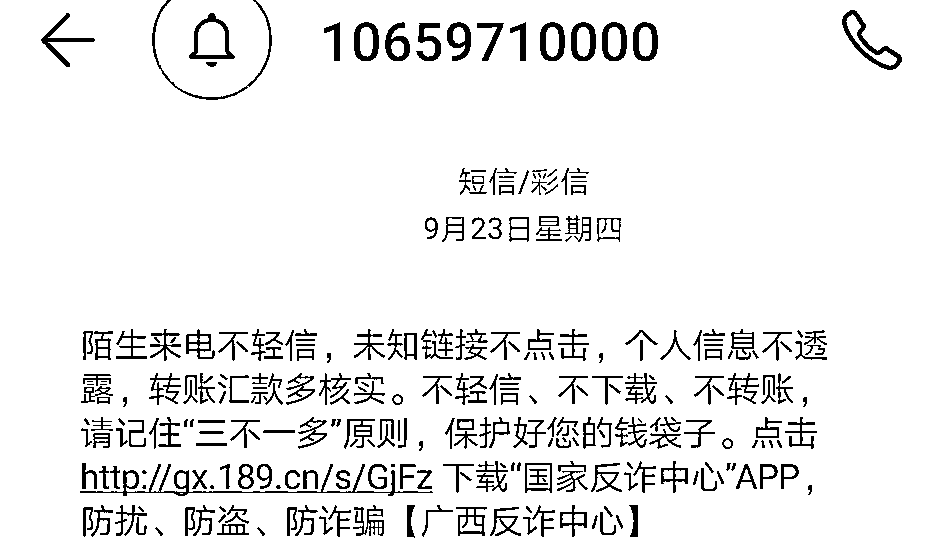
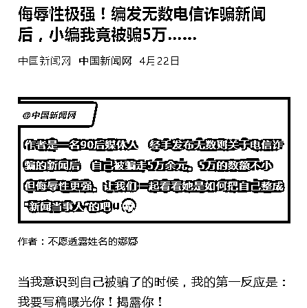
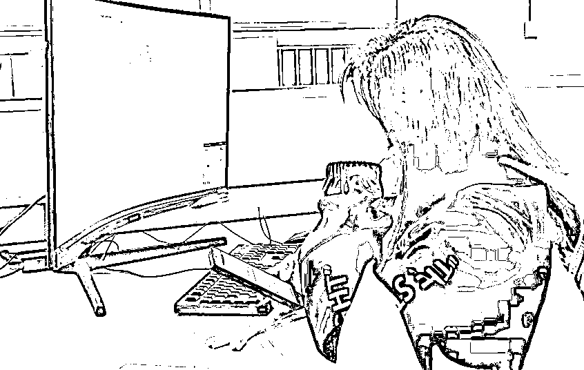
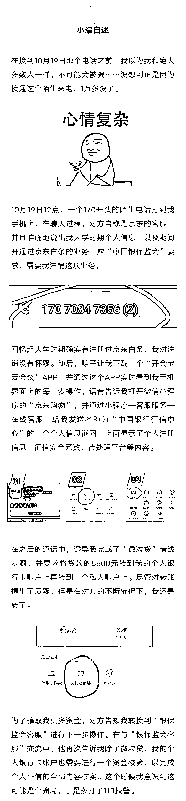
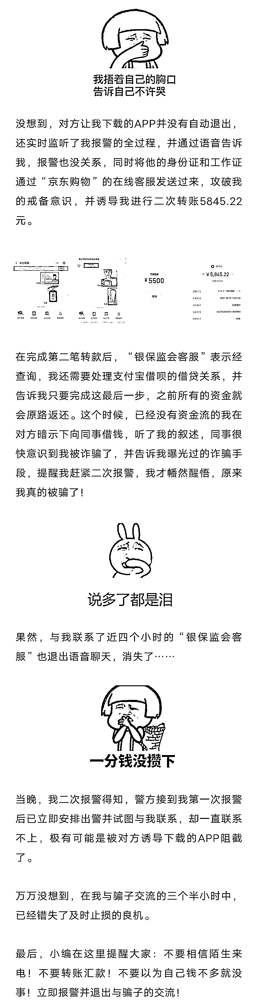

# 伤害性不大，侮辱性极强！反诈小编被诈骗 1 万+

> 原文：[`mp.weixin.qq.com/s?__biz=MzIyMDYwMTk0Mw==&mid=2247522875&idx=4&sn=2b13d0bf0e30a5021ea425e0660d1dff&chksm=97cb5103a0bcd81507fb5785f5ff2ef462ac78680ca6c036739c752b3a6c8bcc0e91a830d75f&scene=27#wechat_redirect`](http://mp.weixin.qq.com/s?__biz=MzIyMDYwMTk0Mw==&mid=2247522875&idx=4&sn=2b13d0bf0e30a5021ea425e0660d1dff&chksm=97cb5103a0bcd81507fb5785f5ff2ef462ac78680ca6c036739c752b3a6c8bcc0e91a830d75f&scene=27#wechat_redirect)

作为一名新闻媒体人 

看过无数电信诈骗案例

也收到无数条反诈短信 

内心笃定自己不会上当受骗

也一度怀疑为何他人会被骗

万万没想到

继中国新闻网小编被骗 5 万元

5 个多月后

10 月 19 日

桂林晚报 95 后小编也成为“局中人”

被骗 1 万多元

此次事件的当事人小编

遭遇人生滑铁卢

希望大家多点关怀之余

秉承着职业素养

以及作为其中一个案例

“血的教训”

在这里特别告诉大家

**谨防不明来电 千万不要上当**

**现在！立刻！马上下载国家反诈骗中心 APP！**

来源：桂林晚报，阻击诈骗

← 向右滑动与灰产圈互动交流 →

