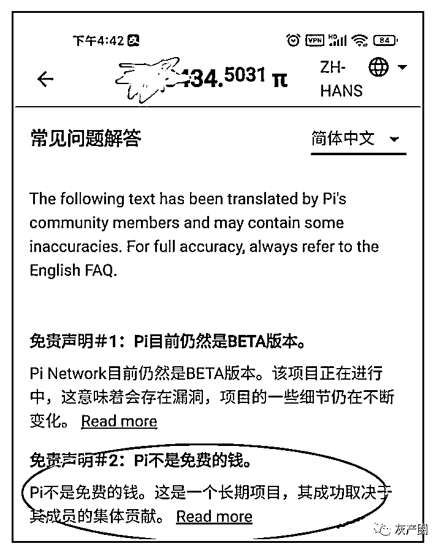
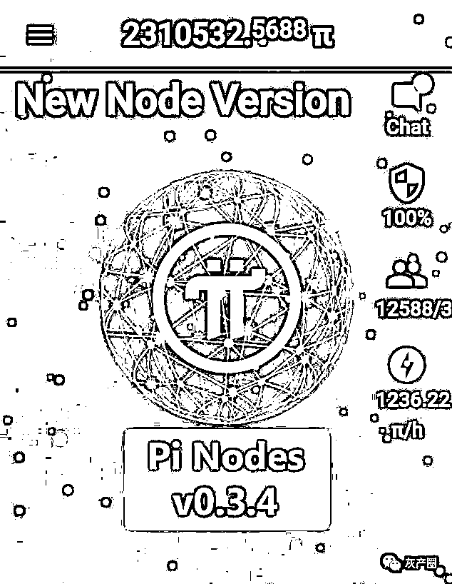

# 我只是挖个币，怎么抓我去坐牢！！！

> 原文：[`mp.weixin.qq.com/s?__biz=MzIyMDYwMTk0Mw==&mid=2247522875&idx=7&sn=82aa2bc31084c30b7ed241f4f098bbd1&chksm=97cb5103a0bcd815beb392775d009373aa966cdb1b1d3904c0462b164031c676ef6b478394a7&scene=27#wechat_redirect`](http://mp.weixin.qq.com/s?__biz=MzIyMDYwMTk0Mw==&mid=2247522875&idx=7&sn=82aa2bc31084c30b7ed241f4f098bbd1&chksm=97cb5103a0bcd815beb392775d009373aa966cdb1b1d3904c0462b164031c676ef6b478394a7&scene=27#wechat_redirect)

有人说现在挖矿都不敢挖了，怕进去坐牢。

这句话也没错，毕竟在国内挖矿是违法的，但是有部分人还挖的火热，为什么？因为他们搞的是所谓资金盘挖矿，根本不需要什么算力，都是系统每日自动分发的空气币。

今天有则新闻，不知道大家看了没，江苏警方破获一起算力挖矿案，挖的就是 P 币，也是操盘手自己研究出来的，这些人假借售卖算力（挖矿设备挖出虚拟币的能力），以“高收益、推荐返利”为诱饵引诱被害人投资、发展下线，打造传销网络，获取非法暴利。

花钱获得算力进行所谓的挖矿，利用动静态收益来传销吸引人来参与，空气币都没有上线，操盘手等人就被抓，涉案金额达到 5500 万，而且法院判决操盘手秦超等 6 人构成组织、领导传销活动罪，**判处五年三个月至一年四个月有期徒刑，并处罚金若干，追缴全部违法所得。**

搞盘子不就是这样，你搞的再好，圈的钱再多，还不是被抓后追缴全部违法所得，而且还要受到法律的制裁。这不就是所谓的得不偿失。 

既然说到了这个 P 币，那就再来说下 PI 币，曾经无数的 Pi 参与者幻想自己主网上线能成为百万千万富翁。现在是不是还在做这个梦。这个 pi 币就是一个屁。还真有人把他当香窝窝了。 

pi 友们有没有注意到这个免责声明，之前是不是没有，大家都在期待 pi 币给你们送钱，你认为可能吗？人家也说了，pi 币不是免费的钱，其能不能成功取决于成员的集体贡献。能不能明白这句话? 

幻想着主网上线，你们也无法直接兑换成钱，能不能玩下去就要看投资者愿不愿意拿钱出来去做贡献。是需要你们拿钱出来把盘子盘活。操盘手是需要你们把他们喂饱，而不是来成就你们。 

百晓生一直说，只要是免费的，大家不投钱，都可以玩玩，对自己也没什么损失。但是一定要记住，别上脑？别被一些有心人骗了去。为什么说这个，就是因为 pi 币最近有点疯狂，有些币友就是打着主网上线的名义，在疯狂私下卖币。一个价值上百元，有的还直接卖账号。有些被洗脑的币友就会上当。真以为上线开盘就上千元一个?

tmd 洗脑忽悠不懂的一些小白，几千个币卖几万块，这不就是纯纯的割不懂区块链的小白韭菜吗？

你们知道这币总量多少吗？其实就是一个数字，假如真上线交易，大家手里都是币，谁来接这个币，项目方吗？除非他是 sb，项目方不是慈善家，不是来普度众生的，更不是来拯救某些没脑子的穷 B 的，可懂？

哎，又说脏话了，主要是身边不是币圈的朋友也来问了这个 pi 币，看他意思还想买，讲了好久才劝下他。希望一些 pi 友别整天幻想，能零撸就拿着，花钱买一律不碰。

来源：资金盘排行， 百晓生道破盘界

← 向右滑动与灰产圈互动交流 →

