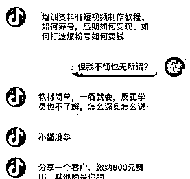

# 抖商培训套路：先教视频抄袭搬运，再教话术拉人头！

> 原文：[`mp.weixin.qq.com/s?__biz=MzIyMDYwMTk0Mw==&mid=2247522875&idx=8&sn=4eb9face3e23b6b2404e8f5447478763&chksm=97cb5103a0bcd8152539415358163023b55447dfb88504a9cebc6e520c47ca93bb3a7f3be693&scene=27#wechat_redirect`](http://mp.weixin.qq.com/s?__biz=MzIyMDYwMTk0Mw==&mid=2247522875&idx=8&sn=4eb9face3e23b6b2404e8f5447478763&chksm=97cb5103a0bcd8152539415358163023b55447dfb88504a9cebc6e520c47ca93bb3a7f3be693&scene=27#wechat_redirect)

错过淘宝、微博、公众号，还要错过抖商吗？

2008 年你错过了淘宝，2010 年你错过了微博，2013 年你错过了公众号，2015 年你错过了自媒体，难道 2019 你还要错过抖音吗？

如何一条视频涨粉 6 万，一天变现 3 万？

如何通过抖音三个月带货变现 300 万+？

在今年 3 月抖商大学举办的首届世界抖商大会上，美业公司昀尚集团董事长、抖商大学联合创始人

一条条直击人心的宣传语，让人满溢着想要赶上这波红利的冲动与热情。

“再也不相信什么抖商培训了。”4 月 9 日，胡翰（化名）在其所加入的“抖商培训 VIP 群”中提出质疑，很快，他发现自己被踢出了群。

“原本想学习如何在抖音平台上涨粉和经营账号。”一个月前，胡翰在网友的推荐下，加入一个有 70 多个学员的抖商培训群中。

但在支付 1600 元学费后，他很快发现，这些所谓的“培训专家”对抖音并不如其所说般精通，“感觉就是传统电商人员换了个皮，来骗我这种抖商小白的。”

一个多月前，任喜刷抖音时，无意间看到了一个励志博主的宣传语：

“加我微信，我带你赚钱。”

他在武汉打工做厨师，一个月忙里忙外能赚五、六千元，一听博主承诺会手把手教他入门，月入十万不是梦，就动了心。“这个社会，谁不想赚钱呢？”

博主告诉他，只需要交 1999 元，即可加入鸿鹰抖商教育社群，里面有很多人可以教他在抖音上赚钱。任喜就这样“拜了师父”。

最多 500 人的社群几乎满员，这样的社群已有 7 个。在群里，像任喜这样付了 1999 元的抖音“小白”还有很多，他们有的是普通公司的员工，有的是在车间打拼的工人，无一例外，他们都有一个迫切想要赚钱的心。

抖商，成为最近几年的热门词。抖音等短视频平台商业化的爆发，让抖商继微商之后开始活跃。有媒体将之形容为“3000 万微商大军涌入抖音”。

“资深导师一对一辅导”、“量身打造的教材”……诱人的广告和涌现的培训机构，让抖商们仿佛找到了成功方向。然而在支付了数千到上万元费用后，抖商们却发现效果远非预料般成功，甚至可能沦为机构拉取更多学员的下线。原本希望收割抖音红利，却被培训机构收割。

记者调查发现，抖商培训的套路，不少仍然是教你“抄袭”视频，微商式的拉人头入群，金字塔式的发展“下线”，而所谓的金牌讲师，也大有包装的成分。

“培训机构并不在意抖商是否能盈利。但当你打款的那一刻，他们是真赚到钱了。”4 月 14 日，从事多年网红营销生意的林静（化名）说。

微信里搜索“抖商”关键字，能得到超过 120 个微信公众号，除了抖商内刊等明显是由微商号改名而来的公号，抖商传媒、抖商公社等公众号均是利用公号引流做付费社群。规模较大的付费培训机构还有抖商大学、简说生活馆、鸿鹰抖商教育等。

闻风而动的还有各路微商。今年 1 月，互联网营销公司青山会创始人胡应邦在广州开办了“首届抖商节暨全球抖商联盟成立大会”，2000 多人的参会人员里，微商占了很大一部分比例。

卖保健品的、卖面膜的、卖电子产品的，还有做云商的，这些人有的尝过了微信红利，想要在抖音续写战绩，有的错过了微商风口生怕这回再次掉队，还有人想借机收割更多“小白”。

在朋友圈卖红糖的夏夏已经做了 3 年微商，她是“微商大咖”锋哥忠实粉丝。今年年初，看着锋哥团队新成立的“抖商公社”又推出了抖商课程，立马付了 399 元成为社员。夏夏的想法很简单：学会了之后，在抖音上发布红糖制作的视频，卖货效果肯定比朋友圈好。

“抖音火就想学啊”，一位云商从业者对我们表示，知识是无价的，想要赶上潮流就不能拿金钱衡量。他热切邀约，“我加入这个团队后已经赚出一套房的首付了。”

这些造梦者活跃于各类“财富群”、朋友圈和抖音里，这是想要快速致富的普通工薪族最常去的地方。造梦口号的引诱下，各路人员汇集。一场抖商收割战即将打响。

02

拉人头抽成，拉一个分成 40%-85%

事实上，戴斌并没有通过抖商赚到钱。1 个月前，他支付了 2999 元加入一家“抖商培训机构”学习发现，对方并没有任何干货，反而极力建议他通过“拉人头”获利。

“钱都给了，不拉人的话就亏大了。”戴斌无奈地向记者表示，“再说返点抽成还算高，拉到 2、3 人就回本了。”

在戴斌发来的抽成返点中，我看到其中清楚地标注着“每拉拢一个客户，就可分成 40%”。按照每笔学费 2999 元计算的话，他能从中抽成近 1200 元。

为了让戴斌显得更专业，“培训机构”要求他将微信头像换为公司专属的 LOGO，每天都必须在朋友圈发布十几条鼓吹机构、教材的营销微信。其内容大多为一些“月赚上万”的广告，以及彰显机构动辄数十万点赞、评论等截图。

之后，又添加了另一家抖商培训机构的微信。在交谈中，对方号称是“全国最大的抖商草根创业平台”，能帮助“0 成本创业”。同时表示“已聚集 14 位抖商高级创业导师，现有学员 1000 位，50%以上学员月薪 3 万-5 万。”

这一平台中学员分为 3 个等级。服务期限一年的初级学员费用为 1999 元，永久服务的中级会员费用为 2888 元，而高级会员则需支付 4980 元。

当我提出学费过高的质疑时，对方表示，“我们和其他机构不一样，都是真材实料。保证你每个月能赚几万元。”然而在记者咨询对方所谓的“真材实料”，以及和其他培训机构有何区别时，对方并没回答，仅是回复称：“加入会员你就知道了。”

据媒体报道，该机构同样是吸引人进群付费，并抽取拉人头回扣。进入社群 1999 元，每拉进一人可以分成 85%。这意味着学员拉 6 个人就可以拿到 1 万元。

在另一个名为“抖商学习平台”的公号中发现，其不仅按照收费标准将学员分为抖商达人、抖商大使、抖商天王、城市合伙人 4 个等级，每个等级能通过拉拢相应学员抽成获利，同时还能享受到“区域合伙人”等条件，进而招募更多的下线。

达人和大使可以通过“分享客户”获得较低比例的分成，以及拉人免费升级。

而其中可以缴纳 10 万元成为城市合伙人，不仅能享受“签约涨粉 100 万”的待遇，还能得到抖商学院副分院长牌匾，以及该城市 70%的利润。

并且拉新还能获得 60%-70%的提成，以及能以每人 3 万元的价格在城市区县招募代理商。

这就是典型的金字塔发展模式。上述电商业内人士分析，层层抽取相应比例的费用，而最底层的学员，为了‘捞回’成本，只能不断发展下线。

03

800 元买涨粉点赞刷评论“套餐”

除了抖商培训外，市场中还存在一些灰色服务。

“加蓝 V 的价格是 600 元。”4 月 8 日，一位自称能提供该项服务的机构人员表示，“这 600 元是给抖音官方的，只需要提供执照就行。”

在抖音方面，申请企业认证需支付 600 元/次（认证一年有效，认证账号需参加年审）的审核服务费用。

在表示需要开通更多服务时，对方很快发来一份详细的价格表，称能帮助开通直播权限，以及提供刷粉丝、刷赞、刷评论等服务。“开通直播权限 600 元，顺便送 60 秒长视频权限。”

在上述价格表中，记者发现刷上 1 万个粉丝的价格为 300 元，而 1000 条评论则要 200 元。

“你才入行的话，可以刷个‘1 万个粉丝+1 万个赞+1 万次分享+1 千条评论+10 万播放量’的套餐，仅需要 800 元就能让你的账号被更多人关注。”上述人士表示。

而后又联系上一家负责“抖商引流”的策划机构。当提出能否将所发布的内容进行官方推送时，该负责人称能实现这一行为，但必须得在前期支付一笔资金，“需要注册一个公司，走一个流程。（才能）跟抖音公司签订协议、合同。”

他同时表示可以提供“代运营”服务。“你来当甩手掌柜，我们来帮你运营，利润平分。可直接卖货、引流，成本较低。”

但实际上这一服务同样需要支付 5 万元作为首笔投资。其中 2 万为官方保证金，2 万为首次充值推广费用，1 万为合作签约费。“一方面可以卖货，另一方面可以持续抖音引流。这个是目前最稳妥的投资方式。”

代管看似轻松，但其中涉及账目、利润的猫腻太多。一不小心就容易被对方坑骗。而刷粉、刷评论这类灰色服务更是风险巨大，一旦被发现将面临封号的下场。

不论是拉人头的资本局，还是裂变式付费课程，都难免沦为一锤子买卖。大批微商涌入抖商圈，“如果只是学了拍抖音的技巧，那肯定不可持续。”强小明担心被人戴着“有色眼镜”看待。

虽然想扎实做培训，但夸大宣传似乎已经成了一些抖商培训机构的通病，看似比较正规的“抖大”也不例外。

抖商大学 3 月份举办的全球抖商大会，受到了颇多质疑。前期宣传中，抖商大学声称要给时代来一次“脑高潮”，拟邀一禅小和尚、杜子建、山村小杰等千万粉丝大 V 参会。报名参会即可获得“一般人没有悟透的抖音技巧”、“从 0 到 100 万的快速变现秘籍”。

抖商大学公众号 截图

做了几年片子的李波觉得有些坑，“教我们怎么用美图秀秀做图，格式工厂导视频，谁还用那些啊。”李波称，不仅拟邀的嘉宾基本都没来，会上讲变现的老师最后都开始在现场销售自家的紫砂壶和保健品。

有人直接喊道：“赶紧下去，花这么多钱听你讲广告？”很多人没有等到晚上的场次就匆匆离场。

对于质疑，强小明表示确实是第一次尝试，前期宣传有问题，让大家期待过高，他表示这只是一个“造势”的会议，并没有定位于培训，其实干货部分更多放在晚上的议程了。

抖商到底需要怎么样的培训？超过 130 万抖音粉丝的创业媒体蛋解创业创始人耿伟认为，能在抖音上带货才是变现的核心。这需要特定的 IP 属性，比如醉鹅娘这种卖货 IP，但像拍流浪大师吸了一大波粉的网红，他想要带货也是比较困难的。

能做培训的首要基础条件是自己能做起来抖音号，第二是能把自己的案例总结出方法论，并且可以复制这种成功。

在他看来，抖商培训的风口概念大于实操概念。“毕竟有数不清的韭菜想一夜暴富。”

来源：燃财经，巴蜀反诈

← 向右滑动与灰产圈互动交流 →

