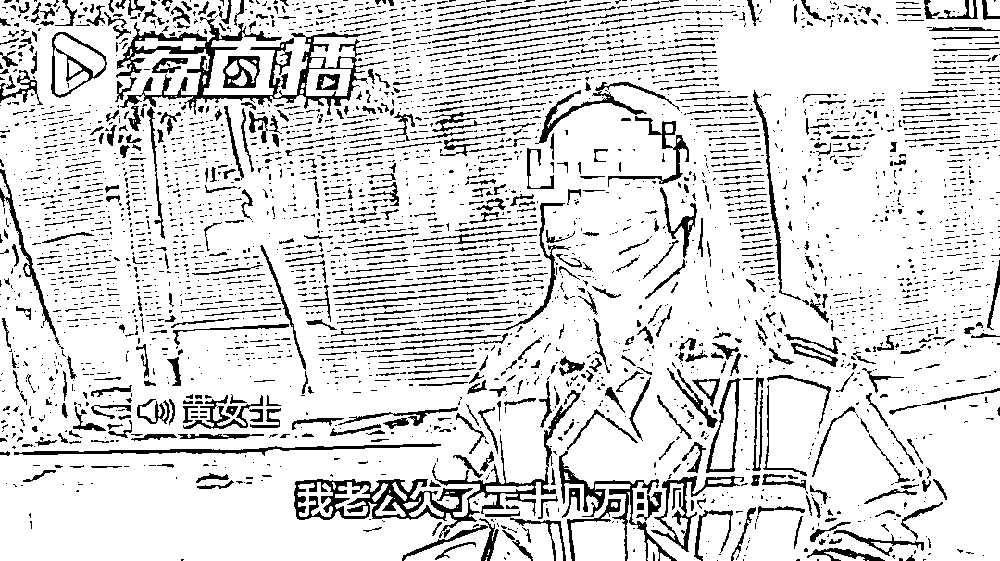
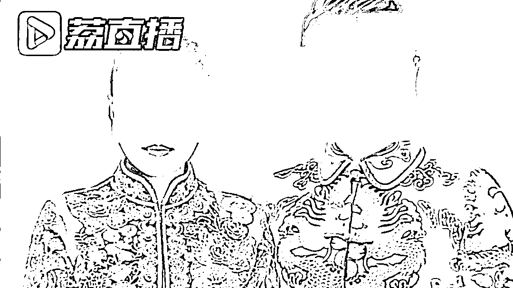
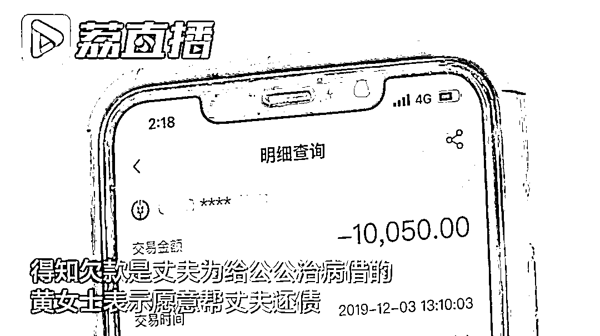
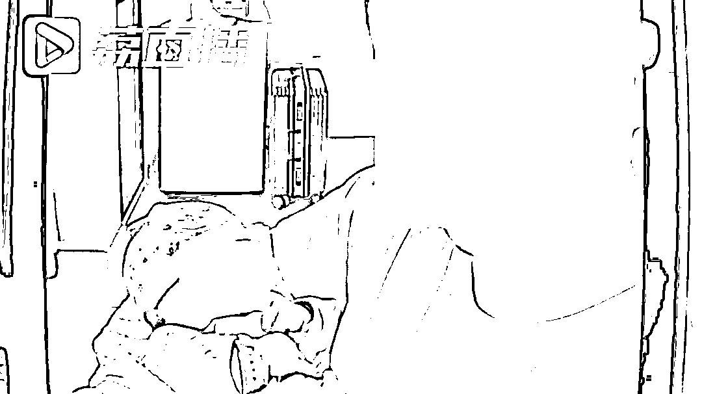

# 婚礼当晚得知丈夫负债 20 多万元！女子帮还清后，丈夫的做法让人愤怒

> 原文：[`mp.weixin.qq.com/s?__biz=MzIyMDYwMTk0Mw==&mid=2247522955&idx=6&sn=9e8405ba4b7c5b4923cf3930fab2e70e&chksm=97cb51b3a0bcd8a5eacc566f96361f196c911c0e1f562a1a25730cbc11de7fb2b58418df73f3&scene=27#wechat_redirect`](http://mp.weixin.qq.com/s?__biz=MzIyMDYwMTk0Mw==&mid=2247522955&idx=6&sn=9e8405ba4b7c5b4923cf3930fab2e70e&chksm=97cb51b3a0bcd8a5eacc566f96361f196c911c0e1f562a1a25730cbc11de7fb2b58418df73f3&scene=27#wechat_redirect)

在婚礼当晚，

妻子得知丈夫负债。

让妻子更难以接受的是，

她帮丈夫还完了债务， 

而婚后不到一年，

丈夫出了轨，随后联系不上了，

至今已经有大半年的时间。

[`mp.weixin.qq.com/mp/readtemplate?t=pages/video_player_tmpl&action=mpvideo&auto=0&vid=wxv_2106621282623520776`](https://mp.weixin.qq.com/mp/readtemplate?t=pages/video_player_tmpl&action=mpvideo&auto=0&vid=wxv_2106621282623520776)

近日，重庆一位黄女士找到记者称，自己两年前和丈夫认识之后不到四个月，就完成了婚礼，而且是奉子成婚。

婚礼当晚，沉浸在甜蜜当中的黄女士，突然受到了现实的打击。她的婆婆告诉她说，**黄女士的丈夫婚前欠了二十几万的账**。黄女士之前并不知晓这一消息，“当时就怀疑人生了。” 

黄女士得知，这笔欠款是丈夫在网贷平台上借的，用于给公公治病。后来公公去世，到结婚时，这笔钱没有还上。

黄女士想着自己怀了孩子，丈夫对她确实很好，“婚都结了，证领了，娃儿也有了，还是慢慢还这个账，好好过日子。”

 黄女士展示了多笔转账记录，表示自己在婚后多次向丈夫账户转账，用于帮丈夫还债。按照黄女士的说法，这些钱一部分来自于自己婚前的积蓄，还有一部分是自己向银行借的。黄女士告诉记者，**加上利息，她一共帮丈夫还了三十多万元的债务**。

欠债已经还清，女儿也健康出生。黄女士本以为接下来的婚姻生活能平顺。然而让她没想到的是，2020 年下半年，生活再起波澜。

“**女儿接近三个月大的时候，我就发现我老公出轨了**。”黄女士告诉记者，女方给她丈夫打电话，被她接到了。“我老公也承认了出轨了，不想和我过了，想跟我离婚。**我想，你要跟我离婚可以，把钱还给我**。”

对此，记者也咨询了律师。律师表示，丈夫在婚前负有个人债务，妻子本没有义务帮忙还债。**如果妻子能证明是使用了婚前个人财产帮丈夫还债，那么可以主张要回这部分钱款**。 

黄女士说，要钱的事还没有掰扯清楚，又突生变故。**从 2020 年底开始，丈夫再也没回来，如今已经失去联系大半年了**。“电话不接，号码已成空号，微信也不回，找不到人，完全失联了。”

黄女士说，她还联系了丈夫的出轨对象，对方表示已经分手，没有保持联系。记者又采访黄女士的婆婆询问她儿子的去向，对方表示自己也不清楚儿子在哪，为何不回来。

目前，黄女士的女儿由黄女士的婆婆带着。黄女士表示，如果接下来仍旧联系不上丈夫，她打算去法院起诉离婚。“**这个钱他到底是还我还是不还我，我都希望他出来给我一个说法**。”

由于联系不上黄女士的丈夫，相关情况，目前还无法进一步核实。黄女士说，当初和丈夫认识时间不长就结婚了，对丈夫了解得不够，后面发生的事情，也让自己重新看待婚姻。婚姻是人生大事，不该草率决定。但事已至此，她希望丈夫能出来面对，妥善解决好两个人之间的问题，也对家庭对孩子有个交代。

来源 ：江苏新闻

← 向右滑动与灰产圈互动交流 →

