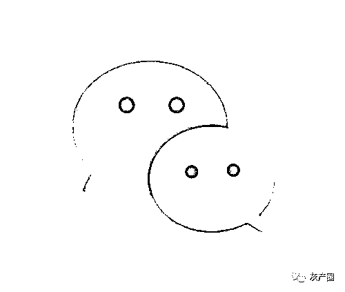

# 买卖微信号？法院：构成不正当竞争，判赔 109 万

> 原文：[`mp.weixin.qq.com/s?__biz=MzIyMDYwMTk0Mw==&mid=2247522955&idx=8&sn=4ea3b2760b1ef71465c7fb5ffeba0b2d&chksm=97cb51b3a0bcd8a51bb14e88ca96d91de38d63760343b873ea8e742496be353105f3fc6e1b3a&scene=27#wechat_redirect`](http://mp.weixin.qq.com/s?__biz=MzIyMDYwMTk0Mw==&mid=2247522955&idx=8&sn=4ea3b2760b1ef71465c7fb5ffeba0b2d&chksm=97cb51b3a0bcd8a51bb14e88ca96d91de38d63760343b873ea8e742496be353105f3fc6e1b3a&scene=27#wechat_redirect)

“国内 15-30 天实名微信号！”

“带支付！10 个起拍”“大量出 VX 号”出租微信号的广告你可能见过 像这样明目张胆买卖微信号的你见过吗"

《腾讯微信软件许可及服务协议》中明确规定，微信帐号所有权归腾讯公司所有，用户仅获得微信帐号的使用权，且不得通过赠予、借用、租用、转让或售卖微信帐号或者以其他方式许可非初始注册人使用微信账号。

"然而，某网站却公然开设交易专区，为微信帐号、微信辅助注册、微信辅助解封的交易行为提供信息发布场所和交易服务。近日，全国首例微信帐号交易的不正当竞争案件一审落定。南京市中级人民法院公布腾讯诉该网站的经营者江苏某网络科技公司买卖微信号案一审判决结果——该网络科技公司**构成不正当竞争，赔偿 109 万元**，并在网站首页刊登声明以消除影响。根据国家法律要求，使用互联网服务必须进行帐号实名认证。为了绕过监管、规避风险，犯罪分子往往会购买他人的帐号**用于实施诈骗、赌博、发布色情低俗信息**等恶意行为。该公司为微信帐号买卖等交易提供平台，并从中收取大量买卖费用和交易佣金的行为，不仅对微信平台生态环境造成负面影响，更是间接地为微信号买卖背后的灰色产业链提供了滋生的土壤，使微信用户面临更多潜在的风险和负面使用体验，严重损害了微信用户的合法权益。**买卖微信号会造成哪些危害？**

大量微信帐号的交易，为发布虚假广告、垃圾信息、低俗违法信息等恶意行为提供了便利条件，对正常使用的用户造成骚扰，破坏网络平台的生态平衡和安全运营。

非法购买的微信帐号容易被犯罪分子利用，用于网络诈骗、违法交易，助长了违法犯罪的发生。同时，加大了警方对于罪犯的追踪抓捕难度。

微信帐号包含用户的个人社会关系、图像照片、家庭住址等私密信息，售卖个人帐号可能损害用户的个人信息安全和合法权益。

为保护微信用户合法权益不受侵害，微信团队对各类违法违规行为一直**坚决处理，绝不姑息**。帐号交易及恶意注册等行为给各类违规行为提供了作恶最基本的帐号资源，更是我们明确打击的对象，后续也将继续保持严厉打击。同时，我们也希望广大用户珍惜自己的帐号使用权，不要把个人使用的帐号出售给他人。出售微信帐号不但本身就违反了微信软件的使用规定，可能导致封号等处罚；更存在极高的安全风险，导致个人隐私信息泄露、被冒名顶替贷款借钱等；严重的还会沦为违法犯罪活动的帮凶。来源：微信 110

← 向右滑动与灰产圈互动交流 →

