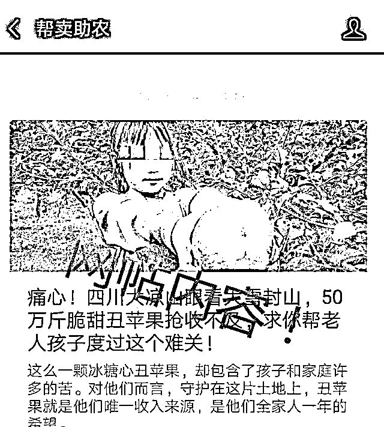

# 永久封禁！永久关闭！

> 原文：[`mp.weixin.qq.com/s?__biz=MzIyMDYwMTk0Mw==&mid=2247523021&idx=3&sn=df41816b31075692c2bf822ee961b04c&chksm=97cb51f5a0bcd8e3a02e4ba747cd6cc13ca8cadff456a522101ef2b51e01ec37daa0e1bfd6f5&scene=27#wechat_redirect`](http://mp.weixin.qq.com/s?__biz=MzIyMDYwMTk0Mw==&mid=2247523021&idx=3&sn=df41816b31075692c2bf822ee961b04c&chksm=97cb51f5a0bcd8e3a02e4ba747cd6cc13ca8cadff456a522101ef2b51e01ec37daa0e1bfd6f5&scene=27#wechat_redirect)

为了博取眼球 

竟然有人抹脏小朋友的脸

故意在破旧房屋前摆拍

发布所谓的

“凉山儿童贫穷无助”视频

并恶意传播收获流量

**还有人故意“卖惨”**

**收获流量获取利益！**

每年 8 月至 10 月，是四川会理石榴上市的季节。一些石榴“滞销”“几毛钱一斤没人要”的**卖惨视频**也开始出现在一些主播、网红的视频中。

四川会理石榴今年遭遇“悲情营销” 视频截图

而在当地多部门的调查中，卖惨短视频中的画面、声音系拼凑制作，与事实不符，涉嫌发布虚假信息。**目前，因“卖惨带货”，已有 5 个账号永久封号，18 个作违规处理。**

**10 月 26 日，记者从凉山州市场监督管理局获悉，针对近期网络上频繁出现的“卖惨”式带货、“悲情”式营销，凉山州市场监管局、州委网信办、州公安局等五部门联合印发《凉山州网络市场“卖惨”营销等虚假助农信息专项整治方案》，在全州范围内**开展专项联合整治。****

******5 个严重违规账号被永久封禁******

******18 个违规账号被扣除信用分******

****“几毛钱一斤都没人要。”今年 8 月，一些主播、网红在直播或者短视频中，声称会理石榴滞销、卖不出去。在一段短视频中，一名 80 多岁的老大爷头发花白，步履蹒跚地挑着两桶水，画面配文写道：“很多石榴都烂了，不如烂在地里当肥料了。”画面中，地上有一些裂开的石榴，同时配上了一段悲伤带着哭腔的声音。****

********

****会理石榴今年遭遇“悲情营销” 视频截图****

****记者了解到，视频中的老人叫王富贵，是会理市彰冠镇的村民。他向记者表示，他家根本没有种石榴，他在帮别人看守果园。**“那天，我在挑水浇园子的时候，有个年轻人拿着手机拍我，可能是那个时候拍的，我也不知道他拍来做什么，视频中的声音也不是我说的，我也没有哭”。******

******对此，有当地的网友及果农看到视频后，向相关部门进行了举报，多部门组成联合执法组进行核查。通过核查发现，视频中的老人确实存在，但是**短视频中的画面、声音是拼凑制作的，老人也没有说过视频中的话，文字上的表述与事实不符，涉嫌发布一些虚假信息**，扰乱了正常石榴市场的销售秩序。同时，会理市电子商务协会还发出《倡议书》，**呼吁大家遇到这种情况请积极举报。********

******会理市商务经济合作和外事局相关负责人表示，会理石榴并不存在滞销。后来，联合执法组人员找到了直播达人刘某，对其进行了教育。**刘某坦言，卖惨主要是为了引起网友同情而下单，以此获利。********

******对此，联合执法组将涉嫌卖惨带货的视频账户和 ID 发送给某短视频平台，**对 5 个严重违规的账号进行了永久封禁和永久关闭电商权限的处理，对 18 个违规账号进行了扣除信用分处理。********

********开展联合整治********

******自媒体营销渠道为主要监管对象******

****10 月 26 日，记者从凉山州市场监督管理局获悉，针对近期网络上频繁出现的“卖惨”式营销、“悲情”式带货，凉山州五部门联合印发《凉山州网络市场“卖惨”营销等虚假助农信息专项整治方案》（以下简称方案）。该《方案》要求，对名为助农销售，实则利用同情心的“套路”带货，在全州范围内开展专项联合整治。****

********

********

****2018 年有关盐源苹果的虚假营销****

****记者从凉山州市场监督管理局了解到，把雷波脐橙、金阳青花椒、盐源苹果、会理石榴、西昌葡萄等凉山农特产品作为品牌保护重点，以**微信视频号、抖音、快手等自媒体平台营销渠道为主要监管对象，**发挥“协同管网”的部门联动优势，做到早预防、早发现、早联动、早规范。****

****“在整治中，将**严厉打击网络营销中的‘卖惨’‘悲情’营销等涉及虚假宣传、虚假广告、不正当竞争的违法、违规及犯罪行为。**”****

****凉山州市场监督管理局表示，将保持高压态势，坚持常态化监管，坚决遏制虚假助农营销乱象，创建公平、公正、清朗的网络经营环境。****

******新闻延伸：** **谎称帮哑巴母子卖苹果获利 29 万******

********抖音号“韩文团队”负责人被行拘 7 日********

****记者调查了解到，这类“悲情营销”等虚假助农的模式早已屡见不鲜。****

********

********

****“韩文团队”采用滴眼药水、掐孩子等手段，人为制造女孩流泪场面****

****今年 3 月，“韩文团队”以扶贫捐助、帮扶困难群众为名，从事网络直播带货。后经查，抖音号“韩文团队”由赵某某策划、指导“摆拍”，发布不实视频博眼球、吸粉，从事网络直播带货牟利。****

****日前，记者从凉山州公安局获悉，“韩文团队”采用滴眼药水、掐孩子等手段，人为制造女孩流泪场面，还谎称帮助哑巴母子销售家产苹果，实际销售的却是市场上的苹果。“韩文团队”只在这户人家买了几千斤苹果，但通过直播销售了几十万斤苹果，获利达 29 万元，赵某某个人分得 12 万元。目前，赵某某被依法行政拘留 7 日，谢某某、贾某某、王某某分别被依法行政罚款 500 元。****

******新华社：******

******“卖惨带货”的戏码该凉凉了******

****“卖惨带货”的戏码在不少网络平台反复上演。有媒体发现，“卖惨带货”背后有一条营销产业链，从演员到剧本，从营销到推广，都充满了“套路”。这种“卖惨带货”，打着助农的幌子，干的却是靠消费大众的同情心谋利的事。****

****“卖惨带货”乱象是如何出现的？前些年，因供过于求、信息闭塞等原因，确实有一些农产品陷入滞销困境，经媒体报道后，不少人慷慨解囊帮农民解了困。一些无良商家从中发现“捷径”，开始作假“卖惨”，进而形成“套路”。****

****从我们耳熟能详的“老板带着小姨子跑了，我们拿着钱包抵工资”，到社交平台上常见的“困苦老果农故事”“卖茶女骗局”，各种骗局让人防不胜防。颇具讽刺意味的是，有一些骗子作假都不走心，有些人谎称水果“滞销”，用的甚至是同一位果农的照片。****

****细心的网友发现，很多“滞销产品”的宣传页面，竟然用了同一位大爷的照片。有人戏称：产品全滞销，大爷不够用。****

****“卖惨带货”看似一本万利，却在客观上破坏了社会互信。网友为“老果农滞销”买单，为“卖茶女”付费，一般是出于内心深处的善良以及对主播的信任。如果真相大白，扯下“卖惨带货”的遮羞布，消费者还会为这些“悲惨”买单吗？一旦消费者对类似行为有了戒备心，就算碰到真人真事，可能也不会再信。这些主播长年累月积累的信用，也将被击碎。****

****近几年，短视频给扶农助农带来了新的可能。特别是疫情期间，短视频直播带货拓宽了农产品销路。相比之下，演出来的“卖惨带货”，有如害群之马，给发布平台甚至整个营商环境、相关产业的伤害都不可逆。****

****以石榴销售为例，当某地石榴“滞销”的信息频频在网络热传，可能引发一些果农恐慌、集中抛售。依靠“卖惨带货”，主播挣了钱，牺牲的却是果农。****

****刻意演出来的“卖惨带货”，本质上就是一种欺诈。对于这类行为，相关平台不应坐视不管，任其逍遥，要给意欲效仿的人传递清晰的信号；有关职能部门有必要加强监管，对演出来的“卖惨带货”乱象及时给予惩处。****

****实践证明，带货营销远不止“卖惨”这一条路。“卖惨带货”是饮鸩止渴，是“一锤子买卖”，无法长久。只有对消费者负责，诚信经营，才会让消费者在“买他”过后不会“踩他”。****

******你有没有刷到过“卖惨”视频？******

****来源：红星新闻、成都商报、新华社、广州日报，巴蜀反诈****

****灰产圈在线客服****

********

****← 向右滑动与灰产圈互动交流 →****

********