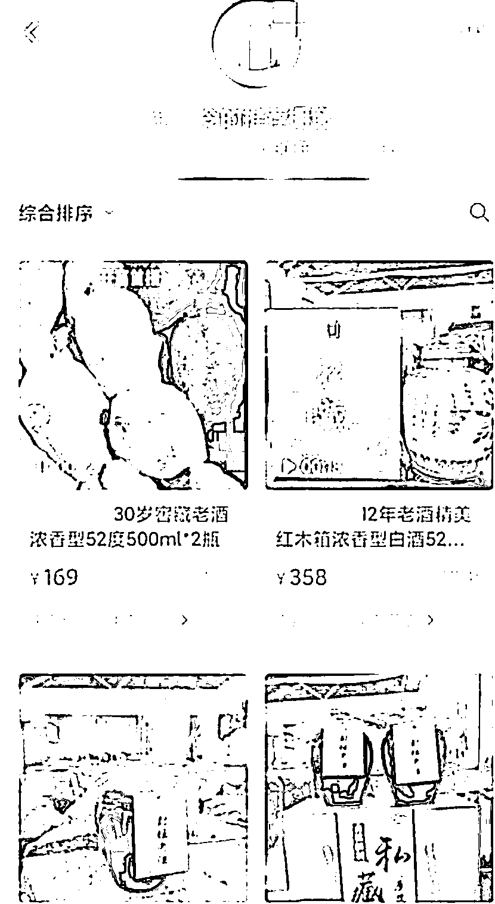
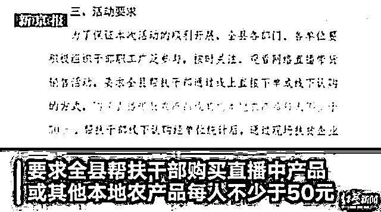
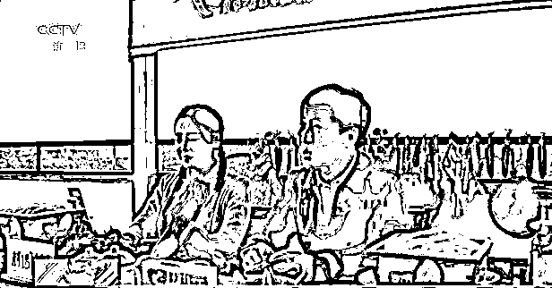
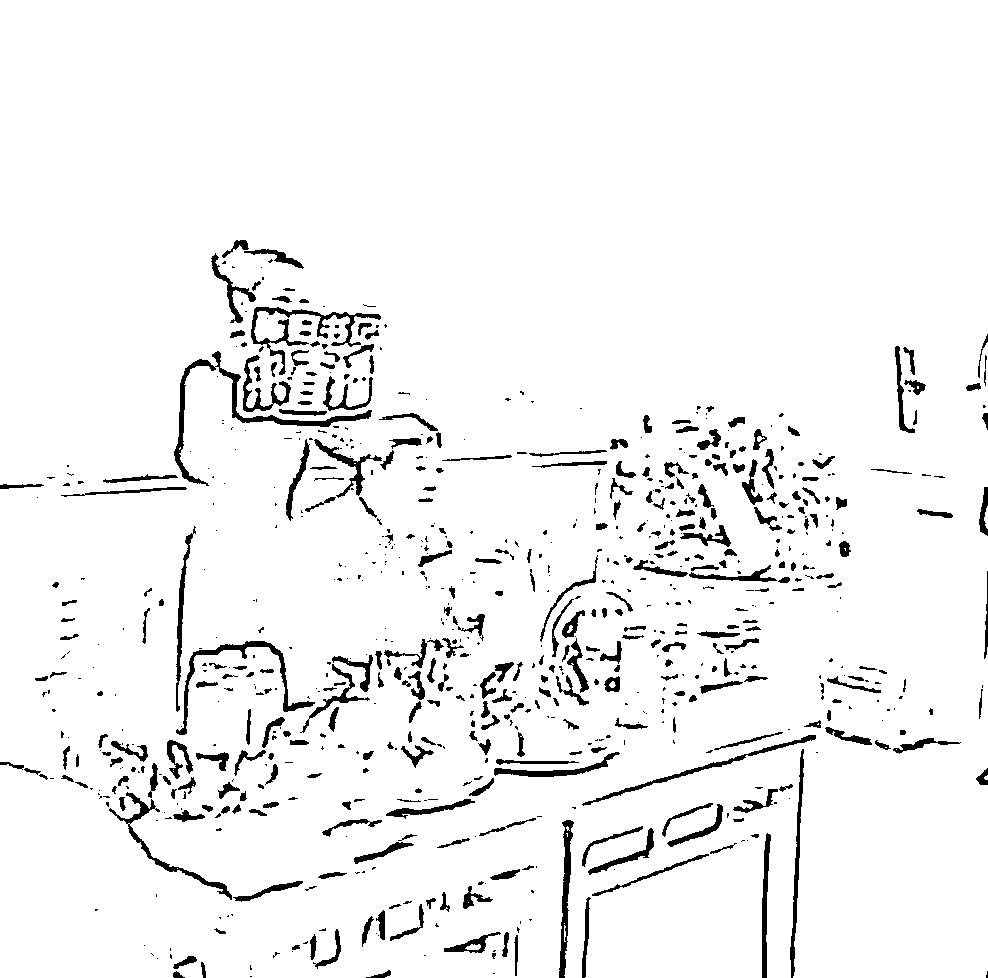

# “我违纪但不违法”，城管干部被曝上班带货

> 原文：[`mp.weixin.qq.com/s?__biz=MzIyMDYwMTk0Mw==&mid=2247523021&idx=4&sn=5815acc621fc1ba7505b15992420dce6&chksm=97cb51f5a0bcd8e3fbf8018983545c1e699aabfed1a96eef0a46e66cddf308664c51ca03248b&scene=27#wechat_redirect`](http://mp.weixin.qq.com/s?__biz=MzIyMDYwMTk0Mw==&mid=2247523021&idx=4&sn=5815acc621fc1ba7505b15992420dce6&chksm=97cb51f5a0bcd8e3fbf8018983545c1e699aabfed1a96eef0a46e66cddf308664c51ca03248b&scene=27#wechat_redirect)

**近日，江苏省徐州市泉山区城市管理局一副科长被曝在上班时直播玩游戏、带货卖酒。** 

更令人意外的是，直播时多次对疑似举报者爆粗口。

[`mp.weixin.qq.com/mp/readtemplate?t=pages/video_player_tmpl&action=mpvideo&auto=0&vid=wxv_2109105706439147522`](https://mp.weixin.qq.com/mp/readtemplate?t=pages/video_player_tmpl&action=mpvideo&auto=0&vid=wxv_2109105706439147522)

上班时间从事与本职工作无关的直播，还爆粗口骂人，这样的画风，与公职人员的身份对照，真是满满的违和。

一句“我违纪，但我不违法。”更是把其本人连带着部门形象一下扣到了负分。

但是否违纪违法，真的如这位副科长所说的那样吗？

工作时间直播带货，如果属于营利性活动，就涉嫌违反公职人员不得经商的相关规定。《公务员法》《事业单位工作人员处分暂行规定》等法律法规都明确了这一红线；如果是党员，还受到《中国共产党纪律处分条例》中关于公职人员不得经商规定的约束。

**有科长口爆脏话**

**有干部带货灌水**

发文搞摊派、亏本做买卖、雇水军拍马屁……

自欺欺人的浮夸作秀，变成了一种新的形式主义、官僚主义。

一些地方不仅让党员干部当观众，还规定了“最低消费额”；

有的地方“亏本赚吆喝”，以低于成本的价格搞促销，只管流量、销量好看，不管这笔买卖划不划算；

还有的地方搞“二次签约”“虚假下单”，把已完成的交易在直播时再演练一遍，或下单之后再退单……

直播带货变成领导的“魅力秀”，领导的个人风头远超农副产品的风头，如此带货带出来的产品，还能有什么味儿？

**干部直播带货**

**本来是件好事**

**1.**

在 2020 年 4 月的时候，湖北枝江农产品的销售计划因疫情被打乱。

为解决这个难题，市领导变身主播，向网友们推销枝江的玛瑙米、脐橙、马蹄和鱼糕等特色农产品。

**2.**

湖北宜昌秭归县县委书记直播带货不输网红，一天卖出四万公斤果农产品。

网友留言：“这才是真正的网红。”

**干部直播带货**

**要“立规矩”**

随着直播带货的兴起，一些地方官员也频频走进直播间，为当地特产或品牌商家“吆喝”。

这种义务、公益性质的直播带货，是值得鼓励的。

但前提是，不能掺杂私利，不能模糊了公与私的界限。

对领导干部开展网络直播活动“立规矩”，在网络直播真经被个别领导干部念歪的情况下，这种措施既必要又及时。

领导干部应该变成直播带货中有态度、充满热情、能说会道的新形象。

但无论如何 

都不该是像

徐州市泉山区

这位副科长一般

**吊儿郎当的形象**

来源：央视网综合极目新闻、澎湃新闻、央视新闻、湖北日报抖音号、新华每日电讯

灰产圈在线客服

← 向右滑动与灰产圈互动交流 →

