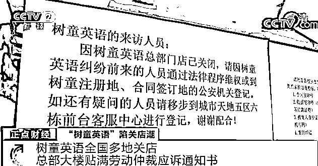
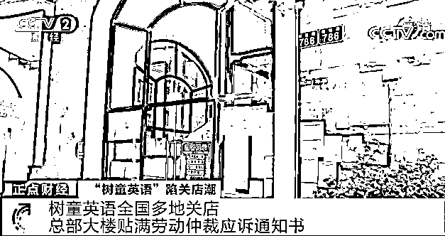
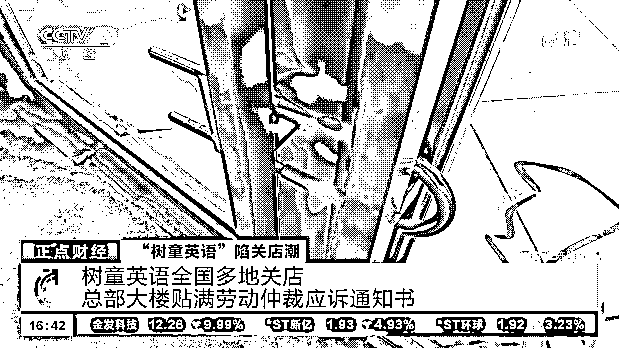
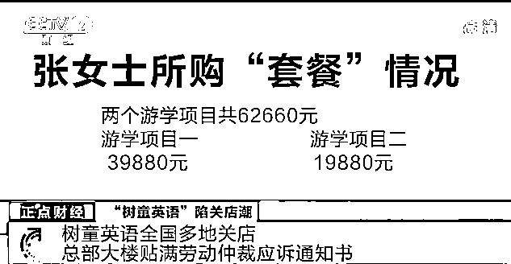
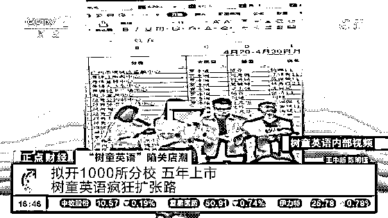
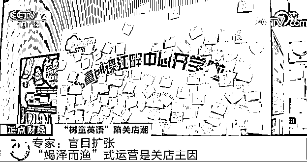

# 突然！这家全国连锁培训机构，掀起关店潮！

> 原文：[`mp.weixin.qq.com/s?__biz=MzIyMDYwMTk0Mw==&mid=2247523021&idx=5&sn=ebb6dbbc6021e3b11dc3c91a76dc3393&chksm=97cb51f5a0bcd8e3e39fd21750c97ddd59f94ae29b80805cf48fa1169f1643b1e043389e7525&scene=27#wechat_redirect`](http://mp.weixin.qq.com/s?__biz=MzIyMDYwMTk0Mw==&mid=2247523021&idx=5&sn=ebb6dbbc6021e3b11dc3c91a76dc3393&chksm=97cb51f5a0bcd8e3e39fd21750c97ddd59f94ae29b80805cf48fa1169f1643b1e043389e7525&scene=27#wechat_redirect)

近日，树童英语掀起了关店潮，全国校区几乎全部停摆，公司也因为债务纠纷被起诉。一个经营 20 多年，拥有 200 多家校区、在读学生 20 多万人的少儿英语培训机构，为什么在短时间内突然陷入这样的境地呢？ 

**树童英语全国多地关店 总部大楼贴满劳动仲裁应诉通知书**

[`mp.weixin.qq.com/mp/readtemplate?t=pages/video_player_tmpl&action=mpvideo&auto=0&vid=wxv_2108048955757363204`](https://mp.weixin.qq.com/mp/readtemplate?t=pages/video_player_tmpl&action=mpvideo&auto=0&vid=wxv_2108048955757363204)

△央视财经《正点财经》栏目视频

记者在走访广州多家树童英语校区时发现，这些校区都处于关门的状态。记者随后也来到了树童英语的注册地址广州市番禺区福德路 786 号，据知情人介绍，这里往常人来人往，非常热闹，但如今已变得格外冷清，**大门玻璃上满满的公告书则是格外显眼。** 

大门上贴着各种各样的应诉通知书等，还有拖欠工资明细表，讨薪的最高金额超过 11 万元左右。 

**树童英语广州**江畔校区老师 余先生：**拖欠从 7 月 31 日开始，树童的工资，发放是在次月 28 日-31 日，所以我 6 月的工资是在 7 月底到账。老师工资只到账了 5000 元，相当于只得到账了一半，**他们顾问或者校长的工资还要更晚，而且比老师还更少。**所以我们感觉有点不太对劲了。** 

****

**这名老师提到的顾问，是树童的销售人员。除了被拖欠的工资以外，三万、五万元不等的“学习卡”的退费问题也让他们十分担忧。按照公司内部规定，工作满半年的顾问必须购买一种类似保证金但没有任何价值的学习卡，如果不购买“学习卡”，顾问的提成收入要打 6 折。除顾问外**，分校校长、副校长以及部分会涉及销售业务的老师也会购买“学习卡”。 **** 

****

****树童英语给员工发放的工资从今年 6 月就开始“打折”**，然而家长对此并不知情。**不少家长还在 7 月份购买了大额套餐**，张女士就是其中一位。7 月 11 日，张女士分别为两个孩子购买了价值 39880 元和 19880 元的两个游学项目。**

**根据协议，购买 39880 元的游学套餐后，在未出游前，张女士的大儿子可以在 4 年的协议有效期内，享有免费报读树童英语国际班课程的权益，每年 48 次课，每次 2 小时。期满如果未选择出游，套餐费用的 80%将返还给张女士。 **

****

**另外购买的 19880 元套餐，协议有效期为学生首次上课之日起至其初中毕业。根据协议内容，张女士只要为上幼儿园的小儿子每年再交 2980 元的学费，就能在 10 年内每年享受 40 课次的课程服务。期满如果选择不游学，也能返还套餐费的 80%。张女士认为很划算，就总共花费 62660 元购买了这两个套餐。让人没想到的是，**只有大儿子上了 5 节课，小儿子还没开始上课就收到了树童大面积关店的消息。 **** 

****拟开 1000 所分校 五年上市 树童英语疯狂扩张路****

 **[`mp.weixin.qq.com/mp/readtemplate?t=pages/video_player_tmpl&action=mpvideo&auto=0&vid=wxv_2108048097602764804`](https://mp.weixin.qq.com/mp/readtemplate?t=pages/video_player_tmpl&action=mpvideo&auto=0&vid=wxv_2108048097602764804)

△央视财经《正点财经》栏目视频**

**记者在采访过程中，不论家长还是老师，都对树童的课程及教学成果表示肯定。**树童英语的官网上，也透露着这家机构未来几年的愿景，“未来将在全国开设 1000 所分校，五年内登陆资本市场。”但就是这一美好愿景下的疯狂扩张，被内部人认为是树童英语走上末路的助推器。 ****

****

****树童英语广州某校区招生负责人 小雅（化名）：从 2017 年到 2021 年，店面数量一路上涨，开了 200 多家分店。他们运营的步伐是跟不上的，销售的味道越来越大。 ****

 ****这位分校负责人所提到的“销售味道越来越大”也得到了多位老师的证实。**为了扩大营收，不仅负责销售的顾问，平时上课的老师也经常被拉去“打榜”。 ******

******树童英语广州喜盈校区老师 邓女士：就是根据他们的话术，打电话给家长，让他们续费各种项目。员工一定要去，如果不去，他们就会道德绑架，说你没有团队精神。******

************

******除了刺激员工增加营收，**微加盟也成了树童英语强推的项目**。树童英语分直营店和加盟店，微加盟就是根据加盟店的总投资额，将股权拆分成如 18 份，家长最低购入一份股权成为股东。记者在采访过程中了解到，**微加盟家长中，购股权不止一份的也大有人在。 ******** 

******吴女士去年花了 13 万元购买了广东佛山一校区的一份股权，让她恼火的是，**投资 1 年以来，不仅没有收到所投资公司的分红，甚至也从没看到过所投校区的财务报表。********

************

********深圳艾特朗律师事务所律师 方碧云****：**我们大概看了家长提供的微加盟协议。从协议的条款来看，很难判断这到底属于投资关系，还是加盟关系。因为协议缺乏了最基本的构成要素。这个协议只是约定了投资人要出资款项成立公司，来加盟树童英语的校区，但是并没有对校区成立加盟之后，校区的经营管理以及收益和盈余分配及亏损负担做出明确的约定，所以协议其实存在很多缺陷。****** 

********专家：盲目扩张 “竭泽而渔”式运营是关店主因********

 ******[`mp.weixin.qq.com/mp/readtemplate?t=pages/video_player_tmpl&action=mpvideo&auto=0&vid=wxv_2108049708651708424`](https://mp.weixin.qq.com/mp/readtemplate?t=pages/video_player_tmpl&action=mpvideo&auto=0&vid=wxv_2108049708651708424)

△央视财经《正点财经》栏目视频******

******树童英语爆雷后，有业内人士指出，从运营方面来讲，树童英语低廉的客单价根本无法覆盖基本的运营成本，这种“竭泽而渔”的运营模式注定不能长远。 ******

************

********融通基金教育行业研究员 马春玄：**比如以近 7 万元的课程报名，经过 4 年的课程，上完后有 80%甚至 90%的退费比例，这样算下来，4 年的客单价也只有不到 7000 元，这肯定不能覆盖树童包括租金以及教师的工资等固定成本。****** 

******业内人士指出，教培机构的盲目扩张，可能造成它本身的教学质量及运营管理无法支撑。只有能保证自身门店盈利模式，以及管理能力跟上扩张步伐，才能做到稳健地扩展。企业如果想走上市之路，更要求其财务状况公开透明。******

************

**********深圳艾特朗律师事务所律师 方碧云**：2018 年 8 月，国务院办公厅发布了《关于规范校外培训机构发展的意见》，里面明确规定校外培训机构在收取学费的时候，不能一次性收取超过 3 个月学费。树童英语这种金牌会员、钻石会员的产品方式，违背了国务院办公厅的规定。所以家长给小孩报这种培训班的时候，要有初步调查，校外培训机构产品的收费方式是不是合法合规。********

************

********树童英语收起来的学费、加盟费到底去了哪里，这是家长和树童员工共同的疑惑。**10 月 13 日，树童官方公众号首次就相关争议作出公开回应，表示会在 10 月 30 日公布相应的解决方案。记者多次拨打树童英语负责人李某的电话，却一直处于无人接听的状态。目前已有不少家长选择向警方报案，记者随后也联系广州警方，对方称案件目前正在调查中，具体案情不方便透露。******

******来源：央视财经（ID：cctvyscj）******

******灰产圈在线客服******

************

******← 向右滑动与灰产圈互动交流 →******

************