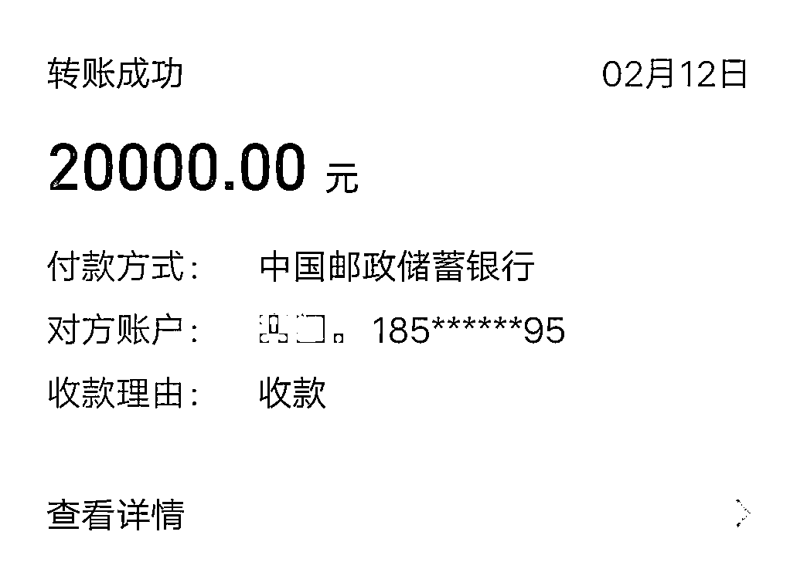
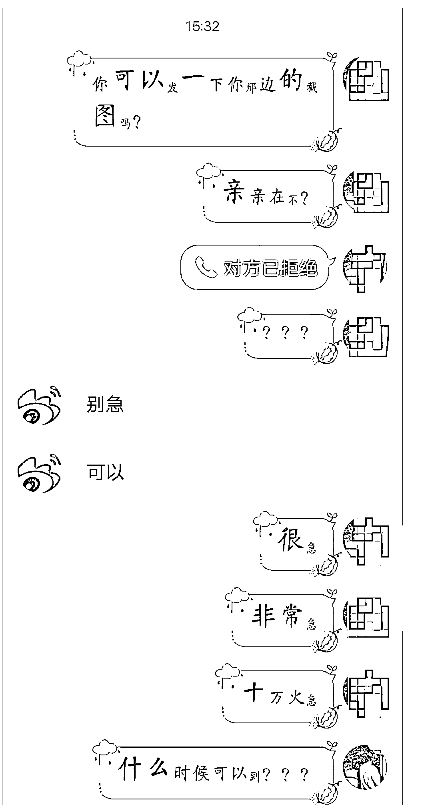

# 爱豆发放福利，快来领取....

> 原文：[`mp.weixin.qq.com/s?__biz=MzIyMDYwMTk0Mw==&mid=2247523021&idx=6&sn=cf87c98211ca6932cd98a6f1c884fea9&chksm=97cb51f5a0bcd8e32befc87b6359b0a2efc48699ac8194f8cd8d7d17d1cce8ba3fa711165491&scene=27#wechat_redirect`](http://mp.weixin.qq.com/s?__biz=MzIyMDYwMTk0Mw==&mid=2247523021&idx=6&sn=cf87c98211ca6932cd98a6f1c884fea9&chksm=97cb51f5a0bcd8e32befc87b6359b0a2efc48699ac8194f8cd8d7d17d1cce8ba3fa711165491&scene=27#wechat_redirect)

过度追星和不良的“饭圈”风气 

会给未成年人带来负面影响

更可能被不法分子所觊觎

利用粉丝的盲目和疯狂

编织骗局大网，请君入瓮

“爱豆发放福利了，快来领取！”

面对粉丝群中的“明星返利”消息

你会动心吗？

小心，已有粉丝上当受骗！ 

近日，重庆荣昌警方在“净网 2021”专项行动中打掉一个“明星返福利”诈骗团伙，抓获嫌疑人 4 名，追回诈骗资金 7 万余元。7 月 12 日，4 名嫌疑人被荣昌警方依法移送起诉。

**回馈粉丝活动 学生被骗 49000 元**

小芳是一名重庆的中学生。2 月 12 日，她在家收到追星族同学发来的二维码，称某综艺节目**回馈粉丝返利，可免费领取。**

小芳扫描二维码入群后发现，这是一个几百人的 QQ 群，管理员**称节目组拿出 50 万回馈粉丝支持广发福利，名额有限**，加微信输入活动代码可免费领取，已有人成功领取，并附有返利截屏。

骗子发布的二维码

骗子称有 50 万元资金发给粉丝

骗子展示“成功领取福利”截图

小芳添加了对方微信，并按照对方要求在付款界面输入此次活动的代码 100，对方**称这只是验证代码不会真的付款成功，审核通过后可以获得 2888 元奖励。**

小芳按照管理员的提示，输入了所谓的验证码 100 并点击付款后，却显示付款成功了！于是她加了管理员 QQ 具体询问。

客服说她是违规操作，需要先退出 QQ 群后重新付款验证。就这么稀里糊涂的，是在对方的指导下，涉世未深的小芳先用微信、后又用母亲的支付宝，付款 9 次共计 49000 余元……

随后对方失去联系，小芳这才发现被骗，赶紧报了警。 

受害人转账截图

**抓获 4 名嫌疑人 涉案金额百万元**

接警后，荣昌警方立即开展调查。经过近 2 个月缜密侦查，民警逐步查明该诈骗团伙的人员构成，并于今年 4 月先后在云南、山东等地将吴某、王某、李某、范某等 4 名犯罪嫌疑人抓获归案。

经审讯，4 名嫌疑人如实交待了其**通过冒充明星给粉丝返利来实施诈骗**的违法犯罪行为。

该团伙先后在 QQ 群内发布内容为某明星开展粉丝高额返利的小广告，待有人联系他们后，便以返利为诱饵，引诱受害人向其转钱，随后以各种理由推脱返利或者直接拉黑对方，以达到诈骗钱财的目的，涉案资金达百余万元。

受害人最终发现“福利”只是骗局 

目前，4 名嫌疑人因涉嫌诈骗已被公安机关移送起诉，案件正在进一步办理当中。

**网警提醒：**

青少年网民首先应该理性追星，其次在各种追星群组里看紧钱包，凡是涉及转账、汇款、扫码支付的，务必核实信息，千万慎重！

此外，家长们也需要多多教育孩子安全上网，并且不要轻易将自己的支付密码透露给未成年子女，避免子女操作失当，造成损失。

来源：重庆网警，公安部网安局

灰产圈在线客服

← 向右滑动与灰产圈互动交流 →

