# 你玩游戏吗？警惕新型骗局！专坑游戏玩家！

> 原文：[`mp.weixin.qq.com/s?__biz=MzIyMDYwMTk0Mw==&mid=2247523021&idx=7&sn=8120137486fe74d8a463c68c20b31a8a&chksm=97cb51f5a0bcd8e3306693b583f2d433bf25bd67343058a2ca125e2e3a28d23758e2892fe00b&scene=27#wechat_redirect`](http://mp.weixin.qq.com/s?__biz=MzIyMDYwMTk0Mw==&mid=2247523021&idx=7&sn=8120137486fe74d8a463c68c20b31a8a&chksm=97cb51f5a0bcd8e3306693b583f2d433bf25bd67343058a2ca125e2e3a28d23758e2892fe00b&scene=27#wechat_redirect)

在游戏里，有的玩家会出售自己的“高级”账号，随之也出现了一群瞄准玩家钱包，欺骗玩家的骗子… **他们打着买账号的幌子，利用虚假交易平台，骗取玩家手里的钱财。****近期就出现了一种新型游戏诈骗**……骗子究竟是如何行骗的？下面小编就以真实的聊天截图给大家解读一下**新型游戏诈骗**套路

**第一步**

**以“玩家”的身份购买游戏账号**

骗子冒充游戏玩家联系卖家，**表示自己想买游戏账号，并且可以出高价**，这会让很多卖家觉得“交易十分划算”。

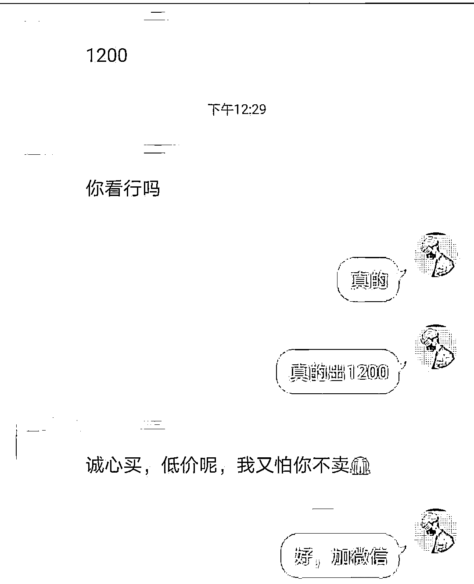

**第二步**

**引导卖家进入虚假“游戏交易平台”**

交易时，骗子往往装作很懂行的样子，表示大家都用某某平台交易，这个交易网站专业有保障，然后教卖家如何上架售卖。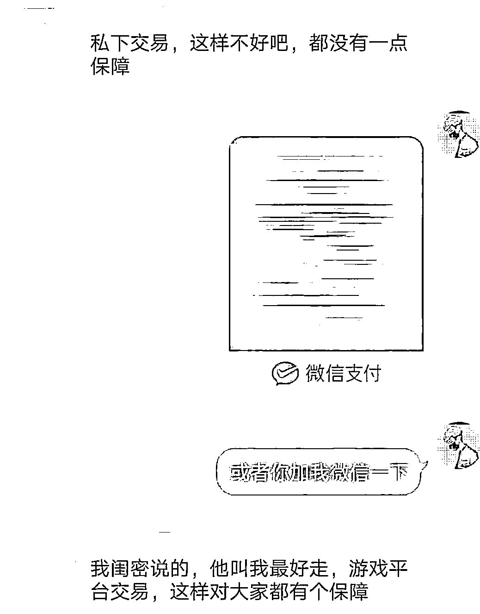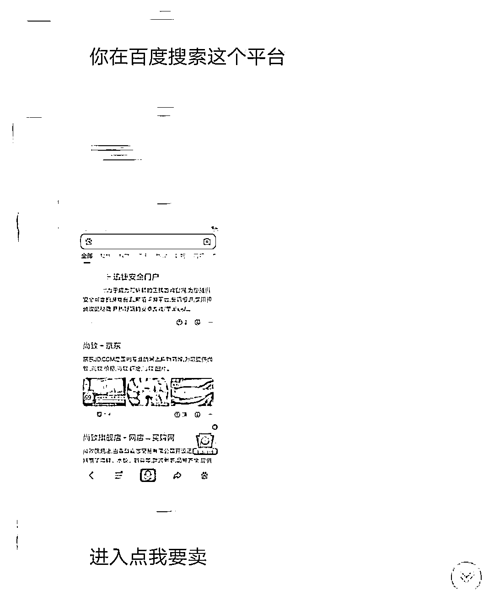**事实上，骗子提供的游戏网站是自己建立的钓鱼网站。**

**第三步**

**伪造成功支付页面**

当卖家根据骗子的指示进入交易网站，把账号信息上架售卖，骗子就会伪造支付成功页面，让卖家以为资金已到平台账户里。但卖家提现时，会发现系统显示由于操作失误，资金被冻结。

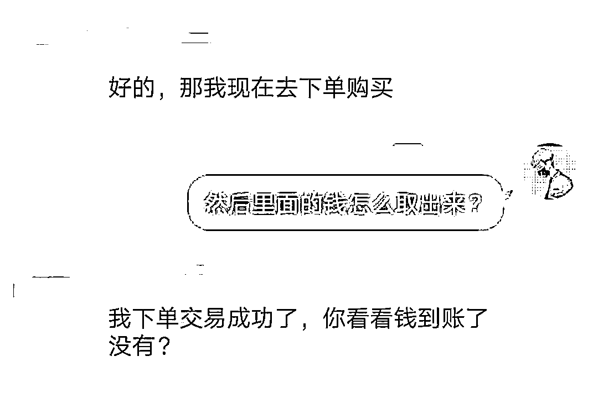

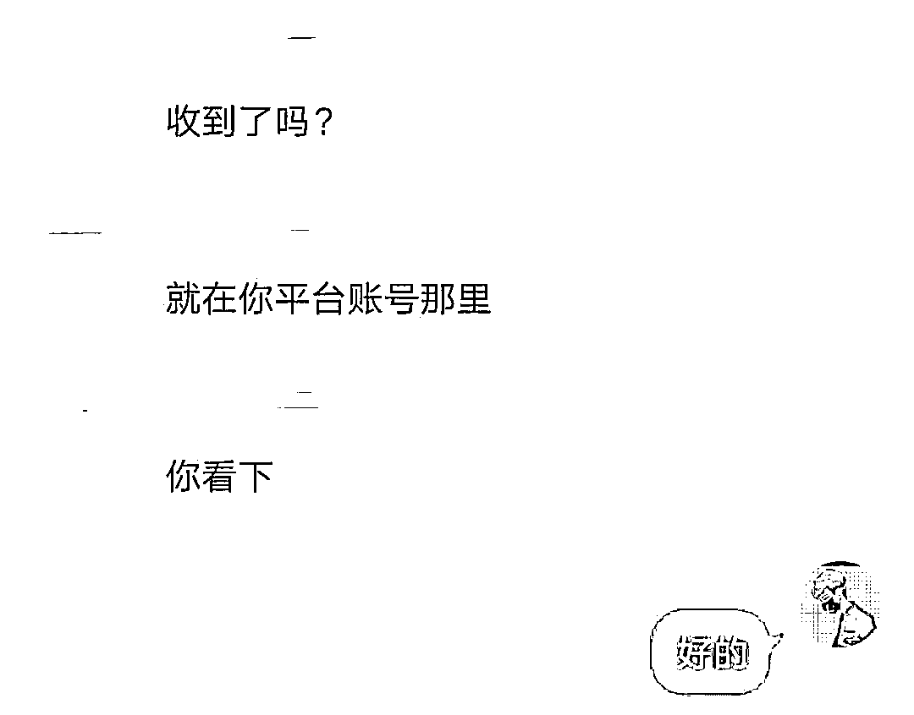

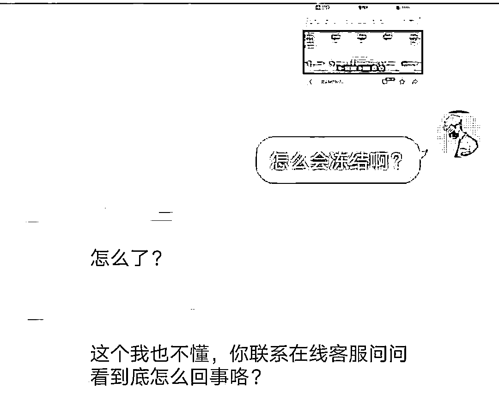

**第四步**

**假冒客服，要求充值为资金解冻**

卖家提现失败时，骗子又开始唱双簧，一边引导卖家联系客服，一边假冒客服，告知卖家账户由于个人操作失误被冻结，需要充值一定金额才能解冻，解冻后会把两笔资金一起返还。

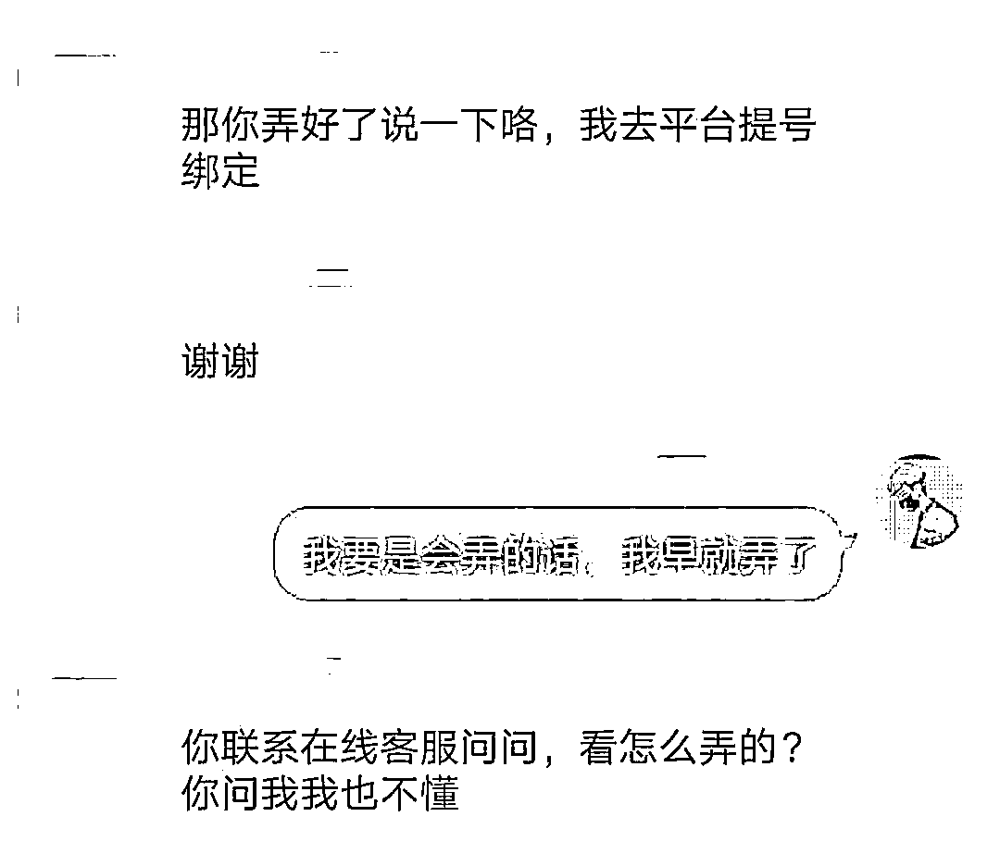

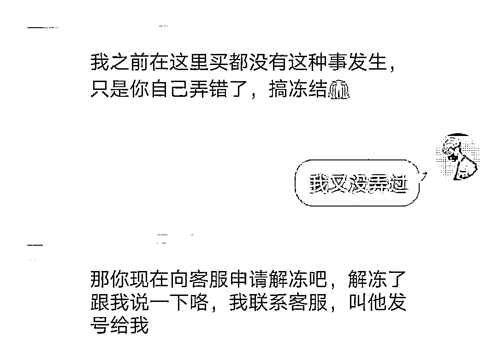

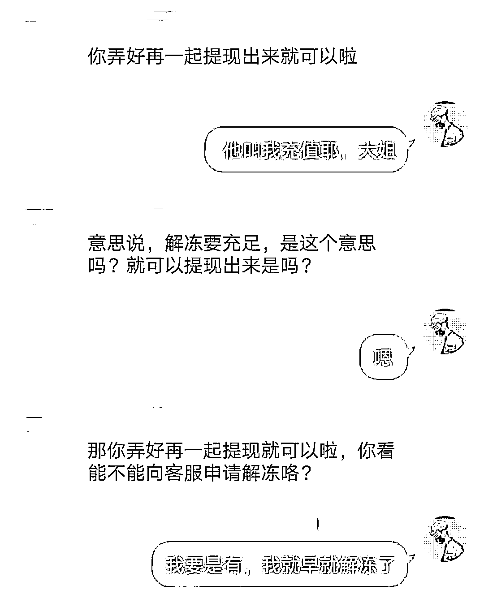

**第五步**

**心理战术，道德压制**

假如卖家表示自己没有钱，骗子便立马化身受害者，用**“钱是你自己搞冻结的，我跟你买东西，我现在只想拿回我的号”，“你自己的问题肯定要负责”**之类的“道德压制”让卖家良心不安，从而配合“客服”。

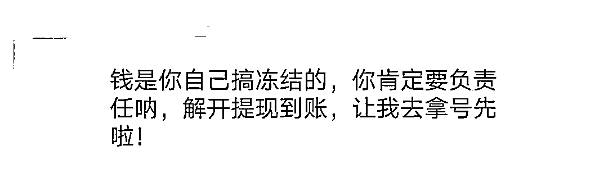

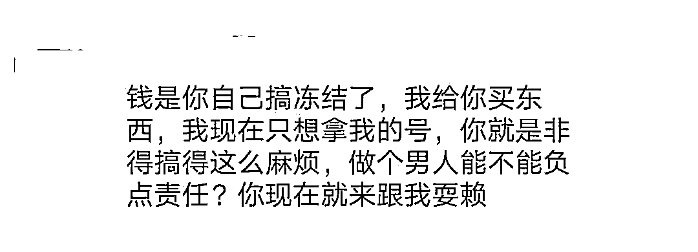

**第六步**

**假冒警察，威胁恐吓**

在道德压制也不管用时，骗子开始威胁要去报警，甚至假冒警察，发送民警图片及报案视频，用恐吓的方式攻破卖家的心理防线，要求卖家继续在该平台完成交易，否则追究其法律责任。

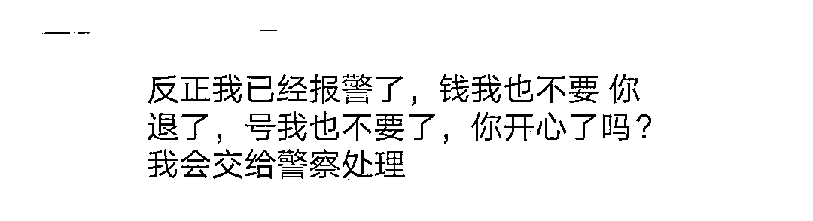

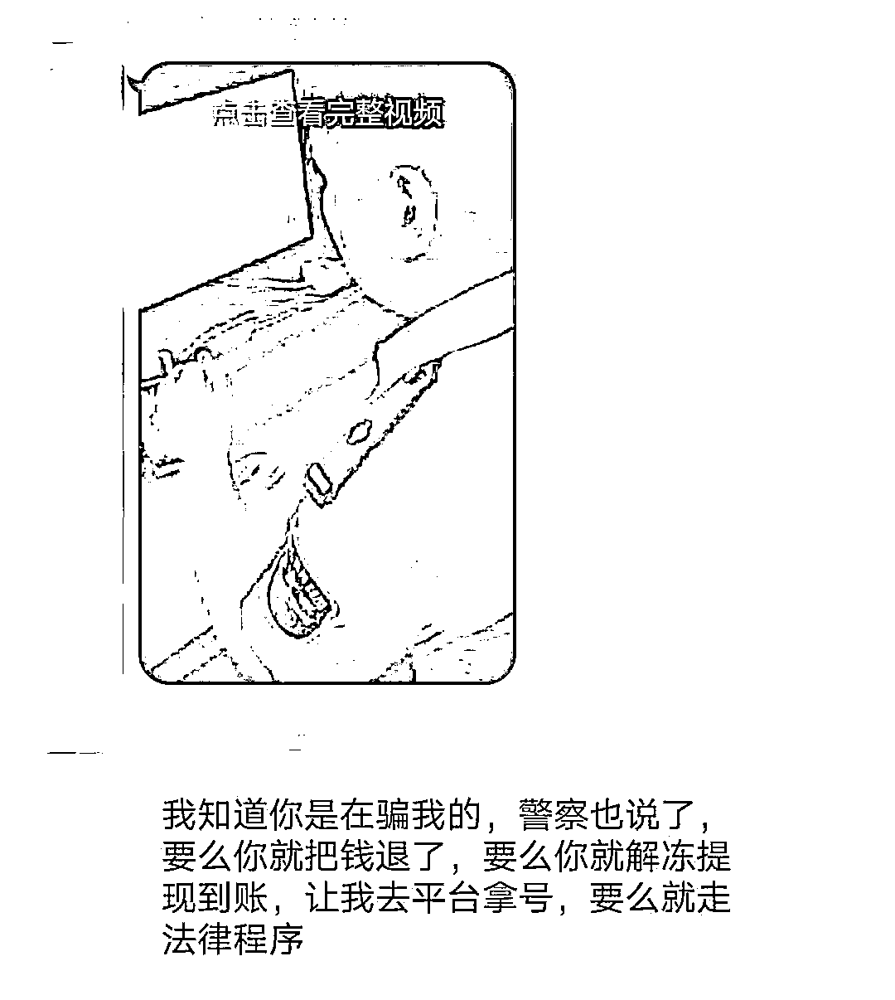

//////////

综上，我们可以看出这样的一个新型诈骗——**骗子假冒买家、客服、警察等多个身份，融合道德压制、恐吓等多种心理操控术，已经是一套成熟完善的话术。**在这类骗局中，受害者多为年轻人，甚至是未成年人。他们辨别能力较低、心智不成熟，遇到一些吓唬的话语或字眼时，更容易感到害怕，从而被诈骗分子一步步操控。**警方提醒：网上交易时一定要通过正规交易平台，不要轻信对方发来的链接或者二维码，时刻保持警惕，避免踩坑。**

来源：中国警察网、内江反诈、阻击诈骗

灰产圈在线客服

← 向右滑动与灰产圈互动交流 →

