# 微信用户小心！犯罪团伙用这招窃取大量个人信息！

> 原文：[`mp.weixin.qq.com/s?__biz=MzIyMDYwMTk0Mw==&mid=2247523083&idx=4&sn=8bffc98dcb1fb39ac5ecb2bb14262930&chksm=97cb5033a0bcd9257122fee1a00d3877588c930d5e4da4def213d72369717297ba9ad2f422bc&scene=27#wechat_redirect`](http://mp.weixin.qq.com/s?__biz=MzIyMDYwMTk0Mw==&mid=2247523083&idx=4&sn=8bffc98dcb1fb39ac5ecb2bb14262930&chksm=97cb5033a0bcd9257122fee1a00d3877588c930d5e4da4def213d72369717297ba9ad2f422bc&scene=27#wechat_redirect)

对于微信用户而言，

“清粉”这词不陌生。

**所谓“清粉”，**

**通常指通过一些第三方应用集群软件，**

**让账户自动向所有好友群发消息，**

**再根据“信息是否能够成功发送接收”**

**来识别和清理**

**那些久不联系或被对方拉黑的好友。**

上海警方今天召开发布会，

通过真实案例提醒：

**有犯罪分子打着“清粉”的幌子，**

**非法获取大量公民个人信息并以此牟利**

“清粉”程序如何伺机“侵权”

今年 8 月，上海市公安局网安总队在网络巡查中发现一条重要线索：**一款应用程序存在表面“清粉”，实为“引流”的违法行为。**接到线索后，闵行警方通过 2 个多月的调查，挖出一个利用“清粉”软件非法获取用户数据的犯罪团伙。

今年 9 月中下旬，闵行警方在上海市公安局网安总队的指导下，**先后在上海，四川，浙江，湖南 4 地收网行动，抓获犯罪嫌疑人 4 名，涉案金额超过 800 万元。**

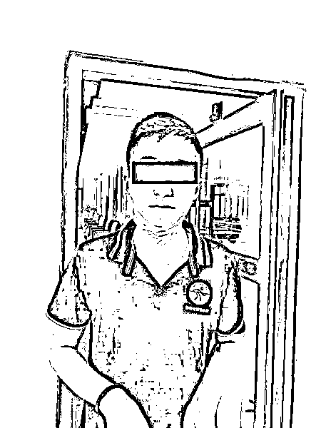

警方抓获犯罪嫌疑人 4 名 警方供图（下同） 

**那么，这种“清粉”软件是如何“暗度陈仓”的？**

前不久，做“微商”的郑小姐想给自己朋友圈“清粉”，**在一家网络交易平台上，她发现了一款“小麻雀清粉助理”，广告注明“清通讯录”。**支付了 5 元服务费后，客服给了郑小姐一个登录密码。

郑小姐打开“小麻雀助手”的登录网址，**输入客服给的登录密码，屏幕上出现了一个二维码。客服提示郑小姐使用手机扫码登录，随即后台系统开始对扫码的手机进行深入“扫描”。**

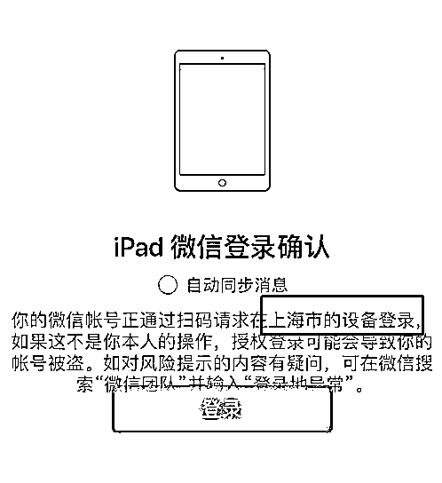

“很快的，我估计**只有 2 分钟都不到**。”郑小姐的微信“文件传输助手”**收到了一份“体检报告”**：除了显示已检测好友数量外，还将那些屏蔽自己的好友名片逐一推送给她。

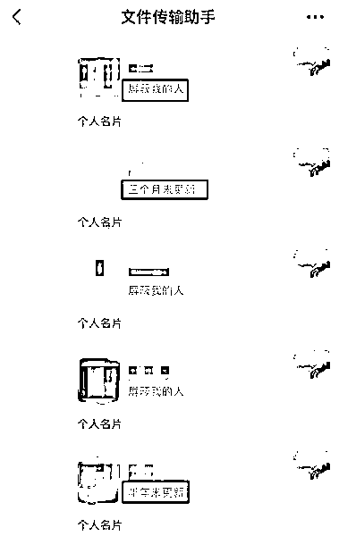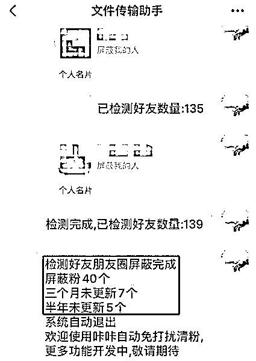

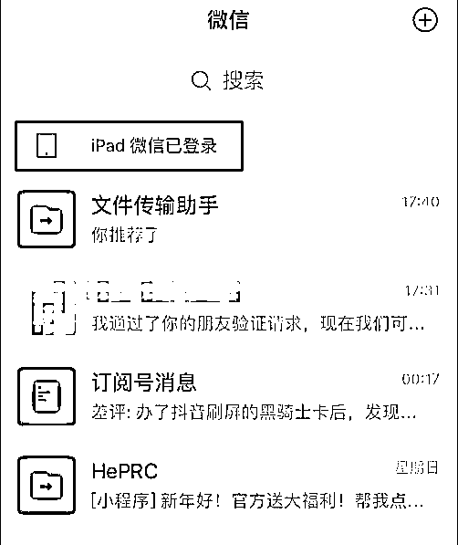

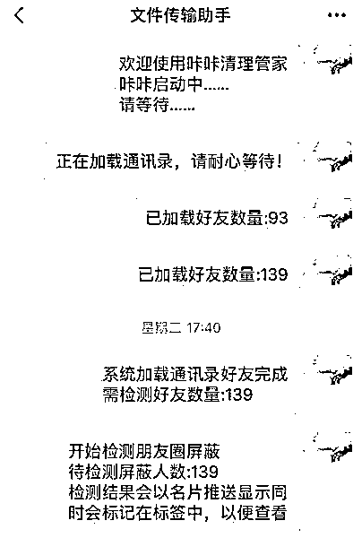

清粉流程

**直到案件侦破，像郑小姐这样的“清粉”用户都不知道自己的信息已经被窃取。**警方分析发现，**犯罪团伙在用户毫无察觉的情况下，“秒级”获取了手机里的公民信息**，直至案发，无人向公安机关报案。他们根本不知道，这些公民信息数据**已被传输到了犯罪团伙的服务器上。**

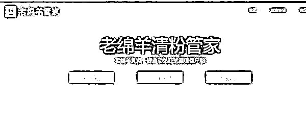

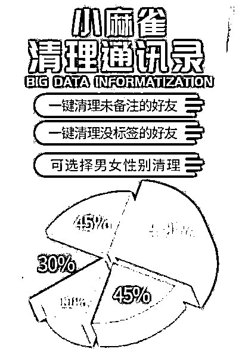

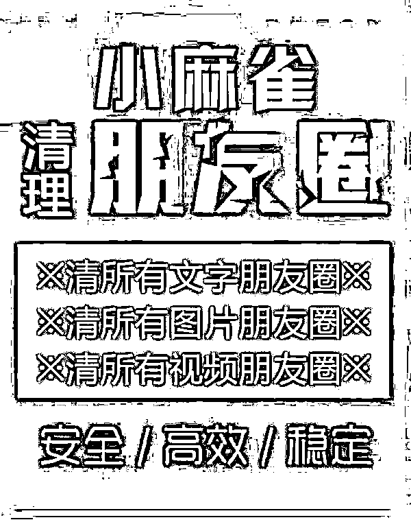

“清粉”软件广告

300 多家网店参与其中

经审讯，警方发现**犯罪团伙不仅用程序非法获取公民信息，还将这些公民信息出售和非法使用，从中牟利。**

2020 年 4 月，犯罪嫌疑人王某组建了一个犯罪团伙，招揽了技术人员陈某、段某和周某，共同研发了一款可实现批量“清粉”功能的程序。

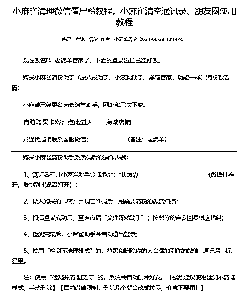

**开发之初，王某就明确了应用程序要有盗窃公民信息的功能，非法获取用户信息后**，数据会自动上传至一个“中转网站”。这个网站具有数据上传、下载以及统计功能。

而只要“充值注册”成为“中转网站”的会员，支付费用后，犯罪分子就能使用这些被窃取的公民信息进行“刷单”“点赞”或者其他网络流量服务。

通过查阅流水记录，**警方发现犯罪团伙通过 14 个月的运维，已从中非法获利 800 余万元。**

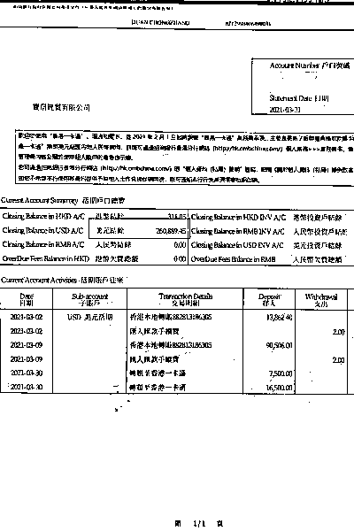

违法所得记录

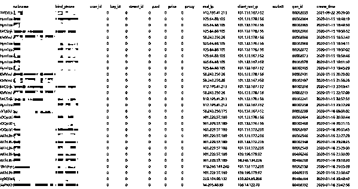

后台登录记录

这个犯罪团伙规模不大，只有 4 人，他们是如何推广自己“产品”的？警方调查发现，**“销售”此款应用的代理网店竟多达 300 余家。**

**目前，犯罪嫌疑人周某已被闵行警方依法刑事拘留，段某等三人因涉嫌侵犯公民个人信息罪被闵行检察院依法批准逮捕，案件正在进一步审理中。**

来源：新民晚报，红网

← 向右滑动与灰产圈互动交流 →

