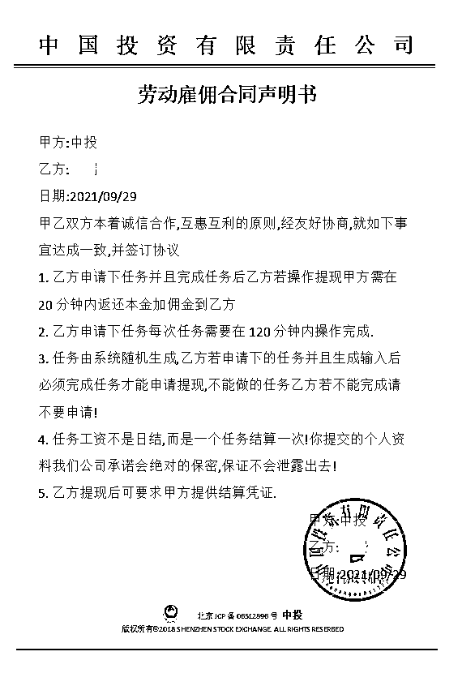

# 三天被骗两次，一名 211 大学生懊恼：“真想把他一锤子捶到墙上去！”

> 原文：[`mp.weixin.qq.com/s?__biz=MzIyMDYwMTk0Mw==&mid=2247523083&idx=5&sn=6a025addb12897de99a62f741804948b&chksm=97cb5033a0bcd9250aa2d69053d5e75673253f24798c7abde1d2ac8e512ea3fc657d6d438307&scene=27#wechat_redirect`](http://mp.weixin.qq.com/s?__biz=MzIyMDYwMTk0Mw==&mid=2247523083&idx=5&sn=6a025addb12897de99a62f741804948b&chksm=97cb5033a0bcd9250aa2d69053d5e75673253f24798c7abde1d2ac8e512ea3fc657d6d438307&scene=27#wechat_redirect)

对大部分人来讲，赚取快钱、轻松钱是一直梦寐以求的事，同时也是一场冒险之旅。就像是一个没有做过任何训练的人去走钢丝，亦是火中取物，殊不知最后的小丑竟是自己。恩施州的刷单诈骗已有上千宗，日赚千元的没几个，人均损失过万的倒真不少，就真是验证了那句古话：偷鸡不着蚀把米。 

小王就是众多蚀米者中的一个，在遭遇三天被骗两次的打脸经历后，就有了这么一篇追悔莫及的自述文章，希望大家能从中看出刷单诈骗的详细套路，以此警示自己。

（图源网络） 

***正文***

**一个网络刷单受害者的自述**

我是一名大学生，22 岁，就读于武汉一所 211 高校。之所以把这个点出来，绝对不是在自我炫耀，而是在被骗后，很多人问我，说我一个 211 大学的还能上这种当……

其实是否被电信网络诈骗，与学历并无多大直接关系，诈骗种类繁多，手段花式花样，学历高的也同样可能被骗。我或许是因为太年轻，见的世面少，自我保护的意识不高才掉入了他人陷阱。不过，事后别人怎么看我，如何评价我，我觉得没什么大不了，丑是有点丑，只希望更多人看了能提高警惕。

短时间内被骗两次，弄丢了将近 18000 余元，我的故事很奇葩，皆是源于刷单。第一次被骗是因为我想做兼职，赚点外快，第二次被骗，并不是因为我想要赚多少钱，而是我想弄懂，还是好奇心在作祟吧。这就似一场赌博，将自己的小金库全部投进去的冲动感和害怕血本无归、害怕被骗的恐惧感交织着，让我觉得刺激却又恐惧不已。

（图源网络）

接下来，简述一下被骗的过程。套路大同小异，在国家反诈骗 APP 和“平安恩施”公众号上我之前也有看到过，奈何好奇害死猫。

9 月 25 日，我在“知乎”上在查阅推荐话题的时候，看到一个兼职刷单平台叫“potato”，下载后，通过平台上预留的 QQ 群号我进了一个群，群里有“导师”推荐我下载一个叫“英格玛”的 APP，这样的 APP 我从来没了解过。下载后，“导师”让我领取刷单任务，第一单获取了佣金 18 元，后“导师”又发给我一个链接，点击链接可以接着领取任务，我分五次给对方转账 11581 元进行刷单，刷单成功后，为了保证资金安全我想把钱全部提出来，平台却显示账户被冻结，无可奈何我咨询了“导师”，他却说是我最后一次操作间隔时间过长，需要重新充值，我感觉情况不对，意识到自己应该是被骗了。

在遭遇诈骗后，我总想看看类似这样在“知乎”上发兼职平台的还有多少，时不时的会去翻阅。过了两天，翻看话题时我又接触到一个自称可以赚钱的 APP，题主说得十分诚恳，好奇心驱使下，我点开了链接下载 APP 进行注册。进去后，随便挑了一个平台任务，通过下面联系人的电话我添加了第一个接待员的微信，对方很快同意了问我是不是来兼职刷单的。

跟着我做了几单几十元一单的小任务，就是给对方指定的账号转账，钱会再充值到我这个 APP 账号里用来购买虚拟货币，叫 BSTD，我加起来充值了 1000 元左右，并且成功的得到了约 300 左右的佣金。后面的任务数额就越来越大，因此我被介绍给了第二个接待员，起始单做的就是 555 元一单的，每单可以赚个 100 多，做了几单，确实可以提现到账的。至此，我想做了这么多单，都可以提现，是不是这个平台不是骗子，是真的可以赚钱。

（与接待员的聊天记录）

随着单越做越大，第二个接待员把我拉到一个 4 人群里，里面还有 2 个做同样任务的。我做完两单后就发现有一个是托儿，因为每单就她最快，也没有疑问，转账最及时（事后回想，这个托当得也是挺草率的）。真正被宰的是我和另一个姐姐。

（与接待员的聊天记录）

群里公布的任务规则就是完成上一个任务后返本金加佣金到 APP 账号，但你提现不了，因为这是一条任务中的一个，只有全部任务完成才可以提现。其实我早就想到了他们肯定会来这套，奈何人心太贪，总想把账户里的本金弄出来，所以我坚持做完了最后一单，截至此时，我账户里没有提现的资金共有 6000 余元。

（与骗子签订的假合同） 

接下来跟我预想的一样，任务必须接着做，此时我确信自己是上当无疑，立马收了手。不过，群里那个姐姐还不知道，我想告诉她也已经来不及了，因为我被禁言了，群里也私加不了她，干着急的看着她又转了一万元，她的金额加起来也有 18000 元了。我心急如焚，真想把那个接待员一锤子捶到墙上去。无可奈何之下，我选择了报警。

就这样，间隔 2 天，我被骗走了 12000 元，报警后，警察蜀黍经过程序冻结我转账的对方账户后，发现里面早已没钱，亦是无话可说。

钱我知道是追不回来了，只能空懊悔自己脑子进水。这次的分享到此为止，感谢大家能在百忙之中读完拙作。

**END**

** 下面来一波粉丝福利 **

点击以下文章链接查看赚钱方法：

*   **日赚 3000+方法！月收入过万不是梦**
*   **你看不起的行业，它真的很赚钱！**
*   ****1 个星期赚了 3W+，她是怎样做到的？****
*   **宝妈在家赚钱的方法有哪些？你还不知道吗**
*   **大学生被发现巨额存款，在妈妈的逼问下终于说出实情**
*   ****怎么样以最快的速度赚到二十万，点击链接进来看看吧****
*   **教你如何在家兼职赚钱，一部手机轻松月赚 5000**
*   **适合上班族的兼职赚钱方法，2021 最受欢迎的网赚项目**

不要点了，这根本就没有链接。哪来那么轻松的赚钱门路，这只是个小测试！下次再看到上面这样的广告，请一定按捺住你躁动的心。

来源：平安恩施，阻击诈骗

← 向右滑动与灰产圈互动交流 →

