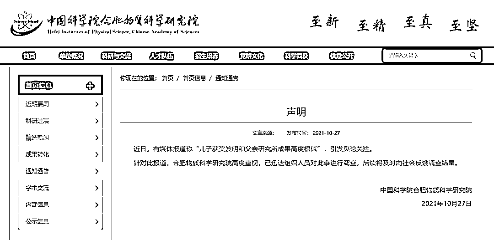
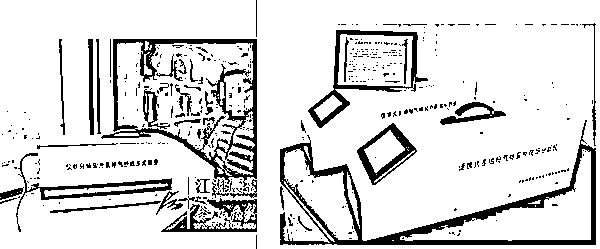
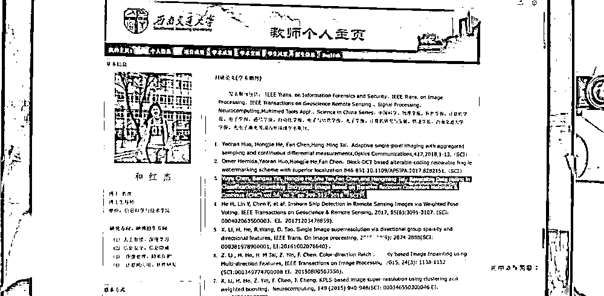
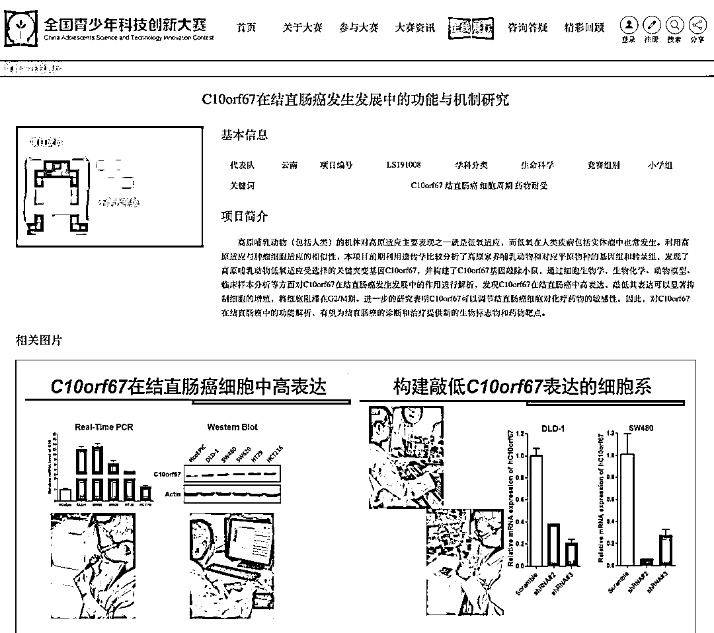

# 古有替父从军，今有“学术拼爹”

> 原文：[`mp.weixin.qq.com/s?__biz=MzIyMDYwMTk0Mw==&mid=2247523083&idx=6&sn=b58dfd17076be0e52151c2d08b767e9a&chksm=97cb5033a0bcd925a8361a5146913c4a72d9633d6f736ce27540e067d7eb3102239fd75ed0cc&scene=27#wechat_redirect`](http://mp.weixin.qq.com/s?__biz=MzIyMDYwMTk0Mw==&mid=2247523083&idx=6&sn=b58dfd17076be0e52151c2d08b767e9a&chksm=97cb5033a0bcd925a8361a5146913c4a72d9633d6f736ce27540e067d7eb3102239fd75ed0cc&scene=27#wechat_redirect)

古有替父从军

今有学术拼爹

有的父亲疑似用自己的研究成果

让儿子拿了奖 

有的父亲已经用自己的科研论文

让女儿保了研

近日，有媒体报道称“儿子获奖发明和父亲研究所成果高度相似”，引发舆论关注。

**儿子“发明”和父亲研究高度相似**

据报道，2015 年刘建国之子刘某阳凭借发明“便携式雾霾污染气体快速识别和检测装置”（又称“便携式多组份气体紫外现场分析仪”）获得多个省级、国家级奖项。

但**该发明在名称、工作原理、外观方面，均与中科院合肥研究院安徽光学精密机械研究所 2012 年的一项科研成果高度一致。当时，刘建国任该所副所长，也是该科研成果所属项目的主要完成人。**

**此外，2018 年就读合肥一六八中学的刘某阳再次凭借发明“酒驾安全激光快速筛查系统”，获得了多个奖项，并获国家专利。**该发明也与刘建国 2011 年所申请的国家专利“激光酒驾道边在线监测系统”原理高度相似。****

****

**刘某阳的发明装置（左图）与安光所的科研成果装置（右图）外观高度一致**

**针对此报道，**合肥物质科学研究院已迅速组织人员对此事进行调查，后续将及时向社会反馈调查结果。****

**虽然事件还在调查中**

**但此前利用自身便利**

**为子女造假的类似案例**

**已经屡见不鲜——**

**为何此事会引发如此大的关注，**一个重要的背景是，此种另类的“大手拉小手”案例接二连三，影响了竞赛公平，加剧了教育焦虑。****

****成绩造假、学术造假，罚！**** 

**2020 年 6 月，关于西南交通大学本科生陈玉钰“推免保研”成绩造假一事，引发广泛热议。**

**报道称，陈玉钰不仅在高考时以“刚过一本线”的分数入读西南交大最好的茅以升学院，还在自己“教授父母”的帮助下，在国际重点期刊上发表文章、修改本科成绩，获得了保送国内一流高校硕士研究生的资格。**

****

**在西南交通大学官网上，陈玉钰母亲和红杰的相关资料显示，有一篇发表于 2018 年，被 SCI 收录的文章的第一作者是陈玉钰**

**事件被披露后，西南交通大学随后发布调查处理通报。通报称，该校时任教务处教务科科长尹帮旭私下接受同事陈帆请托，为其女陈玉钰在缓考和课程替代中违规操作，致使四门课程成绩计算错误。**尹帮旭、陈帆等多人被问责。并取消陈玉钰推荐免试攻读研究生资格并给予记过处分。****

****“小学生研究癌症获奖”****

****研究课题与父母相一致****

**2020 年 7 月，云南昆明一名小学六年级学生凭借“结直肠癌基因敲除”为题的学术论文，获得全国青少年科技创新大赛三等奖，随后被曝出该研究存在“家长过度参与”之嫌。**

**据相关报道，该学生父母都是中科院昆明动物研究所研究员，获奖的研究课题与其父母的研究方向基本一致。**

**** 

**随后经专家组认定：**项目研究报告的专业程度超出了作者认知水平和写作能力，项目研究报告不可能由作者本人独立撰写**。全国青少年科技创新大赛也发布通报，称经过核查后决定将三等奖撤销。**

 ****短评**** 

****“子承父奖”是一种新型学术腐败****

**小学生研究抗癌并取得突破性成果，父亲写篇论文给孩子挂个作者……“子承父奖”是一种新型学术腐败。和利用公权为子女亲属安排工作、开办公司的赤裸直接不同，学术腐败不易察觉、隐形“温和”，最大的难点在于分辨到底是点拨指导，还是直接“馈赠”。还有一些，父母并未直接代劳，但便利孩子使用实验室核心设备核心数据，亦是不公。**

**网友纷纷评论“惭愧惭愧”、“自卑了”。要从大家的自嘲中，读懂公众的不屑与不忿。教育焦虑牵扯着普通人的神经，用弄虚作假的方式，为子女谋得人生的“一路畅通牌”，严重破坏科研群体形象，污染学术土壤，损害社会公平，必须给个说法、拿个办法！**

**父母之爱子，则为之计深远。想让孩子过得轻松点无可厚非，比起使劲把公家的东西往自己家“划拉”，树立良好的榜样、涵养淳厚的家风，更能让小辈受益无穷。**人生的“造假第一课”，如果由父母来上，那就太可悲！****

**更令人心惊的是，这种风气在圈内心照不宣、见怪不怪。躲在学术的象牙塔里，以“窃书不算窃”的侥幸心态自欺欺人，**但科研成果是公产，侵占就是违规，谋私就是腐败！****

**来源：央视网综合澎湃新闻、中国青年报、新华网**

****

**← 向右滑动与灰产圈互动交流 →**

****