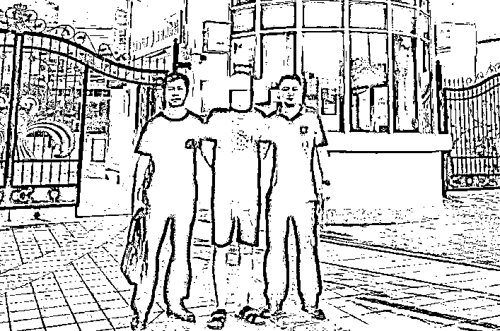
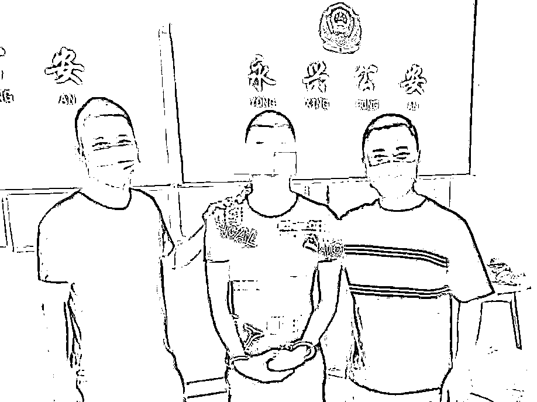
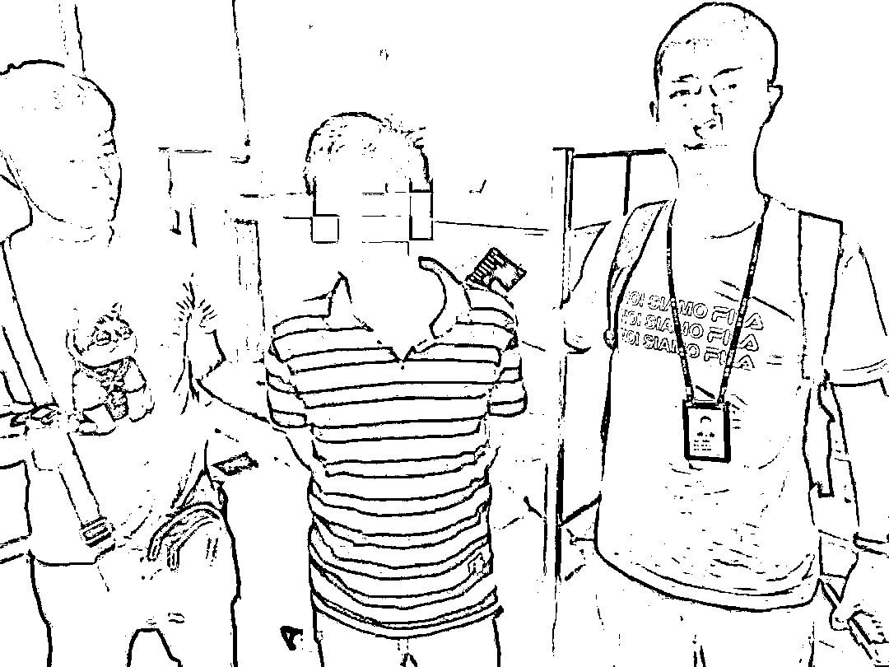

# 警方“全链条”斩断：组织偷渡至境外实施电诈犯罪团伙！

> 原文：[`mp.weixin.qq.com/s?__biz=MzIyMDYwMTk0Mw==&mid=2247523083&idx=7&sn=80c85fdce670d7b4fca193e642884c58&chksm=97cb5033a0bcd925c7a4cbe3b653c7120580a07bf7646304f5952654560ac35baa1fe1648976&scene=27#wechat_redirect`](http://mp.weixin.qq.com/s?__biz=MzIyMDYwMTk0Mw==&mid=2247523083&idx=7&sn=80c85fdce670d7b4fca193e642884c58&chksm=97cb5033a0bcd925c7a4cbe3b653c7120580a07bf7646304f5952654560ac35baa1fe1648976&scene=27#wechat_redirect)

**高额回报**

**无需出入境证件**

**路费和生活费全包**

**这样的“高薪”工作**

**你敢来吗？？？**

[`mp.weixin.qq.com/mp/readtemplate?t=pages/video_player_tmpl&action=mpvideo&auto=0&vid=wxv_2109095319614324739`](https://mp.weixin.qq.com/mp/readtemplate?t=pages/video_player_tmpl&action=mpvideo&auto=0&vid=wxv_2109095319614324739)

▲男子讲述偷渡出境被骗经历

     今年以来，厦门警方根据公安部**“断流”专案行动**统一部署，紧盯目标任务和本地人员作案线索，全力开展侦查打击。

[`mp.weixin.qq.com/mp/readtemplate?t=pages/video_player_tmpl&action=mpvideo&auto=0&vid=wxv_2109099967289032709`](https://mp.weixin.qq.com/mp/readtemplate?t=pages/video_player_tmpl&action=mpvideo&auto=0&vid=wxv_2109099967289032709)

▲直击抓捕现场

6 月 17 日，厦门市公安局组织警力在**厦门、泉州、云南、湖南、广东、辽宁、陕西等地**开展统一收网行动，“全链条”打掉一个长期**为境外电诈窝点招募人员**实施赌博、诈骗的犯罪团伙，**抓获违法犯罪嫌疑人 22 名**，有力策应全国打击治理电信网络诈骗犯罪工作大局。

 3 月底，刑侦支队在工作中获得一条线索，有人以女性身份在网上发布高薪招工信息，在聊天中**许诺待遇优厚、负责路费，疑似拉拢、动员人员偷渡至境外从事网络赌盘、“杀猪盘”等活动。**我市警方高度重视，立即抽调精干警力成立专案组开展侦查，逐步锁定了以董某东为首、涉嫌招募人员偷渡出境参与电信网络诈骗犯罪的团伙。

▲抓获主犯董某东

5 月底，公安部下发断流专案线索，接到专案任务后，我市警方围绕境外涉诈回流人员开展重点摸排，通过梳理过筛，发现下发线索与董某东团伙线索存在交叉，遂串并侦查。专案组围绕董某东团伙涉及的“蛇头”、运送者、接应者、偷渡人员等环节开展“全链条”研判经营，明确了该团伙的人员及组织架构。

经查，犯罪嫌疑人董某东（男，52 岁，厦门人）原注册经营“厦门某劳务服务有限公司”，从事正规劳务中介、职业介绍业务。今年 2 月份，董某东因公司管理经营不善，资金运转困难，加之受到境外犯罪集团低风险挣快钱的诱惑和指使，先后纠集陈某强、刘某红、刘某樟等人，在网上发布高薪招工的信息，并冒充女性身份吸引网友聊天，通过**以“高额回报”“无需出入境证件”“路费和生活费全包”等方式，**蛊惑怂恿并招募网友偷越至东南亚国家从事网络赌博和电信诈骗等违法犯罪活动，每成功招募一人获利 6000 元。

▲警方抓获犯罪团伙其他成员

今年 2 月至今，董某东团伙为境外犯罪集团从国内成功招募 15 名人员，共获利 9 万元。目前，该案 12 名犯罪嫌疑人被依法采取刑事强制措施，其余人员被依法处以行政处罚，案件正在进一步侦办当中。

公安机关正告犯罪分子，**立即停止**组织招募人员赴境外从事电信网络诈骗犯罪活动，**主动投案自首，争取宽大处理。**请广大人民群众不要受所谓的跨国“高薪职业”诱惑加入诈骗团伙，在那些诈骗集团里等待你们的将是**绑架、体罚、殴打，甚至死亡。**欢迎广大群众积极提供线索，协助公安机关侦破案件，全力支持公安机关开展“断流”专案行动，相关情况可通过**拨打 96110 全国反诈劝阻专线**进行咨询举报。

来源：厦门公安，厦门市反诈骗中心

← 向右滑动与灰产圈互动交流 →

