# 盘踞缅甸北部的电信诈骗集团，现在求黄牛“帮忙”自首

> 原文：[`mp.weixin.qq.com/s?__biz=MzIyMDYwMTk0Mw==&mid=2247523173&idx=1&sn=3ad71c0766aa8124166a74adcafb1992&chksm=97cb505da0bcd94be0169916551f72e4baadeeef8b04156556f7d3a4bff91af8d3c93149f2e2&scene=27#wechat_redirect`](http://mp.weixin.qq.com/s?__biz=MzIyMDYwMTk0Mw==&mid=2247523173&idx=1&sn=3ad71c0766aa8124166a74adcafb1992&chksm=97cb505da0bcd94be0169916551f72e4baadeeef8b04156556f7d3a4bff91af8d3c93149f2e2&scene=27#wechat_redirect)

2021 年 10 月 23 日，这本是个平淡无奇的日子，可对于某些群体来说可谓五雷轰顶。 

据广西南宁市宾阳县官方消息：张贵良等**69 名宾阳籍人员被注销了户籍**。

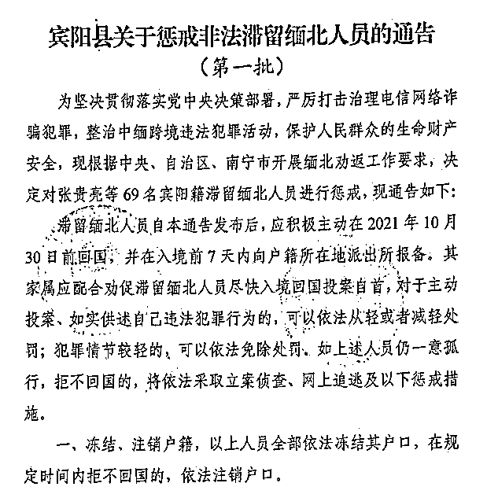

**宾阳县司法局文件**

**这也就是意味着这些人现在彻底成了官方认定的黑户。**

那么，他们是犯了什么重罪，值得用注销户籍这样的惩罚手段吗？

要我说，这还是便宜这帮家伙了，因为这帮家伙真的是在丧良心的道路上彻底走到黑了。他们干的那缺德事就是**电信网络诈骗**！

而这一次，根据该县《通告》上的信息，我们可以获得以下信息：这 69 人目前都滞留在缅甸北部地区，他们应该在 2021 年 10 月 30 日前回国，并在入境前 7 天内向户籍所在地派出所报备。 

对于主动投案，如实供述自己违法犯罪行为的，可以依法从轻或者减轻处罚；犯罪情节较轻的，可以依法免除处罚。

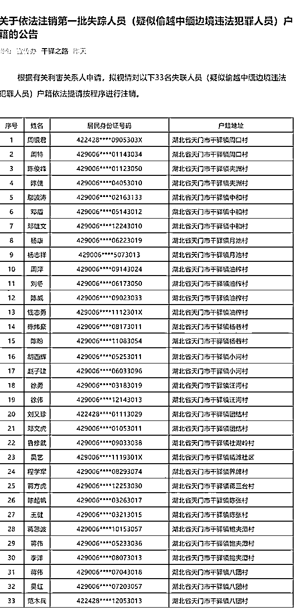

**但这 69 人显然属于一意孤行**，死不悔改那种死硬犯罪分子，也真因为如此，他们才“喜提”户籍注销的惩罚。 

此外，他们不仅户口没了，名下的各种银行卡、手机卡都被冻结，至少五年内也不能再新办，连非银行支付账户微信、支付宝等第三方支付平台账号都不能再办。

更可悲的是，这帮家伙们因为自己犯事，导致其直系亲属在考公、入党参军等权利也受到限制。

而他们煞费苦心用赃款建造、购买的房屋也都被查封或拆除。不仅是在宾阳，近期，国内多地都发布了类似的通告，都是和滞留缅北的人员有关。

国家这次对这群电信网络诈骗的打击力度前所未有，能扛到这份上依然死硬，也算是求锤得锤。

但在另外一边的中缅边境处，却上演着另外一出截然相反的荒诞闹剧——在北起西藏，南止云南的 2185 公里的边境线上，任意一个口岸或者便民通道上，我们都能看到一大群大声疾呼要“求自首”。

但因为抗疫的需求，加上中国一侧的隔离点接待量有限，每天能允许过境不到 150 人左右，导致这帮人短时间求自首不能！

**成千上万的人不得不在缅北一侧聚成一团排队自首。**

其实最近广受关注的云南瑞丽防疫压力，也有相当大的一部分来自他们。据瑞丽市官方表示，境外回流人员持续输入病例，近期检出阳性率持续在 20%以上。

更荒谬的是，许多人为了能尽早回国去争取宽大，不惜四处求爷爷告奶奶。结果，无处不在的黄牛竟然把生意做到了这群诈骗犯身上，什么“插队回国、高价插队、绿色通道”等垃圾广告充斥着缅北华人圈。

 

这样一幕如果不是出自权威官媒，我还以为这又是哪个无良营销号在那恶意编段子呢。

要知道，就在今年年初，缅北地区还是无数犯罪集团的“天堂”，到底发生了什么事，会让这些不法之徒抢着自首呢？

**1**

实际上，电信诈骗这种犯罪行为的出现很晚。

《中华人民共和国电信条例》对“电信”的定义，是指“利用有线、无线的电磁系统或者光电系统，传送、发射或者接收语音、文字、数据、图像以及其他任何形式信息的活动”。

 

换言之，电信天然具备技术属性和非接触属性，使得电信活动跳脱于传统的信息传递方式，具有方便、快捷和高效的特征。

而“电信网络诈骗”一词并不是学术界权威认定的词汇，而是在我国警方进行特定的一类案件的侦办和社会各界犯罪预防宣传的过程中逐步形成的一种称谓。

这种新型犯罪行为是通讯科技发展的副产品，**最早出现在 2000 年左右的中国台湾，之后在 2006 年左右开始向中国大陆、东南亚各地转移。**

 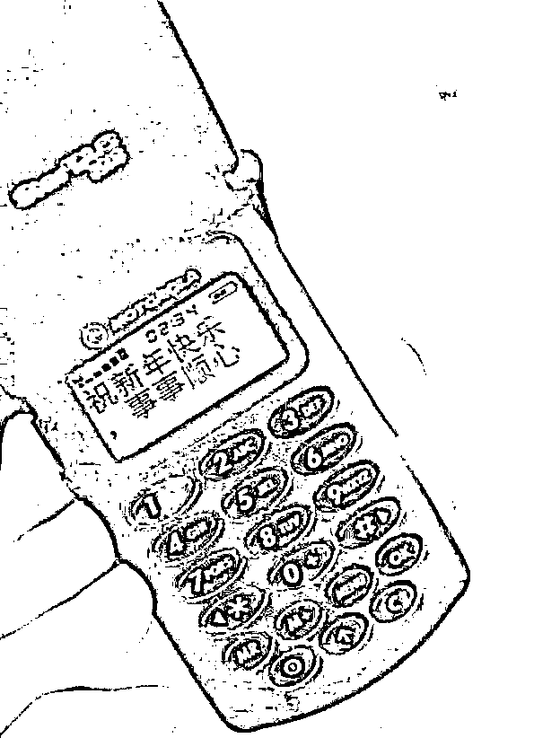

这其中，以毗邻台湾的福建受害最深。

也正是福建省在 2007 首次办理这一类的诈骗案件时提出了“电信诈骗犯罪”这一概念。

可因为没有法律文书的正式明文规范，所以我国很长一段时间都只是在事实上确认了将“电信诈骗犯罪”作为诈骗罪的一种特殊表现予以定罪处罚。

直到最高人民法院于 2016 年发布的《9 起电信网络诈骗犯罪典型案例》，**“电信网络诈骗”（以下简称“电信诈骗”）才真正出现在正式法律文件中。**

虽然学术界、新闻媒体对这一类犯罪的表达一直都不统一，其内涵也在不断变化，但总的来说，只要符合以下三点就属于“电信网络诈骗”：

第一，以电信技术为诈骗载体；第二，犯罪分子和受害人没有实际的现实接触；第三，作案过程中受害人因认识错误而自愿处分财物。

早期的电信诈骗在台湾地区被称为“电信诈欺犯罪”，**在 1990 年代台湾省手机短信功能出现后几乎同步出现**，当时就有犯罪分子通过冒充警察、高管、名人等身份，发送短信、打电话向受害者骗取钱财。

 

**到了 2000 年时，台湾的电信诈骗已经泛滥成灾**，同时为了躲避打击，岛内的诈骗团伙开始把实施诈骗的地点选在对岸的福建等地，并且在当地招募吸纳团伙成员，形成了以同乡亲友关系为主的新型诈骗集团。

之后，台湾当局的“警政机关”联合电视媒体不断向民众普及防诈知识，并开通了“165 反诈骗咨询专线”等。

台湾省“警政署”数据显示：到了 2005 年 4 月后，破案率连年提升，针对岛内群体实行电信诈骗难度与日俱增，**让台湾的犯罪集团开始将诈骗主目标对准大陆居民。**

 

其中，集团高层、头目以台湾人为主，但下线人员则以福建人员居多，基地一般设在台湾省、东南亚国家区域，通过向大陆居民拨打电话和发送短信实施诈骗活动，到 2007 年时，电信诈骗已经在福建和广东等东南沿海省份泛滥，**大陆的诈骗集团开始做大，并逐渐压过了台湾诈骗集团的风头。**

尤其 2008 年后，因为伪基站、来电号码修改、即时网络通讯工具和网络电话等技术已经发展较为成熟，犯罪分子开始冒充电信服务提供商，声称受害人身份信息泄露导致银行账户资金风险，要求其转账这一类型的诈骗。

 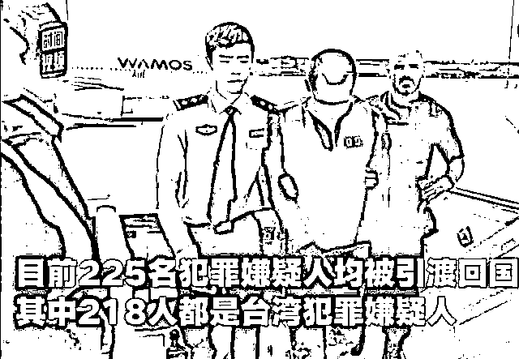

这类诈骗行为是将电信诈骗逐步与互联网通讯技术相结合，正式呈现出“电信网络诈骗”的新态势。

到了 2010 年后，包括 QQ、微信、微博等基于互联网、移动终端等通讯社交软件的普及，电信诈骗迎来了野蛮生长期。

各路诈骗团伙中甚至广募“专业人才”。负责专制编写剧本、话术、图片，并针对不同人群的身份特点进行量身定做，令人防不胜防，形成了一个个“杀猪盘”。

其中最常见的借口包括但不限于婚恋平台征婚、传销诈骗、慈善捐助诈骗、资产解冻诈骗等等......

上述的那些全新的技术手段让诈骗行为“魔高一丈”，识别难度与日俱增。

当然，针对这些犯罪活动，我国警方一直在加强打击力度，2013 年起，大陆警方开始和台湾警方合作，闽、粤、琼等地警方都与台湾警方开展联合活动，破获了多起跨国（境）电信网络诈骗案件，**迫使各个团伙逐渐往偏远的西部内陆省份及境外各国逃窜。**

对此，我国警方趁热打铁，在 2015 年前后，与其他国家和地区的执法机关展开联合行动，落地抓捕的地区从东南亚扩展到了西亚的亚美尼亚、东非的肯尼亚和南欧的西班牙等。

2013 年-2015 年期间，全国共破获电信网络诈骗案件 31.5 万起，打掉犯罪团伙 1.6 万个，捣毁犯罪窝点 1.7 万个，共查处犯罪人员 14.6 万人。

公安部在境外组织了 64 次跨境打击行动，在东南亚、欧洲、非洲等 30 多个国家开展追捕行动，取缔了 216 个境外电信网络诈骗窝点，抓获犯罪嫌疑人 3159 名。

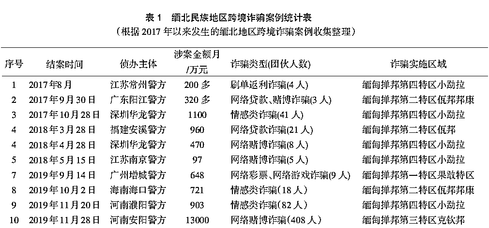

尤其是 2017 年开始，我公安机关开展了 “长城”行动、“利剑”行动等几次规模较大的跨境抓捕活动，极大打击了电信诈骗犯罪集团的嚣张气焰。

经过这一系列的沉重打击，到了 2018 年，对我国公民的电信诈骗案件发案数量有了明显的下降趋势，犯罪分子的猖獗活动在一定程度上被暂时压制。

**押解躲藏境外的诈骗嫌疑人回国** 

可谁能想到，仅仅不到一年时间，电信诈骗竟然再度卷土重来，而且势头之猛烈可谓空前。

这一切的罪恶，就发生在开篇所提及的缅北。

**2**

在许多佣兵、缉毒题材的网络小说及影视剧中，缅北地区都被描述一个混乱不堪、枪林弹雨，却有充斥着机遇的冒险之地，人人都有可能在那里打出属于自己的一片天地。

 

但现实中的缅北绝非什么探险乐园，而是因为复杂的历史和政治因素，充斥着混乱、罪恶与杀戮的是非之地。

 

除了人尽皆知的“金三角”毒品问题外，还有各路缅甸少数民族地方武装（简称“民地武”）盘踞，常年都笼罩在战火之中。

 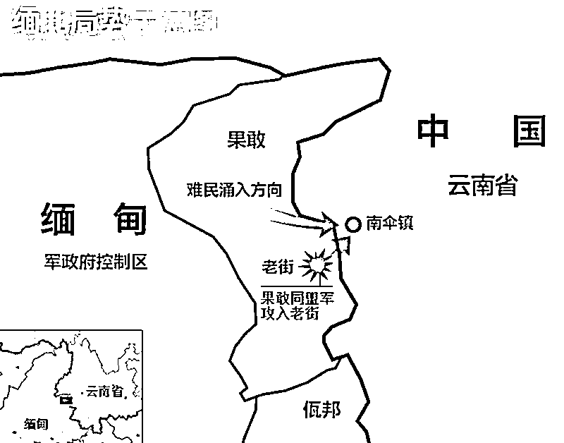

总之，对于一般人来说，只想尽可能远远的逃离这片是非之地，但这对于电信诈骗集团来说，这绝对是一处理想的“天堂”。

因为缅北长期处在军阀割据态势，各路民地武组织、反政府团体、政府军势力犬牙交错，成为了独立于中国政府与缅甸政府之外的利益集团**，形成了该场域特有的“军政合一”的族群政治体系，并衍生出相对独立的社会制度与管理方式。**

 

加上缅北民地武控制区和缅中央因为自治权问题长期谈不妥，各方冲突混战不断，当地无法建立稳定的社会秩序，导致缅北地区的治理缺少既有规范的制约，也就是规范真空。

更棘手的是，在犯罪集团眼中，缅北有着独一无二的“地缘优势”。

 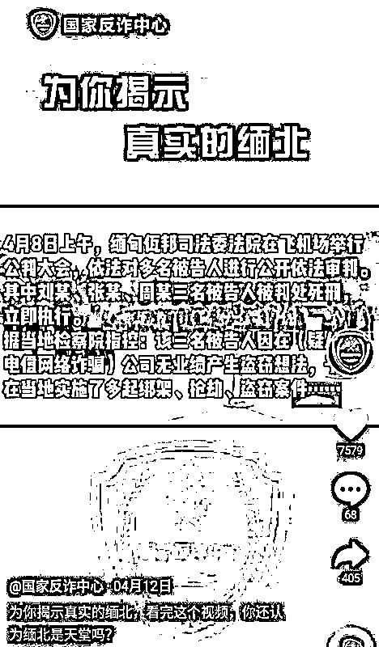

缅北和中国接壤的区域地形复杂，大多数地带无自然屏障，很多界碑、界桩甚至只有一路之隔，这就导致了出入境监管难度极大。同时当地的各路民地武对于边界管控极端松懈，经常“有边不防”，这和中国一侧“有边难防”形成鲜明的对比，同时也造成了中缅两国边境难以做到全面有效的监管的局面。

另外，还有一个关键点就是缅甸政府未与中国签订引渡条约，同时更棘手的则是缅北掸邦四个民地武控制的特区政府，出于自身利益驱动选择消极对待，甚至“坐视不管”。

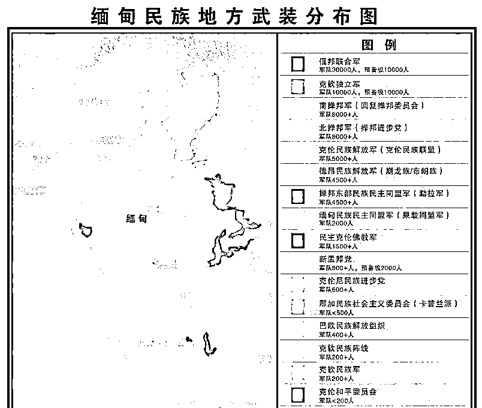

原因就在于当地经济发展水平低下，加上这些年积极响应国际社会的禁毒要求，当地政府采取了比较高压的态势推广替代种植，虽然成功遏制了毒品的泛滥，却也使不少当地农民失去了经济来源，经济基础更加羸弱。

**在全缅甸 14 个省、邦中，面积第一，人口第三的掸邦，GDP 仅列第七。**

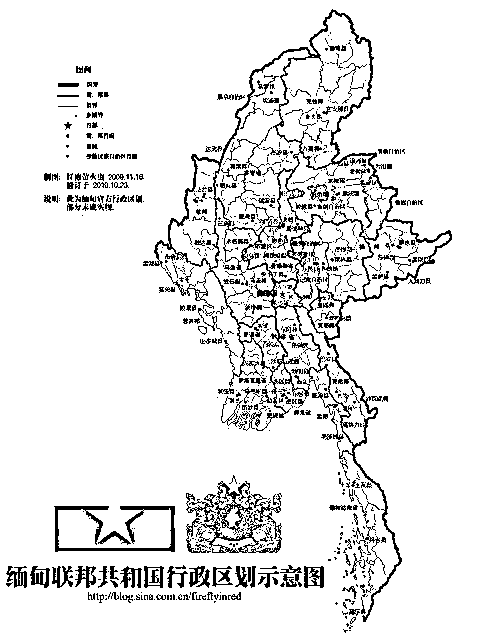

另外，缅甸中央对于这些区域的态度一直是强势打压和封锁削弱，这让缅北地区形成了自己特有的生存逻辑。

为了获得求得自保的军费和经济发展的资金，不惜铤而走险，放任辖区内出现短期积累暴富的非法产业。

 

而掸邦第一特区果敢前任主席彭家声曾经在推动当地博彩产业合法化时，就曾直接提出 “你来帮我发展、我来帮你发财”。

正是因为缅北地区的经济长期依赖各种“罪恶”产业，已经形成了庞大的黑色非法经济圈层，当地民地武组建的特区政府基本上不可能自发去清理这些非法活动。

早年间，缅北各地在中国政府压力下积极配合禁毒和替代种植之际，却又想方设法给其他非法活动提供便利，这极大吸引了中国各地的诈骗团伙“转进”缅北求发展。

 

**缅北赌场**

对于当地民地武来说，相较于实体产业，各种跨境诈骗产业无疑来钱更快，这种能迅速积累财富的捞钱新手法很难轻易割舍。

另外，更令人无语的是，缅北地方法律几乎是白纸一张，就拿果敢为例，该地直到 2019 年 1 月 20 日才拟定出《果敢特区基本法》（草案），**在此之前，竟然连起码的刑法都没有！**

 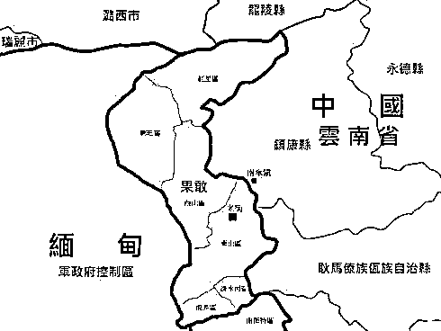

甚至处理杀人放火这些案件，所依据的都是按照传统民俗，即“杀人偿命，欠债还钱”这套理论执行，**连死刑经常由负责的警长、军官自行决定，直接“就地正法”了事**，冤杀错杀与否都不在考虑范畴内。

 

基本的法律条文都处在空白，遑论针对电信诈骗这种有一定技术含量的犯罪行为呢？

在这样的环境下，境外诈骗集团云集缅北。据不完全统计，从 2020 年到 2021 年中旬，我国警方查获来自缅北的大型电信诈骗案件至少数十起，从宁夏到湖北再到福建，覆盖我国绝大多数省份。

**而这些案件中还牵扯到了另一个可怕的犯罪事实：缅北打工骗局！**

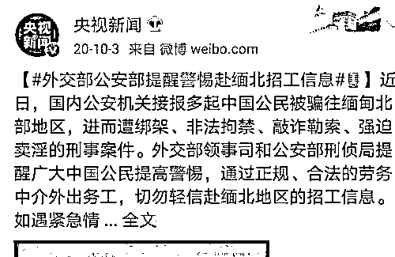

**3**

**“这里是缅甸北部，我生长的地方，欢迎来到我的世界，娇贵的小公主。”**

要是经常刷短视频平台的朋友，**前段时间都有可能刷到过用做作且油腻的男声读出的上述句子。** 

没错，这就是犯罪团伙炮制出的宣传缅北打工的软广，缅北当地的落后经济、文化教育让犯罪集团无法招募的足够的“员工”来实施这种“高技术含量”的犯罪活动，所以，他们将罪恶的手伸向了国内那些渴望出国打工赚钱发财的青年男女。

 

不少人听信了缅北打工发家致富的谣言，跑到缅北加入了诈骗组织，而传销式的发展又进一步骗取了更多人偷渡过去从事犯罪活动。

其中一些人选择沉沦其中，另一些不愿堕落屈服的人则遭受到了炼狱般的折磨。

有记者曾经采访一个从缅北逃回了年轻的广西柳州小伙。

 

据他回忆，当时在 2019 年因为家里投资失败破产，全家生活陷入困顿，他看到了缅北招工的广告后，就凑钱前往云南边境，跟随接应蛇头偷渡到缅北。

未曾想，**刚到所谓的“公司”就遭到软禁，所有人被关在大院里，**外头有持枪的当地人看着。

这时候，已经有人心生悔意，但却被“老板”告知必须赔两万块，没钱就先做满三个月，并许以好处利诱。 

无奈之下，柳州小伙一众人只能硬着头皮开始“打工”还债。

可一工作，小伙就发现不对劲，他竟然要扮演一个高富帅男子和所谓的“富婆”聊天，还专门有指定的话术培训和备用图片进行自我包装，最后以结婚为目的建立“恋爱关系”后，就诱骗其投钱到某个“投资/股票”平台，直到吃光为止。 

 

令小伙惊诧的是，许多女生都相信这些很低级的谎言，心甘情愿的投钱，**他所在的广西办公室（按照户籍划分）一个月骗了 100 万属于“业绩”极差，“业绩”第一的隔壁福建办公室骗了 1000 万......**

干了一个月后，小伙及同来的朋友不想再干，要求回家时，“老板”凶相毕露，立刻将“赎身费”涨价到五万块，小伙一人表示没钱后，武装保安恶鬼般扑过来，将几人用手铐铐住，**关进臭气熏天，老鼠、蟑螂横行的猪圈里，连续数天不准出去，只给吃猪食，大小便就地解决。**

期间他看到不断有其他的“同事”被关进来，其中有几个被鞭子打得皮开肉绽，奄奄一息，一问才知道这几个人是逃跑后被抓回，追捕他们的竟然就是当地民地武成员充当的“雇佣军”！

柳州小伙是幸运的，他因为朋友的关系知道这个“老板”在国内的住址，并以此和“老板”讨价还价，并“威胁”如果自己有事，“老板”在国内的家人会被报复。

最终，小伙“只”付出 1600 块“赎身费”被放回。

但其他赴缅北打工的就没这么幸运了，《公民与法》杂志（2021 年 5 月）上就记录了更多赴缅北打工者的悲惨命运。

 

小兵、小林（均为化名）的两个 20 岁出头的小伙也被骗到缅北打工，最终发现是从事电信诈骗后，和伙伴们想逃脱，结果遭到极端残忍的折磨。

小兵亲眼目睹一个伙伴逃跑被抓回后，手指头当场被砍掉两根，后脑被人用螺丝刀打进 2 公分，鲜血流了一地。

 

小林则目睹了一个十八九岁的贵州小伙儿逃跑被抓回后，用电棍进行长时间殴打，打得大小便失禁，最后还向其家属勒索 10 万块“赎身费”才免于被打死。

更恐怖的是，即便你不逃跑一样难逃厄运，在那里可不是什么 996、007 的问题了，业绩不达标也会被群殴，要是垫底也会被丢进黑屋紧闭，甚至是水牢里，还会被要求上缴所谓的“管理费”，过着和奴隶一样的悲惨生活不说，被虐得奄奄一息之际，分文没赚，还“倒欠”“老板”一大笔钱。

最终，小兵被困 90 天后，看准时机逃跑，并利用自己当过兵学到的野外战术生存技能在深山里躲了好几年，最终虎口脱险。而小林则没那么好运，最后交了 6 万块赎身费后被释放。

以上 3 人的例子仅仅是其中冰山一角，更多血腥残酷的重口味案例限于篇幅缘故在此不多叙述了。

因此，对于缅北地区的电信诈骗集团难以打击，一直令各地政府十分头疼。 

最后，在想尽了各种方法后，劝返成为了其中相对有效的方法。

其中，广西宾阳有着丰富经验，从 2009 年至今，宾阳当地有相当多的年轻人从事电信诈骗活动，其中不乏发了横财的。

当地的网络诈骗规模从 2010 年开始越来越多，一度出现一周内有一亿资金流入宾阳银行。从 2013 年开始，公安部就针对宾阳进行深入调查，当地政府为了自己声誉开始狠下力度整治。

其中就包括本文开头提到的那些强硬手段。

之后，全国其他地方也出台了类似的劝返措施，并定期公布相应人员名单，一场轰轰烈烈的大劝返运动展开。

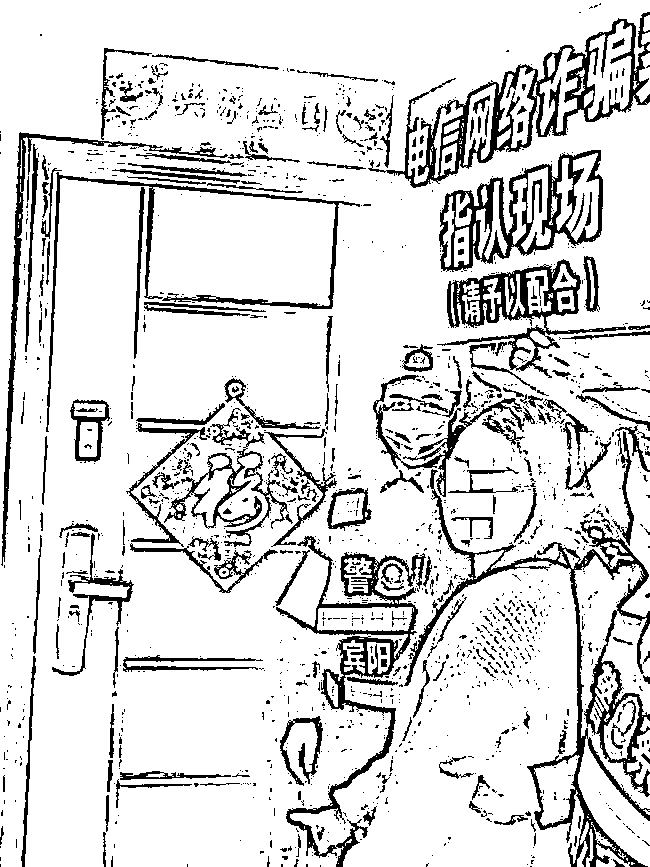

而因为正好赶上了缅甸疫情大爆发后，许多滞留人员出于对自己生命安全和家人的纷纷考虑回国，这也是目前口岸大量人“排队回国自首”这一奇景发生的一大因素。

此外，因为疫情的缘故，缅北的各民地武政府也终于没办法再继续装糊涂了。

疫情导致当地大量工厂、店铺关门停业，人员聚集的电信诈骗窝点带来的收益大大减少。同时，**因为和缅甸中央的敌对导致当地民地武得不到中央政府的一丝一毫援助，包括疫苗、防疫物资等全部靠中国援助。**

**中国医疗队援助佤邦** 

经过利害权衡后，一些民地武一改之前的态度，也对这些团伙进行了驱赶，并积极协助中国政府引导这些人通过边境口岸回国自首，同时也加强了边界线的警戒兵力，阻止不法分子偷渡回国。

在这种高压态势下，绝大多数人都决定自首求得宽大。但总有极个别的死硬份子打算顽抗到底。

而这些人中的代表，就是本文开头提到的那 69 个被注销户籍，**官方认定“社死”的人员。**

**尾声**

看到这里，恐怕也有些人会对这些诈骗犯们的遭遇产生一些同情，觉得他们也是“同胞”，日子也不好过，我们应该“宽以待人”。

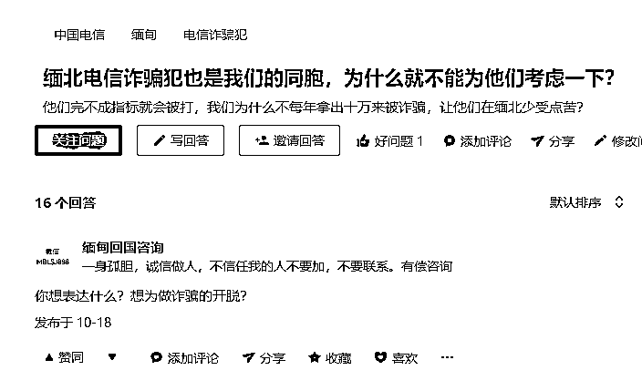

而且，一定会有人指责“注销户籍”、“墙上喷字”以及“限制子女考公务员、参军、学区资格“太木人道”，没有“人权”。

对此，我不做表态，只想说一句：“君子爱财，取之有道。”这些措施是否得当的问题先搁置。首先，那些受到欺骗而赴缅北“打工”受害者当然要同情，但那些集团的头目、高级管理，以及主观作恶的罪犯们，他们从一开始就萌生了用违法手段获取钱财的念头，这种人是没法去洗白的。

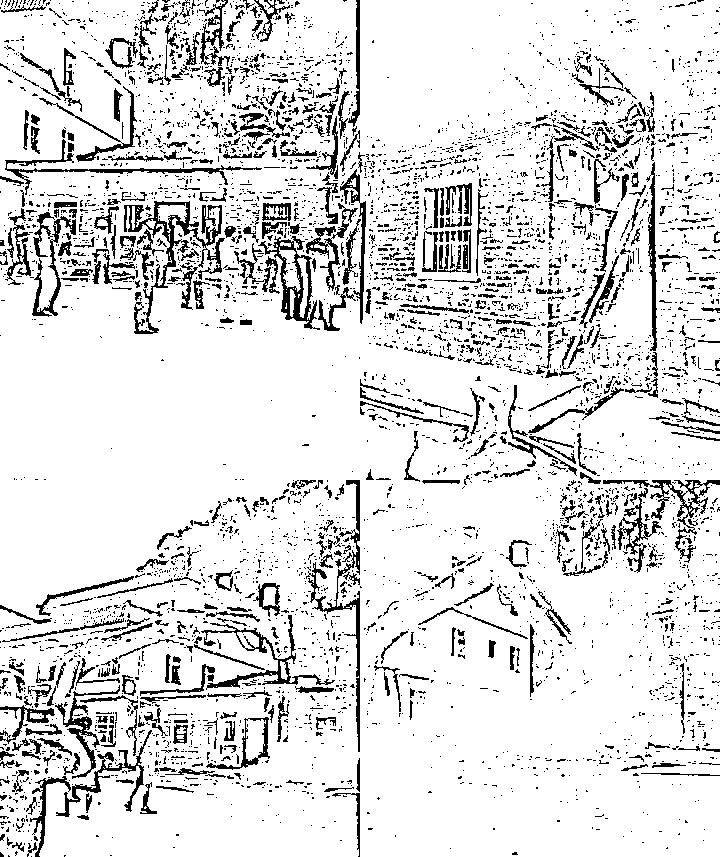

**依法拆除电信诈骗犯用“赃款”所盖的违建房屋** 

**如果他们算“可怜”的话**，那些被骗得倾家荡产，妻离子散、家破人亡的受害者们就不可怜吗？

此外，现在虽然大劝返行动取得了巨大成功，但这也仅仅意味着电信诈骗目前得到了遏制，但是否会卷土重来还很难说。

毕竟这世界大得很。

最新的消息显示，缅北的许多诈骗集团高层又开始向更远的地区转移了，其中就包括高加索的格鲁吉亚。

这必然是一场持久战，这一次阶段的“大劝返”虽然大获全胜，但距离最终的胜利还有很长的路要走。

← 向右滑动与灰产圈互动交流 →

