# 遇到这种情况，务必要当心！

> 原文：[`mp.weixin.qq.com/s?__biz=MzIyMDYwMTk0Mw==&mid=2247523173&idx=7&sn=b28dc5bc0472a89291c3c296febad0b8&chksm=97cb505da0bcd94be55fe182ead2afe6f28b9698e8e1d4fc7ddf5086485f10269f838c849b79&scene=27#wechat_redirect`](http://mp.weixin.qq.com/s?__biz=MzIyMDYwMTk0Mw==&mid=2247523173&idx=7&sn=b28dc5bc0472a89291c3c296febad0b8&chksm=97cb505da0bcd94be55fe182ead2afe6f28b9698e8e1d4fc7ddf5086485f10269f838c849b79&scene=27#wechat_redirect)

在以往的反诈宣传中

我们经常会说

“骗子一定不敢跟你视频”

很多人也都是这么认为的

殊不知

这点也成为了骗子利用的漏洞

近日 

常熟警方接到指令辖区内的朱女士疑似接到诈骗电话**警方第一时间联系寻找当事人****一场紧张的拦截工作火速展开**

↓↓↓

**以下视频来源于**

**新闻夜班车**

 *[`v.qq.com/iframe/preview.html?width=500&height=375&auto=0&vid=wxv_2059745231159230466`](https://v.qq.com/iframe/preview.html?width=500&height=375&auto=0&vid=wxv_2059745231159230466)* 

*但当拨打朱女士电话时* 

*发现电话已经处于空号状态*

*意识到情况不妙*

*警方立即赶往朱女士家中**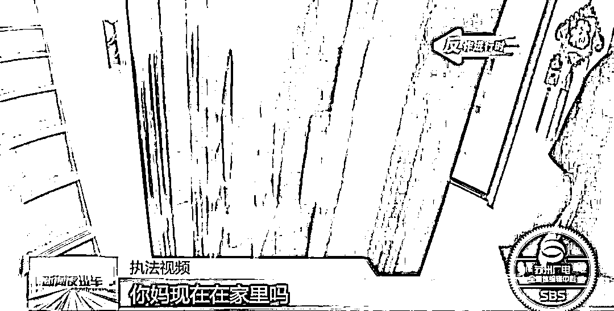****警方来到朱女士家中*

*只有朱女士的儿子在家*

*朱女士的行踪未知* 

*随后警方与朱女士丈夫取得联系*

*但也没能得到朱女士音讯**眼看情况紧急**警方调动更多力量共同寻找朱女士**最终找到了当事人下落* 

*然而事情发展不太乐观*

*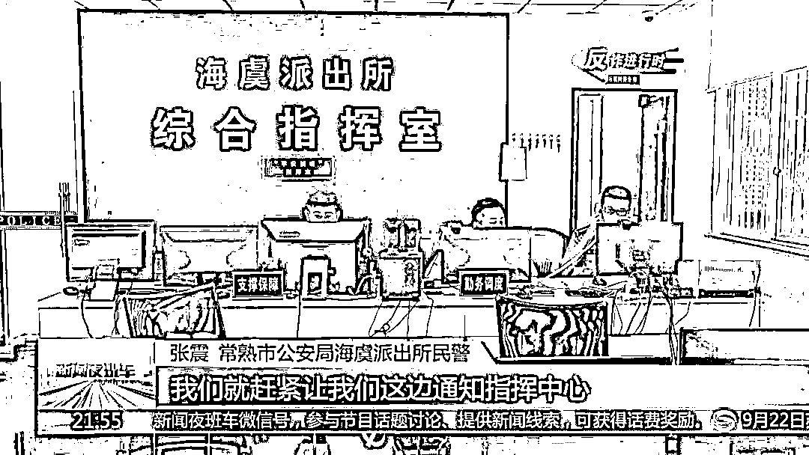*

*原来，当天一早*

*朱女士接到自称山东菏泽公安局的电话*

***说她涉嫌洗黑钱***

*让她到山东的公安局说明情况*

*朱女士提出自己可以去当地派出所*

*对方却称****这件事不能让第三方知道的***

***否则要负法律责任***

*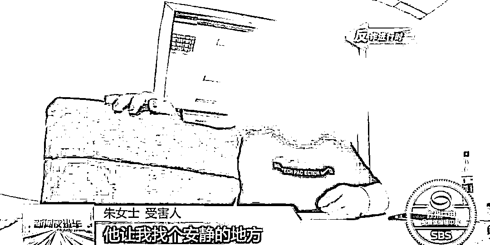*

**

*随后，对方让朱女士*

*可以找一个安静的地方*

*与朱女士进行了视频连线**视频中**对方穿着警服**周边环境也像是公安机关办案场所****按照对方的要求******朱女士下载了一款软件并输入代码****这一步操作**导致她的手机号变成了空号**别人无法联系上她*

*但她自己却毫不知情*

*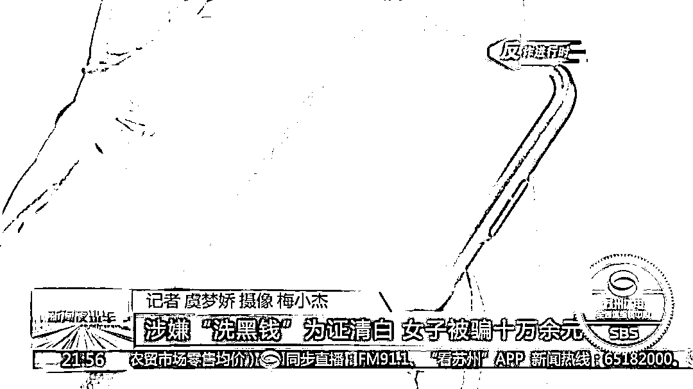*

*对方又让朱女士*

*登陆了一个假冒检察院的网站**输入对方提供的案件编号****朱女士看到了一张通缉令***

***上面真的是自己的名字***

*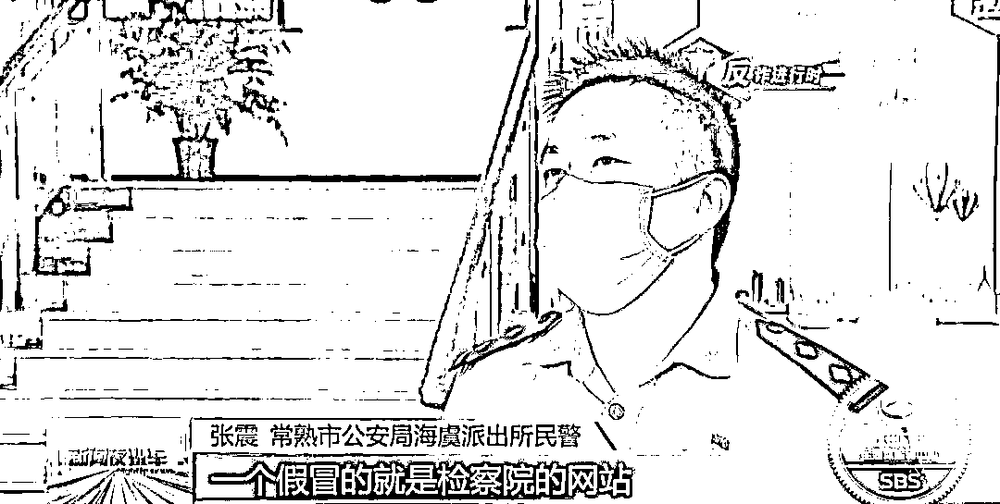*******

*对方称*

***如果朱女士坐牢信誉就会有问题******还会影响孩子今后上学****一听到这句话**朱女士彻底吓懵了****只好跟随着对方的要求***

***一步步操作下去***

*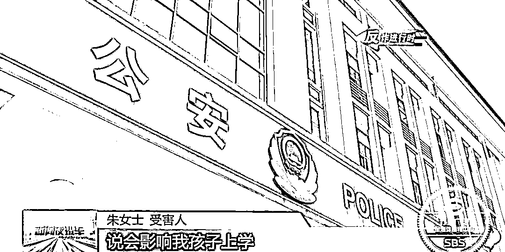*

**

*对方告诉朱女士*

*想要自证清白的话*

*需要将所有的银行卡跟密码告诉对方*

*让对方去查看流水是否有获利*

***之后朱女士按照对方要求***

***在网络平台借了 5 万元后***

***又向自己的老板借了 5 万***

***转入银行卡中***

*而等警方和家人终于能打通朱女士的电话* 

*提醒她可能被骗时*

***朱女士查询自己的银行卡账户***

***发现里面的钱已经没了****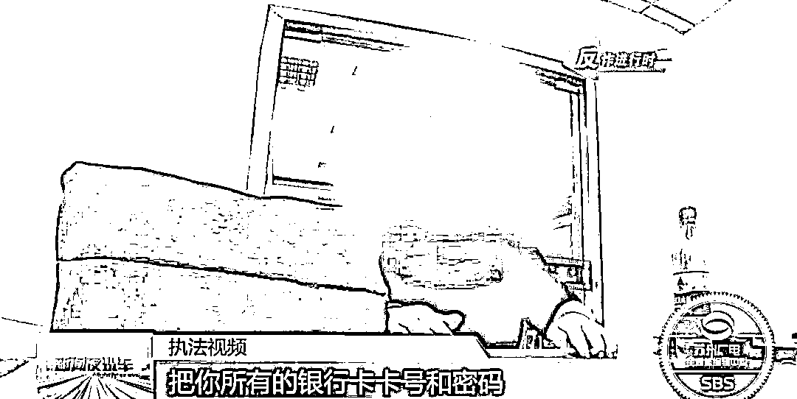******目前**案件还在进一步调查中*

*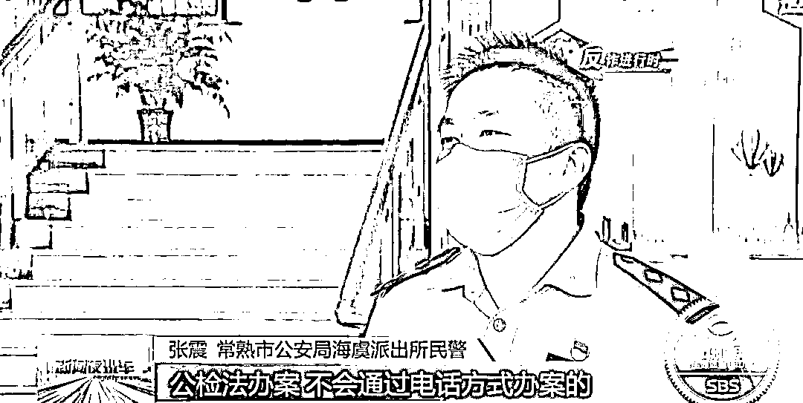*

**

**

*其实这是一起**典型的冒充公检法诈骗***

*但犯罪分子为了**阻止**公安机关及时**劝阻***

***诱导**受害人下载软件*

*导致**“失联”***

**

***冒充公检法诈骗***

***1***

*****  冒充公检法诈骗开场  *****

*1、冒充公检法诈骗是指骗子**冒充公安局、检察院、法院等国家执法、司法机关工作人员**打电话给受害人，**称受害人涉嫌各类案件**，现需受害人配合调查。*

*▼*

***2***

***  电话转接至“**警方**” ***

*随后，电话被转接到“某地警方”，在交谈过程中“警察”不断强调，**案件涉密，****不得向任何人透露任何信息，并且要求受害人保持联络，否则就要对受害人进行拘留并冻结其资产**。因此，大多数受害人在被诈骗过程中对接到诈骗电话的事缄默不言，甚至不会将此事告诉亲友。*

*同时，**骗子会告知受害人，如有自称公安机关、反电信网络诈骗中心的人打来电话都是骗子。**因此会出现真民警电话劝阻受害人时，受害人表示未接到诈骗电话，过段时间却报警被骗的情况。*

*▼*

***3***

*****  “通缉令、警官证"齐上阵  *****

*自称“警察”的骗子还会让受害人**添加其 QQ**，并通过 QQ 向受害人发送**虚假******警官证******、****逮捕令**。大多数受害人在看到“自己”的”逮捕令、通缉令”后会陷入恐慌并开始对骗子的话深信不疑，骗子也就基本完成对受害人的洗脑。*

*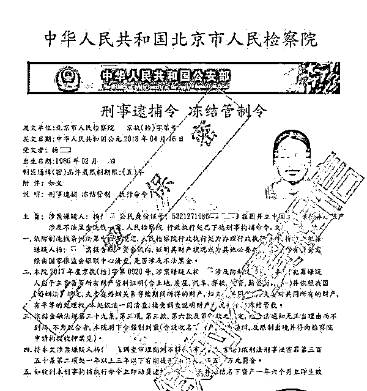*

*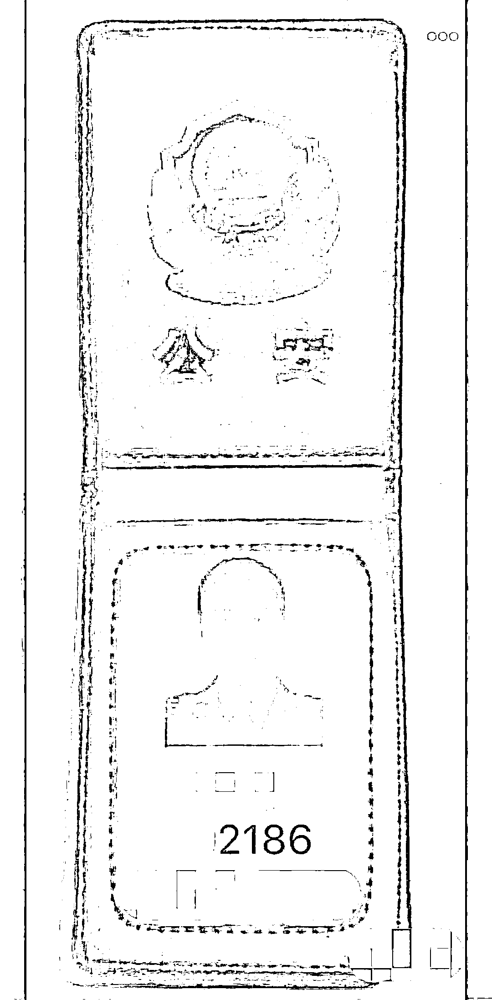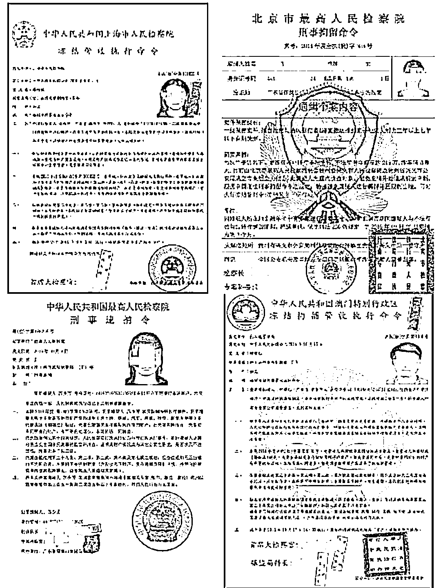*

*▼*

***4***

*******“资金清查”**** ***

*骗子告诉受害人要对其进行**“资金清查”**，**“资金清查”**后确认受害人的钱没有问题，即可证明受害人的清白。*

*骗子会要求受害人找偏僻地方（断绝和外界的联系）接受**“资金清查”**，先让受害人将所有资金集中到一张卡上，后要求受害人在诈骗 APP 中**填写该银行卡账号、密码、手机****验证码**。骗子在后台获取这些信息后，将受害人钱款洗劫一空。*

* * *

****警方提示****

***　　1.凡是接到自称公检法人员的电话，提到安全账户、清查资金、转账汇款的，****都是诈骗!******　　2.凡是自称某部门工作人员，主动“帮你”转接电话至公检法的，****都是诈骗！******　　3.凡是要求通话内容绝对保密，或通过网络出示“通缉令”“警官证”的，****都是诈骗!******　　4.凡是自称公安人员要求通过电话、QQ、微信做笔录的，****都是诈骗!******　　5.凡是要求前往酒店、家里、网吧等隐蔽环境接受调查或自证清白的，****都是诈骗!******　　6.如不慎被骗或遇可疑情形，请注意保护证据，****立即拨打 110 报警。***

*来源：新闻夜班车、常熟公安微警务、阻击诈骗*

**

*← 向右滑动与灰产圈互动交流 →*

**