# 我潜入黑医美行业，发现 5 元可买一条假贴，34 元可买 6000 张“整容对比照”

> 原文：[`mp.weixin.qq.com/s?__biz=MzIyMDYwMTk0Mw==&mid=2247523228&idx=1&sn=6cf510bc8cc5a5b9a323830dec031938&chksm=97cb50a4a0bcd9b2d704df21695245b20f59ec7c269432aeea5b1ad9dc6bb047845ed76d1af5&scene=27#wechat_redirect`](http://mp.weixin.qq.com/s?__biz=MzIyMDYwMTk0Mw==&mid=2247523228&idx=1&sn=6cf510bc8cc5a5b9a323830dec031938&chksm=97cb50a4a0bcd9b2d704df21695245b20f59ec7c269432aeea5b1ad9dc6bb047845ed76d1af5&scene=27#wechat_redirect)

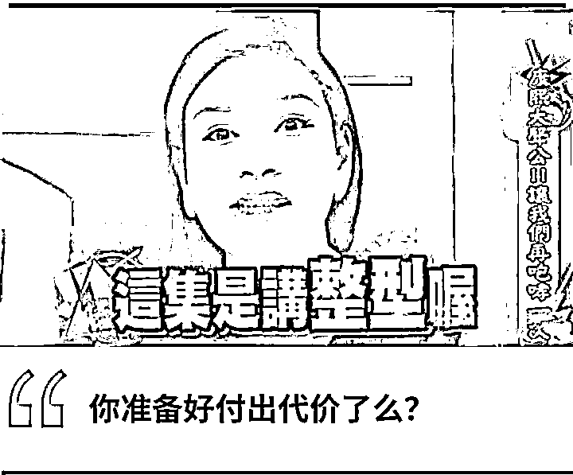

最近我看到一个触目惊心的数字，**黑医美一年毁掉 10 万张脸**！

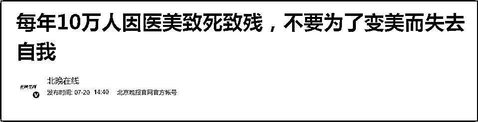

虽然大家时不时能看到医美相关的负面新闻，也看到了网红小冉、罗贝尔这样惨死手术台上的悲剧，但每年 10 万人因医美致残致死，还是太让人震惊了！ 

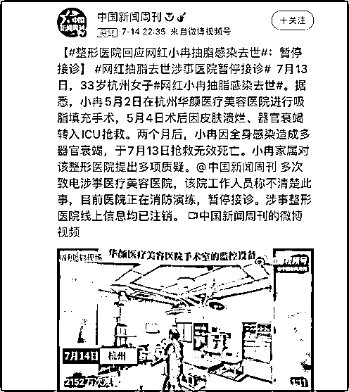

更可怕的是，我发现，黑医美的营销造假成本，低到令人发指。

在电商平台上，只要花几十块钱，就能买到几千张整容前后对比的照片；最低 5 块钱，就能让人代写一条“医美体验”的帖子；甚至有医美营销机构说，就算没有营业执照，一样能打造社交媒体上的爆款账号，分分钟实现线下引流！

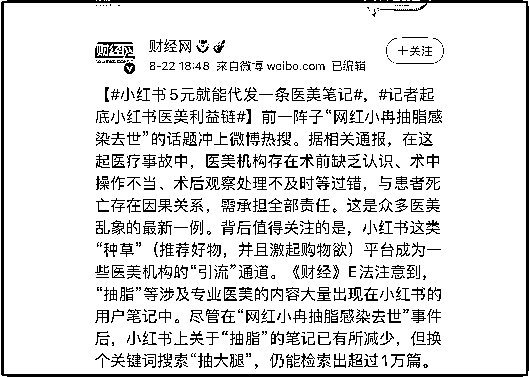

而正是因为有如此低的“造假”成本，黑医美才能把自己包装得那么高大上，毁脸不倦。

**造假重灾区：**

**对比照片、医美体验贴**

我在某多多上输入“医美案例”，发现最贵 74 元，可以买到 50 张“鼻综合”整形前后对比图；便宜的只要 34 元，就可以买到 6000 张整容前后照片、700 个视频、1000 条文案。

 商家还贴心地表示，这些素材都是高清无码，可以直接使用。

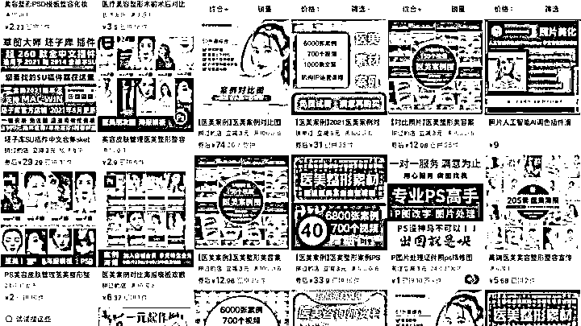

我花 34 元买了一个素材包，发现里面的素材真的是琳琅满目，从整形到抽脂减肥统统都有。

而我咨询的另外一个商家，59.98 元，里面更是有 8000 张对比图、1300 个视频和 1000 个文案。

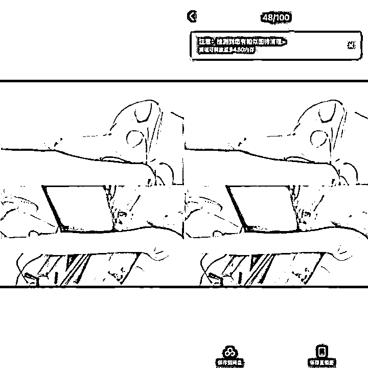

那个商家信誓旦旦地说“所有素材均来自医院”，却有好多图片、视频素材和前一个商家一模一样！都说人类的悲欢并不相通，但人类的整容照片可以。

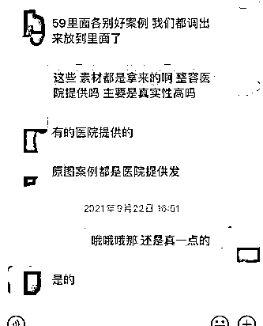

我专门咨询了浙江省某三甲医院美容整形科的医生，对方表示，正规医美机构，求美者前后对比照片肯定不会流出，因为要保护隐私。

就算医院本身要做宣传，也会给照片打码、或者只放局部。而现在网上不少对比照，不但有全脸全身，而且效果看起来特别完美，很可能是摆拍+PS 的。

我查了一下，发现确实有媒体，报道过专业模特去整形机构拍虚假整形照片的事情。

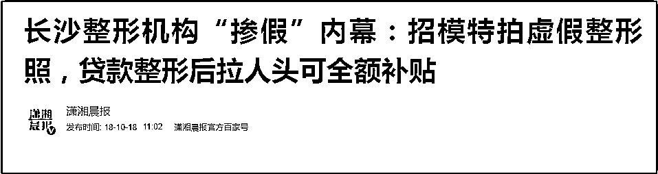

而某乎上，还有专业人士爆料，称造假对比照片就是一个产业。

 那些卖 PS 造假照片的，只是低端玩法，而高端玩法，就是媒体提到的组织专业模特，直接去机构所在地拍摄。当然，这些模特不会真的去做手术，依靠专业化妆师，她们完全可以做到以假乱真的地步，拍出手术前、手术中、术后即刻等效果！

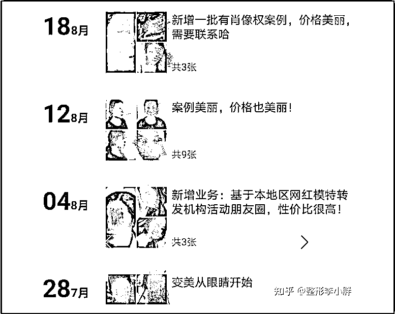

除此之外，“医美体验贴”也是造假重灾区。

网红小冉事件曝光后，《新京报》揭露，小红书里大量的“医美体验帖”，都是营销团队雇写手杜撰出来的，一条帖 5 块钱，老练写手只需要 5 分钟就能成稿。

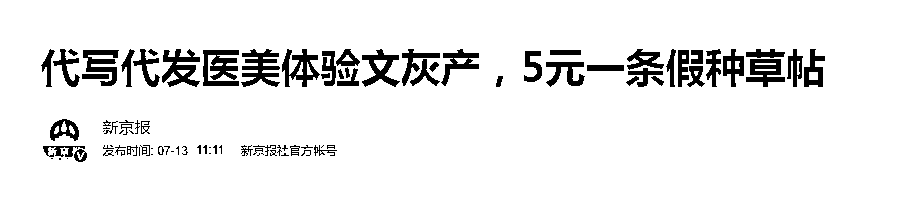

或许因为媒体的报道，某瓣上“小红书代写长期合作（美容医美创业类）”、“小红书公众号种草医美类招聘写手”这类小组讨论已被删除。

但在“中国赏金写手”网站上，仍能找到医美类写手的招聘。有意思的是，这里的写手需要比稿，中标的才能拿到钱。比如，一则“微商隆鼻整容软文写作”任务，要求以“隆鼻后我 xxx”为开头，需要 10 个稿件，每个中标有 16 元赏金。

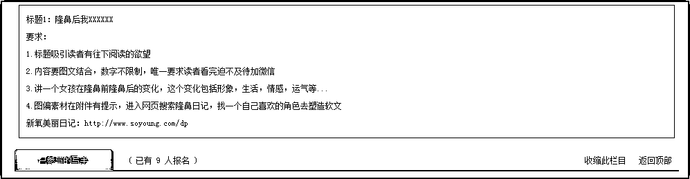

下面的 7 个应聘稿件，基本上都讲了隆鼻之后，女孩人生直接开挂，从标题上就能看出来，“隆鼻后我成功逆袭女神”、“隆鼻后我不再忧郁”等等。

之前有媒体揭露过，这基本上也是造假医美体验贴的通用模板：医美改变人生，工作、男朋友都来了，前半部分一定要丧，后半部分一定要写出人生赢家的感觉，总之就是爽文套路。

 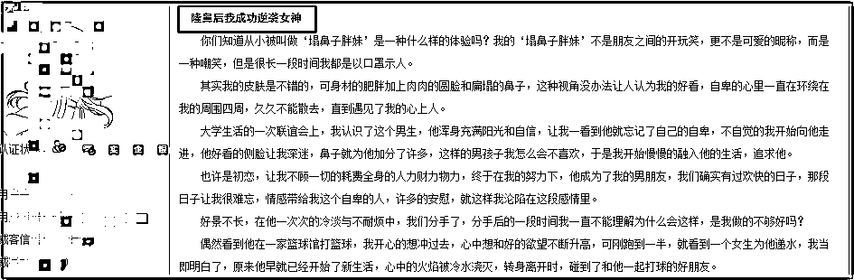

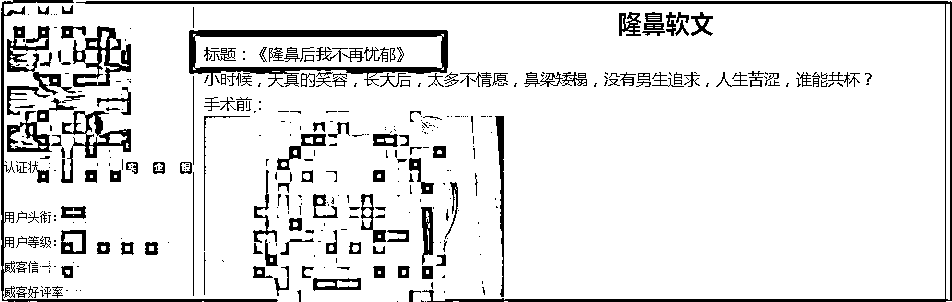

从假照片到假笔记，这个价格，这个方式，就跟大妈们去菜市场买菜差不多，都是按斤买的呀！

**没有营业执照**

**照样能打造大号**

为了能揭开黑医美营销造假的面纱，我假扮了医美机构负责人，找了一家号称能在某书上打造大号的公司。

接待我的是个声音粗犷的大叔。他表示，只要签了合同，开通账号，支付平台 600 元认证费，他就会帮我对接公司的策划、运营、美工、文案和数据分析等部门，从零开始打造一个大号。

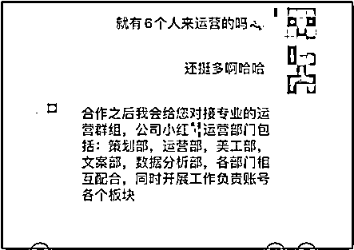

大叔推荐我开个企业账号，因为营销性质更强，比个人号更有说服性。至于费用，企业账号 12800 元，个人账号 9800 元，不要发票可以减 500，3 个月能有 90000+的曝光量。

万把块就能打造一个大号，热玛吉做一次都能打造 3 个号了，分分钟回本。

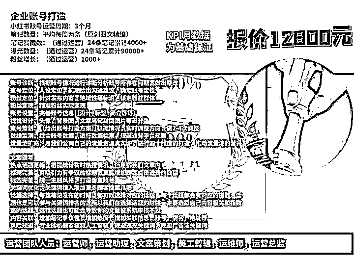

我特意问了一下，说我跟朋友的医美机构没有手术资质，甚至连营业执照、许可证都是找人办的，没想到大叔却说不重要，没人会探究证是不是正规渠道办的。

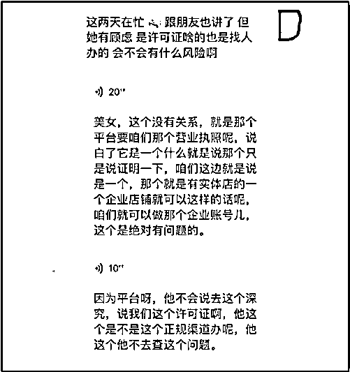

另外，大叔还说赠送 50 个素人笔记，素人账号都是他们公司长期合作的，这些素人笔记，一条价格在 60 元到 90 元不等。

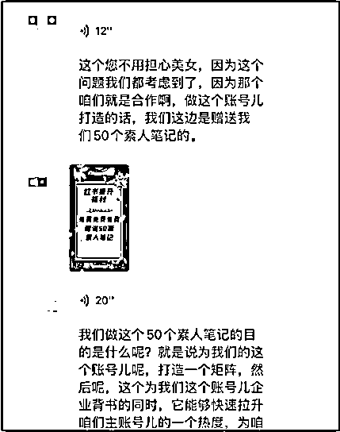

但我看了一下所谓“素人文案”的水平，估计大叔很可能也是花了几十块钱买了 1000 条，然后做了中间商赚差价来坑我。

好家伙，黑医美收割客户，营销公司收割黑医美，一整套收割食物链啊，韭菜终将逝，收割永流传。

**“造假”背后**

**都是生意**

**Mob 研究院数据显示，2020 年中国医美行业市场规模约为 1975 亿元。与此同时，医美营销渠道成本高达 50%。**

**以两年前港股上市的艺星医美为例，它一年的营销费用超过了 3 亿元。**

**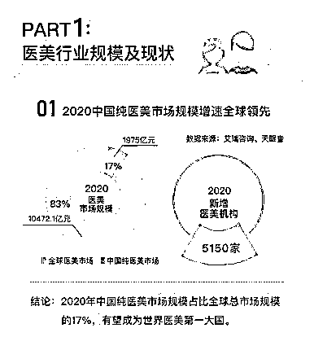**

**而媒体揭露，各类医美垂直类 app, 以及新开的、流量不大的医美机构，正是造假“素材”的大客户。**

 **毕竟，医美有风险，而大家都想看到真实的医美体验分享，据说一篇优质“种草”笔记，比几万元的广告更能引流。**

**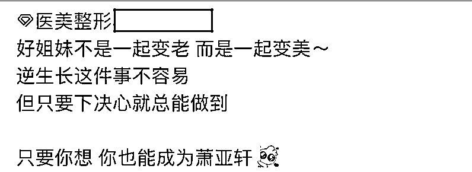**

**于是，“医美体验”、“对比照片”在网上泛滥。**

**当你打开某书，搜索“医美”二字，跳出来 94 万多篇笔记，除了大 V、机构，还有大量的素人种草贴，而你能看到的，几乎都是成功案例，而这背后，是造假黑产的狂欢，和受害者们的无声痛哭。**

**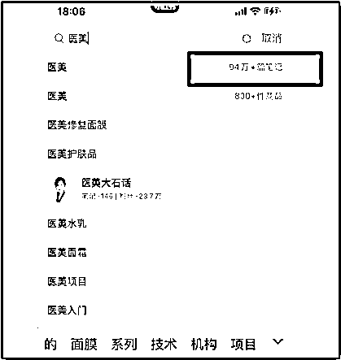**

**不过，令人欣慰的是，已经有人为此付出了代价。**

**央视财经曾采访律师，对方表示，“种草笔记”具备了网络广告的性质，也受《广告法》等法律约束，一旦发布虚假内容，严重的可处 20 万～100 万元罚款，并被吊销营业执照。**

 **此外，最近市场监管总局发布了《医疗美容广告执法指南（征求意见稿）》，将会重点打击那些制造容貌焦虑，进行虚假、夸大宣传的广告。**

**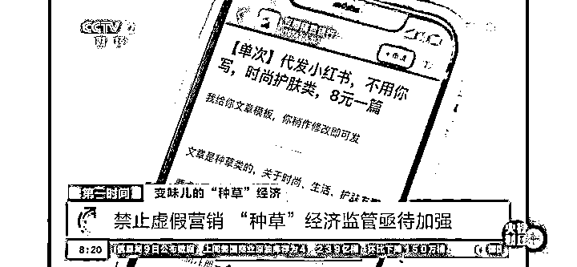** 

**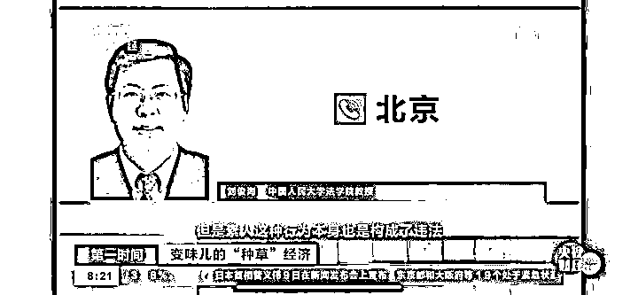**

**今年 1 月，浙江台州市椒江区某一医疗美容医院存在使用患者照片做宣传、使用虚假案例、其他医院案例照片、附有明星诊疗照片等情况，被当地市场监督管理局处以 25.2 万元的罚款。**

**去年，河北沧州华美妇产医院也同样因为发布虚假违法医疗广告，最终被处罚 45 万元。**

**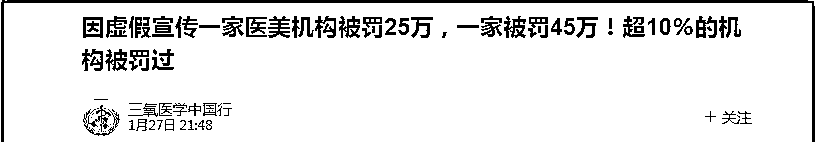**

**当然，我们无权干涉每一个人爱美的权利，也无意打击任何一个人变美的决心。但一些医美传递给我们的前篇一律的“美”的标准，究竟是美，还是为了让我们掏空腰包的容貌 PUA? 它们传递的“变美了，人生就能轻易成功”的理念，真的经得起推敲吗？**

**“美”，本就该是千姿百态的，你觉得那些不符合当下“网红”审美的特征，可能恰恰是你的辨识度。如果真的要调整，也请慎重，慎重，再慎重一点，另一方面，也希望监管可以严厉，严厉，再严厉一点，让悲剧不再发生，让恶劣的骗子都为自己的行为付出代价。**

****

**← 向右滑动与灰产圈互动交流 →**

****