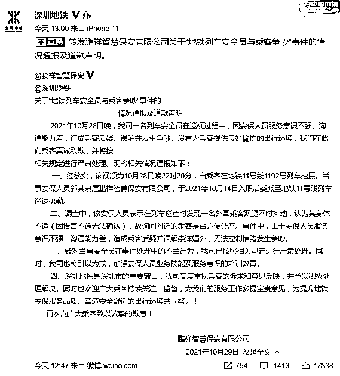

# 鸡毛当令箭！地铁保安要身体不适的乘客给老外让座：发扬待客之道

> 原文：[`mp.weixin.qq.com/s?__biz=MzIyMDYwMTk0Mw==&mid=2247523228&idx=2&sn=5e51eb1ab251dad100145bf5b6272780&chksm=97cb50a4a0bcd9b2e3bed046cd7cfb2ad91afaaf256e40f098c1db3638d4ef03c47e8078bf52&scene=27#wechat_redirect`](http://mp.weixin.qq.com/s?__biz=MzIyMDYwMTk0Mw==&mid=2247523228&idx=2&sn=5e51eb1ab251dad100145bf5b6272780&chksm=97cb50a4a0bcd9b2e3bed046cd7cfb2ad91afaaf256e40f098c1db3638d4ef03c47e8078bf52&scene=27#wechat_redirect)

10 月 28 日，网曝广东深圳地铁 11 号线上，一名保安要求男子给外国人让座，旁边乘客看不下去说了句“崇洋媚外”，保安就开始在车厢内大声叫嚣，让乘客下车去警务室。

[`mp.weixin.qq.com/mp/readtemplate?t=pages/video_player_tmpl&action=mpvideo&auto=0&vid=wxv_2112257359967240197`](https://mp.weixin.qq.com/mp/readtemplate?t=pages/video_player_tmpl&action=mpvideo&auto=0&vid=wxv_2112257359967240197)

视频发布者陈先生告诉极目新闻记者，28 日晚 10 时许，他下班后乘深圳地铁 11 号线回家。当时他的身体很累，而且最近刚做了手术，等到一个座位就坐了下去。几站后，一个外国男子上了车，此时车厢内已没有空位。一名地铁安全员突然朝他走来，要求他给这名外国人让座。陈先生拒绝了安全员的要求。几秒钟后，这名安全员再次返回，又让他给老外让座，并称本着中国人传统好客礼仪，他应该给老外让座。

现场一位男乘客看不惯安全员的行为，质问他为什么要陈先生给老外让座，质疑他崇洋媚外。这时安全员变得十分激动，对这位男乘客大声指责，还让他下车跟自己一起去警务室。陈先生介绍，这名安全员当时还拿出手机，要求男乘客取下口罩让安全员拍照，称要让他身败名裂。

陈先生目前已报警。深圳地铁表示，正在调查。

陈先生目前已报警。深圳地铁表示，正在调查。 

这一事件迅速登上了抖音热榜 

今天下午，鹏祥智慧保安公司通过官方微博发布通报并致歉称，保安见外国乘客双腿不时抖动，认为其身体不适，安保人员服务意识不强、沟通能力差，造成乘客质疑、误解并发生争吵，向乘客真诚致歉，并将按相关规定进行严肃处理。深圳地铁也转发了这一条致歉微博。

**全文如下：**

10 月 28 日晚，公司一名列车安全员在巡视过程中，因安保人员服务意识不强、沟通能力差，造成乘客质疑、误解并发生争吵。没有为乘客提供良好愉悦的出行环境，在此向乘客真诚致歉，并将按相关规定进行严肃处理。现将相关情况通报如下：

一、经核实，该视频为 10 月 28 日晚 22 时 20 分，由乘客在地铁 11 号线 1102 号列车拍摄。当事安保人员郭某隶属鹏祥智慧保安有限公司，于 2021 年 10 月 14 日入职后委派至地铁 11 号线列车巡逻执勤。

二、调查中，该安保人员表示在列车巡查时发现一名外国乘客双腿不时抖动，认为其身体不适（因语言不通无法确认），故询问附近的乘客是否方便让座。事件中，由于安保人员服务意识不强、沟通能力差，造成乘客质疑并误解崇洋媚外，无法控制情绪发生争吵。

三、针对当事安全员在事件处理中的不当行为，公司已按照相关规定进行严肃处理。同时，公司也将引以为戒，加强安保人员业务技能及服务意识的培训教育。

四、深圳地铁是深圳市的重要窗口，公司高度重视乘客的诉求和意见反映，并予以积极处理解决。同时也欢迎广大乘客持续关注、监督，为我们的服务工作多提宝贵意见，为提升地铁安保服务品质、营造安全舒适的出行环境共同努力！

来源：新闻晨报综合@深圳地铁、极目新闻

← 向右滑动与灰产圈互动交流 →

# 原文：[`mp.weixin.qq.com/s?__biz=MzIyMDYwMTk0Mw==&mid=2247523228&idx=3&sn=3f1cf8112f515cdf85989d24f2ec10b8&chksm=97cb50a4a0bcd9b28dea27ec2638871acb1e67b8d89dd010ef0c447c16614472ca0b28245520&scene=27#wechat_redirect`](http://mp.weixin.qq.com/s?__biz=MzIyMDYwMTk0Mw==&mid=2247523228&idx=3&sn=3f1cf8112f515cdf85989d24f2ec10b8&chksm=97cb50a4a0bcd9b28dea27ec2638871acb1e67b8d89dd010ef0c447c16614472ca0b28245520&scene=27#wechat_redirect)