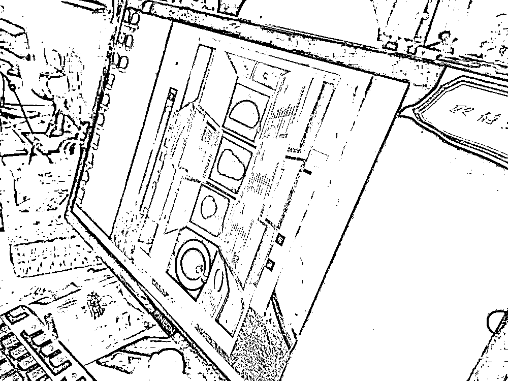
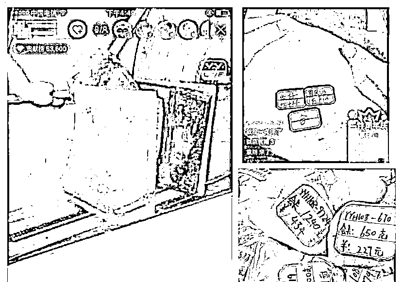
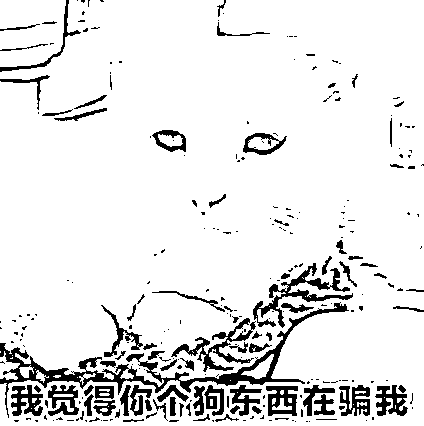
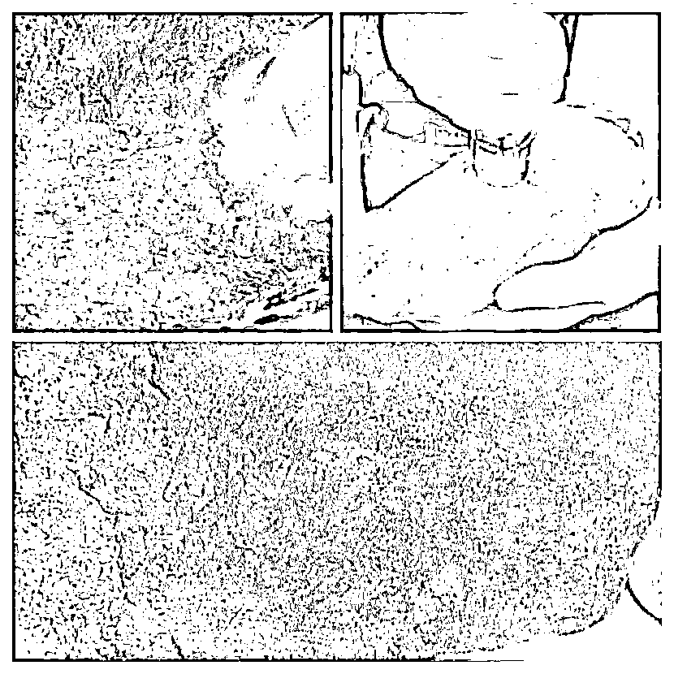
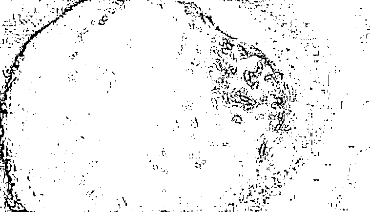
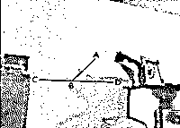
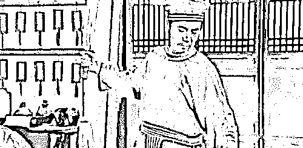
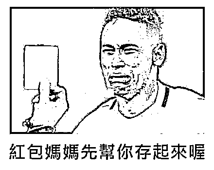

# 醒醒吧，翡翠和韭菜，一个颜色

> 原文：[`mp.weixin.qq.com/s?__biz=MzIyMDYwMTk0Mw==&mid=2247523228&idx=5&sn=a7ae6ae141a48b43344e00b4533a1e43&chksm=97cb50a4a0bcd9b243a560ae53c94240a615dd8d2cf3eaaf79e2439841c01f7f190520685571&scene=27#wechat_redirect`](http://mp.weixin.qq.com/s?__biz=MzIyMDYwMTk0Mw==&mid=2247523228&idx=5&sn=a7ae6ae141a48b43344e00b4533a1e43&chksm=97cb50a4a0bcd9b243a560ae53c94240a615dd8d2cf3eaaf79e2439841c01f7f190520685571&scene=27#wechat_redirect)

**“一刀穷，一刀富，一刀披麻布”**。在直播间里，在云南瑞丽，或者更遥远的缅甸，这句行话传了又传，概括了几百年来人们痴迷于“赌石”的原因。这里小珊给大家普及一下**“赌石”**的概念。 赌石就是卖家拿一块未切割的原石并出价，它里面可能是块玉石，也可能是低品质宝石或者普通石头，需要买家自行判断。 小珊发现，在赌石这个行业，有着各种各样真假难辨的的故事。有人说赌石是一种综合专业知识，资金实力乃至运气的活动。有人说赌石存在以小博大，是一条发财致富之道。还有人开了直播，直播赌石或者卖原石，鼓励观看者们下注或者购买原石，时不时就蹦出一句“**恭喜这位小姐姐，开出一颗妖紫大巴!**”，可谓热闹非凡。虽然换了无数种形式，但他们其实做的都是同一件事。**割韭菜！**前段时间。一个带货“玉石”的直播中，网友正期待捡“大漏”。忽然画风突转，只听见一阵紧促的“趴下，趴下”声，画面变成了警方抓捕直播。原来，这是柳州市公安局经过 3 个多月的缜密侦查，实施的一次抓捕行动。通过多地围剿，打掉了一个涉案 500 余起、案值千万元的特大“杀猪盘”电信诈骗团伙，**查获假玉石原石约 1 吨**，劣质珠宝首饰一批。这个案子中，诈骗团队先组织“业务员”**冒充美女在互联网上以婚恋、交友为名，骗取受害者信任**。然后**诱导受害者进入“赌石”直播间**，营造玉好假象，让对方购买劣质玉石首饰送给女方及双方亲戚等……常见的赌石直播骗局则更加直接。他们怎么操作的呢？ **首先，演得一手好戏。**赌石直播间经常会出现这种画面：货主报价 20000，主播说 200。那货主脸色立马变了，伸手就要把翡翠原石抢回来，通过这种争抢的画面，让观众觉得“这真的超值啊”，但其实，两人只是在演戏。

还有一些商家还会雇佣缅甸籍人员冒充毛料市场摊主来扫货，网络主播则以砍价为名来骗取毛料费、加工费、鉴定费等等。**其次，赌石直播间的卖家通常都懂得利用灯光营造种“水好”假象。**打灯看玉是赌石的常用手段，但赌石直播间的灯总是特别亮，显得翡翠原石特别的通透，种水特别的好。**除此之外，还会使用一些“特殊道****具”。**成本最低的套路是使用糖浆，嗯，就是白砂糖的那个糖浆。看看下面的图，一个普通石头。用糖浆来涂抹开口处。等糖浆干了，就成了色彩鲜艳的大马坎开窗，要你 1W 块不多吧，但成本也就 30 块。然后我们再做一道家庭作业。这块所谓的【开窗翡翠】，用什么口味的糖浆来做才更正宗呢？受害者一旦在直播间下单，基本收到的都是假货。
**所以，与其说你输掉了一场赌局，不如说是输掉了一场早已安排好的骗局。**

那有同学就说了，但我看直播间确实有人普通的价格开出了玻璃种，开出了帝王绿啊，评论区也有开出高品质玉石的案例。小珊可以提醒你的是，这些案例可能确实是真的，但无关运气好，也不是鉴石专家走眼了，这一切都是被设计好的。<mpvideosnap class="js_uneditable custom_select_card channels_iframe" data-pluginname="videosnap" data-id="export/UzFfAgtgekIEAQAAAAAAaB8aFsq-wQAAAAstQy6ubaLX4KHWvLEZgBPEsKN0ShI7J_z9zNPgMIvkXilCbJXI9YoopPDtL7Ze" data-url="https://findermp.video.qq.com/251/20350/stodownload?encfilekey=XGocBFxVWK5dcyOOqpEU47RpBHQIvlhnicQzHEqic6tqUaoXNItrgY1RqfViaszAYmPhPQWDCNsITEq5s6tMI3zxQ6H4zzsEND7Mn9xMZFH8tHFHrA7rXO6SGSynmaXxNEuybyHjbMX2tWMemI97qdxdK6icbaBtFtkFlIic857ibhOKjwewGy8L6wdlD0wVEwbtOe&amp;adaptivelytrans=0&amp;bizid=1023&amp;dotrans=0&amp;hy=SH&amp;idx=1&amp;m=717e6ba7649e9f55d23147fe8a40050d&amp;token=x5Y29zUxcibC0PCHYeSRLoLvEoluWA1maBicvdqSf4J52tFnOqxTBD7Z8DSpKGtiaORoglHg0XwicOk" data-headimgurl="http://wx.qlogo.cn/finderhead/Q3auHgzwzM4vic7VYMSYbXibHmbfrkhwI92uYf9bZ9TD2SMFA0dBcgNw/0" data-username="v2_060000231003b20faec8cae1891bcadcce01e931b077b71557c83fd4d1acf8daa363d027c104@finder" data-nickname="南京壹诺珠宝有限公司" data-desc="直播间翡翠赌石骗局（下）
珠宝行业真的可以线上捡漏吗？真的可以脱离售后服务吗？直播间珠宝行业的乱象谁之过？@人民网 @中宝协" data-nonceid="8536563403674545400" data-type="video"></mpvideosnap>作为赌石的顶层设计者，也不能让所有买家都亏，也要适量地放水，让成功案例在市场上传播。**但那个幸运儿不是你我，****而是卖家的亲朋好友。******最后，给大家总结一下。国内微商赌石和直播赌石基本全都是骗局，从故事到演员到货物到价格，**没有一个是真的**。只有他们的骗子身份，演技和收你的钱，是真的。
来源：微信珊瑚安全

← 向右滑动与灰产圈互动交流 →

