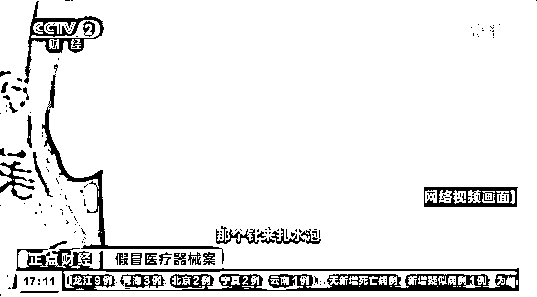
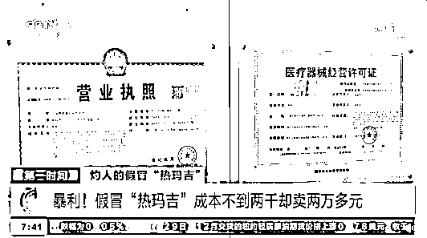
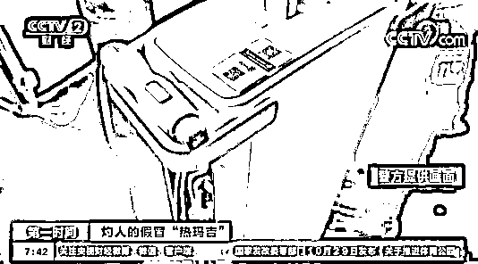
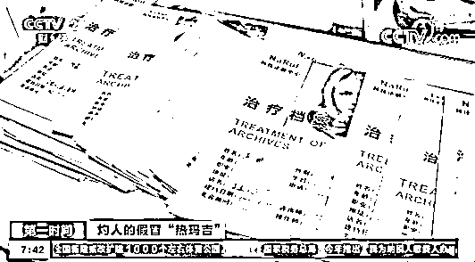
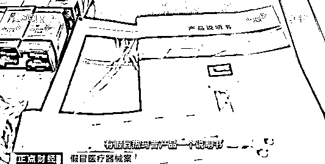
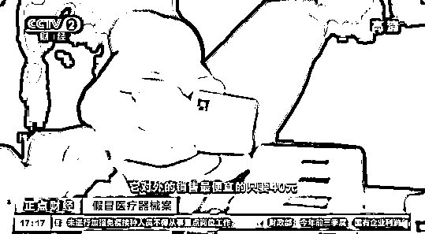

# 网红医美“热玛吉”也有假的了！1 万元做出一脸泡

> 原文：[`mp.weixin.qq.com/s?__biz=MzIyMDYwMTk0Mw==&mid=2247523228&idx=6&sn=78e9b469c30d54d68ab152aff8224208&chksm=97cb50a4a0bcd9b225a40c4c9813bc9909269eda2d4f50d60da9c76ff1cfcf0cefc69171de36&scene=27#wechat_redirect`](http://mp.weixin.qq.com/s?__biz=MzIyMDYwMTk0Mw==&mid=2247523228&idx=6&sn=78e9b469c30d54d68ab152aff8224208&chksm=97cb50a4a0bcd9b225a40c4c9813bc9909269eda2d4f50d60da9c76ff1cfcf0cefc69171de36&scene=27#wechat_redirect)

“古有唐僧肉，今有热玛吉。

你若想年轻，只有打格子。” 

近两年，

“美容神器”热玛吉稳坐美容抗衰界 C 位。

然而，

受到了很多爱美人士欢迎的同时，

热玛吉导致烫伤的事情也在各地频频出现，

爱美不成反被烫伤，

找谁说理去？

网红“热玛吉”频出事，消费者变美不成反被烫伤

去年 10 月，上海的马女士在一家医疗美容机构专门针对眼部做了热玛吉美容项目，没想到花了一万多元出现了红肿和大量的水泡。

专家告诉记者，热玛吉这项技术利用射频深入真皮层，产生 50-60℃的热量，在不至于引起烫伤的情况下，紧致皮肤。

然而，目前热玛吉机器和与之配套操作的探头缺货严重。

专家表示：“可能原厂也没有想到，我们中国方面会有这么大的需求量，所以它产能跟不上。一些机构、医院订货以后，等一年都等不到机器。耗材的缺口相当大。”

由于稀缺性和机器的昂贵，最近两年，市场上出现使用热玛吉假货的现象，而随之产生的消费纠纷不断。在某投诉平台上，以热玛吉为例，投诉集中在“假热玛吉”“毫无效果”“灼伤”“脸颊凹陷”上。

假冒热玛吉，成本不到两千却卖两万元

针对医美医疗器械领域产品的整体投诉率较高的现象，近日上海警方查处了一些医美机构。

警方查处的一家医美机构位于上海徐家汇核心地段，店内醒目位置上挂着营业执照、医疗器械经营许可证、卫生许可证等，齐全证件，然而这里所谓的热玛吉产品却是假货。

上海市公安局食药环侦总队副大队长聂柳表示：“热玛吉产品买过来的时候，合同价格只有 22000 元，实际上美国那边出来正规的产品大概是 80 万元到 100 万元；热玛吉的耗材主要是射频探头，市场价格大概在 4000 元左右，他们跟不法商户订的长期合同，大概一个热玛吉的探头只要 350 元到 400 元。”

警方查获的热玛吉设备，外观看起来和正品没差。热玛吉官方有一套指导消费者鉴定真伪的流程，比如，在开始前扫设备和探头上的二维码进行验证。假的热玛吉探头也有二维码，不过链接的是其假冒官网。

在查处的医美机构里，警方查获热玛吉项目合同近百份，合同金额大都在两到三万元之间，而成本却是售价的十分之一不到。

“**热玛吉的面部和眼部的服务价格是 26800 元，可以说跟市场价格是一模一样的，但是他所进的产品的价格成本，每次一个合同所用的耗材加上人工不超过 2000 元。**”

**上海警方侦破假冒热玛吉案 案值近亿元**

近日，上海警方侦破了一起制售假冒知名品牌医美医疗器械领域产品案，捣毁犯罪窝点 15 处，查处医美机构 15 家，查获假冒多个知名品牌医美医疗器械及耗材，涉案金额近亿元。

警方通过一些医美机构采购渠道，发现多家高风险售假网店，并由此线索查到上游供货源头，**共查获假冒多个知名品牌医美医疗器械 54 台、探头等耗材 4.6 万多件、包材 6.1 万多件，涉案金额 9200 多万元。**

经查，自 2020 年以来，以犯罪嫌疑人陈某等人为首的 5 个犯罪团伙，在广东设立制假窝点，私自加工生产假冒多个知名品牌的多类医美医疗器械和配套产品，并以远低于市场价的价格，通过线上网店和社交软件大肆层层加价销售至上海多家医美服务场所。

“这些产品都是在生产窝点，我们现场查扣到的，有假冒热玛吉产品说明书，还有它的商标、防伪标记。现场查扣到的探头，对外销售最便宜的只要 40 元，外面正品差不多要卖到 4000 元左右。”

目前，上海公安机关已对 70 多名犯罪嫌疑人依法采取刑事强制措施，案件正在进一步侦办中。

**评论区聊聊**

**你遇到过的“医美乱象”**

来源：央视网综合央视财经、南都周刊

← 向右滑动与灰产圈互动交流 →

