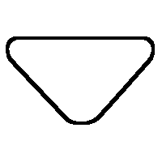
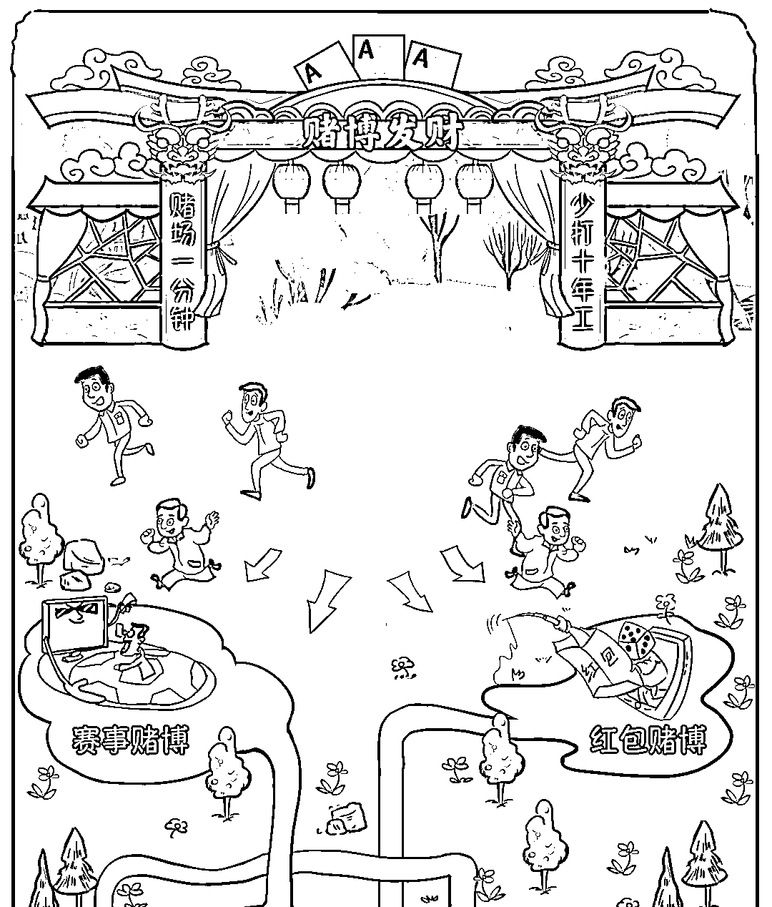
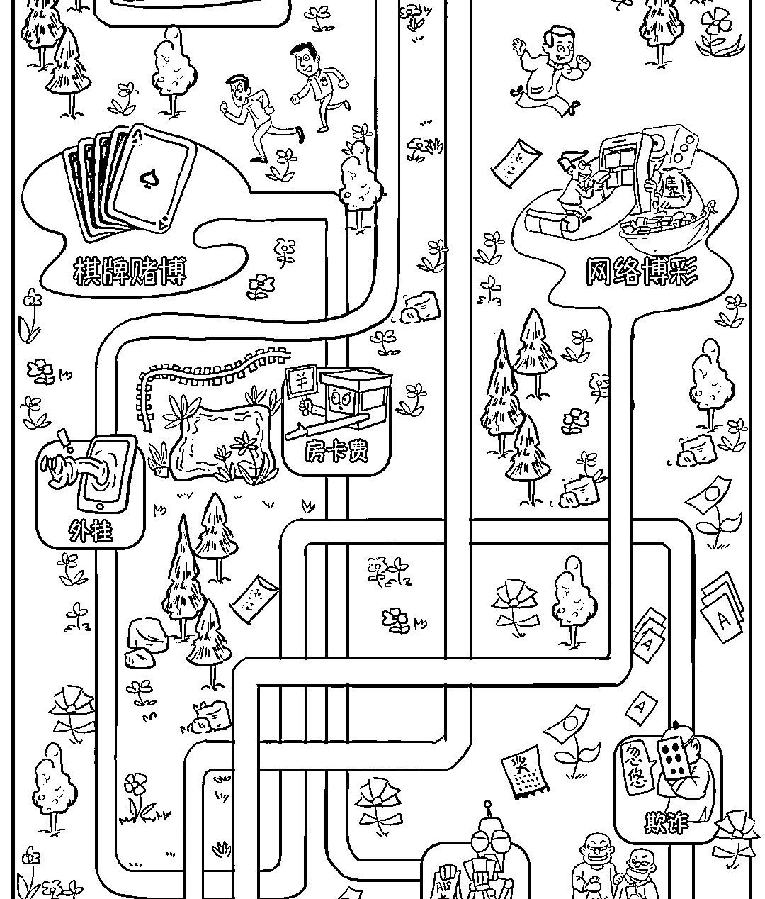
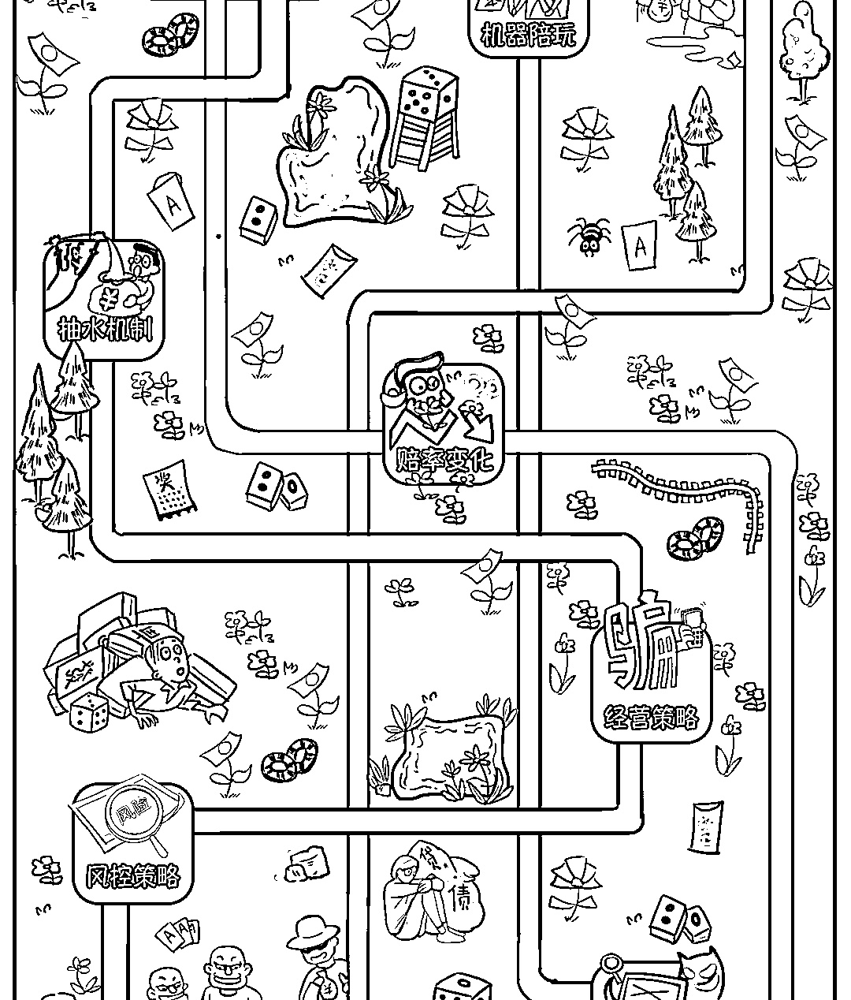
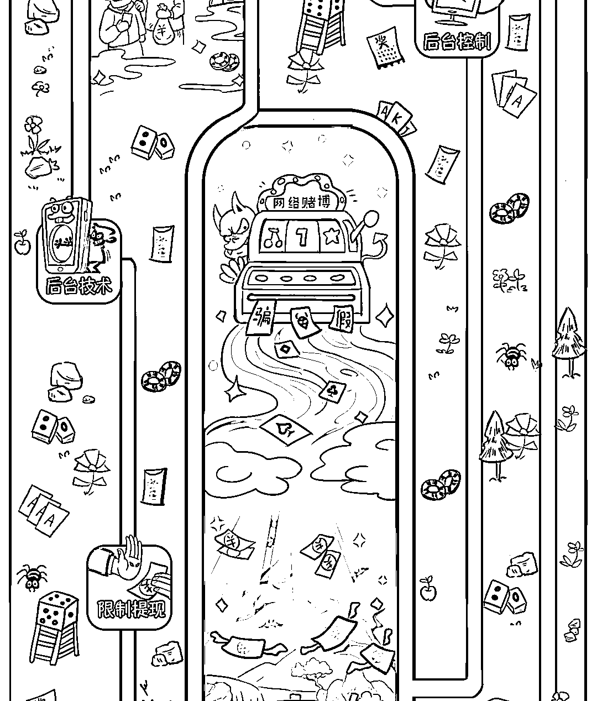
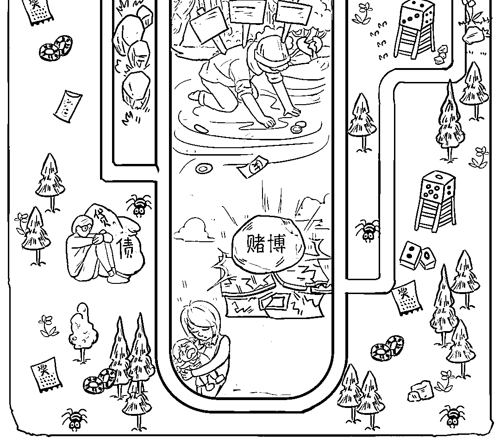
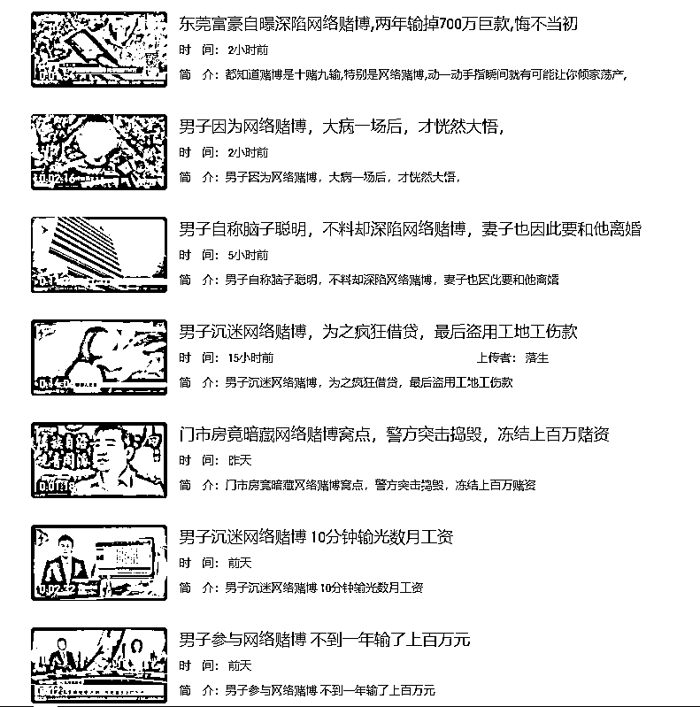

# 赌博的人后来都怎么样了

> 原文：[`mp.weixin.qq.com/s?__biz=MzIyMDYwMTk0Mw==&mid=2247523228&idx=7&sn=b37365d573481e58e4fb5f226391d1ea&chksm=97cb50a4a0bcd9b27ca92ecd318184d857d6a77d24e74b385b12ecd48d7a78ba1b27d8e34d92&scene=27#wechat_redirect`](http://mp.weixin.qq.com/s?__biz=MzIyMDYwMTk0Mw==&mid=2247523228&idx=7&sn=b37365d573481e58e4fb5f226391d1ea&chksm=97cb50a4a0bcd9b27ca92ecd318184d857d6a77d24e74b385b12ecd48d7a78ba1b27d8e34d92&scene=27#wechat_redirect)

“搏一搏，单车变摩托” 

“赌场一分钟，少打十年工”

“all in！下一个赌神就是你！”

想象一下这个场景是不是还挺热血沸腾

仿佛下一秒就要冲进赌场大干一场了?

网络赌博，熟悉而又陌生

熟悉在于绝大部分人都听过

陌生在于大多数人只听过没接触过

更不了解其中的“道”

现在“机会”来了

我们准备了一些网络上常见的赌博类型

来选择你想要尝试的玩法

看看最后将会通向哪里吧

无数的事实告诉我们

不管你选择哪一条路

赌博的终点只有一个

**——那就是倾家荡产**

**参与赌博违法！**

**参与网络赌博不仅会损失钱财，还是违法行为：**

根据《治安管理处罚法》第 70 条：以营利为目的，为赌博提供条件的，或者参与赌博赌资较大的，处 5 日以下拘留或者 500 元以下罚款；情节严重的，处 10 日以上 15 日以下拘留，并处 500 元以上 3000 元以下罚款。

**警方提醒**

1、网络博彩是违法行为，且具有极大的危害性。不相信“有内幕、稳赚不赔”的投资，守好自己的钱袋子；

2、不向陌生人提供个人身份证号、银行卡号、密码、验证码等信息。不扫描陌生人发来的“二维码”，不点击来历不明的网页链接；

3、如不慎被骗或遇可疑情形，请注意保护证据，立即拨打 110 报警或拨打 96110 反诈专线咨询。

来源：乌鲁木齐市反电信网络诈骗中心,阻击诈骗

← 向右滑动与灰产圈互动交流 →

